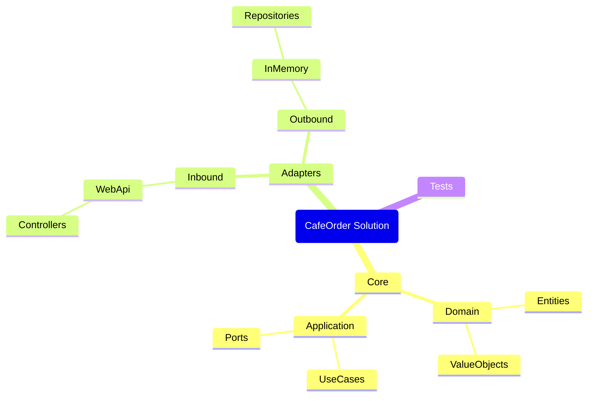

# 第17章：フォルダ/プロジェクト構成（おすすめ）📦🏷️


この章は「ぐちゃぐちゃ🍝を未然に防ぐための“住所決め”」だよ〜！😊✨
最初にここをちゃんと決めると、あとで Port/Adapter を増やしても迷子になりにくいの🙌

ちなみに **2026/01/23 時点**だと、.NET は **.NET 10（LTS）**が最新で、C# は **C# 14** が基本セットだよ〜🆕✨（Visual Studio 2026 でもそのまま使えるよ） ([Microsoft][1])

---

## 1) まず結論：おすすめの「最小で強い」構成🔷💪

カフェ注文アプリ（ミニ題材☕）では、最初はこれが超おすすめ😊✨
（“分ける”けど“増やしすぎない”やつ！）

### ✅ Solution 全体（おすすめ）

* **CafeOrder.Core**（中心）🏠❤️

  * Domain / Application（UseCase & Port）
* **CafeOrder.Adapters.Inbound.WebApi**（入口）🌐🚪

  * Controller / Endpoints / API用DTO
* **CafeOrder.Adapters.Outbound.InMemory**（出口その1）📦🗄️

  * Repositoryの InMemory 実装
* **CafeOrder.Tests**（テスト）🧪✨

  * Core中心にテストしやすくする

DB版（EF Core など）は第28章あたりで増やせばOKだから、今は “置き場所だけ予約” くらいでいいよ〜😊🔖

---

## 2) “依存の向き” を先に固定しよ！🧭🚦（ここ超だいじ）


ヘキサで一番大事なのは **矢印の向き**だよ🔁💥

### ✅ OKな依存（外→中）

* Inbound（WebApi） → Core
* Outbound（InMemory） → Core
* WebApi（Composition Root） → Outbound（InMemory）  ※「配線の都合」で外同士はOK🙆‍♀️🧩

### ❌ NGな依存（中→外）

* Core → WebApi（ASP.NET 参照しちゃう）🚫
* Core → EF Core / DB / HttpClient 直参照🚫
* Core → InMemory 実装を知る🚫

要するに **Core は“外側の事情”を一切知らない**が正解🛡️✨

---

## 3) どこに何を置く？「住所」テンプレ📮✨




ここからは「そのファイル、どこに置くのが自然？」を迷わない地図だよ🗺️😊

---

### 3-1) CafeOrder.Core（中心🏠❤️）


#### ✅ Core の中は “2大エリア” に分けるのがラクだよ

* **Domain**：業務の言葉・ルール・制約🧠💎
* **Application**：ユースケース手順（Portの定義もここ）🧭🛠️

例（フォルダ案）👇

* Core/

  * Domain/

    * Entities/
    * ValueObjects/
    * DomainServices/
    * Exceptions/
  * Application/

    * UseCases/
    * Ports/

      * Inbound/
      * Outbound/
    * Dtos/
    * Mappers/（※Core側に置くなら“UseCase DTO↔Domain”くらいまで）

#### ✅ Coreに置いていいもの/ダメなもの

* 置いていい：Entity/VO/ユースケース/Port(interface)/UseCase DTO 😊
* 置いちゃダメ：Controller、DbContext、EF Entity、HttpClient直叩き、ASP.NETの型 😵‍💫🚫

---

### 3-2) CafeOrder.Adapters.Inbound.WebApi（入口🌐🚪）


ここは「Webの都合」を全部引き受ける場所だよ😊✨
Coreに Webの匂いを持ち込まないための“防波堤”🌊🧱

例（フォルダ案）👇

* Adapters.Inbound.WebApi/

  * Controllers/（または Endpoints/）
  * ApiContracts/

    * Requests/
    * Responses/
  * Mapping/（API DTO ↔ UseCase DTO 変換）
  * Filters/（例外→HTTP変換など）

✅ Controllerは **薄く！薄く！薄く！** 🥷✨
「受け取る→変換→Port呼ぶ→結果返す」だけに寄せると勝ち🏆

---

### 3-3) CafeOrder.Adapters.Outbound.InMemory（出口📦🗄️）


Core の Outbound Port を実装する“差し替え部品”だよ🔁✨

例（フォルダ案）👇

* Adapters.Outbound.InMemory/

  * Repositories/
  * Storage/（List/Dictionaryなど）
  * Mapping/（Domain ↔ 保存用モデルを作るならここ）

✅ ポイント：**Port は Core に置く**、**実装は Adapter に置く** 🔌✨

---

### 3-4) CafeOrder.Tests（テスト🧪💖）

Core中心にテストすると気持ちいいよ〜😆✨
（DBなしで動く＝速い＝楽しい！）

例（フォルダ案）👇

* Tests/

  * Core/

    * UseCases/
    * Domain/
  * Adapters/（必要になったら）

---

## 4) “見た目” と “実体” を揃えるコツ📁✨


Visual Studio の **Solution Folder** は「見た目の整理」だよ😊
でも、実体のフォルダ構造も揃えておくと未来の自分が助かる…！🥹🙏

おすすめはこんな感じ👇

* /src

  * CafeOrder.Core
  * CafeOrder.Adapters.Inbound.WebApi
  * CafeOrder.Adapters.Outbound.InMemory
* /tests

  * CafeOrder.Tests

---

## 5) Visual Studioでの作り方（手順）🛠️🪄


やることはシンプルだよ😊✨

1. ソリューション作成（例：CafeOrder）📦
2. Class Library を追加：CafeOrder.Core 🏠
3. Web API を追加：CafeOrder.Adapters.Inbound.WebApi 🌐
4. Class Library を追加：CafeOrder.Adapters.Outbound.InMemory 🗄️
5. Test Project を追加：CafeOrder.Tests 🧪
6. 参照設定（Project Reference）をこうする🔗

### ✅ 参照ルール（これだけ覚えて！）

* WebApi → Core（必須）
* InMemory → Core（必須）
* Tests → Core（必須）
* WebApi → InMemory（DI配線で使うなら追加OK🙆‍♀️）

Core は **誰も参照しない**のが理想じゃなくて、
**Core が誰も参照しない（＝外を参照しない）** のが理想だよ🛡️✨

---

## 6) csproj の最小イメージ（雰囲気だけ掴もう）📄✨

「どのプロジェクトがどれを参照してるか」だけ見えればOK😊

例：Inbound WebApi が Core と Outbound を参照する場合👇

```xml
<Project Sdk="Microsoft.NET.Sdk.Web">
  <ItemGroup>
    <ProjectReference Include="..\..\CafeOrder.Core\CafeOrder.Core.csproj" />
    <ProjectReference Include="..\..\CafeOrder.Adapters.Outbound.InMemory\CafeOrder.Adapters.Outbound.InMemory.csproj" />
  </ItemGroup>
</Project>
```

例：Outbound(InMemory) は Core だけ👇

```xml
<Project Sdk="Microsoft.NET.Sdk">
  <ItemGroup>
    <ProjectReference Include="..\..\CafeOrder.Core\CafeOrder.Core.csproj" />
  </ItemGroup>
</Project>
```

---

## 7) ルール破りを“起きにくくする”小ワザ🧷😆


### ✅ 小ワザ1：Coreをプロジェクト分割する（強い）💪

フォルダ分けだけだと、うっかり参照しがち😵‍💫
プロジェクト分割すると「参照できない」＝事故りにくい✨

### ✅ 小ワザ2：アーキテクチャテストを後で入れる（さらに強い）🧪🛡️

あとで **NetArchTest** みたいな仕組みで「CoreがWeb参照してない？」を自動検査できるよ🔍✨
（このライブラリ自体はテストで依存ルールをチェックする用途だよ〜） ([GitHub][2])

※本格導入はテスト章（第33章あたり）でやると気持ちいい😊

---

## 8) AI拡張の使いどころ（この章版）🤖✨

AIは「住所決め」にも使えるよ〜😆🧠
おすすめはこんな依頼👇

* 「この構成で、各プロジェクトのフォルダツリー案を出して」🌳✨
* 「Core/Domain に Entity と ValueObject の雛形を作って」🧱
* 「WebApi で Controller を薄く保った例を書いて」🥷
* 「変換（API DTO→UseCase DTO）の Mapper を作って」🔁

ただし最後は人間がチェック✅
**“Coreが外を参照してない？”** だけ毎回見れば事故が激減するよ🛡️😊

---

## 9) まとめチェックリスト✅✨

* Core に Web/DB の型が入ってない？🚫
* Port（interface）は Core にある？🔌
* Adapter 実装は外側プロジェクトにある？🧩
* WebApi は薄い？（変換して呼ぶだけ）🥷
* 依存の矢印が「外→中」になってる？🧭

---

## 10) ミニ課題（5分）☕🧩

1. Core に `IOrderRepository`（Outbound Port）を置く🗄️
2. InMemory に実装を置く📦
3. WebApi から UseCase を呼ぶ（Program.cs でDI配線）🧩
4. Core からうっかり `Microsoft.AspNetCore...` を参照しようとして「やっぱダメだ！」を体感😆🚫

---

次の章（第18章）では、いよいよ **Domainってなに？🏠🌱** に入って、「現実の言葉をコードに置く」練習をしていくよ〜😊✨

[1]: https://dotnet.microsoft.com/en-us/download/dotnet "Browse all .NET versions to download | .NET"
[2]: https://github.com/BenMorris/NetArchTest?utm_source=chatgpt.com "BenMorris/NetArchTest: A fluent API for .Net that can ..."
