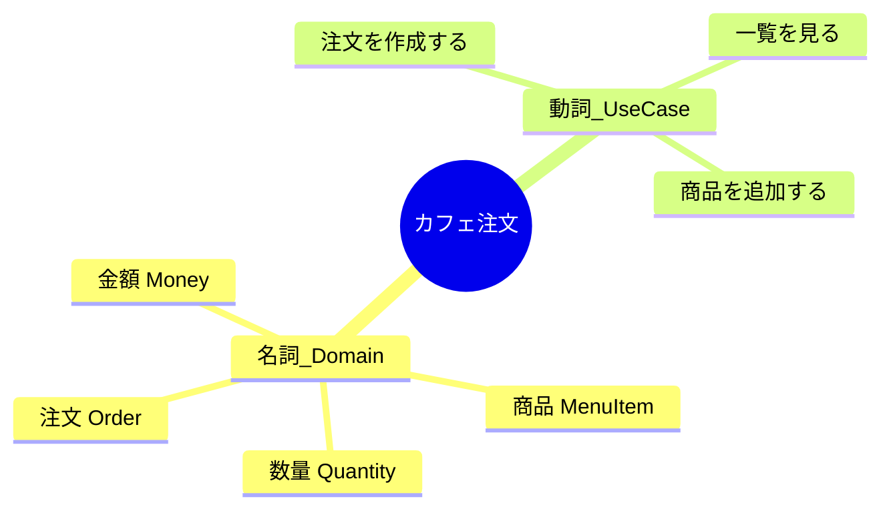

# 第18章：Domain入門①：Domainってなに？🏠🌱


## 0. 今日のゴール🎯

この章が終わると…👇

* 「Domain＝業務ルールの世界🌍」って説明できる
* “DBの都合”や“画面の都合”をDomainに混ぜない感覚がつく🧼✨
* カフェ注文アプリで、Domainの「言葉」と「制約」をコードに置けるようになる☕🧾💪

---

## 1. Domainってなに？（一言で）🏠


**Domain（ドメイン）＝そのアプリが解決したい“現実世界のルール＆言葉”**だよ😊✨

たとえばカフェ注文なら👇

* 「注文」「商品」「数量」「金額」みたいな**業務の言葉**🗣️
* 「数量は1以上」「金額はマイナス不可」みたいな**業務の制約**🔒
* 「注文合計金額は明細の合計」みたいな**業務の計算ルール**🧮

ここがヘキサゴナルの**Coreの一番おいしい中心部分🍰**になるよ〜💖

---

## 2. Domainを“中心に置く”と何が嬉しいの？🛡️✨


Domainを中心にすると、外側（UI/DB/API）が変わっても耐えられる💪🔥

* 画面が変わる（Web→スマホ）📱🔁🖥️
* DBが変わる（SQLite→SQL Server）🗃️🔁🗄️
* 外部サービスが変わる（メール送信API差し替え）✉️🔁📡

こういう変更が来ても、**Domainのルールが綺麗に守られてる**と、直す場所が小さくなるの🥹✨
「怖い変更」を減らす本丸だよ〜🏯🛡️

---

## 3. Domainに入れるもの／入れないもの✅🚫


超大事ポイントを、ざっくり仕分けするね😊👇

| 種類          | Domainに入れる？ | 例                                   |
| ----------- | ----------: | ----------------------------------- |
| 業務の言葉       |           ✅ | Order / Money / Quantity / MenuItem |
| 業務の制約（不変条件） |           ✅ | 数量は1以上、金額はマイナス不可                    |
| 業務の計算       |           ✅ | 合計金額、明細の小計                          |
| DBの事情       |          🚫 | テーブル名、ORM属性、外部キー、SQL                |
| UIの事情       |          🚫 | 画面の入力フォームの都合、ViewModel直置き           |
| 外部APIの事情    |          🚫 | HttpClient、APIレスポンスそのまま型            |
| フレームワークの事情  |          🚫 | Controller、EF CoreのEntity、Json属性    |

つまり…
**Domainは「純C#で、現実のルールに集中」🧼✨**
「外の都合（UI/DB）」はAdapter側に押し出すのが勝ち🏆😊

---

## 4. カフェ注文アプリ：Domainの“言葉”を集めよう📝☕




まずは要件を見て、**名詞と動詞を拾うゲーム🎮**しよ！

### 名詞（＝Domainの候補）📌

* 注文（Order）
* 注文明細（OrderLine）
* 商品（MenuItem）
* 数量（Quantity）
* 金額（Money）
* 注文ID（OrderId）

### 動詞（＝UseCaseの候補）🧭

* 注文を作成する（CreateOrder）
* 注文一覧を見る（ListOrders）
* 注文に商品を追加する（AddItem）

この章では、**名詞（Domainの言葉）をコードに置く**ところから始めるよ🌱✨

---

## 5. “制約”をコードで守る＝不変条件（Invariant）🔒✨

Domainの強さって、結局ここなの😊
**「ルール違反のデータを、そもそも作れない」**に寄せる！

### 5.1 Money（マイナス禁止💸）例


```csharp
namespace Cafe.Core.Domain;

public readonly record struct Money(decimal Value, string Currency)
{
    public Money(decimal value, string currency = "JPY")
    {
        if (value < 0) throw new ArgumentOutOfRangeException(nameof(value), "金額はマイナス不可だよ💸");
        if (string.IsNullOrWhiteSpace(currency)) throw new ArgumentException("通貨は必須だよ💱", nameof(currency));

        Value = value;
        Currency = currency;
    }

    public static Money Zero(string currency = "JPY") => new(0, currency);

    public static Money operator +(Money a, Money b)
    {
        if (a.Currency != b.Currency) throw new InvalidOperationException("通貨が違うよ💥");
        return new Money(a.Value + b.Value, a.Currency);
    }
}
```

ポイント🧠✨

* Moneyができた瞬間にルールチェック✅
* 「decimal＋通貨」で“現実の言葉”っぽくなる💖
* 足し算も、通貨が違うと事故るのでDomainで止める🛑

---

### 5.2 Quantity（1以上🍰）例


```csharp
namespace Cafe.Core.Domain;

public readonly record struct Quantity(int Value)
{
    public Quantity(int value)
    {
        if (value <= 0) throw new ArgumentOutOfRangeException(nameof(value), "数量は1以上だよ🍰");
        Value = value;
    }

    public static implicit operator int(Quantity q) => q.Value;
}
```

ポイント🧠✨

* 「数量」をintで表すと、0や-1が混ざる事故が起きる😵‍💫
* Domainの型にして、入口で防ぐ🛡️

---

## 6. DBの都合と混ぜない：IDを“型”にする🪪✨


DBだと `int` のIDになりがちだけど、Domainでは **「それは注文IDです」**って分かるのが大事😊

```csharp
namespace Cafe.Core.Domain;

public readonly record struct OrderId(Guid Value)
{
    public static OrderId New() => new(Guid.NewGuid());
    public override string ToString() => Value.ToString("N");
}
```

こうすると👇

* `OrderId` と `MenuItemId` を取り違えにくい🙅‍♀️💥
* “現実の言葉”がコードの型として残る📌✨

---

## 7. Domainは「時間」すら外から受け取る（混ぜない練習）⏰🧼


ありがちな事故👇

* Domainが `DateTime.UtcNow` を勝手に読んでしまう
  → テストが面倒＆「いつの時間？」がブレる😵‍💫

まずはシンプルに、**作成時刻を引数でもらう**に寄せよう😊✨
（あとで「時計Port」に進化できるよ🔌）

```csharp
namespace Cafe.Core.Domain;

public sealed class Order
{
    public OrderId Id { get; }
    public DateTimeOffset CreatedAt { get; }

    private readonly List<OrderLine> _lines = new();
    public IReadOnlyList<OrderLine> Lines => _lines;

    public Order(OrderId id, DateTimeOffset createdAt)
    {
        Id = id;
        CreatedAt = createdAt;
    }

    public void AddItem(MenuItemId menuItemId, string name, Money unitPrice, Quantity qty)
    {
        if (string.IsNullOrWhiteSpace(name)) throw new ArgumentException("商品名は必須だよ☕", nameof(name));
        _lines.Add(new OrderLine(menuItemId, name, unitPrice, qty));
    }

    public Money TotalPrice
        => _lines.Aggregate(Money.Zero(), (acc, line) => acc + line.Subtotal);
}

public readonly record struct MenuItemId(Guid Value)
{
    public static MenuItemId New() => new(Guid.NewGuid());
}

public sealed class OrderLine
{
    public MenuItemId MenuItemId { get; }
    public string Name { get; }
    public Money UnitPrice { get; }
    public Quantity Quantity { get; }

    public Money Subtotal => new(UnitPrice.Value * Quantity.Value, UnitPrice.Currency);

    public OrderLine(MenuItemId menuItemId, string name, Money unitPrice, Quantity quantity)
    {
        MenuItemId = menuItemId;
        Name = name;
        UnitPrice = unitPrice;
        Quantity = quantity;
    }
}
```

---

## 8. AIで雛形を作るときの“当たりプロンプト”🤖✨

AIはめっちゃ頼れるんだけど、**境界ルール（何をDomainに入れないか）だけは人間が守る🚦**のがコツだよ😊

### 使える指示例（そのまま投げてOK）🪄

* 「カフェ注文のDomainモデルを作って。Money/Quantity/Order/OrderLine/ID型を用意して、不変条件をコンストラクタでチェックして」
* 「Domain層にはDB/Json/Controller依存を入れないで。純C#のみで」
* 「Orderの合計金額計算と、数量・金額の制約を入れて」

✅ 出てきたコードは、最後にこのチェック👇

* `using Microsoft.EntityFrameworkCore` とか入ってない？🚫
* `[Table]` `[Key]` `[JsonPropertyName]` とか付いてない？🚫
* `HttpClient` / `DateTime.UtcNow` を勝手に呼んでない？🚫

---

## 9. 章末ミニ課題🎓✨（10〜20分でOK）

1. 要件文から「名詞」を10個拾って、ドメイン用語リストを作る📝
2. その中から「制約がありそうな名詞」を2つ選ぶ（例：金額、数量）🔒
3. その2つを **型（record struct）** にして、コンストラクタで制約チェック✅
4. 最後に「int/decimalのままだと起きる事故」を1行でメモ😆

---

## 10. 最新メモ（2026/01/23時点）📌✨

* 最新のLTSは **.NET 10**（例：10.0.2 が 2026/01/13 リリース）だよ🧰✨ ([Microsoft][1])
* 最新のC#は **C# 14**（.NET 10 対応）😊 ([Microsoft Learn][2])
* Visual Studio も **Visual Studio 2026** 系で更新が続いてるよ🪟✨ ([Microsoft Learn][3])

---

## 次章につながるよ〜🔜😊

次は **Entity（同一性）👤🪪**！
「Orderは同じ注文として追いかける存在だよね？」って感覚を、めっちゃやさしく固めていくよ〜☕✨

[1]: https://dotnet.microsoft.com/en-US/download/dotnet/10.0?utm_source=chatgpt.com "Download .NET 10.0 (Linux, macOS, and Windows) | .NET"
[2]: https://learn.microsoft.com/en-us/dotnet/csharp/whats-new/csharp-14?utm_source=chatgpt.com "What's new in C# 14"
[3]: https://learn.microsoft.com/ja-jp/visualstudio/releases/2026/release-notes?utm_source=chatgpt.com "Visual Studio 2026 リリース ノート"
