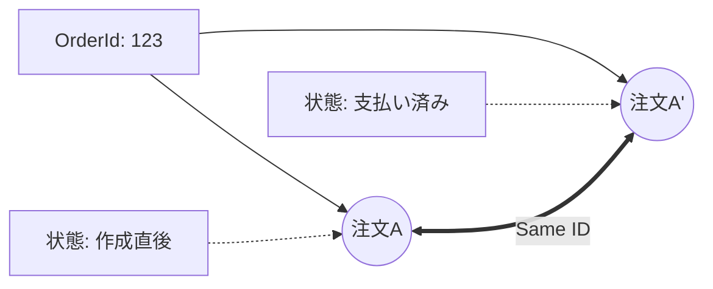

# 第19章：Domain入門②：Entity（同一性）👤🪪


この章は「**同じものを、ずっと追いかけられる**」って感覚をつかむ回だよ〜！😊
ヘキサゴナルの**Core（中心）**で、ちゃんと「同一人物（同一注文）」を扱えるようになると、設計が一気に安定するよ🔷🛡️

---

## 1) Entityってなに？ひとことで言うと…📝✨




**Entity（エンティティ）＝ “IDで同じものだと判断する” ドメインの登場人物** だよ👤🪪

たとえばカフェ注文アプリなら☕🧾

* 注文（Order）
* 注文は「時間が経っても同じ注文」で、状態や中身が変わることがある（例：支払い済み、キャンセル、品目追加）

ここがポイント👇
**Entityは「中身が変わっても同じ」**って扱うのが得意😊🔁

---

## 2) ValueObjectとの違い（次章の予告も兼ねて）💎👀


ざっくり比較するとこう👇

* **Entity**：IDで同一性を判断する（同じ注文IDなら同じ注文）👤🪪
* **ValueObject**：値そのものが同一性（同じ金額なら同じ）💎🔒

例でいうと…

* Order（注文）＝ Entityっぽい🍩
* Money（金額）＝ ValueObjectっぽい💴✨（次章でやるよ！）

---

## 3) 「同一性」ってどういうこと？🧠🔍


### ✅ “同じ注文” って、どう決める？

こういう2つのOrderがあったとして…

* 注文A：ラテ1つ、作成直後
* 注文A：ラテ1つ＋クッキー追加、支払い済み

中身が変わってても、**注文IDが同じなら同じ注文**だよね？☕🍪
これが **Entityの同一性（Identity）** だよ😊🪪✨

---

## 4) Entity設計の超基本ルール3つ🧱✨


### ルール①：Entityには「ID」がいる🪪

IDがないと「同じもの」として追えないからね😊

### ルール②：Entityは「変化する」前提でOK🔁

状態（Status）や明細（Items）が変わっても、同じIDなら同じ存在👤

### ルール③：勝手に壊れないように、操作はメソッドで守る🛡️

「プロパティ全部 public set」だと、どこからでも壊せちゃう😭
だから、**変更はメソッド経由**にしてルールを守るのが基本だよ✅

---

## 5) カフェ題材で：Order Entityを作ってみよう☕🧾✨

### まずはID型を用意（強い！）💪🪪

「Guidをそのまま使う」でもいいんだけど、ドメインの言葉として **OrderId** を作ると読みやすさが爆上がりするよ😊📈

```csharp
public readonly record struct OrderId(Guid Value);
```

---

## 6) Order Entity（最小の形）👤🧾


```csharp
public enum OrderStatus
{
    Created,
    Paid,
    Cancelled
}

public sealed class Order
{
    public OrderId Id { get; }
    public OrderStatus Status { get; private set; } = OrderStatus.Created;

    private readonly List<OrderItem> _items = new();
    public IReadOnlyList<OrderItem> Items => _items;

    private Order(OrderId id)
    {
        Id = id;
    }

    public static Order CreateNew(OrderId id)
        => new(id);

    public void AddItem(MenuItemId menuItemId, int quantity)
    {
        if (Status != OrderStatus.Created)
            throw new InvalidOperationException("作成中の注文にしか追加できません🥲");

        if (quantity <= 0)
            throw new ArgumentOutOfRangeException(nameof(quantity), "数量は1以上だよ🙂");

        _items.Add(new OrderItem(menuItemId, quantity));
    }

    public void MarkPaid()
    {
        if (_items.Count == 0)
            throw new InvalidOperationException("空の注文は支払えないよ🥲");

        if (Status != OrderStatus.Created)
            throw new InvalidOperationException("Created状態じゃないと支払えないよ🙂");

        Status = OrderStatus.Paid;
    }

    public void Cancel()
    {
        if (Status == OrderStatus.Paid)
            throw new InvalidOperationException("支払い後はキャンセル不可だよ🥲");

        Status = OrderStatus.Cancelled;
    }
}

public readonly record struct MenuItemId(Guid Value);
public readonly record struct OrderItem(MenuItemId MenuItemId, int Quantity);
```

ここでの学びポイント🎯✨

* **Idがあるから “同じ注文” を追える**🪪
* 状態は変わる（Created→Paid など）🔁
* 変更はメソッドで守る（勝手にPaidにできない）🛡️

---

## 7) IDはどう作る？（2026の最新寄りTips）🆔✨


いまの最新 .NET / C#（.NET 10 / C# 14）では、**UUID v7（タイムスタンプを含む形式）**の `Guid.CreateVersion7()` が使えるよ🕒✨
これは RFC 9562 に沿った v7 を作るメソッドとして案内されてるよ📘 ([Microsoft Learn][1])
（C# 14 が .NET 10 でサポートされる、という公式ページもあるよ📌 ([Microsoft Learn][2])）

### 例：OrderId を v7 で作る🪪🕒

```csharp
var id = new OrderId(Guid.CreateVersion7());
var order = Order.CreateNew(id);
```

> v7は「時間っぽく並びやすい」性質があるので、DBのインデックス都合で嬉しいことがあるよ😊🗃️
> ただし最初は **Guid.NewGuid()でも全然OK**！焦らなくて大丈夫👌✨

---

## 8) 「IDはどこで生成するの？」問題🏭🧠


初心者さん向けの“まずはこれ”の答えは👇😊

* **アプリの手順（UseCase）側で作って、Entityに渡す**
  → 分かりやすいし、テストもしやすいよ🧪✨

ヘキサの感覚で言うと🔷

* **Coreは「注文を作る」という意思決定をする**
* 外部の都合（DBが採番するとか）は後でPort/Adapterに逃がせる🔌🔁

---

## 9) Entityの “あるある事故” 🧯😭


### 😭 事故①：Entity＝DBテーブルだと思っちゃう

Entityは「業務の存在」だよ👤
DBの列都合（null許可とか、外部キーとか）をそのまま持ち込むと、Coreが汚れやすい🧼💦

### 😭 事故②：public set だらけでルールが崩壊

どこからでも `Status = Paid` とかできると、業務ルールが守れない🥲
**メソッドで守る**のがコツ🛡️✨

### 😭 事故③：DTOとEntityがごっちゃになる

DTOは「運ぶ箱」📦
Entityは「ドメインの登場人物」👤
役割が違うよ〜！

---

## 10) ミニ演習（手を動かすと一気に腹落ちする！）🧪💪✨

### 演習A：Orderにルール追加してみよ😊

* Paidのとき `AddItem()` できない（もう入れてあるけど確認！）
* Cancelledのとき `MarkPaid()` できない
* Itemsが空なら `MarkPaid()` できない

### 演習B：テストを書いてみよ🧪

* 「空注文は支払えない」を1本テストで保証✅
* 「支払い後キャンセル不可」を1本テストで保証✅

### 演習C：AIに下書き作ってもらう🤖✨

Copilot/Codexにこう聞くと早いよ👇

* 「Orderエンティティの状態遷移ルール（Created→Paid/Cancelled）をテストで保証したい。xUnitでテスト例を作って」
* 「public set を減らして、メソッドで不変条件を守る形にリファクタして」

ただし最後は人間がチェック！✅
**“境界を守れてるか”**（DTO/DB都合がCoreに入ってないか）を見てね🚦😊

---

## まとめ🎁✨

* **EntityはIDで“同じもの”を追う存在**👤🪪
* **中身は変わってOK**（状態遷移・明細追加など）🔁
* **ルールはEntityのメソッドで守る**（壊れにくい！）🛡️
* ID生成はまずシンプルでOK、最新だと `Guid.CreateVersion7()` も選べるよ🕒✨ ([Microsoft Learn][1])

次章は **ValueObject（値・不変）💎🔒**！
「Moneyを型にしてバグを減らす」みたいな、超気持ちいい世界に入るよ〜😊✨

[1]: https://learn.microsoft.com/en-us/dotnet/api/system.guid.createversion7?view=net-10.0&utm_source=chatgpt.com "Guid.CreateVersion7 Method (System)"
[2]: https://learn.microsoft.com/en-us/dotnet/csharp/whats-new/csharp-14?utm_source=chatgpt.com "What's new in C# 14"
