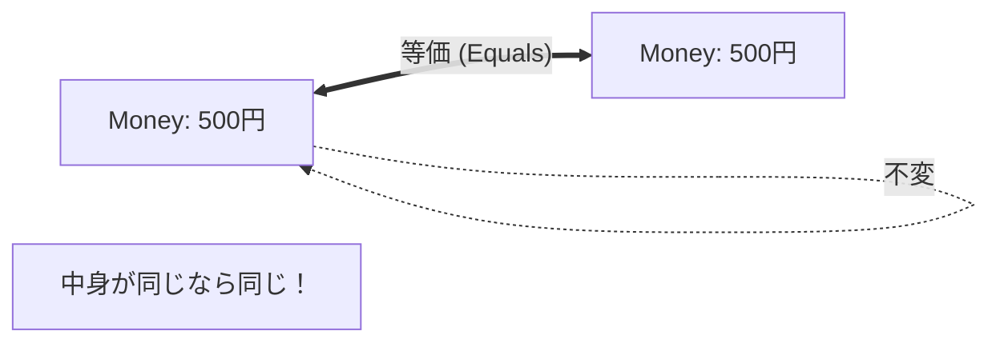

# 第20章：Domain入門③：ValueObject（値・不変）💎🔒


この章では「値そのもの」をちゃんと“型”にして守る練習をするよ〜！😊✨
カフェ注文アプリだと **金額💰／数量🔢／メール📧／住所🏠** みたいなのが主役になりやすいです。

---

## 1) ValueObjectってなに？💎




**ValueObject（値オブジェクト）** はざっくり言うと、

* **IDで区別しない**（同一性じゃなくて、値で同じかどうか）🙂
* **中身（値）が同じなら同じ扱い**（= “値の等価性”）✅
* **できるだけ不変（immutable）** にして事故を減らす🔒

たとえば **「(2,3)という座標」** は、別インスタンスでも値が同じなら同じもの扱いしたいよね、というのが典型例です。 ([martinfowler.com][1])

---

## 2) なんで“不変”がうれしいの？🔒😊

ValueObjectを不変にすると、こういう良いことが起きます👇✨

* **途中で書き換わらない** → 追いかけるバグが激減😇
* **共有しても安心**（Aが持ってる値がBの操作で変わらない）🧠
* **生成時にルール（制約）を強制**できる（変な値を入れない）🛡️

MicrosoftのDDDガイドでも、ValueObjectは「作ったら変えない」前提で説明されています。 ([Microsoft Learn][2])

---

## 3) “プリミティブ地獄”を脱出しよ🍝💥

たとえば、金額を全部 `decimal` で持ってると…

* `price` が **税込？税抜？** 🤔
* `discount` が **率？金額？** 😵
* `yen` と `usd` をうっかり足しちゃう…😱

こういう事故が起きやすいのね。
だから **「意味のある型」** にしちゃうのがValueObjectの考え方です💎✨

---

## 4) 2026のC#/.NETだと、VOは“record”が超やりやすい😆

いまの最新の土台は **.NET 10（LTS）** で、2026-01-13時点だと 10.0.2 が最新パッチです。 ([Microsoft][3])
言語は **C# 14** が現行の「最新世代」だよ〜🧡 ([Microsoft Learn][4])

そしてVO作りに強いのが **record / record struct**！

* **record系は“値の等価性”が標準**（同じ値なら同じ扱い）✅ ([Microsoft Learn][5])
* **record struct + readonly** にすると「小さくて不変」なVOが作りやすい💎🔒 ([Microsoft Learn][6])

---

## 5) 例①：Money（お金）💰✨

カフェ題材ならまずは **JPY固定** でOK！（最初から多通貨にすると難易度上がる😵‍💫）

```csharp
namespace Cafe.Domain.ValueObjects;

public readonly record struct Money
{
    public decimal Amount { get; }

    private Money(decimal amount)
    {
        if (amount < 0) throw new ArgumentOutOfRangeException(nameof(amount), "金額はマイナス不可だよ💦");
        Amount = decimal.Round(amount, 0, MidpointRounding.AwayFromZero); // 円なので0桁に丸め（好みでOK）
    }

    public static Money Jpy(decimal amount) => new Money(amount);

    public override string ToString() => $"{Amount:N0}円";

    // 足し算
    public static Money operator +(Money a, Money b) => Jpy(a.Amount + b.Amount);

    // 掛け算（単価×数量）
    public static Money operator *(Money money, int multiplier)
    {
        if (multiplier < 0) throw new ArgumentOutOfRangeException(nameof(multiplier), "数量はマイナス不可だよ💦");
        return Jpy(money.Amount * multiplier);
    }
}
```

ポイントはここ👇😊

* **コンストラクタをprivate** にして、必ず `Jpy()` 経由で作らせる🧩
* 作った瞬間に **ルール（マイナス禁止）** を強制できる🛡️
* 以後は **変更できない**（readonly）🔒
* `+` や `*` が書けると、ユースケースが読みやすい📖✨

---

## 6) 例②：Quantity（数量）🔢✨

```csharp
namespace Cafe.Domain.ValueObjects;

public readonly record struct Quantity
{
    public int Value { get; }

    public Quantity(int value)
    {
        if (value <= 0) throw new ArgumentOutOfRangeException(nameof(value), "数量は1以上だよ🙂");
        if (value > 99) throw new ArgumentOutOfRangeException(nameof(value), "数量は多すぎるよ😳（上限99）");
        Value = value;
    }

    public override string ToString() => Value.ToString();
}
```

これで「数量0」「数量-1」みたいな入力が来た瞬間に止められる！🚫✨

---

## 7) カフェ注文ドメインに組み込む☕🧾

`OrderItem`（注文の1行）を、プリミティブじゃなくVOで守るとこうなるよ👇

```csharp
using Cafe.Domain.ValueObjects;

namespace Cafe.Domain.Entities;

public sealed class OrderItem
{
    public string MenuItemName { get; }          // まずはstringでもOK（後でVO化できる👍）
    public Money UnitPrice { get; }
    public Quantity Quantity { get; }

    public Money LineTotal => UnitPrice * Quantity.Value;

    public OrderItem(string menuItemName, Money unitPrice, Quantity quantity)
    {
        if (string.IsNullOrWhiteSpace(menuItemName))
            throw new ArgumentException("商品名が空だよ💦", nameof(menuItemName));

        MenuItemName = menuItemName;
        UnitPrice = unitPrice;
        Quantity = quantity;
    }
}
```

`LineTotal` が **式として自然に読める** のが最高😊✨
しかも `UnitPrice` が負になることも、`Quantity` が0になることも基本起きない👍

---

## 8) VOの“置き場所”と“出し方”📦🚪

### ✅ 置き場所（基本）

* `Domain/ValueObjects` に入れるのが気持ちいい💎

### ✅ 外に出すとき（APIや画面）

* **DomainのVOをそのまま外へ出すより**、DTOに変換して出すのが無難😊
  （JSONの形やUI都合がDomainに逆流しがちだからね🌀）

---

## 9) テストして「安心の土台」を作る🧪💖

VOはテストが超ラク！少し書くだけで効くよ〜😊

```csharp
using Cafe.Domain.ValueObjects;
using Xunit;

public class MoneyTests
{
    [Fact]
    public void 同じ金額なら等しい()
    {
        var a = Money.Jpy(100);
        var b = Money.Jpy(100);

        Assert.Equal(a, b); // record struct の値等価が効く✨
    }

    [Fact]
    public void マイナス金額は作れない()
    {
        Assert.Throws<ArgumentOutOfRangeException>(() => Money.Jpy(-1));
    }
}
```

record系は「値の等価性」が自然に使えるからテストがスッキリするよ✅ ([Microsoft Learn][5])

---

## 10) AI拡張（Copilot/Codex等）に頼むなら🤖✨

おすすめの頼み方（コピペしてOK）👇

* 「`Money` を `readonly record struct` で作って。不変。マイナス禁止。`+` と `*` を実装。xUnitテストも作って」
* 「`Quantity` を 1〜99 に制限するValueObjectにして。例外メッセージは日本語で」

⚠️注意ポイントも1つだけ！
AIが勢いで **EF用の属性** とか **DB都合** をDomainに混ぜがちなので、そこだけ人間がチェック✅😆

---

## 11) よくあるハマりどころQ&A😵‍💫➡️😊

### Q1. `record` と `record struct` どっち？🤔

* 小さくて軽い値（Money/Quantity） → **record struct（+ readonly）** が気持ちいい💎
* 複雑で大きい/参照で扱いたい → **record（class）** でもOK😊
  どっちでも「値の等価性」が狙いです✅ ([Microsoft Learn][5])

### Q2. 不変って、毎回newで重くない？😳

* VOはだいたい **小さく作る** ので問題になりにくいよ😊
* まずは「バグが減る」のメリットが圧勝しがち💖

---

## 12) ミニ課題（やると一気に身につく！）🎯✨

次の3つをVO化してみてね👇😆

1. `Money`（JPY固定、マイナス禁止）💰
2. `Quantity`（1〜99）🔢
3. `ProductName`（空文字禁止、最大50文字）🍰☕

そして、既存の `decimal` や `int` をVOに置き換えて、**コンパイルエラーに導かれながら修正**してみよう！
この体験がいちばん強い💪✨

---

次の第21章では、このVOたちを使って **「注文する」手順（UseCase）** を気持ちよく組み立てていくよ〜🧭🛠️😆

[1]: https://martinfowler.com/bliki/ValueObject.html?utm_source=chatgpt.com "Value Object"
[2]: https://learn.microsoft.com/en-us/dotnet/architecture/microservices/microservice-ddd-cqrs-patterns/implement-value-objects?utm_source=chatgpt.com "Implementing value objects - .NET"
[3]: https://dotnet.microsoft.com/en-US/download/dotnet/10.0?utm_source=chatgpt.com "Download .NET 10.0 (Linux, macOS, and Windows) | .NET"
[4]: https://learn.microsoft.com/ja-jp/dotnet/csharp/whats-new/csharp-14?utm_source=chatgpt.com "C# 14 の新機能"
[5]: https://learn.microsoft.com/en-us/dotnet/csharp/language-reference/builtin-types/record?utm_source=chatgpt.com "Records - C# reference"
[6]: https://learn.microsoft.com/ja-jp/dotnet/csharp/language-reference/builtin-types/record?utm_source=chatgpt.com "レコード - C# reference"
