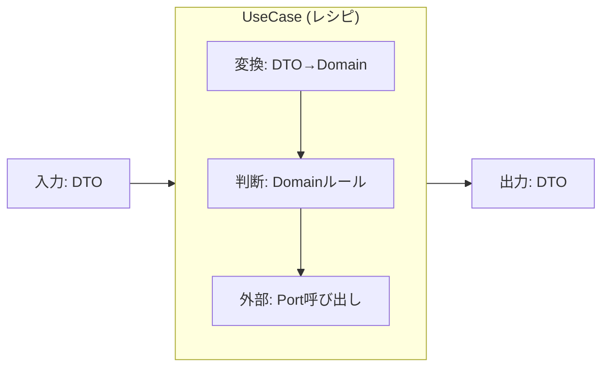

# 第21章：UseCase入門：アプリの手順（Application層）🧭🛠️


（いまのC#は **C# 14**、対応ランタイムは **.NET 10** が最新ど真ん中だよ〜✨） ([Microsoft Learn][1])

---

## 1) UseCaseってなに？🍳✨（「アプリのレシピ」だと思ってOK）




UseCase（ユースケース）は、ざっくり言うと **「ユーザーがやりたいこと（目的）を、アプリとして成立させる手順」** だよ🧾💕

例：カフェ注文アプリなら…☕

* 「注文する」🛒
* 「注文一覧を見る」📋
* 「注文をキャンセルする」🧯

この “やりたいこと単位” で、**入力→処理→出力** を整えるのがUseCaseの役目📦✨

---

## 2) DomainとUseCaseの違い🏠🧭（超ざっくりでOK！）


* **Domain（第18〜20章）**：ルールそのもの💎（値・制約・同一性・計算など）
* **UseCase（第21章）**：ルールを使って「手順にする」🧭（保存する・取得する・外部を呼ぶ…を段取りする）

つまり…

* Domain：**正しさの芯**🛡️
* UseCase：**実行の段取り**🧩

---

## 3) UseCaseの“責務”チェック✅（ここ超大事💖）


UseCaseがやること👇

* 入力を受け取る📥
* Domainのオブジェクトに変換する🔁
* Domainのルールで判断・計算する🧠
* 保存/取得など「外の力」が必要なら **Port（interface）** 経由で頼む🔌
* 出力を組み立てて返す📤

UseCaseが **やらない** こと👇（やりがち注意⚠️）

* Controller/画面の都合（HttpContextとか）を持ち込む🌐🚫
* DBの都合（SQL/ORMの型）を直に触る🗄️🚫
* 外部APIの細かい仕様（リトライ/ヘッダ/SDK事情）を抱え込む📡🚫

この考え方は「中心（Application Core）にインターフェイスを置いて、外側はそれを実装する」って整理に繋がるよ〜🔷 ([Microsoft Learn][2])

---

## 4) “画面項目のままにしない”ってどういうこと？📱➡️🧠


UseCaseの入力を、こんな風にUI都合のまま持ち込むとツラい😵‍💫

* `selectedIndex`（プルダウンの選択番号）
* `textBox1`（UI部品名）
* `isChecked`（チェックボックスの都合）

UseCaseでは、**業務の言葉**に寄せるのがコツだよ✨

* `MenuItemId`（商品ID）
* `Quantity`（数量）
* `CustomerName`（顧客名）

「そのデータは、現実世界でなんて呼ぶ？」って聞くのが最強🫶✨

---

## 5) 形を作ろう📦：Input → Process → Output

ここからミニ題材（カフェ注文）で、UseCaseの“型”を作るよ〜☕🛠️

### 5-1) 入力DTO / 出力DTO を用意する📥📤


* **DTOはUseCaseの入出力の箱**📦
* Domain型をそのまま外に出さない（理由は次章でじっくり）😉

```csharp
namespace CafeOrder.Core.Application;

public sealed record CreateOrderInput(
    string CustomerName,
    IReadOnlyList<CreateOrderItemInput> Items
);

public sealed record CreateOrderItemInput(
    string MenuItemId,
    int Quantity
);

public sealed record CreateOrderOutput(
    string OrderId,
    int TotalYen
);
```

> いまは「箱がある」だけでOK🙆‍♀️✨
> “Domainに変換する” のはUseCase側でやるよ🔁

---

### 5-2) 外に頼むためのPortを置く🔌（DBはまだ触らない）

「保存する」は外の仕事🗄️
UseCaseは **約束（interface）だけ知る** のがコツだよ💪

```csharp
namespace CafeOrder.Core.Application;

using CafeOrder.Core.Domain;

public interface IOrderRepository
{
    Task SaveAsync(Order order, CancellationToken ct);
}
```

---

### 5-3) UseCase本体を書く🧭✨（段取り係の完成！）


UseCaseは “手順” を書く場所だから、読みやすさが命だよ📖💕

```csharp
namespace CafeOrder.Core.Application;

using CafeOrder.Core.Domain;

public sealed class CreateOrderUseCase
{
    private readonly IOrderRepository _orderRepository;

    public CreateOrderUseCase(IOrderRepository orderRepository)
        => _orderRepository = orderRepository;

    public async Task<CreateOrderOutput> ExecuteAsync(CreateOrderInput input, CancellationToken ct)
    {
        // 1) 入力を最低限チェック✅（UIのバリデーションと役割分担してOK）
        if (string.IsNullOrWhiteSpace(input.CustomerName))
            throw new ArgumentException("CustomerName is required.");

        if (input.Items is null || input.Items.Count == 0)
            throw new ArgumentException("Items is required.");

        // 2) DTO → Domain に変換🔁
        var customerName = new CustomerName(input.CustomerName);

        var items = input.Items
            .Select(x => new OrderItem(new MenuItemId(x.MenuItemId), Quantity.Of(x.Quantity)))
            .ToList();

        // 3) Domainで注文を作る🛒（ルールはDomain側に寄せるイメージ）
        var order = Order.Create(customerName, items);

        // 4) 保存はPort経由でお願いする🗄️🔌
        await _orderRepository.SaveAsync(order, ct);

        // 5) 出力を作って返す📤
        return new CreateOrderOutput(
            OrderId: order.Id.Value,
            TotalYen: order.Total.Yen
        );
    }
}
```

ポイントまとめ🎯

* UseCaseは **「段取り」** に集中🧭
* 保存は `IOrderRepository` にお願いするだけ🔌
* Domain型への変換があるから、UI/DBの都合をCoreに混ぜにくい🧼✨

（「Use Cases＝Application層」って整理は、クリーンアーキ系でも定番の呼び方だよ📚） ([GitHub][3])

---

## 6) Domain側は“こういうノリ”でOK🏠💎（最低限のイメージ）

第18〜20章で作った想定でいいんだけど、雰囲気だけ置いておくね☺️

```csharp
namespace CafeOrder.Core.Domain;

public sealed record CustomerName(string Value);

public sealed record MenuItemId(string Value);

public sealed record Money(int Yen);

public sealed record Quantity(int Value)
{
    public static Quantity Of(int value)
        => value <= 0 ? throw new ArgumentOutOfRangeException(nameof(value)) : new(value);
}

public sealed record OrderItem(MenuItemId MenuItemId, Quantity Quantity);

public sealed record OrderId(string Value);

public sealed class Order
{
    public OrderId Id { get; }
    public CustomerName CustomerName { get; }
    public IReadOnlyList<OrderItem> Items { get; }
    public Money Total { get; }

    private Order(OrderId id, CustomerName customerName, List<OrderItem> items, Money total)
        => (Id, CustomerName, Items, Total) = (id, customerName, items, total);

    public static Order Create(CustomerName customerName, List<OrderItem> items)
    {
        // 本当はメニュー価格参照とかあるけど、ここでは雰囲気だけ☺️
        var total = new Money(items.Sum(x => x.Quantity.Value) * 500);
        return new Order(new OrderId(Guid.NewGuid().ToString("N")), customerName, items, total);
    }
}
```

---

## 7) UseCaseの“あるある事故”と治し方🩹😵‍💫


### 事故①：UseCaseが肥大化して読むのが辛い🍝

✅ 治し方：

* Domainに押し込めるルールは押し込む🏠
* 「変換」や「整形」はAdapter側に寄せる（次章）🔁
* UseCaseは “台本” のままにする📖✨

### 事故②：UseCaseがDB型（Entity）を返し始める🗄️😨

✅ 治し方：

* 出力DTOに詰め替える📦
* “外に見せる形” はUseCaseで決める📤

---

## 8) AI（Copilot/Codex等）に頼むときのコツ🤖✨（境界を守らせる）


AIは雛形づくりが得意だよ〜😆
でも境界を破りがちだから、プロンプトに **ルールを書いちゃう** のがコツ✍️

例（そのまま貼れる系）👇

* 「CreateOrderUseCaseを作って。**UseCaseはDTOを受け取りDTOを返す**。**DBやHTTP型は参照しない**。保存は `IOrderRepository` 経由。」🤖🔒
* 「DTO→Domain変換はUseCaseに置く。**Domainは純粋にルールだけ**。」🏠✨
* 「例外は `ArgumentException` でOK。あとでResult型にする前提で。」🧯🙂

---

## 9) ミニ練習問題💪📚（10〜20分でできる！）

1. `Quantity` が 1〜99 じゃないとダメ、をDomainに追加してみよ🔒✨
2. `CustomerName` を空文字禁止＋最大30文字、をDomainに追加してみよ🪪
3. `TotalYen` を「500円固定」じゃなくて、メニュー価格表（仮）から計算に変えてみよ🧾🔁

   * 価格表は次の章以降で外に出していくともっと気持ちいいよ😆🔌

---

## まとめ🎁✨

* UseCaseは「アプリの手順（段取り）」🧭
* Domainは「ルールの芯」🏠💎
* UseCaseは **Port（interface）経由で外に頼む** 🔌
* 入力DTO→Domain→出力DTO の型を作ると、ぐちゃぐちゃを防げる🧼✨

次の第22章では、このUseCaseを **「入口の約束（Inbound Port）」としてinterface化** していくよ〜🚪📝✨

[1]: https://learn.microsoft.com/en-us/dotnet/csharp/whats-new/csharp-14?utm_source=chatgpt.com "What's new in C# 14"
[2]: https://learn.microsoft.com/en-us/dotnet/architecture/modern-web-apps-azure/common-web-application-architectures?utm_source=chatgpt.com "Common web application architectures - .NET"
[3]: https://github.com/ardalis/CleanArchitecture?utm_source=chatgpt.com "ardalis/CleanArchitecture: Clean Architecture Solution ..."
