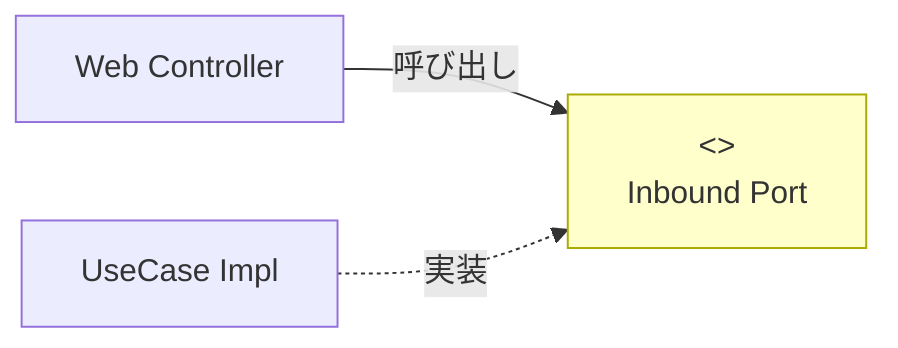

# 第22章：Inbound Port設計①：ユースケースの入口をinterface化🚪📝


([Past chat][1])([Past chat][2])([Past chat][3])([Past chat][4])([Past chat][5])([Past chat][6])([Past chat][7])

この章は「ユースケース（UseCase）を外側から呼ぶための“入口”を、`interface`として固定しよう！」がテーマだよ〜😊🔌
ここをちゃんとやると、ControllerやCLIみたいな入口を増やしても、中心（Core）のルールがブレにくくなる✨

※ちなみに今どきのC#は **C# 14 / .NET 10** が最新世代だよ🆕✨（Visual Studio 2026に .NET 10 SDK が入ってるよ） ([Microsoft Learn][8])
Visual Studio 2022を使ってる場合も、2026年1月時点で 17.14 系が現役サポートだよ〜🧰 ([Microsoft Learn][9])

---

## 1) Inbound Portってなに？🤔🔌




Inbound Portは一言でいうと…

**「外側（Web/画面/CLI）が、アプリの中心（Application）を呼ぶための“呼び出し口”」** だよ🚪✨

* 外側：Controller / API / 画面 / CLI / バッチ など🌐💻
* 中心：UseCase（アプリがやりたい手順）🧭
* その間の“約束”が Inbound Port（interface）📝

イメージ👇

```text
[Web Controller]  --->  (ICreateOrderUseCase)  --->  [CreateOrderUseCase]
   外側 Adapter              Inbound Port                中心 Application
```

---

## 2) なんでわざわざ interface 化するの？😵‍💫➡️😊

### ✅ 理由A：入口が増えても中心が守れる🛡️

今日はWeb、明日はCLI、来週はバッチ…って入口が増えても、
**「呼び方（契約）」が1つに固定**されてると、中心が散らからない✨

### ✅ 理由B：Controllerが“薄く”なりやすい🌿

Controllerは「受け取って、呼ぶ」だけに寄せやすい😊
（次の章で“薄いController最高✨”をやるよ！）

### ✅ 理由C：テストがラクになる🧪💖

UseCaseをinterfaceで扱えると、外側のテストでも差し替えやすい！
（Fake/Stubを作るときもキレイにハマる🎯）

---

## 3) Inbound Portはどこに置く？📦🧠

**置き場所は“中心側（Application）”** が基本だよ😊
なぜなら「外側に置く」と、中心が外側に引っ張られやすいから⚠️

おすすめ例👇

* `src/CafeOrder.Application/Ports/Inbound/`

  * `ICreateOrderUseCase.cs`
  * （増えてきたら）`IGetOrdersUseCase.cs` など

---

## 4) 署名（メソッド）をどう設計する？📝✨

ここがこの章のキモだよ〜！💪😆
方針は **「ユースケース1つにつき、interface1つ + メソッド1つ」** が分かりやすい👍

### ✅ 4-1) 入力は「Command」、出力は「Result」📦✨

この教材では（前の章の流れ的にも）こうするのがキレイ：

* 入力：`CreateOrderCommand`
* 出力：`CreateOrderResult`

**ポイント：WebのDTO（Request/Response）をApplicationに入れない**🚫
DTOは次章で作って、Adapter側で `ToCommand()` 変換するよ🔁✨

### ✅ 4-2) 非同期は基本 `Task` に寄せとく⚡

将来DBや外部APIが入ったら、非同期に寄りたくなることが多いよね😊
だから最初からこうしておくと“後で地獄”を避けられる😂

### ✅ 4-3) `CancellationToken` をつける（今どき感）🧯

Webやバッチでキャンセルが効くようになる✨
「あとで付け足す」のもアリだけど、最初から付けるのがラク！

---

## 5) 実装してみよう（この章のゴール）🛠️☕🧾

ここでは「注文作成」の入口を `interface` 化するよ！✨
（※クラス本体の詳細ロジックは前章〜で作ってる前提でOK👌）

### 5-1) Inbound Port（interface）を作る🚪📝

**`src/CafeOrder.Application/Ports/Inbound/ICreateOrderUseCase.cs`**

```csharp
using System.Threading;
using System.Threading.Tasks;

namespace CafeOrder.Application.Ports.Inbound;

public interface ICreateOrderUseCase
{
    Task<CreateOrderResult> HandleAsync(CreateOrderCommand command, CancellationToken ct = default);
}
```

> メソッド名は `HandleAsync` / `ExecuteAsync` どっちでもOK😊
> 大事なのは **チーム内で統一** することだよ〜📌✨

---

### 5-2) UseCase本体が interface を実装する🧩✨

**`CreateOrderUseCase` がある前提**で、こうするだけ！

```csharp
using System.Threading;
using System.Threading.Tasks;
using CafeOrder.Application.Ports.Inbound;
using CafeOrder.Application.Ports.Outbound;

namespace CafeOrder.Application.UseCases;

public sealed class CreateOrderUseCase : ICreateOrderUseCase
{
    private readonly IOrderRepository _orderRepository;

    public CreateOrderUseCase(IOrderRepository orderRepository)
    {
        _orderRepository = orderRepository;
    }

    public async Task<CreateOrderResult> HandleAsync(CreateOrderCommand command, CancellationToken ct = default)
    {
        // ここは前章〜で作った「手順」を入れる場所🧭✨
        // 例：Order を作る → 保存する → 結果を返す
        // （詳細はこの章の主題じゃないので最小でOK👌）

        await Task.CompletedTask;
        return new CreateOrderResult(orderId: "TEMP"); // 仮（後でちゃんと）
    }
}
```

> ここでの主役は **「入口が interface になった」** ことだよ😊🔌
> 中身は最小でOK（後で積み上げる）👍

---

### 5-3) Command / Result（なければ最小で用意）📦✨

もしまだ無いなら、まずは最小でOK！

```csharp
namespace CafeOrder.Application;

public sealed record CreateOrderCommand(
    string CustomerName,
    IReadOnlyList<CreateOrderLineCommand> Lines
);

public sealed record CreateOrderLineCommand(
    string ItemName,
    int Quantity
);

public sealed record CreateOrderResult(
    string OrderId
);
```

> 次章でDTOを作ったら、Web側DTO → Command へ変換していくよ🔁✨

---

## 6) テストはどうする？（この章っぽいやり方）🧪💖

「interface作っただけ」ってテストしにくいんだけど、
**“interfaceとして扱える”ことをテストで固定**すると気持ちいいよ😊✨

例：`ICreateOrderUseCase sut = new CreateOrderUseCase(...)` が通ることを確認！

```csharp
using CafeOrder.Application.Ports.Inbound;
using CafeOrder.Application.UseCases;
using Xunit;

public class CreateOrderUseCaseTests
{
    [Fact]
    public void Can_be_used_via_inbound_port_interface()
    {
        // Arrange
        var repo = new FakeOrderRepository();
        
        // Act
        ICreateOrderUseCase sut = new CreateOrderUseCase(repo);

        // Assert
        Assert.NotNull(sut);
    }
}
```

---

## 7) AI（Copilot/Codex）に頼むときのコツ🤖✨

“こう頼む”ときれいに出やすいよ😊

* 🪄 **プロンプト例**

  * 「`CreateOrder` ユースケースの Inbound Port を `ICreateOrderUseCase` として作って。引数は `CreateOrderCommand`、戻り値は `Task<CreateOrderResult>`、`CancellationToken` も付けて」
* ⚠️ **注意**

  * 「WebのRequest/Response DTOをApplicationに置かないで」って一言を足すと事故りにくい🚫🙂

---

## 8) よくある落とし穴（超あるある）⚠️😂

* ❌ `HttpContext` や `ControllerBase` がUseCaseに入ってくる
  → それは“外側の都合”だからダメ〜！🧼
* ❌ UseCaseが `Request/Response DTO` を直接受け取る
  → DTOはAdapter側！次章でやるよ🔁
* ❌ interfaceが巨大化（メソッド10個とか）
  → **「ユースケースごとにinterface分ける」** がスッキリ😊✨

---

## 9) この章のミニ練習🎯✨

1. 「注文一覧」のInbound Portを作ってみてね😊

   * `IGetOrdersUseCase`
   * `Task<GetOrdersResult> HandleAsync(GetOrdersQuery query, CancellationToken ct = default);`

2. interfaceの置き場所をちゃんと `Application/Ports/Inbound` にする📦

---

## 10) 章末チェックリスト✅✨

* ✅ Inbound Port（interface）が **Application側** にある
* ✅ UseCase本体がそのinterfaceを **実装している**
* ✅ 入口（外側）は **interfaceを呼ぶ設計** にできる準備ができた
* ✅ Web DTO は **まだ中心に入れてない**（次章でAdapter側に置く）🧼🔁

---

次の第23章で、いよいよ **DTO（入力/出力）** を作って、
「外側のデータ」をキレイに受け渡しできる形にしていくよ〜📦✨😆

[1]: https://chatgpt.com/c/696d0f55-9da0-8320-b777-d0aff4030dd8 "第14章 粒度ルール"
[2]: https://chatgpt.com/c/6971bcc8-dcec-8321-aa8a-5b588cbb6f33 "設計優先度リスト"
[3]: https://chatgpt.com/c/696baf41-2a80-8320-8f04-a61f31ad7a78 "依存関係ルール入門■■■"
[4]: https://chatgpt.com/c/6970458f-7110-8321-8e2c-01eb1ab5a08b "ヘキサゴナル設計の略語"
[5]: https://chatgpt.com/c/6972890b-5ac4-8322-a67f-bf53b37bf0aa "ヘキサゴナル設計入門"
[6]: https://chatgpt.com/c/69727622-52cc-8324-9048-3c609aeecd57 "ヘキサゴナル設計基礎"
[7]: https://chatgpt.com/c/6971d123-fea8-8322-9f32-6a5f069ca40f "第5章 ポートとアダプター"
[8]: https://learn.microsoft.com/en-us/dotnet/csharp/whats-new/csharp-14?utm_source=chatgpt.com "What's new in C# 14"
[9]: https://learn.microsoft.com/ja-jp/visualstudio/releases/2022/release-history?utm_source=chatgpt.com "Visual Studio 2022 リリース履歴"
