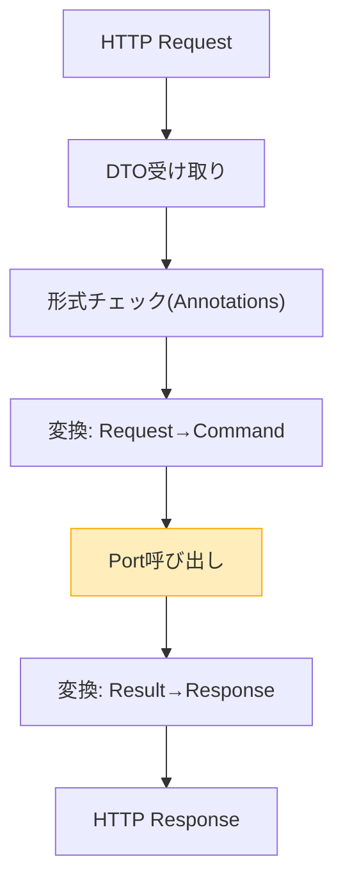

# 第24章：Inbound Adapter①：Controllerは薄く！🌐🙂


この章はひとことで言うと、**「Controllerを“ただの受付”にする」**練習だよ〜！🧾➡️🧠➡️✅
受付が薄いほど、変更に強くなるし、テストもしやすくなるの😊💕

---

## 1) 今日のゴール🎯✨




### ✅ Controllerがやること（受付の仕事）💁‍♀️

* HTTPリクエストを受け取る📩
* 入力DTOを受ける（形のチェック）🧩
* **Port（UseCase）を呼ぶ**📞
* 結果をHTTPレスポンスにする📤

### ❌ Controllerがやっちゃダメなこと（中身の仕事）🙅‍♀️

* 業務ルールの判断（例：割引条件、在庫ルール）🧠💥
* DBアクセス（Repository呼び出し）🗄️💥
* ドメインの生成ロジック盛り盛り（複雑な組み立て）🧱💥
* 例外の握りつぶし・謎の変換（とりあえず200返す等）😇💥

---

## 2) “薄いController”の合言葉🪄✨


**Controllerは、これだけでOK**👇（テンプレ6手）😆

1. DTOを受け取る📦
2. 必要なら軽い形式チェック✅
3. UseCase入力に変換🔁
4. Port（UseCase）を呼ぶ📞
5. 出力をレスポンスDTOに変換🔁
6. HTTP結果を返す📤

それ以上は **外へ追い出す**！🏃‍♀️💨

---

## 3) バリデーションの置き場所ルール✅🧠


ここ、超大事だよ〜！📌✨

### ① 形式（入力の形）バリデーション：Inbound側🧾✅

例：

* 必須項目が空（null/空文字）
* 数字の範囲（1〜99）
* 文字数（1〜50）

ASP.NET Coreの **`[ApiController]`** を付けると、モデル検証エラーは **自動で400** になるから、Controllerで `ModelState.IsValid` を毎回書かなくていいよ〜！楽ちん！😆✨ ([Microsoft Learn][1])

### ② 業務（意味）バリデーション：Core（Domain/UseCase）🛡️❤️

例：

* 「注文は営業時間内だけ」
* 「同一注文に同じ商品を二重追加禁止」
* 「金額の合計が負にならない」

これはUI都合じゃなくて**ルール**だから、Coreに置くのが強い💪✨

---

## 4) 変換（DTO ↔ Core）の置き場所🔁🧼


**変換はAdapterの大事なお仕事**だよ〜！🧹✨
外の都合（HTTP/JSON）を、Coreに持ち込まないための“フィルター”😤💕

* Request DTO → UseCase Input（Coreが欲しい形）
* UseCase Output → Response DTO（外へ出す形）

「変換が散らばる」とControllerが太りがちだから、**Mapper（変換クラス）を用意**すると超気持ちいいよ😊🌿

---

## 5) 実装例：OrdersController（薄い版）☕🧾✨

前提：すでに Core 側に **Inbound Port（UseCase interface）** と **UseCase用DTO** がある想定だよ！（第22〜23章の続き）🙂

### 5-1. Core側（Port）イメージ🧠🔌

```csharp
public interface ICreateOrderUseCase
{
    Task<CreateOrderResult> HandleAsync(CreateOrderCommand command, CancellationToken ct);
}

public sealed record CreateOrderCommand(
    string CustomerName,
    IReadOnlyList<CreateOrderItem> Items
);

public sealed record CreateOrderItem(string MenuId, int Quantity);

public sealed record CreateOrderResult(string OrderId);
```

> ここは **Core**。HTTPを一切知らないのがポイント🛡️✨

---

### 5-2. Inbound側：Request/Response DTO📦✨

```csharp
using System.ComponentModel.DataAnnotations;

public sealed record CreateOrderRequest(
    [property: Required, StringLength(50, MinimumLength = 1)]
    string CustomerName,

    [property: Required, MinLength(1)]
    List<CreateOrderItemRequest> Items
);

public sealed record CreateOrderItemRequest(
    [property: Required, StringLength(50, MinimumLength = 1)]
    string MenuId,

    [property: Range(1, 99)]
    int Quantity
);

public sealed record CreateOrderResponse(string OrderId);
```

`[ApiController]` なら、この DataAnnotations の検証エラーは **自動400** にしてくれるよ〜！😆✨ ([Microsoft Learn][1])
（エラーフォーマットは `ValidationProblemDetails` が使われる流れだよ🧩） ([Microsoft Learn][1])

---

### 5-3. 変換Mapper（Controllerを痩せさせる）🔁🧼

```csharp
public static class OrderDtoMapper
{
    public static CreateOrderCommand ToCommand(this CreateOrderRequest req)
        => new(
            CustomerName: req.CustomerName,
            Items: req.Items.Select(x => new CreateOrderItem(x.MenuId, x.Quantity)).ToList()
        );

    public static CreateOrderResponse ToResponse(this CreateOrderResult result)
        => new(result.OrderId);
}
```

---

### 5-4. Controller本体（薄い！）🌿✨

```csharp
using Microsoft.AspNetCore.Mvc;

[ApiController]
[Route("api/orders")]
public sealed class OrdersController : ControllerBase
{
    private readonly ICreateOrderUseCase _createOrder;

    public OrdersController(ICreateOrderUseCase createOrder)
    {
        _createOrder = createOrder;
    }

    [HttpPost]
    public async Task<ActionResult<CreateOrderResponse>> Create(
        [FromBody] CreateOrderRequest request,
        CancellationToken ct)
    {
        // ① DTOを受ける（[ApiController] が形式チェックを助けてくれる）
        // ② UseCase入力に変換
        var command = request.ToCommand();

        // ③ Port呼び出し
        var result = await _createOrder.HandleAsync(command, ct);

        // ④ 返す形に変換して返却
        var response = result.ToResponse();

        return CreatedAtAction(nameof(GetById), new { orderId = response.OrderId }, response);
    }

    [HttpGet("{orderId}")]
    public ActionResult GetById(string orderId)
        => Ok(new { OrderId = orderId }); // ← ここは後の章でちゃんと実装しよう😊
}
```

見て見て！👀✨
Controllerの中に「業務ロジック」「DB」「謎の変換」が無い！最高！🎉😆

---

## 6) よくある“太る原因”と治し方🍔➡️🥗


### 🍔 太る原因①：Controllerで「ビジネス判断」しちゃう

✅ **治し方**：UseCaseへ移動（Coreへ）🛡️

### 🍔 太る原因②：ControllerがRepositoryを呼ぶ

✅ **治し方**：UseCaseがRepository Portを使う構造に戻す🔌🗄️

### 🍔 太る原因③：変換がControllerにベタ書き

✅ **治し方**：Mapperへ隔離（Adapterの仕事）🧼🔁

### 🍔 太る原因④：ModelStateチェック祭り

✅ **治し方**：`[ApiController]` の自動400を活かす（毎回書かない）😆✨ ([Microsoft Learn][1])

---

## 7) AI活用（Copilot/Codex）で爆速にするコツ🤖💨✨


### ✅ おすすめプロンプト例（そのまま貼れる）📋✨

* 「ASP.NET Core WebAPIのControllerを作って。`ICreateOrderUseCase` をDIで受け取り、Controllerは変換→UseCase呼び出し→返却だけにして。業務ロジックは入れないで。」
* 「Request/Response DTOをDataAnnotationsで作って。`[ApiController]` 前提で、検証エラーは自動400に任せたい。」

Visual Studio 2026 は Copilot まわりの統合も強化され続けてるので、**雛形生成→人間が境界ルールを守る**がやりやすいよ〜！🤖✨ ([Microsoft Learn][2])

---

## 8) ミニ演習🧪✨（めちゃ効く！）

### お題☕🧾

「太ったController」を想像して、次を全部外へ追い出してみてね👇😆

* if文だらけの業務判断 → UseCase
* DB保存 → Outbound Port/Adapter
* 変換ぐちゃぐちゃ → Mapper
* 形式チェック → DTO + DataAnnotations

---

## 9) 仕上げチェックリスト✅✨

* Controllerが **Port以外**（RepositoryやDB）を触ってない？🗄️🚫
* Controllerに「業務判断」が書いてない？🧠🚫
* 変換がMapperに寄ってる？🔁✅
* `[ApiController]` の自動400を活かしてる？😆✅ ([Microsoft Learn][1])
* CoreはHTTPを知らない？🛡️✅

---

## おまけ：今どきの基準のひとことメモ📝✨

いまの .NET は **.NET 10 が最新LTS**として提供されていて、2026-01-13時点で 10.0.2 が出てるよ〜！🪟✨ ([Microsoft][3])
（C# 14 は .NET 10 以降でサポート、って整理になってるよ📌） ([Microsoft Learn][4])

---

次の章（第25章）は、いよいよ **Outbound Port（Repositoryの約束）** を作って「Coreが外を知らない」をさらに固めるよ〜！🔌🗄️✨

[1]: https://learn.microsoft.com/en-us/aspnet/core/web-api/?view=aspnetcore-10.0 "Create web APIs with ASP.NET Core | Microsoft Learn"
[2]: https://learn.microsoft.com/ja-jp/visualstudio/releases/2026/release-notes "Visual Studio 2026 リリース ノート | Microsoft Learn"
[3]: https://dotnet.microsoft.com/en-us/download/dotnet "Browse all .NET versions to download | .NET"
[4]: https://learn.microsoft.com/en-us/dotnet/csharp/language-reference/language-versioning?utm_source=chatgpt.com "Language versioning - C# reference"
