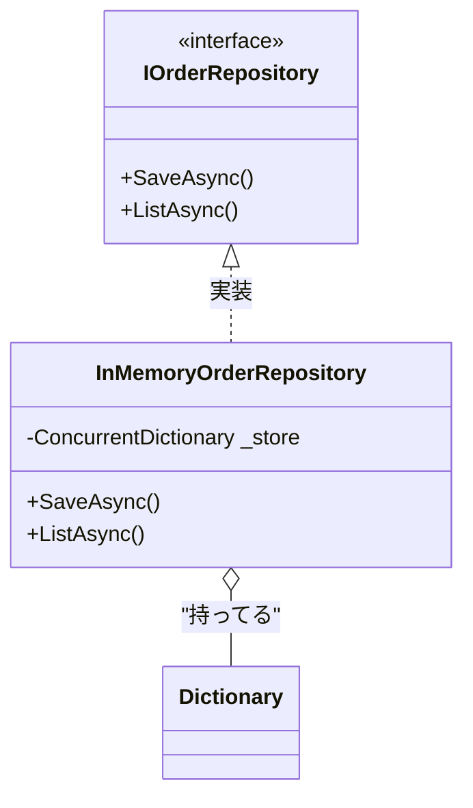

# 第26章：Outbound Adapter①：InMemory実装でまず完成🧪📦


まず今の “最新土台” は **.NET 10（LTS）**＆**C# 14**＆**Visual Studio 2026** が中心だよ〜！✨（.NET 10 は 2025/11/11 リリース、2026/1/13 時点の最新パッチは 10.0.2） ([Microsoft][1])
C# 14 は .NET 10 SDK / Visual Studio 2026 で試せるよ〜 🧠✨ ([Microsoft Learn][2])

---

## 1) この章のゴール ✅✨

この章でやることは、ズバリこれ👇

* **Outbound Port（IOrderRepository）** を **InMemory Adapter** で実装して
* **「注文できる／一覧できる」** を **まず動く状態にする** ☕🧾
* しかも、あとでDBに差し替えても **Core側はほぼ無傷** を目指す🛡️✨

---

## 2) ざっくり図で確認🔷➡️🗄️


Core（中）は「保存したい！」って“気持ち”だけ知ってて、
実際の保存先（メモリ／DB）は外に置くよ〜😊

* Core：`IOrderRepository`（約束）📝
* 外側：`InMemoryOrderRepository`（実装）📦

---

## 3) “InMemoryから始める” の良さ😊💡


* 最速で **動く**（KISS！）🚀
* まだDBの細かい話がなくても **ユースケースの形が作れる** 🧭
* テストがしやすい（DBなしで検証できる）🧪💖
* 後で差し替えして「強さ」を体感しやすい🔁✨

---

## 4) 置き場所のおすすめ📦🏷️

例（前章の構成に合わせて読み替えOKだよ）👇

* `CafeApp.Core`

  * `Ports/Outbound/IOrderRepository.cs`
* `CafeApp.Adapters.Outbound.InMemory`

  * `Orders/InMemoryOrderRepository.cs`

---

## 5) Outbound Port（Core側）📝🔌

すでに第25章で作ってる前提だけど、イメージはこんな形👇
（もし違ってても、メソッド名だけ合わせればOKだよ😊）

```csharp
// CafeApp.Core/Ports/Outbound/IOrderRepository.cs
namespace CafeApp.Core.Ports.Outbound;

public interface IOrderRepository
{
    Task SaveAsync(Order order, CancellationToken ct = default);
    Task<Order?> FindByIdAsync(OrderId id, CancellationToken ct = default);
    Task<IReadOnlyList<Order>> ListAsync(CancellationToken ct = default);
}
```

---

## 6) InMemory Adapter 実装（外側）📦🧪




### 方針はシンプルに😊


* まずは **ConcurrentDictionary** で持つ（Web APIだと並行アクセスあるからね）🔒
* `SaveAsync` は「上書き保存」でOK
* `ListAsync` は「今あるもの全部返す」でOK

> **ポイント**：InMemoryは “最終形” じゃなくて、**差し替え可能な踏み台** だよ〜🧱✨

---

### 実装例（InMemoryOrderRepository）📦

```csharp
// CafeApp.Adapters.Outbound.InMemory/Orders/InMemoryOrderRepository.cs
using System.Collections.Concurrent;
using CafeApp.Core;
using CafeApp.Core.Ports.Outbound;

namespace CafeApp.Adapters.Outbound.InMemory.Orders;

public sealed class InMemoryOrderRepository : IOrderRepository
{
    // OrderId をキーにして注文を保存（超シンプル）
    private readonly ConcurrentDictionary<OrderId, Order> _store = new();

    public Task SaveAsync(Order order, CancellationToken ct = default)
    {
        _store[order.Id] = order; // 上書きOK（まずはKISS😊）
        return Task.CompletedTask;
    }

    public Task<Order?> FindByIdAsync(OrderId id, CancellationToken ct = default)
    {
        _store.TryGetValue(id, out var order);
        return Task.FromResult(order);
    }

    public Task<IReadOnlyList<Order>> ListAsync(CancellationToken ct = default)
    {
        // 返すときは IReadOnlyList にしておくと安心感アップ💖
        IReadOnlyList<Order> list = _store.Values
            .OrderBy(o => o.CreatedAt) // もしCreatedAtがあるなら並べ替え✨（無ければ消してOK）
            .ToList();

        return Task.FromResult(list);
    }
}
```

---

## 7) ここで “事故りやすいポイント” 3つ😵‍💫➡️😊


### ① Domainを外へ漏らしすぎ問題 🌊

* InMemoryは内製だからまだマシだけど、**DTO変換が必要な外部（DB/HTTP）** では
  「変換はAdapter側」ってルールを守るのが超大事🧼✨

### ② 返したリストを外側が勝手に書き換える問題 ✍️

* だから `IReadOnlyList` で返すのがおすすめだよ💖

### ③ 並行アクセスで落ちる問題🧨

* Web APIだと同時アクセス普通にあるから、`ConcurrentDictionary` は良い保険😊🔒

---

## 8) “とりあえず動かす配線” の最小例🧩✨


本来は Composition Root（第32章）でやるけど、今は最小だけ紹介するね🙂
（あとで「ここに集める！」って形に直す前提でOK）

### Program.cs（例：ASP.NET Core）

```csharp
using CafeApp.Core.Ports.Outbound;
using CafeApp.Adapters.Outbound.InMemory.Orders;

var builder = WebApplication.CreateBuilder(args);

builder.Services.AddControllers();

// InMemoryは「状態を持つ」ので、まずは Singleton が分かりやすいよ😊
builder.Services.AddSingleton<IOrderRepository, InMemoryOrderRepository>();

var app = builder.Build();
app.MapControllers();
app.Run();
```

---

## 9) 動作チェックのミニ手順☕🧾✅


* 注文作成APIを叩く（POST）📮
* 注文一覧APIを叩く（GET）📬
* アプリ再起動したら消える（InMemoryだからね）😆💨
  → ここで「次はDBに差し替えたい！」って気持ちが育つ🌱✨

---

## 10) Copilot/Codexに頼むときの “うまい指示”🤖✨

こういう指示が強いよ👇（境界ルールを守らせる！🚦）

* 「`IOrderRepository` を実装する `InMemoryOrderRepository` を作って。保存は `ConcurrentDictionary`。返却は `IReadOnlyList`。」
* 「Core には依存しないでね。Adapter側のプロジェクトに置いてね。」
* 「メソッドは `SaveAsync / FindByIdAsync / ListAsync` の3つ。」

AIに雛形を作らせて、**“置き場所と責務” は人間がガード** が最強だよ😊🛡️

---

## 11) この章のチェックリスト✅✨

* [ ] Core の `IOrderRepository` は **外の実装を知らない** 🚫
* [ ] InMemory 実装は **Adapter側** にある📦
* [ ] 依存の向きが逆転してない（Core→Adapter参照になってない）🔁❌
* [ ] 一覧取得ができる（動く！）😆
* [ ] あとでDB実装に差し替えできそうな匂いがする🔁✨

---

次の第27章では、この InMemory を **DB実装に差し替える“考え方”** をやって、
「うわ…Coreがほんとに変わらない…😍」を体験しにいくよ〜🔁🗃️✨

[1]: https://dotnet.microsoft.com/en-us/platform/support/policy/dotnet-core?utm_source=chatgpt.com "NET and .NET Core official support policy"
[2]: https://learn.microsoft.com/ja-jp/dotnet/csharp/whats-new/csharp-14?utm_source=chatgpt.com "C# 14 の新機能"
