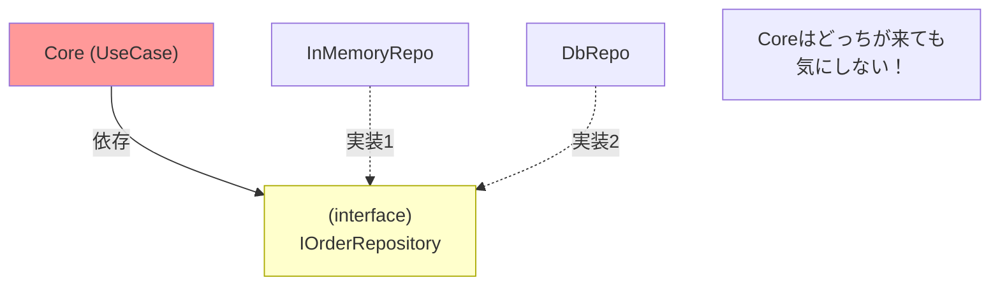

# 第27章：Outbound Adapter②：DB実装に差し替え（考え方）🔁🗃️


この章は「**InMemoryで動いたアプリを、DBに差し替えるときの“設計のコツ”**」を身につける回だよ〜！🥳
次の第28章でDB実装の最低限サンプルをやる前に、ここで**迷子にならない地図**を作る感じ🗺️💕

---

## 0. まず結論：差し替えで変えたいのは“外側だけ”🛡️✨




ヘキサゴナルの美味しいところはこれ👇

* ✅ **Port（interface）は変えない**（＝約束は固定）
* ✅ **Core（Domain/UseCase）は変えない**（＝業務ルール守られる）
* ✅ **Adapterだけ入れ替える**（＝外部の都合だけ交換）

つまり「**DB対応＝大改造**」じゃなくて、
「**プラグインを差し替える**」みたいな感覚になるのが理想だよ🔌😆

---

## 1. “差し替え”の全体像を1枚で🧠📌


イメージはこう👇

* Core（UseCase）が欲しいのは「保存できること」「取得できること」だけ
* それを **IOrderRepository（Port）** に言語化してある
* 実装は複数あってOK

  * InMemoryOrderRepository（いま）
  * DbOrderRepository（これから）

そして **DI（Composition Root）でどっちを使うか選ぶ**🧩✨
（この「選ぶ場所」が超だいじ！）

---

## 2. DB差し替えの“正しい手順”】【最短で事故らない】🚦🧯

差し替えって、焦るとぐちゃぐちゃになるので…
おすすめ手順をそのまま使ってOKだよ🙆‍♀️💕

### Step A：まず“いま”が全部グリーンか確認🟢✅

* テストがあるなら全部通す
* テストないなら最低でも「注文作成→一覧表示」が動くのを確認

ここが赤いまま次に行くと、原因が混ざって地獄になるよ😇💥

---

### Step B：DB用Adapterを“別プロジェクト/別フォルダ”に作る📦✨


ここが超重要ポイント💡
**DBの都合（EF Core、接続文字列、Entityクラス）をCoreに入れない**ために分けるよ！

EF Core は .NET 10 と同じタイミングの **EF Core 10（LTS）** があり、.NET 10 SDK/Runtime が必須だよ〜（古い .NET では動かない）📌✨ ([Microsoft Learn][1])

---

### Step C：Portはそのまま、DB Adapterが実装する🧠🔌

Portは「欲しいこと」だけを表してるはず👇

* Save（保存）
* Find（取得）
* List（一覧）

DB Adapterはその interface を実装して、DBへつなぐ役目だけやる✨
**このとき Core は DB を1ミリも知らない**のが勝ち🏆

---

### Step D：差し替えポイントは “DI登録（配線）” だけにする🔁🧩


差し替えの本体はここ！
「どの実装を IOrderRepository として使うか」を切り替えるのは **Composition Root（例：Program.cs）** だよ📍✨

ASP.NET Core のDIは `AddScoped` / `AddTransient` / `AddSingleton` みたいに登録して使うのが基本だよ〜🔧 ([Microsoft Learn][2])

例（雰囲気だけ。実装は次章で！）👇

```csharp
// Program.cs（Composition Root）
if (builder.Configuration.GetValue<bool>("UseInMemory"))
{
    builder.Services.AddScoped<IOrderRepository, InMemoryOrderRepository>();
}
else
{
    builder.Services.AddScoped<IOrderRepository, DbOrderRepository>();
}
```

これができると、**Coreのコード0行変更で差し替え**が成立するよ😆🛡️

---

## 3. “差し替えで壊れやすいポイント”だけ先に潰そ〜😵‍💫🧯

### ❶ Domain型をそのままDBに保存しようとして詰む💥


ありがち👇

* DomainのクラスにEFの属性を貼る
* Domainに `DbContext` が出てくる
* CoreプロジェクトがEFパッケージ参照しちゃう

👉 これは「DB都合がCoreに侵入」してアウト〜🧼😭
**DBモデル（Entity）とDomainは別物**にして、変換はAdapterに押し込むのが安全🙆‍♀️✨

---

### ❷ Portが“DBっぽい形”になる（Queryable地獄）🕳️😇


Portにこういうのを入れると、差し替え不能になりがち👇

* `IQueryable<Order>` を返す
* `Expression<Func<...>>` を受ける
* 「DBの検索最適化都合」が interface に滲む

👉 Portは「ユースケースが欲しいもの」を返すのが大事🎯
検索条件も「ユースケース語彙」で表現できると強いよ💪✨

---

### ❸ 例外がDB依存のままCoreへ飛んでくる💣

DB Adapterが投げる例外（接続失敗、制約違反など）を、そのままCoreに流すと…

* CoreがDB例外型を知る羽目になる
* 画面にDBっぽいエラーが出る

👉 Adapter側で「アプリとして意味ある失敗」に変換するのが理想（この話は第35章で仕上げるよ🎁）

---

## 4. “差し替えに強い”設計の合言葉3つ🧡✨


### 合言葉①：Portは「欲しいこと」だけ📝

* 保存したい
* 取得したい
* 一覧が欲しい
  → **方法は言わない**（SQLとか知らん！😤）

### 合言葉②：Adapterは「変換係」🔁

* Domain ↔ DB Entity
* DTO ↔ Domain（Inboundの話と同じ！）

### 合言葉③：配線は外で（Composition Root）📍

* Coreは配線しない
* `new` しない（DIに寄せる）

---

## 5. AI（Copilot/Codex）で爆速にするコツ🤖⚡

AIはこういう“外側作業”が得意だよ😆✨
ただし **境界ルール（Coreに漏らさない）は人間が守る**🚦

おすすめ指示例👇（そのまま投げてOK）

* 「`IOrderRepository` を実装する `DbOrderRepository` の雛形を作って。DomainとDB Entityは分けて、変換はRepository内でやって」
* 「EF Core用の `OrderEntity` と `OrderItemEntity` を作って、Domain `Order` とのマッピング関数も用意して」
* 「Program.csで `UseInMemory` フラグに応じて実装を切り替えるDI登録コードを書いて」

AIに作らせたら、人間はここだけ見る👀✨

* CoreがEF参照してない？
* PortがDB都合になってない？
* 変換がAdapterに閉じてる？

---

## 6. ミニ演習：差し替えの“気持ちよさ”を体験しよ😆🎮

やることは超シンプル👇

1. `DbOrderRepository : IOrderRepository` を作る（中身は `throw new NotImplementedException()` でもOK）
2. DI登録を `DbOrderRepository` に切り替える
3. **コンパイルエラーがどこに出るか**を見る👀

   * 理想：Adapter側だけで完結
   * もしCore側が壊れたら、依存が漏れてるサイン🚨

この“漏れ検知”にめちゃくちゃ効くよ✅✨

---

## 7. この章の最終チェックリスト✅✨

* [ ] Port（interface）を変えずに進めてる？📝
* [ ] CoreがEF/DBを参照してない？🛡️
* [ ] DBモデルとDomainを分けた？🧼
* [ ] 変換はAdapterに押し込めた？🔁
* [ ] 差し替え箇所がDI登録（配線）に集中してる？📍

---

## ちなみに：2026時点の基盤はこんな感じだよ📌🪟

* .NET 10 は **2025年11月リリースのLTS** で、2026年1月時点でもアクティブサポート中だよ🧡 ([Microsoft][3])
* EF Core 10 も **LTS** で .NET 10 が必須だよ🔒 ([Microsoft Learn][1])
* Visual Studio は **Visual Studio 2026** のリリースノートが出ていて、2026年1月の更新も案内されてるよ🧰✨ ([Microsoft Learn][4])

---

次の第28章では、いよいよ **DB Adapterの“最低限実装”** をやって「ほんとに差し替わるじゃん！」を体験するよ〜！🗃️🔥

[1]: https://learn.microsoft.com/en-us/ef/core/what-is-new/ef-core-10.0/whatsnew?utm_source=chatgpt.com "What's New in EF Core 10"
[2]: https://learn.microsoft.com/en-us/aspnet/core/fundamentals/dependency-injection?view=aspnetcore-10.0&utm_source=chatgpt.com "Dependency injection in ASP.NET Core"
[3]: https://dotnet.microsoft.com/ja-jp/platform/support/policy/dotnet-core?utm_source=chatgpt.com ".NET および .NET Core の公式サポート ポリシー"
[4]: https://learn.microsoft.com/ja-jp/visualstudio/releases/2026/release-notes?utm_source=chatgpt.com "Visual Studio 2026 リリース ノート"
