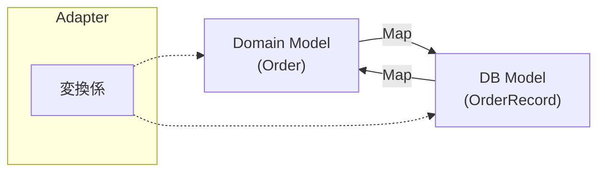

# 第28章：Outbound Adapter③：DB実装（最低限の実例）🗃️⚙️


ここでやることは超シンプルだよ〜！😆
**「InMemory の Repository を、DB版に差し替える」** それだけ！
しかも、**Core（Domain/Application）は1ミリも汚さない**のが今日の勝ち筋 🛡️💖

---

## 今日のゴール 🎯✨

* ✅ Outbound Port（IOrderRepository）を **DB実装Adapter** で満たす
* ✅ **DB都合（テーブル、カラム、ORMの癖）をCoreに漏らさない**🧼
* ✅ “差し替え”を体験して「ヘキサ強い…」ってなる😆🔁

---

## 今どきの前提（最新）📌🆕

* **.NET 10** は 2025/11/11 リリースで LTS（サポートは 2028/11/14 まで）([Microsoft Learn][1])
* **EF Core 10** も 2025/11 にリリースで LTS、しかも **.NET 10 が必須**だよ ([Microsoft Learn][2])
* **Visual Studio 2026** のリリースノートが出ていて、最新ラインは VS2026 系で動く感じだよ 🧑‍💻✨ ([Microsoft Learn][3])

---

## まずは絵（依存の向き）🔷➡️🗄️

イメージはこれだけ覚えてね😊✨

* Core（UseCase）
  ↳ **IOrderRepository（Port）** ← ここはCore側の約束📝
  ↳ **OrderRepositoryEfCore（Adapter）** ← ここでEF Core使う🗃️
  ↳ SQLite（DB）📦

**ポイント：EF Core の型は Core に絶対入れない！** 🚫🧼

---

## 今回のDBは SQLite にするよ 📦🪶

理由は「最小で動くから」！😆
SQLite は EF Core の公式プロバイダーがあって、入れ方もシンプルだよ✨ ([Microsoft Learn][4])

---

## 1) 追加する NuGet（最小）📦✨

Adapters（Outbound側のプロジェクト）に入れるよ！

* Microsoft.EntityFrameworkCore.Sqlite（SQLiteプロバイダー）([Microsoft Learn][4])
* Microsoft.EntityFrameworkCore.Design（マイグレーション用。必要なら）([Microsoft Learn][5])

---

## 2) 方針：DomainモデルとDBモデルは分ける 💎🆚🗄️




ここが今日の主役ポイント！🎬✨

* **Domain（Core）**：ValueObject や Entity、ルールがある世界 💎
* **DB（Adapter）**：テーブルに保存しやすい “プリミティブ” の世界 🧱

変換はぜんぶ Adapter に押し込むよ〜！🧼🔁

---

## 3) Outbound Port（Core側の約束）📝🔌

すでに第25章で作ってる想定だけど、形はだいたいこんな感じ👇

```csharp
public interface IOrderRepository
{
    Task AddAsync(Order order, CancellationToken ct);
    Task<Order?> FindByIdAsync(OrderId id, CancellationToken ct);
    Task<IReadOnlyList<Order>> ListAsync(CancellationToken ct);
}
```

✅ これがあるから、**差し替えは Adapter を変えるだけ**になるよ 🔁✨

---

## 4) DB用のモデル（Persistence Model）を作る 🗄️📄

Adapter側に「DBに保存するための形」を作るよ！

```csharp
using System.ComponentModel.DataAnnotations;
using System.ComponentModel.DataAnnotations.Schema;

[Table("Orders")]
public class OrderRecord
{
    [Key]
    public string Id { get; set; } = default!;        // OrderId を string 化（例）
    
    public int TotalAmount { get; set; }              // Money を int（例：円）にする
    public string Currency { get; set; } = "JPY";

    public DateTime CreatedAtUtc { get; set; }
}
```

💡ここ、あえて雑でOK！
**「DBに保存しやすい」**が正義で、**ドメインの美しさはCoreで守る**のがヘキサ流😆🛡️

---

## 5) DbContext（Adapter側）を作る 🧠🗃️

```csharp
using Microsoft.EntityFrameworkCore;

public class CafeDbContext : DbContext
{
    public CafeDbContext(DbContextOptions<CafeDbContext> options) : base(options) { }

    public DbSet<OrderRecord> Orders => Set<OrderRecord>();

    protected override void OnModelCreating(ModelBuilder modelBuilder)
    {
        var e = modelBuilder.Entity<OrderRecord>();

        e.HasKey(x => x.Id);
        e.Property(x => x.Id).HasMaxLength(64);

        e.Property(x => x.Currency).HasMaxLength(8);
        e.Property(x => x.CreatedAtUtc);

        e.HasIndex(x => x.CreatedAtUtc);
    }
}
```

---

## 6) Repository Adapter 実装（EF Core 版）🔁🔌✨

ここが本丸〜！😆🗃️

### 変換関数を Adapter に置く（重要）🧼

```csharp
public static class OrderMapper
{
    public static OrderRecord ToRecord(Order order)
        => new OrderRecord
        {
            Id = order.Id.Value,
            TotalAmount = order.Total.Amount,
            Currency = order.Total.Currency,
            CreatedAtUtc = order.CreatedAtUtc
        };

    public static Order ToDomain(OrderRecord r)
        => new Order(
            new OrderId(r.Id),
            new Money(r.TotalAmount, r.Currency),
            r.CreatedAtUtc
        );
}
```

### Repository（Adapter）本体

```csharp
using Microsoft.EntityFrameworkCore;

public class OrderRepositoryEfCore : IOrderRepository
{
    private readonly CafeDbContext _db;

    public OrderRepositoryEfCore(CafeDbContext db) => _db = db;

    public async Task AddAsync(Order order, CancellationToken ct)
    {
        var record = OrderMapper.ToRecord(order);
        _db.Orders.Add(record);
        await _db.SaveChangesAsync(ct);
    }

    public async Task<Order?> FindByIdAsync(OrderId id, CancellationToken ct)
    {
        var record = await _db.Orders
            .AsNoTracking()
            .SingleOrDefaultAsync(x => x.Id == id.Value, ct);

        return record is null ? null : OrderMapper.ToDomain(record);
    }

    public async Task<IReadOnlyList<Order>> ListAsync(CancellationToken ct)
    {
        var records = await _db.Orders
            .AsNoTracking()
            .OrderByDescending(x => x.CreatedAtUtc)
            .ToListAsync(ct);

        return records.Select(OrderMapper.ToDomain).ToList();
    }
}
```

🎉 これで **Core は IOrderRepository を呼ぶだけ**！
EF Core の存在すら知らない！最高！😆🛡️

---

## 7) DI登録（配線）🧩⚙️

配線は外側（Composition Root）でやるのがヘキサの気持ちいいところ😊✨
EF Core は AddDbContext で登録するのが王道だよ ([Microsoft Learn][6])

```csharp
using Microsoft.EntityFrameworkCore;

var builder = WebApplication.CreateBuilder(args);

builder.Services.AddDbContext<CafeDbContext>(opt =>
    opt.UseSqlite("Data Source=cafe.db"));

builder.Services.AddScoped<IOrderRepository, OrderRepositoryEfCore>();

var app = builder.Build();
app.Run();
```

✅ 交換したいときはここだけ直せばOK 🔁✨

---

## 8) マイグレーションでDBを作る 🧱➡️🗄️

EF Core のマイグレーションで “テーブル作成” を自動化するよ😊
仕組みは Microsoft のドキュメントでもこの流れだよ ([Microsoft Learn][5])

### ツール（dotnet-ef）を入れる

```bash
dotnet tool install --global dotnet-ef
```

コマンドの使い方は公式リファレンスがあるよ ([Microsoft Learn][7])

### マイグレーション作成 → DB反映

（プロジェクト分割してる想定で書くね）

```bash
dotnet ef migrations add InitialCreate --project Cafe.Adapters --startup-project Cafe.WebApi
dotnet ef database update --project Cafe.Adapters --startup-project Cafe.WebApi
```

💡コツ：

* 「DbContext があるプロジェクト」が --project
* 「起動する側（Program.cs）があるプロジェクト」が --startup-project
  ここズレると迷子になりがち〜！😵‍💫

---

## 9) よくあるつまずき 😵‍💫➡️😆

* **マイグレーションが見つからない**
  → DbContext のあるプロジェクト指定を確認！🔍
* **SQLite のファイルがどこにできたか分からない**
  → 実行フォルダに作られることが多いよ（出力先を見てね）📁
* **Design パッケージが無くて困る**
  → マイグレーションで怒られたら追加すればOK（必要なときだけでOK）🧰

---

## 10) 今日のチェックリスト ✅💖

できたら勝ち！🎉

* ✅ Core（Domain/Application）が EF Core を参照してない？🧼
* ✅ DB都合の型（OrderRecord）が Core に出てきてない？🚫
* ✅ 変換（Domain ↔ DB）が Adapter に閉じ込められてる？🔁
* ✅ 差し替えは DI 登録を変えるだけになってる？🧩

---

## 11) AI（Copilot/Codex）に頼るコツ 🤖✨

AIにお願いするのはめちゃアリ！😆 ただし守るルールはこれ👇

* 🧠「OrderRecord を作って」→ OK
* 🧠「DbContext の Fluent API 書いて」→ OK
* 🚫「Domain に EF Core 属性つけて」→ それはダメ〜！Coreが汚れる！🧼💥
* ✅ 出力されたコードは **“依存の向き”だけ人間が最終チェック**🚦

---

次の第29章で「外部API/メールも同じ発想」って一気に世界が広がるよ📡✉️✨
この第28章ができたら、ヘキサの“差し替え快感”はもう掴めてる！😆🔁

[1]: https://learn.microsoft.com/ja-jp/lifecycle/products/microsoft-net-and-net-core?utm_source=chatgpt.com "Microsoft .NET および .NET Core - Microsoft Lifecycle"
[2]: https://learn.microsoft.com/en-us/ef/core/what-is-new/ef-core-10.0/whatsnew?utm_source=chatgpt.com "What's New in EF Core 10"
[3]: https://learn.microsoft.com/en-us/visualstudio/releases/2026/release-notes?utm_source=chatgpt.com "Visual Studio 2026 Release Notes"
[4]: https://learn.microsoft.com/en-us/ef/core/providers/sqlite/?utm_source=chatgpt.com "SQLite EF Core Database Provider"
[5]: https://learn.microsoft.com/en-us/ef/core/managing-schemas/migrations/?utm_source=chatgpt.com "Migrations Overview - EF Core"
[6]: https://learn.microsoft.com/ja-jp/ef/core/dbcontext-configuration/?utm_source=chatgpt.com "DbContext の有効期間、構成、および初期化 - EF Core"
[7]: https://learn.microsoft.com/en-us/ef/core/cli/dotnet?utm_source=chatgpt.com "EF Core tools reference (.NET CLI)"
