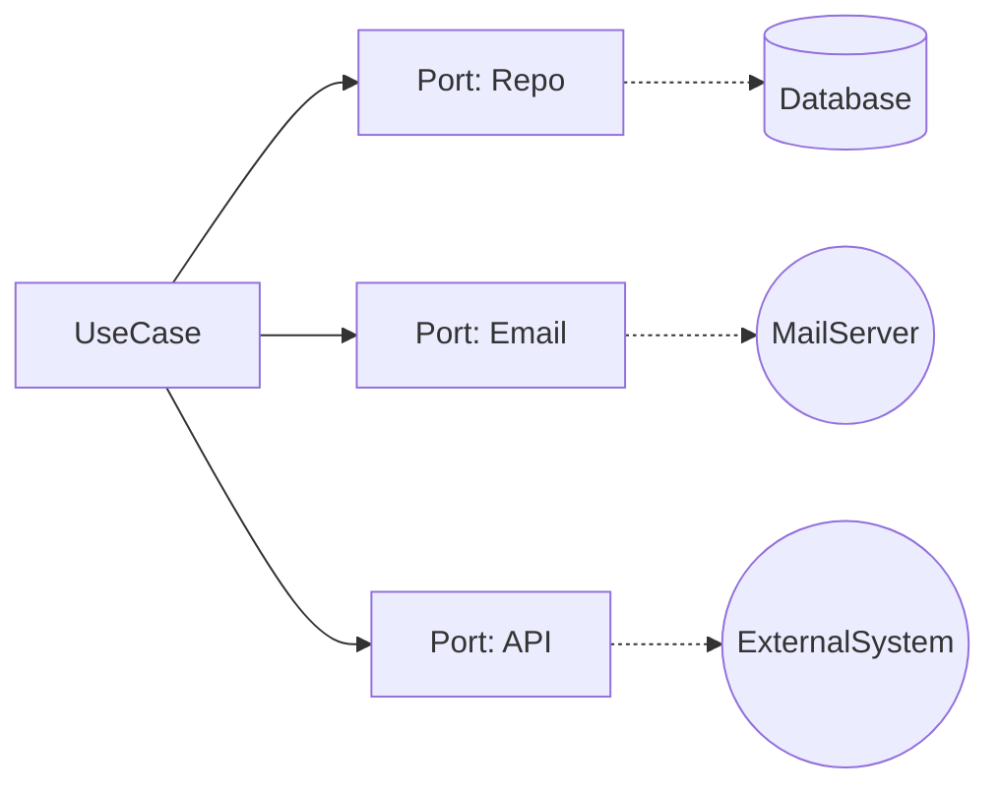

# 第29章：Outbound Adapter④：外部API/メールも同じ発想📡✉️


この章は「DBに保存するのと同じノリで、外部API呼び出しやメール送信も“差し替え可能”にする」がゴールだよ〜😆🔁
ポイントはたった1つ👇
**Coreは “何をしたいか” だけ知ってて、 “どうやってやるか” は外側（Adapter）に押し出す** 🛡️✨

---

## 1) 外部API/メールは「外の世界」🌍➡️🏠




DBと同じで、外部APIやメールもこういう特徴があるよね👇

* 相手の都合で落ちる😵‍💫（一時的エラー、タイムアウト）
* 仕様が変わる🔧（レスポンス形式が変わる等）
* 認証や鍵がいる🔑（設定・秘密情報）
* テストが面倒になりがち🧪（本番API叩きたくない）

だからこそ、ヘキサの出番💪✨
**Coreの外に隔離して、Port越しに使う** のが超効くよ〜🔌

---

## 2) 例：注文確定で「確認メール」＋「ポイント付与API」☕🧾➡️✉️➡️📡


カフェ注文アプリでよくある流れを想像してみよ😊

* 注文できた！✅
* お客さんへ確認メール送りたい✉️
* 外部のポイントサービスに「ポイント付与」通知したい📡

この2つ（メール・外部API）を **Outbound Port** にするよ〜📝✨

---

## 3) 手順①：Core側に Outbound Port（interface）を作る📝🔌


Coreが欲しいのは「メールを送れること」「ポイントを付けられること」だけ。
SMTPとかHttpClientとかは知らないでOK🙆‍♀️

```csharp
// Core側（Application or Domain寄り）
// 「外にお願いしたいこと」を interface にするよ📝

public interface IOrderEmailSender
{
    Task SendOrderConfirmedAsync(OrderConfirmedMail mail, CancellationToken ct);
}

public interface ILoyaltyPointGateway
{
    Task AddPointsAsync(AddPointsRequest request, CancellationToken ct);
}

// Core側の “外向けDTO” はシンプルに📦✨
public sealed record OrderConfirmedMail(
    string ToEmail,
    string CustomerName,
    string OrderId,
    decimal TotalYen);

public sealed record AddPointsRequest(
    string CustomerId,
    string OrderId,
    int Points);
```

🎀コツ

* **HttpResponseMessage とか MailMessage とかを Core に持ち込まない**🧼
* 「業務的に欲しい情報」だけを DTO にする✨

---

## 4) 手順②：UseCaseは Port を呼ぶだけにする📞😊

UseCase内で `HttpClient` を new したり、SMTPに接続しないよ🙅‍♀️
“お願い”だけする係にする✋✨

```csharp
public sealed class CreateOrderUseCase : ICreateOrderUseCase
{
    private readonly IOrderRepository _repo;
    private readonly IOrderEmailSender _emailSender;
    private readonly ILoyaltyPointGateway _loyalty;

    public CreateOrderUseCase(
        IOrderRepository repo,
        IOrderEmailSender emailSender,
        ILoyaltyPointGateway loyalty)
    {
        _repo = repo;
        _emailSender = emailSender;
        _loyalty = loyalty;
    }

    public async Task<CreateOrderResult> HandleAsync(CreateOrderCommand cmd, CancellationToken ct)
    {
        // 1) 注文作成（詳細は前章までの想定）☕🧾
        var order = Order.Create(cmd);
        await _repo.SaveAsync(order, ct);

        // 2) 外部へお願い（Port越し）🔌✨
        await _emailSender.SendOrderConfirmedAsync(
            new OrderConfirmedMail(
                ToEmail: cmd.Email,
                CustomerName: cmd.CustomerName,
                OrderId: order.Id.Value,
                TotalYen: order.Total.Amount),
            ct);

        await _loyalty.AddPointsAsync(
            new AddPointsRequest(
                CustomerId: cmd.CustomerId,
                OrderId: order.Id.Value,
                Points: (int)(order.Total.Amount / 100)),
            ct);

        return new CreateOrderResult(order.Id.Value);
    }
}
```

ここまでで **Coreは完全に“外のやり方”を知らない** 形になるよ🛡️✨

---

## 5) 手順③：Outbound Adapter（外側）で “どうやるか” を実装する🔧🔌

### 5.1 外部API Adapter：HttpClientで呼ぶ📡


HttpClientは “Factory経由” が基本だよ（いわゆる `AddHttpClient`）🧰✨
さらに最近は **回復性（リトライ等）を足しやすい仕組み** が用意されてるよ〜💪
`Microsoft.Extensions.Http.Resilience` を入れて `AddStandardResilienceHandler()` みたいに付けられる（そして回復性ハンドラーは基本1つにするのが推奨）だよ📌 ([Microsoft Learn][1])

```csharp
// Adapters.Outbound.ExternalApi 側（例）
// Port（ILoyaltyPointGateway）を実装して、外部APIへ📡

using System.Net.Http.Json;

public sealed class LoyaltyPointHttpAdapter : ILoyaltyPointGateway
{
    private readonly HttpClient _client;

    public LoyaltyPointHttpAdapter(HttpClient client)
    {
        _client = client;
    }

    public async Task AddPointsAsync(AddPointsRequest request, CancellationToken ct)
    {
        // 外部API用の“外向けDTO”に変換してもOK（必要なら）🔁
        var payload = new
        {
            customerId = request.CustomerId,
            orderId = request.OrderId,
            points = request.Points
        };

        using var res = await _client.PostAsJsonAsync("/points/add", payload, ct);

        // 失敗したら例外（or 独自エラーに変換）🔥
        res.EnsureSuccessStatusCode();
    }
}
```

DI登録（Composition Root側のイメージ）👇
`AddStandardResilienceHandler()` で標準の回復性を付与できるよ🧯✨ ([Microsoft Learn][1])

```csharp
// Program.cs など（外側）
// NuGet: Microsoft.Extensions.Http.Resilience が必要になるよ📦 :contentReference[oaicite:2]{index=2}

builder.Services
    .AddHttpClient<ILoyaltyPointGateway, LoyaltyPointHttpAdapter>(client =>
    {
        client.BaseAddress = new Uri(builder.Configuration["Loyalty:BaseUrl"]!);
        client.Timeout = TimeSpan.FromSeconds(10); // タイムアウトは必ず入れたい⏱️
        client.DefaultRequestHeaders.Add("X-Api-Key", builder.Configuration["Loyalty:ApiKey"]!);
    })
    .AddStandardResilienceHandler(); // 標準の回復性🧯✨ :contentReference[oaicite:3]{index=3}
```

🎯ここでの重要ポイント

* **タイムアウトは必須**⏱️（無限待ちは事故る😇）
* **キャンセル（CancellationToken）を最後まで通す**🧵
* **秘密情報（APIキー等）はCoreに置かない**🔑（外側の設定へ）

---

### 5.2 メール Adapter：SmtpClientより MailKit が推奨✉️✨


.NETの `SmtpClient` は “新規開発ではおすすめしない” って明言されてて、MailKit等が推奨だよ📌 ([Microsoft Learn][2])
（メールは地味に罠が多いので、実績あるライブラリに寄せるのが安心😌）

```csharp
// Adapters.Outbound.Email 側（例）
// MailKit を使って送る✉️（SmtpClientは新規には非推奨） :contentReference[oaicite:5]{index=5}

using MailKit.Net.Smtp;
using MailKit.Security;
using MimeKit;

public sealed class MailKitOrderEmailSender : IOrderEmailSender
{
    private readonly SmtpOptions _opt;

    public MailKitOrderEmailSender(SmtpOptions opt)
    {
        _opt = opt;
    }

    public async Task SendOrderConfirmedAsync(OrderConfirmedMail mail, CancellationToken ct)
    {
        var message = new MimeMessage();
        message.From.Add(new MailboxAddress(_opt.FromName, _opt.FromEmail));
        message.To.Add(MailboxAddress.Parse(mail.ToEmail));
        message.Subject = $"ご注文ありがとうございます！(注文ID: {mail.OrderId})";

        message.Body = new TextPart("plain")
        {
            Text =
$@"{mail.CustomerName} さん ☕✨

ご注文を受け付けました！
注文ID: {mail.OrderId}
合計: {mail.TotalYen:N0} 円

またのご利用お待ちしてます〜😊"
        };

        using var smtp = new SmtpClient();
        await smtp.ConnectAsync(_opt.Host, _opt.Port, SecureSocketOptions.StartTls, ct);
        await smtp.AuthenticateAsync(_opt.User, _opt.Password, ct);
        await smtp.SendAsync(message, ct);
        await smtp.DisconnectAsync(true, ct);
    }
}

public sealed record SmtpOptions(
    string Host,
    int Port,
    string User,
    string Password,
    string FromEmail,
    string FromName);
```

🧪テストでメールを「実際に送らずに確認したい」なら、ローカルで受け口を立てて確認できるツール（MailPitなど）を使う流れがよく紹介されてるよ📮✨ ([dometrain.com][3])

---

## 6) リトライ、どこまでやる？😵‍💫🔁（初心者向けの現実ライン）


外部APIにリトライを入れたくなるけど、**何でもかんでもリトライは危険**⚠️

* GET（参照）はリトライしやすい😊
* POST（作成）は“二重送信”の危険😱
  → **相手が冪等（Idempotent）対応**してるか、**Idempotency-Key** があるか確認したい💡

だから最初は👇がおすすめ✨

* まず `AddStandardResilienceHandler()` で標準セットを使う🧯 ([Microsoft Learn][1])
* それでも怖いPOSTは、**「後で送る」方式（イベント/キュー/Outbox）**にする（発展）📦🔁

---

## 7) テストがめっちゃ楽になる瞬間🧪💖


Coreのテストは、外部APIもメールも **Fake差し替え**で爆速になるよ😆

```csharp
public sealed class FakeEmailSender : IOrderEmailSender
{
    public List<OrderConfirmedMail> Sent { get; } = new();

    public Task SendOrderConfirmedAsync(OrderConfirmedMail mail, CancellationToken ct)
    {
        Sent.Add(mail);
        return Task.CompletedTask;
    }
}
```

これをUseCaseに差して

* 「注文したらメール送ろうとしてる？」✅
  だけ確認できる✨（外部に一切繋がないの最高〜😇）

---

## 8) AI活用（Copilot/Codex）で爆速にするコツ🤖⚡

AIに任せやすいのはここ👇

* Adapterの雛形（HttpClient叩くコード、MailKitで送るコード）
* DTOのマッピング（外向けpayload作るやつ）
* 設定クラス（Options）作成

でも **AIに任せない方がいい** のはここ👇🚦

* Portの粒度（「何をしたいか」の切り方）
* Coreに入れちゃダメな型が混ざってないか（HttpResponseMessageとか！）
* 失敗時の扱い（握りつぶし、二重送信、業務的に許される？）

💡AIへ投げるプロンプト例（そのままコピペOK）

* 「`ILoyaltyPointGateway` を実装する typed HttpClient Adapter を作って。例外は Core 独自例外にラップして。キャンセル対応必須」
* 「MailKitで `IOrderEmailSender` 実装して。本文テンプレも入れて。設定は Options クラス化して」

---

## 9) ミニ演習🎓✨

1. `ILoyaltyPointGateway` のFakeを作る🧪
2. CreateOrderUseCaseのテストで「ポイント付与が呼ばれた」確認✅
3. HttpAdapterのBaseUrlとApiKeyを設定から取る🔑
4. メール送信は最初FakeでOK、慣れたらMailKitで実装✉️

---

## 10) まとめチェックリスト✅✨

* Coreは `HttpClient` / SMTP / SDK を知らない？🛡️
* 外部APIやメールは **Outbound Port** 経由？🔌
* DTOに外部都合（レスポンス型など）が漏れてない？🧼
* タイムアウト・キャンセル入ってる？⏱️🧵
* 標準回復性（`AddStandardResilienceHandler`）などで落ちにくくしてる？🧯 ([Microsoft Learn][1])
* メールは `SmtpClient` に寄りかかってない？（新規は非推奨）✉️ ([Microsoft Learn][2])

---

次の章（第30章）は、いよいよ **DIの意味が“体感”できる**ところだよ〜🧠🔧✨
「newしないと何が嬉しいの？」がスッキリするやつ😆

[1]: https://learn.microsoft.com/ja-jp/dotnet/core/resilience/http-resilience "回復性がある HTTP アプリを構築する: 主要な開発パターン - .NET | Microsoft Learn"
[2]: https://learn.microsoft.com/en-us/dotnet/api/system.net.mail.smtpclient?view=net-10.0 "SmtpClient Class (System.Net.Mail) | Microsoft Learn"
[3]: https://dometrain.com/blog/sending-email-with-dotnet/?srsltid=AfmBOorv18Pho2TZ_VTR7dloBPs_tctLGZcCt5qzCp7mPM9bikdKdhVj&utm_source=chatgpt.com "Sending email with C# in .NET"
