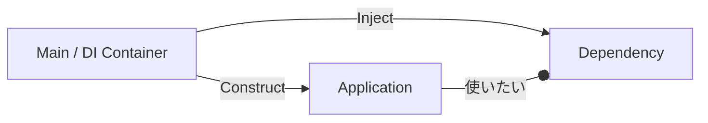

# 第30章：DI入門①：DIって何？なぜ必要？🧠🔧


カフェ注文アプリ☕で、最初は **InMemory** で動いたけど…
「よし！次はDBにしたい！」ってなった瞬間に、変更が一気に怖くなることあるよね😵‍💫💥

そこで登場するのが **DI（Dependency Injection / 依存性注入）** だよ〜！🎉

---

## 1) DIを一言でいうと？🧩✨




**「部品（依存先）を、自分の中でnewして作らず、外から渡してもらう」** ってことだよ😊🔌

* ❌ 自分で部品を買いに行く（中で `new` する）
* ✅ 受付で部品を受け取る（外から渡される＝注入）

ASP.NET Core / .NET は “最初からDIを前提に作られてる” ので、自然にDIを使う流れになってるよ🧡
（公式ドキュメントでも、ASP.NET Core が DI パターンをサポートしていることが明記されてるよ） ([Microsoft Learn][1])

---

## 2) なんでDIが必要なの？「new地獄」から抜けるため😇🔥

### 🔥 ありがちな地獄（DIなし）

たとえば UseCase の中で、こうやって作っちゃう👇

```csharp
public class CreateOrderUseCase
{
    public void Handle(CreateOrderCommand command)
    {
        // ❌ ここで具体実装を new しちゃう
        var repo = new InMemoryOrderRepository();
        repo.Save(/* ... */);
    }
}
```

この瞬間に、UseCaseが **「InMemoryを知ってしまう」** のが痛い😭💔
DBに変えたい時、UseCaseを書き換える羽目になる…！

しかもテストもつらい😵

* DBが必要？
* インメモリ固定？
* 置き換え不可？

---

## 3) DIがくれる“うれしさ”3点セット🎁✨

### ✅ ① 差し替えが楽（InMemory ↔ DB）🔁🗃️

Core は「保存できればOK」だけ知っていればいい。
**どの保存方法かは外側の都合** にできるよ😊

### ✅ ② テストが爆速で書ける🧪💖

Fake（偽物）を注入して、DBなしでUseCaseを検証できる！
「テストのために環境作る」が減るの最高😆✨

### ✅ ③ 依存の向きがキレイになる🧼➡️🛡️

ヘキサの目的そのもの！
**CoreはPort（interface）だけ見て、Adapterは外で差し替え** ができる💪

---

## 4) ヘキサ視点でのDI：DIは“配線係”だよ🔌🧩

思い出してね👇

* Port = 「こうしてね」の約束（interface）📝
* Adapter = 約束を満たす実装（InMemory/DB/外部API）🔧
* DI = **Port と Adapter をつなぐ“配線”** 🧩✨

つまりこう！👇

**「Coreのコードは変えずに、外側の配線だけ変える」** 🥳🔁

.NETのDIの基本は Microsoft の公式ドキュメントにもまとまってるよ（DIの概念、依存グラフ、注入の考え方など） ([Microsoft Learn][2])

---

## 5) DIの基本形は「コンストラクタ注入」🏗️💉

一番スタンダードで、設計がキレイになりやすいのがこれ😊

### ✅ Port（Core側）

```csharp
public interface IOrderRepository
{
    void Save(Order order);
}
```

### ✅ UseCase（Core側）：interface を受け取る

```csharp
public class CreateOrderUseCase
{
    private readonly IOrderRepository _repo;

    // ✅ ここで受け取る（注入）
    public CreateOrderUseCase(IOrderRepository repo)
    {
        _repo = repo;
    }

    public void Handle(CreateOrderCommand command)
    {
        var order = Order.Create(/* ... */);
        _repo.Save(order);
    }
}
```

この瞬間に、UseCaseはこう思ってるだけになる👇
「保存できる人（IOrderRepository）ちょうだい🥺」
InMemoryかDBかは知らない！最高！😆✨

---

## 6) 「じゃあ誰が注入するの？」→ それは外側（配線場所）📍🧩

ここが超重要ポイントだよ〜！📌💕

* Core（UseCase/Domain）は **注入される側**
* 外側（起動時の場所）は **注入する側（配線する側）**

ASP.NET Core だと、アプリ起動時にDIコンテナへ登録して、必要な時に自動で注入される仕組みが標準で用意されてるよ ([Microsoft Learn][1])

※登録（`AddScoped` とか）や `Program.cs` の具体は **次章（第31章）** でガッツリやるよ🔧✨

---

## 7) DIでありがちな勘違いあるある😵‍💫💦

### ❌ 「DI = new禁止」ではないよ！

正しくはこう👇
**「newする場所を、ちゃんと“外側の1か所”に寄せようね」** 🧹✨

Coreの中でnewしまくるのが問題で、
外側（配線）でnewするのは普通にアリだよ😊（ただし .NET ではコンテナに任せるのが一般的）

---

## 8) DIを導入する“超実践ステップ”🪜✨

カフェ注文アプリ☕でやるなら、こう進めると安全だよ😊

1. **「外とつながる処理」を探す**（DB保存、メール送信、時刻取得…）🔍
2. それを **Port（interface）にする** 📝
3. Coreは **interfaceをコンストラクタで受け取る** 💉
4. 実装（Adapter）は外側に置く 🔧
5. 最後に外側で **配線する** 🔌🧩（次章で！）

---

## 9) ミニ演習（10分）⏱️🧪✨

### 演習A：newを追い出そう🏃‍♀️💨

* UseCase内に `new InMemoryOrderRepository()` があったら削除！
* `IOrderRepository` をコンストラクタで受け取る形に直す！

### 演習B：Fakeでテスト気分💖

* `FakeOrderRepository : IOrderRepository` を作る
* UseCaseに注入して、`Save` が呼ばれたかを確認してみよう😆

---

## 10) AI（Copilot/Codex）に手伝ってもらうコツ🤖✨

DIは“型と置き場所”が大事だから、AIに頼む時は指示をハッキリめにすると強いよ💪

おすすめプロンプト例👇（そのままコピペOK🫶）

* 「このクラスの依存を constructor injection に直して。`new` をクラス内部から消して、interface経由にして」
* 「Hexagonalの前提で、CoreがAdapter実装を参照しないようにリファクタして」
* 「`IOrderRepository` のFake実装を作って、UseCaseの単体テスト例も出して」

---

## まとめ：第30章で持ち帰ること🎒✨

* DIは **「依存を外から渡す」** こと🧩
* DIの価値は **差し替え・テスト・依存方向** を一気にラクにするところ🎁
* ヘキサでは DI は **PortとAdapterをつなぐ配線** 🔌✨
* .NET / ASP.NET Core は DI が標準機能として組み込まれてるよ ([Microsoft Learn][1])

次の第31章では、いよいよ `.NET のDI登録（AddScopedとか）` を触って、**「自動で注入される気持ちよさ」** を体験するよ〜😆🔧💖

[1]: https://learn.microsoft.com/en-us/aspnet/core/fundamentals/dependency-injection?view=aspnetcore-10.0&utm_source=chatgpt.com "Dependency injection in ASP.NET Core"
[2]: https://learn.microsoft.com/en-us/dotnet/core/extensions/dependency-injection?utm_source=chatgpt.com "NET dependency injection"
