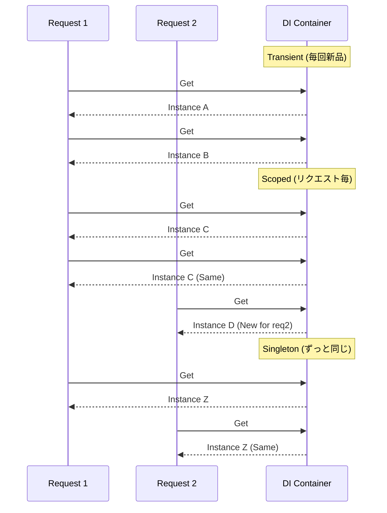

# 第31章：DI入門②：.NETのDI基本（AddScoped等）🔧🧰


この章は「配線（ワイヤリング）」の基礎だよ〜！🧩💕
ヘキサゴナル的には **“Coreは配線しない、外側でつなぐ”** のが大事で、その「外側でつなぐ」を .NET のDIが助けてくれる感じ✨

---

## 1) まずは全体像：DIって何してるの？🧠🔌

ざっくり言うと👇

* **どの interface（Port）に、どの実装（Adapter）を使うか** を登録しておく📝
* 実行時に .NET が **必要なものを自動で組み立てて渡してくれる**（コンストラクタに注入）🏗️✨
* 依存関係が連鎖しても（AがBを、BがCを…）**依存グラフを解決**してくれる🕸️✅ ([Microsoft Learn][1])

---

## 2) どこに登録する？ → だいたい Program.cs 💡🧩

ASP.NET Core のテンプレだと、だいたいこういう場所にあります👇
（`WebApplication.CreateBuilder()` で作った `builder.Services` に登録）✨

```csharp
var builder = WebApplication.CreateBuilder(args);

// ここが登録場所（DIコンテナに「このPortにはこの実装ね！」を教える）
builder.Services.AddScoped<IOrderRepository, InMemoryOrderRepository>();
builder.Services.AddScoped<ICreateOrderUseCase, CreateOrderUseCase>();

var app = builder.Build();
app.Run();
```

`.NET` のホスト／アプリビルダーを使うと、フレームワーク側で大量のサービスが最初から登録されてたりするよ〜（ログとかオプションとか）🧰✨ ([Microsoft Learn][1])

---

## 3) 3大ライフタイム：AddTransient / AddScoped / AddSingleton 🕒✨




ここが本章の主役！🎉
.NET のDIはサービスを登録するときに **寿命（ライフタイム）** を選べます👇 ([Microsoft Learn][1])

### A. Transient（毎回新品）🆕🆕🆕

* **解決（Resolve）されるたびに新しいインスタンス**
* 登録：`AddTransient`
* 「軽い・状態を持たない・使い捨て」向き✨
* Webアプリだと **リクエストの最後でDispose** される（IDisposableの話）🧹 ([Microsoft Learn][1])

```csharp
builder.Services.AddTransient<PriceCalculator>();
```

**向いてる例**：計算、フォーマット、変換、バリデーションなど（状態なし）📐✨

---

### B. Scoped（リクエストごとに1回）📩➡️1回✨

* **Webなら「1リクエスト（接続）に1インスタンス」**
* 登録：`AddScoped`
* リクエストが終わると **Dispose** 🧹 ([Microsoft Learn][1])

```csharp
builder.Services.AddScoped<ICreateOrderUseCase, CreateOrderUseCase>();
```

**向いてる例**：UseCase、Repository（DBアクセス系）、DbContext など🗄️✨
ちなみに EF Core の `AddDbContext` は **既定でScoped** 登録だよ〜📝 ([Microsoft Learn][1])

---

### C. Singleton（アプリ全体で1個だけ）👑✨

* **最初の1回だけ作って、ずっと同じインスタンス**
* 登録：`AddSingleton`
* **アプリ終了時にDispose**（メモリも基本戻らないと思ってOK）🧠⚠️
* **スレッドセーフ必須**になりがち！ ([Microsoft Learn][1])

```csharp
builder.Services.AddSingleton<SystemClock>();
```

**向いてる例**：設定・キャッシュ・時刻・乱数（注意）・ステートレスなユーティリティなど🧰✨
（逆に「状態を持つ」Singletonは事故りやすい😇）

---

## 4) 迷ったらどうする？ざっくり目安表🎯✨

* **UseCase / Repository / DbContext系** → まず **Scoped** を疑う🧠✨ ([Microsoft Learn][1])
* **軽い処理・状態なし** → **Transient** 🆕 ([Microsoft Learn][1])
* **アプリ全体で共有したい・重い初期化・キャッシュ** → **Singleton** 👑（スレッドセーフ注意）([Microsoft Learn][1])

---

## 5) いちばん多い事故：ScopedをSingletonに混ぜる💥😵‍💫

### ❌ ダメなやつ（例）

「Singletonの中にScopedをコンストラクタ注入」すると…

* Scopedなのに **実質Singleton化**して
* リクエストまたいで変な状態になったりする😱

.NETのDIは開発環境だと、こういうのをチェックして **例外で教えてくれる**よ（スコープ検証）✅ ([Microsoft Learn][1])

**開発環境の既定チェック内容**：

* Scopedをルートプロバイダから解決してない？
* ScopedをSingletonに注入してない？ ([Microsoft Learn][1])

### ✅ どうしてもSingletonの中でScopedを使いたいとき

`IServiceScopeFactory` で **明示的にスコープを作って** そこから解決する🙏✨
（BackgroundServiceなどでよく使うやつ） ([Microsoft Learn][1])

---

## 6) 登録の書き方いろいろ（よく使う形だけ）🧩✨

### 6-1) いちばん基本：インターフェイス→実装

```csharp
builder.Services.AddScoped<IOrderRepository, InMemoryOrderRepository>();
```

### 6-2) 実装だけ登録（自分自身を解決できる）

```csharp
builder.Services.AddScoped<CreateOrderUseCase>();
```

「実装だけ登録」は「同じ型をサービス型としても登録したのと同じ」扱いになるよ〜📝 ([Microsoft Learn][1])

### 6-3) 引数が必要なら factory 登録（`sp => new ...`）

```csharp
builder.Services.AddSingleton<IMyDep>(sp => new MyDep(99));
```

こういう登録方法が公式に載ってるよ🧰✨ ([Microsoft Learn][1])

---

## 7) ヘキサゴナル視点：PortとAdapterをDIでつなぐ🔷🔌✨

カフェ注文アプリに寄せると👇

* Core側（Port）

  * `IOrderRepository`（Outbound Port）📝
  * `ICreateOrderUseCase`（Inbound Port）🚪
* 外側（Adapter）

  * `InMemoryOrderRepository`（Outbound Adapter）🧠🗄️
  * `OrdersController`（Inbound Adapter）🌐

**つなぐ場所（Program.cs）で**
「PortにはこのAdapterを使う！」を登録するだけでOK✨
Coreは相変わらず **interfaceしか知らない** 🛡️

---

## 8) ミニ演習（5〜10分）🧪💕

### 演習1：Scoped/Transient/Singletonの挙動を体感しよ！👀✨

1. `Guid` を持つクラスを用意👇

```csharp
public sealed class InstanceMarker
{
    public Guid Id { get; } = Guid.NewGuid();
}
```

2. ライフタイムを変えて登録👇

```csharp
// builder.Services.AddTransient<InstanceMarker>();
// builder.Services.AddScoped<InstanceMarker>();
builder.Services.AddSingleton<InstanceMarker>();
```

3. エンドポイントで2回解決して比べる👇

```csharp
app.MapGet("/marker", (InstanceMarker a, InstanceMarker b) =>
{
    return new { a = a.Id, b = b.Id };
});
```

* Transient：a と b が別IDになりやすい🆕🆕
* Scoped：同一リクエスト内は同じIDになりやすい📩
* Singleton：いつアクセスしても同じID👑

---

## 9) AI（Copilot/Codex）を使うコツ🤖✨（でも“境界ルール”は人が守る🚦）

AIに頼むと速いところ👇

* `IOrderRepository` みたいなPort作成📝
* `InMemoryOrderRepository` の雛形🧠
* `Program.cs` の登録コードの下書き🧩

でもチェックは人間の役目👇😆

* Coreが外側（DB/HTTP/EF）参照してない？🛡️
* ライフタイム変じゃない？（Scoped→Singleton混入）💥
* 変換（DTO↔Domain）がAdapter側に収まってる？🔁

---

## 10) まとめ（この章の持ち帰り）🎁✨

* DI登録は `builder.Services`（Program.cs）でやる🧩
* 迷ったら **UseCaseはScoped** から考えると事故りにくい😊 ([Microsoft Learn][1])
* **ScopedをSingletonに注入しない**（開発環境だと検知される）✅ ([Microsoft Learn][1])
* 次章「Composition Root」で、配線をもっとキレイにまとめるよ〜📍✨

---

必要なら、この章の内容を **カフェ注文アプリの具体コード（Port/Adapter/UseCase/Program.csの一式）** に落として、ちゃんと動く形でテンプレ化して渡すよ〜☕🧾💖

[1]: https://learn.microsoft.com/en-us/dotnet/core/extensions/dependency-injection "Dependency injection - .NET | Microsoft Learn"
