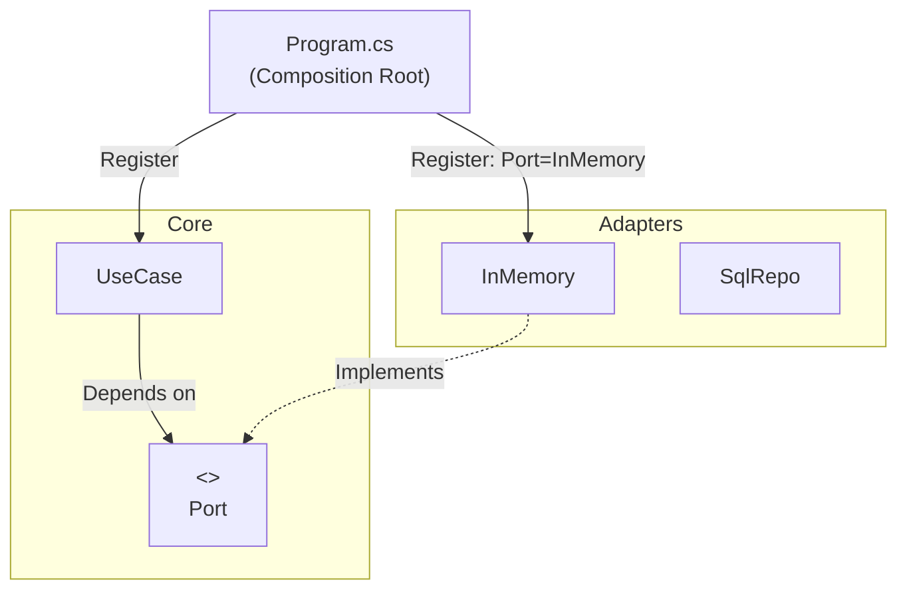

# 第32章：Composition Root：配線をここに集める📍🧩


## 0. いきなり結論：Composition Root は「配線盤」だよ🧠⚡




ヘキサゴナルって、**Core（中心）をキレイに保つ**設計だよね🔷✨
じゃあ「Core と外側（DB / API / UI など）をどうやってつなぐの？」って話になるんだけど……

その“つなぐ作業（配線）”を **1か所に集める場所**が **Composition Root** だよ📍🧩
（ここだけは外側の都合を持ち込んでOK🙆‍♀️）

> Composition Root は「アプリのエントリーポイント付近で、モジュールを組み立てる（オブジェクトグラフを構築する）場所」だよ、という定義が有名だよ📚✨ ([Ploeh Blog][1])

---

## 1. なんで “配線を1か所” にするの？🧶😵‍💫➡️😆

### ✅ もし配線が散らばると…🍝💥

* Controller の中で `new` しまくる😵‍💫
* あちこちで `ServiceProvider.GetService()` し始める😇
* 「この実装ってどこで使われてるの？」が追えなくなる🕵️‍♀️

結果：**差し替えが怖い**＆**テストもしんどい**😭

### ✅ 配線を1か所に集めると…✨

* 「外側の実装」は **ここだけ見れば全部わかる**👀✨
* InMemory ↔ DB の差し替えが **配線を変えるだけ**で済む🔁
* Core は “抽象（Port）だけ” を見て、ずっとキレイ🧼💖

---

## 2. ASP.NET Core だと Composition Root はどこ？👑🌐

いまの ASP.NET Core だと、だいたい **`Program.cs` が Composition Root** になりやすいよ📍
`builder.Services.AddScoped(...)` を並べる“あそこ”だね🧩✨ ([Microsoft Learn][2])

ちなみに .NET は **.NET 10 が LTS（長期サポート）**で、2025-11-11 リリースになってるよ📅✨（サポートポリシーの表に載ってる） ([Microsoft][3])

---

## 3. ミニ題材（カフェ注文☕）で “配線” を体験しよ〜🧩😆

ここでは、登場人物をざっくりこうするね👇✨

* Core（中心）

  * `ICreateOrderUseCase`（Inbound Port）🚪
  * `IOrderRepository`（Outbound Port）🗄️
  * `CreateOrderUseCase`（手順）🧭

* Adapters（外側）

  * `InMemoryOrderRepository`（まずは動く）📦
  * `SqlOrderRepository`（あとで差し替え）🗃️

* Composition Root（配線）

  * `Program.cs`（ここでつなぐ！）📍🧩

---

## 4. Core 側は「interface を受け取るだけ」🛡️✨

### 4-1. Port（約束）📝🔌

```csharp
public interface IOrderRepository
{
    Task SaveAsync(Order order, CancellationToken ct);
}
```

### 4-2. UseCase（手順）🧭✨

```csharp
public interface ICreateOrderUseCase
{
    Task<CreateOrderResult> HandleAsync(CreateOrderCommand command, CancellationToken ct);
}

public sealed class CreateOrderUseCase : ICreateOrderUseCase
{
    private readonly IOrderRepository _repo;

    public CreateOrderUseCase(IOrderRepository repo) // ← ここが超重要💖
    {
        _repo = repo;
    }

    public async Task<CreateOrderResult> HandleAsync(CreateOrderCommand command, CancellationToken ct)
    {
        var order = Order.Create(command.CustomerId, command.Items);
        await _repo.SaveAsync(order, ct);
        return new CreateOrderResult(order.Id.Value);
    }
}
```

ポイントはこれ👇😆

* Core は **`InMemoryOrderRepository` とか `SqlOrderRepository` を一切知らない**🧼✨
* 依存は `IOrderRepository`（抽象）だけ🔌💖

---

## 5. Adapter 側は「Port を実装」して外の都合を吸収🔁🧽

### 5-1. まずは InMemory（最速で動く）📦✨

```csharp
public sealed class InMemoryOrderRepository : IOrderRepository
{
    private readonly List<Order> _store = new();

    public Task SaveAsync(Order order, CancellationToken ct)
    {
        _store.Add(order);
        return Task.CompletedTask;
    }
}
```

### 5-2. DB版（イメージだけ）🗃️✨

```csharp
public sealed class SqlOrderRepository : IOrderRepository
{
    private readonly DbConnection _conn;

    public SqlOrderRepository(DbConnection conn)
    {
        _conn = conn;
    }

    public async Task SaveAsync(Order order, CancellationToken ct)
    {
        // DBモデル変換とかSQLとかは、ここ（Adapter）に押し込む🧼✨
        // await ...
    }
}
```

---

## 6. いよいよ Composition Root（Program.cs）で配線！📍🧩✨

### 6-1. いちばんシンプルな配線（InMemoryで動かす）😆📦

```csharp
var builder = WebApplication.CreateBuilder(args);

// Inbound Port（UseCase）
builder.Services.AddScoped<ICreateOrderUseCase, CreateOrderUseCase>();

// Outbound Port（Repository）→ いまは InMemory を採用
builder.Services.AddScoped<IOrderRepository, InMemoryOrderRepository>();

var app = builder.Build();
app.Run();
```

この「登録（AddScoped など）」が ASP.NET Core のDIの基本だよ🧩✨ ([Microsoft Learn][2])

---

## 7. Program.cs が太ってきたら… “配線を分割” しよ🍔➡️🥗✨

`Program.cs` に登録が増えると、すぐゴチャるよね😂
そこで **拡張メソッドで “配線モジュール化”** すると気持ちいいよ〜🧘‍♀️✨

### 7-1. Core 用の配線（UseCase系）🧭

```csharp
public static class CafeCoreServiceCollectionExtensions
{
    public static IServiceCollection AddCafeCore(this IServiceCollection services)
    {
        services.AddScoped<ICreateOrderUseCase, CreateOrderUseCase>();
        return services;
    }
}
```

### 7-2. Adapter 用の配線（Repository系）🗄️

```csharp
public static class CafeAdapterServiceCollectionExtensions
{
    public static IServiceCollection AddCafeAdapters(this IServiceCollection services, IConfiguration config)
    {
        var storage = config.GetValue<string>("Storage");

        if (storage == "Sql")
        {
            // ここで DB 接続やら Repository 実装やらを選ぶ🗃️
            services.AddScoped<IOrderRepository, SqlOrderRepository>();
        }
        else
        {
            services.AddScoped<IOrderRepository, InMemoryOrderRepository>();
        }

        return services;
    }
}
```

### 7-3. Program.cs はスッキリ✨

```csharp
var builder = WebApplication.CreateBuilder(args);

builder.Services
    .AddCafeCore()
    .AddCafeAdapters(builder.Configuration);

var app = builder.Build();
app.Run();
```

これで「配線は外側でまとめて管理」ができる〜！📍🧩💖

---

## 8. 差し替えポイントの作り方🔁✨（3パターン）

### パターンA：設定（appsettings）で切り替え📄🔧

```json
{
  "Storage": "InMemory"
}
```

本番だけ `"Sql"` にする、とかがやりやすいよね😆

### パターンB：環境（Development / Production）で切り替え🌎✨

ASP.NET Core は環境別設定が王道だよ〜（配線側で拾って切替）🌱➡️🏭

### パターンC：Keyed services（複数実装を同時に持つ）🔑✨（発展）

「A/Bテスト」「テナントごとに別実装」みたいなとき便利！
ASP.NET Core のDIには **key（鍵）つき登録**があるよ🔑 ([Microsoft Learn][2])

（※ ただ、最初は A/B までやらなくてOK！今回は“存在だけ”覚えれば十分😌💖）

---

## 9. 事故りやすいポイント集🚑😇（ここ超大事！）

### ❌ Core が DI コンテナを触りだす

* Core プロジェクトで `services.AddScoped...` をやり始めたら、境界がにじむ🫠
* DI 参照は **Composition Root だけ**に寄せるのが基本だよ✨ ([Ploeh Blog][1])

### ❌ `IServiceProvider` をアプリ中にばらまく（Service Locator化）🕳️

「必要になったら取ってくる」は、依存が見えなくなる🙅‍♀️
→ なるべく **コンストラクタ注入**でスパッと見える化👀💖 ([Microsoft Learn][4])

### ❌ Singleton が Scoped を抱える（寿命ミス）🧟‍♀️

`Singleton` の中に `Scoped` を入れると、変な寿命事故が起きがち😇
ライフタイムの基本（Transient/Scoped/Singleton）は、公式にもまとまってるよ🕒 ([Microsoft Learn][2])

---

## 10. AI（Copilot / Codex）で “配線づくり” を爆速にするコツ🤖✨

AIはこういうの得意〜！😆✨ でも **境界ルールは人間が守る**のがポイント🚦

### 使えるプロンプト例💬✨

* 「この `IOrderRepository` の実装が2つある。`IServiceCollection` 拡張メソッドで `AddCafeAdapters()` を作って。`Program.cs` は薄くして」🤖🧩
* 「CoreプロジェクトがDIコンテナ参照しないように。登録は外側プロジェクトに置く前提でコード生成して」🛡️✨
* 「登録の lifetimes をレビューして。Scoped/Singleton の事故がないか指摘して」🚑🔍

---

## 11. まとめチェック✅✨（この章のゴール）

* ✅ 配線（DI登録）は **Composition Root（だいたい Program.cs）に集めた**📍🧩
* ✅ Core は **Port（interface）だけを知ってる**🔌✨
* ✅ Adapter の差し替えが **配線変更だけ**でできる🔁💖
* ✅ Program.cs が太ったら **拡張メソッドで分割**🍔➡️🥗✨

---

## 12. ミニ演習📝😆（手を動かすと一気に理解できる！）

1. `InMemoryOrderRepository` を残したまま、`SqlOrderRepository` も追加して
   　設定 `"Storage"` で切り替えられるようにしてみよ🔁📄✨
2. `AddCafeCore()` / `AddCafeAdapters()` を別ファイルにして、Program.cs を3行くらいまで薄くしてみよ📍🧩💖
3. AIに登録コードを作らせて、**「CoreがDI参照してない？」**を目視レビューしてみよ🚦👀✨

[1]: https://blog.ploeh.dk/2011/07/28/CompositionRoot/?utm_source=chatgpt.com "Composition Root - ploeh blog"
[2]: https://learn.microsoft.com/en-us/aspnet/core/fundamentals/dependency-injection?view=aspnetcore-10.0&utm_source=chatgpt.com "Dependency injection in ASP.NET Core"
[3]: https://dotnet.microsoft.com/en-us/platform/support/policy/dotnet-core?utm_source=chatgpt.com "NET and .NET Core official support policy"
[4]: https://learn.microsoft.com/en-us/dotnet/core/extensions/dependency-injection-usage?utm_source=chatgpt.com "Tutorial: Use dependency injection in .NET"
