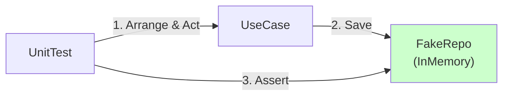

# 第33章：テスト設計①：Coreの単体テストが簡単になる🧪💖


この章では「DBなし・APIなし」で、**UseCase（Application層）とDomain（Domain層）をサクッと単体テストできる**ようになるよ〜！😆✨
ヘキサゴナルの気持ちよさって、まさにここ！💥

---

## 1) なんでヘキサだと “Coreテスト” が楽なの？🔷🧠




ヘキサゴナルは **Core（中心）を外側から守る**設計だったよね🛡️
だから Core は基本こうなる👇

* UI（Controller）知らない🙅‍♀️
* DB（EF/SQL）知らない🙅‍♀️
* 外部API（HttpClient）知らない🙅‍♀️
* でも「保存したい」「時刻がほしい」みたいな *やりたいこと* はある✅

そこで登場するのが **Port（interface）** だよね🔌✨
Core は interface に向かって話すだけ。外側の実装（Adapter）は差し替え可能🔁

つまりテストでは…

> ✅ Adapter（DBなど）を用意しなくていい
> ✅ 代わりに “Fake/Stub” を差せば Core が動く

これが「単体テストが簡単」の正体だよ🧪💖

---

## 2) この章でやるテストの範囲🎯


ここでは **Coreの単体テスト**に集中するよ😊

* ✅ Domainのテスト（値の制約・計算・不変条件）💎
* ✅ UseCaseのテスト（手順・分岐・保存呼び出し）🧭
* ❌ DB接続するテスト（それは次章寄り：統合テスト）🗄️

---

## 3) 用語をゆるく整理：Fake / Stub / Mock 🍰


初心者向けに、まずこの感覚でOKだよ〜😊✨

* **Stub（スタブ）**：戻り値だけ返す係（固定の返答）📦
* **Fake（フェイク）**：軽い実装（InMemoryで保存できる等）🧠
* **Mock（モック）**：呼ばれた回数や引数を検査する係（道具でやること多い）🔍

この章は **Fake（InMemory）** が最強に相性いいよ💪😆

---

## 4) テストの基本型：AAAで書こう📐✨


テストはだいたいこの3段で書くと読みやすいよ👇

* **Arrange**：準備する（Fake用意・入力作る）🧺
* **Act**：実行する（UseCase呼ぶ）▶️
* **Assert**：検証する（結果・保存された中身を確認）✅

---

## 5) ミニ題材（カフェ注文）で “Core単体テスト” を1本通す☕🧾🧪

ここからは「注文作成」を例にするね😊
（第15章の題材をそのまま使うイメージ！）

---

### 5-1) Core側の最小コード（Port + UseCase + Domain）🔌🧭💎

#### Port（Outbound Port）🗄️📝

```csharp
public interface IOrderRepository
{
    Task SaveAsync(Order order, CancellationToken ct);
}
```

#### “時刻”も外に逃がす（テストしやすさUP）⏰✨


実務だと `DateTime.UtcNow` がテストを壊しがちなので、ClockもPortにしちゃうのがコツ👍

```csharp
public interface IClock
{
    DateTimeOffset UtcNow { get; }
}
```

#### Domain（超ミニ）💎

```csharp
public readonly record struct OrderId(Guid Value);

public sealed class Order
{
    public OrderId Id { get; }
    public DateTimeOffset CreatedAtUtc { get; }
    public int TotalQuantity { get; }

    public Order(OrderId id, DateTimeOffset createdAtUtc, int totalQuantity)
    {
        if (totalQuantity <= 0) throw new ArgumentOutOfRangeException(nameof(totalQuantity), "Quantity must be > 0");

        Id = id;
        CreatedAtUtc = createdAtUtc;
        TotalQuantity = totalQuantity;
    }
}
```

#### UseCase（Application層）🧭

```csharp
public sealed record CreateOrderCommand(int TotalQuantity);

public sealed record CreateOrderResult(Guid OrderId, DateTimeOffset CreatedAtUtc);

public sealed class CreateOrderUseCase
{
    private readonly IOrderRepository _repo;
    private readonly IClock _clock;

    public CreateOrderUseCase(IOrderRepository repo, IClock clock)
    {
        _repo = repo;
        _clock = clock;
    }

    public async Task<CreateOrderResult> HandleAsync(CreateOrderCommand cmd, CancellationToken ct)
    {
        // ここで “業務ルール” を守る（例：数量は1以上）✅
        if (cmd.TotalQuantity <= 0)
            throw new ArgumentOutOfRangeException(nameof(cmd.TotalQuantity), "TotalQuantity must be > 0");

        var now = _clock.UtcNow;
        var order = new Order(new OrderId(Guid.NewGuid()), now, cmd.TotalQuantity);

        await _repo.SaveAsync(order, ct);

        return new CreateOrderResult(order.Id.Value, order.CreatedAtUtc);
    }
}
```

---

### 5-2) テスト側：Fake Adapter（InMemory Repository）を作る🧪📦


テストプロジェクト内に、こんなのを置くと便利だよ😊

```csharp
public sealed class FakeOrderRepository : IOrderRepository
{
    public List<Order> Saved { get; } = new();

    public Task SaveAsync(Order order, CancellationToken ct)
    {
        Saved.Add(order);
        return Task.CompletedTask;
    }
}
```

Clockも固定しよう⏰（これ大事！）

```csharp
public sealed class FakeClock : IClock
{
    public DateTimeOffset UtcNow { get; set; }
}
```

---

### 5-3) xUnitで “まず1本” 書く！🧪💖

※ xUnit は v3 も出ていて、今どきの環境では xUnit3 対応情報も出てるよ（後ろでちょい触れるね）🧠✨ ([xUnit.net][1])

```csharp
using Xunit;

public sealed class CreateOrderUseCaseTests
{
    [Fact]
    public async Task HandleAsync_ValidCommand_SavesOrderAndReturnsResult()
    {
        // Arrange 🧺
        var repo = new FakeOrderRepository();
        var clock = new FakeClock { UtcNow = new DateTimeOffset(2026, 1, 23, 0, 0, 0, TimeSpan.Zero) };

        var sut = new CreateOrderUseCase(repo, clock);
        var cmd = new CreateOrderCommand(totalQuantity: 2);

        // Act ▶️
        var result = await sut.HandleAsync(cmd, CancellationToken.None);

        // Assert ✅
        Assert.NotEqual(Guid.Empty, result.OrderId);
        Assert.Equal(clock.UtcNow, result.CreatedAtUtc);

        Assert.Single(repo.Saved);
        Assert.Equal(2, repo.Saved[0].TotalQuantity);
        Assert.Equal(clock.UtcNow, repo.Saved[0].CreatedAtUtc);
    }

    [Fact]
    public async Task HandleAsync_InvalidQuantity_Throws()
    {
        // Arrange 🧺
        var repo = new FakeOrderRepository();
        var clock = new FakeClock { UtcNow = DateTimeOffset.UtcNow };
        var sut = new CreateOrderUseCase(repo, clock);

        // Act & Assert ✅
        await Assert.ThrowsAsync<ArgumentOutOfRangeException>(() =>
            sut.HandleAsync(new CreateOrderCommand(0), CancellationToken.None));

        // ついでに「保存されてない」も確認しちゃう😊
        Assert.Empty(repo.Saved);
    }
}
```

🎉 これで「DBなしで、注文作成の手順を検証できた！」って状態になったよ😆✨
この時点で、もうヘキサの勝ちを感じるはず…！🏆

---

## 6) Visual Studioでの回し方（Windows）🪟🧪


* テストプロジェクトを右クリック → **テストの実行** ▶️
* **テスト エクスプローラー**で一覧が見える👀✨
* 失敗したらクリックで詳細が出る🧯

あと「デバッグしたい！」なら、普通にブレークポイント置いて F5 でもOKな流れが整ってるよ（特に Microsoft.Testing.Platform の説明でも “テストプロジェクトをスタートアップにしてF5でデバッグ” が案内されてる）🧠🔍 ([Microsoft Learn][2])

---

## 7) いまどきの .NET テスト周りの “空気” も軽く押さえよう🌬️🧠

### 7-1) .NET 10 / C# 14 が現行の軸になってるよ🧩✨

* .NET 10 は **LTS** として 2025-11-11 リリース（サポートも長め）🛡️ ([Microsoft for Developers][3])
* C# 14 は .NET 10 対応の “最新C#” として整理されてるよ🧠✨ ([Microsoft Learn][4])
* Visual Studio 2026 も .NET 10 を含む流れが前提になってる📦 ([Microsoft Learn][5])

### 7-2) “Microsoft.Testing.Platform” っていう新しい流れもある🧪🚀

最近の .NET はテスト実行基盤が進化中で、**Microsoft.Testing.Platform** への移行ガイドも公式で用意されてるよ📘✨ ([Microsoft Learn][6])

設定ファイルも **`[appname].testconfig.json`** って形で案内されてる（必要になった時に思い出せばOK）🧠 ([Microsoft Learn][7])

MSTest を Microsoft.Testing.Platform で動かす場合は、プロジェクトに `<EnableMSTestRunner>true</EnableMSTestRunner>` と `<OutputType>Exe</OutputType>` を足す、みたいな “オプトイン” が紹介されてるよ🔧 ([Microsoft Learn][8])

👉 でもこの章の結論はシンプル：
**Coreの単体テストは「Fake差して動かす」さえできれば勝ち**😆💖

---

## 8) “Core単体テスト” を強くするコツ集💪✨

### コツA：外部要素はPortにして固定できるようにする🔌🧊

* 時刻（Clock）⏰
* ID生成（必要なら）🆔
* 乱数🎲

「テストが不安定」って悩みの8割はここで消えるよ😊✨

### コツB：テストは速く・少なく・気持ちよく🏎️💨


* 1テストは 10〜50ms くらいで走るのが理想（体感）⚡
* 速いと「常に回す」文化になって勝てる🏆

### コツC：Mockライブラリは “必要になってから” でもOK🙂

最初は Fake だけで十分！
「呼ばれた回数を厳密に見たい」みたいな局面で Mock を導入すればいいよ🔍✨

---

## 9) AI（Copilot/Codex等）をテストで使うコツ🤖🧪✨

AIに任せやすいのはここ👇

* Arrange の雛形（Fake作成、入力作成）🧺
* Assert の候補（何を検証するべき？）✅
* テストケース洗い出し（境界値）📌

でも、人間が必ず握るのはここ👇🚦

* **「Coreのテストは外部に触れない」ルール**🛡️
* **何が業務ルールで、何が技術都合か**の切り分け🧠

### AIに投げるプロンプト例（そのまま使ってOK）📝✨

* 「CreateOrderUseCase の正常系/異常系の単体テストを xUnit で AAA 形式で作って。Repository と Clock は Fake で。」🤖
* 「TotalQuantity の境界値（0, 1, 大きい値）でテストケース提案して」📌
* 「Domain の不変条件に対するテストを3本提案して」💎

---

## 10) ミニ演習（3本だけ！）🏋️‍♀️🧪

1. `TotalQuantity=1` のとき成功する✅
2. `TotalQuantity=-1` のとき例外になる🧯
3. `HandleAsync` が呼ばれたら `repo.Saved` が増える📦

たったこれだけで「Coreテストの型」が身体に入るよ😆✨

---

## 11) この章のチェックリスト✅📝

* [ ] UseCase を **Fake Adapter** で動かせた？🔌
* [ ] **DBなし**でテストが回った？🗄️🚫
* [ ] 時刻などの外部要素を **Portに逃がした**？⏰
* [ ] AAAで読みやすく書けた？📐
* [ ] 失敗時に “何が壊れたか” すぐ分かる？🧯

---

次の第34章では「Adapter側のテスト（DBや外部APIを含む）」が **別ゲーム** だよ〜！🔍🧪
Coreが固まってるからこそ、外側は安心して “別枠” で育てられるんだ😊✨

[1]: https://xunit.net/releases/v3/1.0.0?utm_source=chatgpt.com "Core Framework v3 1.0.0 [2024 December 16]"
[2]: https://learn.microsoft.com/ja-jp/dotnet/core/testing/microsoft-testing-platform-intro?utm_source=chatgpt.com "Microsoft.Testing.Platform の概要 - .NET"
[3]: https://devblogs.microsoft.com/dotnet/announcing-dotnet-10/?utm_source=chatgpt.com "Announcing .NET 10"
[4]: https://learn.microsoft.com/en-us/dotnet/csharp/whats-new/csharp-14?utm_source=chatgpt.com "What's new in C# 14"
[5]: https://learn.microsoft.com/en-us/visualstudio/releases/2026/release-notes?utm_source=chatgpt.com "Visual Studio 2026 Release Notes"
[6]: https://learn.microsoft.com/en-us/dotnet/core/testing/migrating-vstest-microsoft-testing-platform?utm_source=chatgpt.com "Migration guide from VSTest to Microsoft.Testing.Platform"
[7]: https://learn.microsoft.com/en-us/dotnet/core/testing/microsoft-testing-platform-config?utm_source=chatgpt.com "Microsoft.Testing.Platform config options - .NET"
[8]: https://learn.microsoft.com/ja-jp/dotnet/core/testing/unit-testing-mstest-runner-intro?utm_source=chatgpt.com "MSTest での Microsoft.Testing.Platform のサポート ..."
