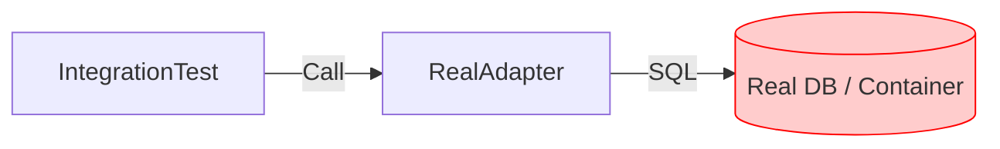

# 第34章：テスト設計②：Adapterのテストは別物🔍🧪


第33章で「Core（ユースケース）」の単体テストがスッと書ける快感を味わったよね？😆💖
でも第34章はちょい別ジャンル！**Adapterのテストは“外の世界”が相手**になるから、目的もやり方も変わるよ〜🧭✨

---

## 🎯この章のゴール

* **CoreテストとAdapterテストの目的の違い**をスパッと分けられる🙂✂️
* DB/HTTPなど**Outbound Adapterを“現実的な範囲”でテスト**できる🧪🗄️
* Inbound Adapter（API/Controller）の**統合テストの基本**がわかる🌐✅
* 「どこまでやる？」の**現実ライン**が持てる📌😌

---

## 🧠 まず結論：CoreのテストとAdapterのテストは“守るもの”が違う

### ✅ Core（UseCase）のテストで守るもの

* 業務ルール（計算・状態遷移・バリデーションの方針）🧠💎
* 依存はFake/Stubで差し替え🧩✨
  → 速い！安い！大量に回せる！🏃‍♀️💨

### ✅ Adapterのテストで守るもの

* 「外部と**ちゃんと噛み合ってるか**」🔌🤝
* 例：

  * DB：SQL/ORM設定、マッピング、制約、トランザクション🗄️
  * HTTP：認証ヘッダ、URL、パラメータ、JSON形式、リトライ方針📡
    → 遅い！環境が要る！でも**壊れると痛い場所**😇

---

## 🧱 テストの種類を整理（ここ超大事）🎯




Adapterのテストは、だいたいこの2つに寄るよ👇

1. **統合テスト（Integration Test）**🧪

* 例：DBに本当に接続して、保存→取得が通るか
* 例：APIをテストサーバーで起動して、HTTPで叩く
  統合テストは「複数コンポーネントが一緒に動くか」を確認するテストだよ〜📌
  （ASP.NET Coreの統合テストの説明はこの感じ！）([Microsoft Learn][1])

2. **契約テスト（Contract Test）**📜🤝

* 「このAdapterはこの形式で話す」を固定するテスト
* 外部仕様（DBスキーマ/HTTPレスポンス形式）が変わると爆発するので、ここで検知💥👀

---

## 🧪 どこまでやる？現実的ライン📌🙂

Adapterは全部をE2Eでやり始めると破産しがち💸😭
おすすめのラインはこれ👇

### 🌟 最低限やる（強い）

* **マッピングが正しいか**（Domain ↔ DBモデル、Domain ↔ DTO）🔁✅
* **重要なクエリが正しいか**（検索条件、ソート、ページング）🔎🗄️
* **失敗時の扱い**（例：接続失敗→例外の種類、再試行する/しない）🧯⚡

### 💤 やりすぎ注意（コスパ悪化しがち）

* 画面UIの細かい見た目テスト🎨😵‍💫
* 1テストで全部の経路を通す“巨大テスト”🦑💥

---

## 🗄️ Outbound：DB Adapterのテスト（統合テスト寄り）🧪🗃️

DB Adapterは「本物のDBで動かす」方が信頼度高いよ💪
最近は **Testcontainers** がめちゃ便利（テスト時だけDBをコンテナで起動）🐳✨
（.NET用のモジュールとして Postgres などが用意されてるよ）([dotnet.testcontainers.org][2])

### ✅ パターンA：Testcontainers（おすすめ）🐳

**狙い**：ローカル/CIでも同じ条件でDBが立つ → “動く保証”が強い✨

#### ざっくり流れ

1. テスト開始 → DBコンテナ起動🐳
2. 接続文字列をAdapterに渡す🔌
3. マイグレーション実行（必要なら）🛠️
4. 保存→取得→検証🧪
5. テスト終了 → コンテナ破棄🧹

#### xUnit例（雰囲気サンプル）

（xUnitは v3 が .NET 8+ 対応って書かれてるよ）([xUnit.net][3])

```csharp
using Xunit;
using DotNet.Testcontainers.Builders;
using DotNet.Testcontainers.Containers;

public sealed class OrderRepository_IntegrationTests : IAsyncLifetime
{
    private IContainer _db = default!;
    private string _connectionString = default!;

    public async Task InitializeAsync()
    {
        // 例：PostgreSQL。実務ではSQL Server等でもOK（同じ発想！）
        _db = new ContainerBuilder()
            .WithImage("postgres:16")
            .WithEnvironment("POSTGRES_PASSWORD", "postgres")
            .WithPortBinding(5432, true)
            .Build();

        await _db.StartAsync();

        var hostPort = _db.GetMappedPublicPort(5432);
        _connectionString = $"Host=localhost;Port={hostPort};Username=postgres;Password=postgres;Database=postgres";

        // ここでマイグレーション/テーブル作成など
        // await Migrator.ApplyAsync(_connectionString);
    }

    public async Task DisposeAsync()
    {
        await _db.DisposeAsync();
    }

    [Fact]
    public async Task Save_Then_Load_Returns_Same_Order()
    {
        // Arrange
        var repo = new OrderRepository(_connectionString);

        var order = TestData.NewOrder();

        // Act
        await repo.SaveAsync(order);
        var loaded = await repo.FindByIdAsync(order.Id);

        // Assert
        Assert.NotNull(loaded);
        Assert.Equal(order.Id, loaded!.Id);
        Assert.Equal(order.TotalPrice, loaded.TotalPrice);
    }
}
```

**ポイント**💡

* このテストは「業務ルール」じゃなくて **DBとの接続・マッピング・SQLの正しさ**が目的🎯
* Core側のテストで同じことをやり直さない！（二重投資を避ける）🙅‍♀️💸

---

### ✅ パターンB：SQLite in-memory（軽いけど注意）🪶🗄️

**速い**けど、DBごとの差（型、ロック、SQL方言、制約）が出ることがあるよ⚠️😵‍💫
「軽い安心」は取れるけど、**本番DBとの差で事故る**可能性は残る…！

---

## 🌐 Inbound：API/Controllerの統合テスト（入口のテスト）🚪🧪

Inbound Adapterのテストは「HTTPとして正しく受け取れるか」を見るやつだね🙂📮

ASP.NET Coreは **WebApplicationFactory** でテスト用サーバーを立てて叩けるよ✨
（WebApplicationFactoryの説明はここ）([Microsoft Learn][4])

```csharp
using System.Net;
using System.Net.Http.Json;
using Microsoft.AspNetCore.Mvc.Testing;
using Xunit;

public class OrdersApi_IntegrationTests : IClassFixture<WebApplicationFactory<Program>>
{
    private readonly HttpClient _client;

    public OrdersApi_IntegrationTests(WebApplicationFactory<Program> factory)
    {
        _client = factory.CreateClient();
    }

    [Fact]
    public async Task POST_orders_returns_201()
    {
        var req = new { items = new[] { new { menuId = "coffee", qty = 1 } } };

        var res = await _client.PostAsJsonAsync("/orders", req);

        Assert.Equal(HttpStatusCode.Created, res.StatusCode);
    }
}
```

**ここで守るもの**🎯

* ルーティング、HTTPステータス、JSON形式、バリデーションの入口の挙動✅
* 業務ルールの中身はCoreのテストに任せる（ここでも重複しない）🧠✂️

---

## 📡 Outbound：外部HTTP API Adapterのテスト（2段階が便利）🌍🧪

HTTP系は「全部本番APIに当てる」は危険だし遅い😇💥
なのでおすすめは2段階👇

### ① 速い：メッセージハンドラ差し替え（疑似レスポンス）⚡

* URL組み立て、ヘッダ付与、レスポンスのパース（DTO→Domain）を確認
* 失敗レスポンス時の例外変換もチェック🧯

### ② 強い：スタブサーバー（WireMock等）で“それっぽく”統合🧱

* 「このパスにこう投げたら、こう返る」を契約として固定📜
* CIでも安定しやすい😌✨

---

## 🏷️ 「遅いテスト」を普段の開発から守るコツ😆🛡️

統合テストは回す価値あるけど、毎回フルで回すとしんどい😵‍💫
なのでラベル付けして分けるのが定番！

```csharp
[Trait("Category", "Integration")]
public class OrderRepository_IntegrationTests { /* ... */ }
```

* ふだん：Unitだけ（サクサク）🏃‍♀️💨
* PR前/CI：Integrationも含める（安心）🧪✅

---

## 🤖 AI活用のしかた（Adapterテストは特に相性いい）✨

AIに任せやすいのはここ👇

* テストの**雛形生成**（Arrange/Act/Assertの形）🧱
* ありがちなパターン（Testcontainers初期化、WebApplicationFactory）📦

でも人間が必ず見るのはここ👇🚦

* **Port/Adapterの境界を破ってない？**（Coreに外の都合を逆流させてない？）🧼
* **何を守るテストか**（目的がブレて巨大化してない？）🎯

---

## ✅ 章末チェックリスト（ここだけ見返せばOK）📌✨

* ✅ Adapterテストは「外との噛み合わせ」を守ってる？🔌
* ✅ Coreの業務ルールをAdapterテストで二重に検証してない？🧠💦
* ✅ DB Adapterは最低限「マッピング」「重要クエリ」「失敗時」を押さえた？🗄️
* ✅ Inboundは「HTTP入口として正しいか」を見てる？🌐
* ✅ 統合テストはラベル分けして、回し方を分離した？🏷️

---

次の第35章は、仕上げとして「エラー・ログ・AI活用」を最小セットでまとめるよ〜🎁✨
テストで“壊れたらすぐ気づける”状態ができたら、運用もめっちゃ楽になる😆🛡️

[1]: https://learn.microsoft.com/en-us/aspnet/core/test/integration-tests?view=aspnetcore-10.0&utm_source=chatgpt.com "Integration tests in ASP.NET Core"
[2]: https://dotnet.testcontainers.org/modules/postgres/?utm_source=chatgpt.com "PostgreSQL"
[3]: https://xunit.net/?utm_source=chatgpt.com "xUnit.net: Home"
[4]: https://learn.microsoft.com/en-us/dotnet/api/microsoft.aspnetcore.mvc.testing.webapplicationfactory-1?view=aspnetcore-10.0&utm_source=chatgpt.com "WebApplicationFactory<TEntryPoint> Class"
