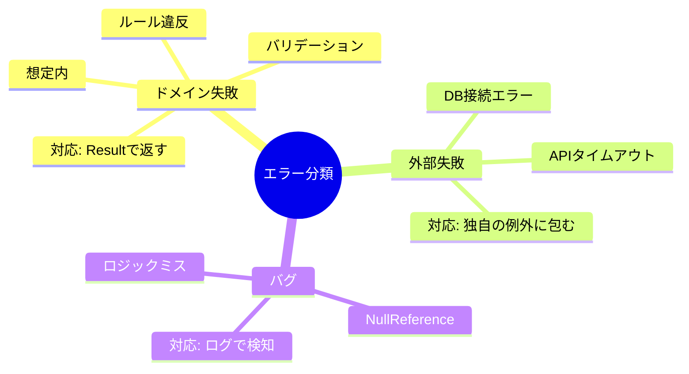

# 第35章：仕上げ：エラー・ログ・AI活用の“最低限セット”🎁✨


この章は「動くようになったアプリ」を、**壊れにくく＆直しやすく**する最終仕上げだよ〜！🛠️💖
（しかも、ヘキサの良さ＝**境界で整える**がめっちゃ効くところ✨）

---

## 35-0 今日のゴール🎯✨

* エラーを「種類」で分けて、**責任の場所**をはっきりさせる🧯
* ログを「最小限」入れて、**あとで原因追える**ようにする📝
* AIに“任せる所”と“人が守る所”を分けて、**事故を防ぐ**🤖🚦

ちなみに今の最新だと **.NET 10 がLTS（長期サポート）**で、2025/11/11 リリース＆サポートは 2028/11 頃までだよ〜📌 ([Microsoft for Developers][1])
IDEも **Visual Studio 2026** が提供されてる流れだよ🪟✨ ([Microsoft Learn][2])

---

## 35-1 エラーは3種類に分けるのが勝ち🧯✨




カフェで例えると…☕🍰

1. **ドメイン失敗（想定内）** 🧾

* 例：数量が0、営業時間外、支払い方法NG、など
* “ルール的にダメ”だから **バグじゃない**🙅‍♀️

2. **外部失敗（外が悪い）** 🌩️

* 例：DB落ちた、外部APIタイムアウト、メール送信失敗
* Coreは「使いたい」だけで、**壊れ方は外側の都合**だよね🧊

3. **想定外バグ（ほんとにヤバい）** 💥

* null参照、変換ミス、前提が崩れた…みたいな
* これはログ＆監視で早期発見したい😵‍💫

---

## 35-2 “ドメイン失敗”は Result で返すのが超ラク😊🧾

### なんで例外じゃなくて Result？🤔

* 「数量0は例外！」って言われると、**毎回 try/catch だらけ**になりがち🍝
* “想定内の失敗”は **戻り値で普通に返す**と、流れが読みやすい✨

### Core側に置く最小セット（エラーコード＋メッセージ）📦

```csharp
namespace Cafe.Core;

public enum ErrorType
{
    Validation,   // 入力が変
    BusinessRule, // ルール違反
    NotFound,     // ない
    Conflict,     // 競合（例：二重注文）
    External,     // 外部都合（本当は外側で作ることが多い）
    Unexpected    // 想定外
}

public sealed record AppError(string Code, string Message, ErrorType Type);

public readonly record struct Result<T>(T? Value, AppError? Error)
{
    public bool IsSuccess => Error is null;

    public static Result<T> Ok(T value) => new(value, null);
    public static Result<T> Fail(AppError error) => new(default, error);
}
```

### 使い方イメージ（ユースケース内）🧭

```csharp
public Result<CreateOrderOutput> Handle(CreateOrderInput input)
{
    if (input.Items.Count == 0)
    {
        return Result<CreateOrderOutput>.Fail(
            new AppError("ORDER_EMPTY", "注文は1つ以上の商品が必要だよ🍩", ErrorType.Validation));
    }

    // ルールOKなら進む…
    var orderId = Guid.NewGuid().ToString("N");
    return Result<CreateOrderOutput>.Ok(new CreateOrderOutput(orderId));
}
```

ポイントはこれ👇✨

* **Coreは「失敗の意味」だけ持つ**（コードと分類）
* 「HTTP 400 にする？ 409？」みたいな**外の都合は Core に入れない**🧼

---

## 35-3 “外部失敗”は Adapter で握りつぶさず、ちゃんと整形🧰🌩️

外部（DB/HTTP/メール）の例外って、めちゃくちゃ種類あるよね😵‍💫
だから方針はこれでOK👇

* **Outbound Adapter：低レベル例外をキャッチして、意味のある例外に包む**🎁
* **Inbound Adapter：例外を ProblemDetails で返す**🧾✨
  （.NET 8+ から `IExceptionHandler` で中央集約しやすいよ） ([Microsoft Learn][3])

### Outbound Adapter（例：Repository）🗄️

```csharp
public sealed class OrderRepositorySql : IOrderRepository
{
    private readonly SqlConnection _conn;

    public async Task SaveAsync(Order order, CancellationToken ct)
    {
        try
        {
            // DB処理…
        }
        catch (SqlException ex)
        {
            // DB都合の例外を、そのままCoreへ漏らさない
            throw new RepositoryUnavailableException("DBが混み合ってるっぽい🥺", ex);
        }
    }
}

public sealed class RepositoryUnavailableException : Exception
{
    public RepositoryUnavailableException(string message, Exception inner)
        : base(message, inner) { }
}
```

### Inbound（Web API）側：ProblemDetailsで返す🧾✨

ASP.NET Coreには **ProblemDetails** っていう標準エラー形式があるよ〜📌 ([Microsoft Learn][4])

#### Program.cs（例外ハンドラ登録）🧩

```csharp
var builder = WebApplication.CreateBuilder(args);

builder.Services.AddProblemDetails();
builder.Services.AddExceptionHandler<ApiExceptionHandler>();

var app = builder.Build();

app.UseExceptionHandler();

app.MapPost("/orders", async (CreateOrderRequest req, ICreateOrderUseCase uc) =>
{
    var result = uc.Handle(req.ToInput());

    if (result.IsSuccess)
        return Results.Ok(result.Value);

    // Result → HTTPへ変換（境界の仕事）
    return result.Error!.Type switch
    {
        ErrorType.Validation   => Results.BadRequest(ToProblem(400, result.Error)),
        ErrorType.BusinessRule => Results.Conflict(ToProblem(409, result.Error)),
        ErrorType.NotFound     => Results.NotFound(ToProblem(404, result.Error)),
        _                      => Results.BadRequest(ToProblem(400, result.Error)),
    };
});

app.Run();

static ProblemDetails ToProblem(int status, AppError err) => new()
{
    Status = status,
    Title = err.Code,
    Detail = err.Message
};
```

#### `IExceptionHandler` 実装（外部失敗などをここでまとめて処理）🧯

```csharp
using Microsoft.AspNetCore.Diagnostics;
using Microsoft.AspNetCore.Mvc;

public sealed class ApiExceptionHandler : IExceptionHandler
{
    public async ValueTask<bool> TryHandleAsync(
        HttpContext context,
        Exception exception,
        CancellationToken cancellationToken)
    {
        if (exception is RepositoryUnavailableException)
        {
            context.Response.StatusCode = StatusCodes.Status503ServiceUnavailable;

            var pd = new ProblemDetails
            {
                Status = 503,
                Title = "REPOSITORY_UNAVAILABLE",
                Detail = "いまDBが不安定みたい💦 ちょっと待ってもう一回やってみてね🙏"
            };

            await context.Response.WriteAsJsonAsync(pd, cancellationToken);
            return true;
        }

        return false; // 次のハンドラへ
    }
}
```

### ちょい注意：.NET 10 の例外診断の扱い🧠

.NET 10 では、`IExceptionHandler` が「処理した」例外の**診断（テレメトリ）が抑制される方向**の変更が入ってるよ。必要なら `SuppressDiagnosticsCallback` で調整できる📌 ([Microsoft Learn][3])

---

## 35-4 ログは「重要イベントだけ」でOK📝✨（最小で勝つ）

ログは**書きすぎると読めない**し、少なすぎると追えない😇
だから“最低限”のおすすめはこれ👇

### ✅ 残すと強いログ（例）💪

* 注文作成リクエスト受けた（OrderId/商品数）📥
* 注文作成成功（OrderId）✅
* 外部呼び出し失敗（どの外部か＋例外）🌩️
* 想定外例外（スタックトレース付き）💥

.NET の `ILogger` は **構造化ログ**（テンプレ＋値）を前提にしてて高速だよ📌 ([Microsoft Learn][5])

### 文字列結合じゃなくてテンプレで書く🧩

```csharp
_logger.LogInformation(
    "CreateOrder requested. ItemCount={ItemCount} CustomerId={CustomerId}",
    req.Items.Count,
    req.CustomerId);
```

---

## 35-5 まず動くログ設定（appsettings.json）⚙️🪟

ASP.NET Coreならこの形が基本でOK〜📝
（Microsoftのドキュメントでもこの設定構造が出てくるよ） ([Microsoft Learn][6])

```json
{
  "Logging": {
    "LogLevel": {
      "Default": "Information",
      "Microsoft.AspNetCore": "Warning"
    }
  }
}
```

**コツ**🧠✨

* 最初は `Information` で十分
* フレームワーク系（`Microsoft.AspNetCore`）は `Warning` くらいに落とすと読みやすい💡

---

## 35-6 “つながる”観測：OpenTelemetryは最小だけ入れる🔗📡

「このリクエストの失敗、DB？外部API？どこ？」を追うのに、
トレース（TraceId）があると一気に楽になるよ〜😆

OpenTelemetry は **ログ・メトリクス・トレース**の観測フレームワークだよ📌 ([OpenTelemetry][7])
.NET でも `AddOpenTelemetry().WithTracing(...)` で入れられる（Microsoft側の手順例もあるよ）📌 ([Microsoft Learn][8])

### 最小サンプル（まずはConsoleに出す）🧪

```csharp
builder.Services.AddOpenTelemetry()
    .WithTracing(t => t
        .AddAspNetCoreInstrumentation()
        .AddHttpClientInstrumentation()
        .AddConsoleExporter());
```

「まずはローカルで見える」が最強の第一歩だよ👀✨

---

## 35-7 AI活用：雛形は任せて、境界ルールは人が守る🚦🤖✨

AIはほんと便利だけど、**境界を破るコード**を平気で出してくることがあるのね…😇
だから、役割分担しよ〜！

### 🤖 AIに任せていいもの

* DTOの雛形、Mapper、単体テストのたたき台🧪
* `IExceptionHandler` の骨組み、ログ出力のテンプレ📝
* Repository/HttpClient の実装案（ただしレビュー必須👀）

### 🙋‍♀️ 人が守るもの（ここがヘキサのキモ❤️）

* **Coreが外側参照してないか**（DbContext/HttpClient直参照など）🛡️
* Port（interface）の責務がブレてないか🔌
* 変換（DTO↔Domain）がAdapterに寄ってるか🔁

### Copilotの“効かせ方”の基本📌

GitHub公式でも「**関係あるファイルを開いて、関係ないのは閉じる**」みたいな“コンテキスト整理”を推してるよ🧠✨ ([GitHub Docs][9])

#### そのまま使えるお願いテンプレ（コピペ用）📌✨

* 「このプロジェクトはヘキサ。Coreは外部参照禁止。変更はAdapterで吸収。Resultでドメイン失敗、外部失敗は例外→ProblemDetails。これ守って提案して」
* 「このファイルはOutbound Adapter。低レベル例外をラップして意味のある例外にして。CoreへDB例外は漏らさないで」

---

## 35-8 最終チェックリスト✅✨（これ通ったら卒業🎓）

* ✅ Coreが外（DB/HTTP/フレームワーク）を参照してない？🛡️
* ✅ “想定内の失敗”は Result で返してる？🧾
* ✅ 外部例外は Adapter で意味ある形に整形してる？🎁
* ✅ Inboundで Result / 例外 を HTTP（ProblemDetails）へ変換してる？🌐🧾
* ✅ ログは「重要イベントだけ」＆構造化で書けてる？📝
* ✅（余裕あれば）TraceIdで追える？🔗

---

## 35-9 ミニ宿題（カフェ注文アプリでやるやつ）☕🧪✨

1. `CreateOrder` で「商品0件」を `ORDER_EMPTY` で返す🧾
2. Repositoryで例外をわざと投げて `503` の ProblemDetails を返す🌩️
3. ログで `OrderId` と `ItemCount` を残す📝
   4)（できたら）OpenTelemetryのConsoleExporterでトレース出す🔗

---

必要なら、いまの「カフェ注文アプリ」のコード前提で、**この章をまるごと実装した“完成形の差分”**を作って貼るよ〜😆💖（どのUI方式：Controller/Minimal API かだけ合わせて書くね）

[1]: https://devblogs.microsoft.com/dotnet/announcing-dotnet-10/?utm_source=chatgpt.com "Announcing .NET 10"
[2]: https://learn.microsoft.com/en-us/visualstudio/releases/2026/release-notes?utm_source=chatgpt.com "Visual Studio 2026 Release Notes"
[3]: https://learn.microsoft.com/en-us/aspnet/core/fundamentals/error-handling?view=aspnetcore-10.0&utm_source=chatgpt.com "Handle errors in ASP.NET Core"
[4]: https://learn.microsoft.com/en-us/dotnet/api/microsoft.aspnetcore.mvc.problemdetails?view=aspnetcore-10.0&utm_source=chatgpt.com "ProblemDetails Class (Microsoft.AspNetCore.Mvc)"
[5]: https://learn.microsoft.com/en-us/dotnet/core/extensions/logging?utm_source=chatgpt.com "Logging in C# - .NET"
[6]: https://learn.microsoft.com/en-us/aspnet/core/fundamentals/logging/?view=aspnetcore-10.0&utm_source=chatgpt.com "Logging in .NET and ASP.NET Core"
[7]: https://opentelemetry.io/docs/languages/dotnet/?utm_source=chatgpt.com "NET"
[8]: https://learn.microsoft.com/en-us/dotnet/core/diagnostics/distributed-tracing-collection-walkthroughs?utm_source=chatgpt.com "Collect a distributed trace - .NET"
[9]: https://docs.github.com/en/copilot/get-started/best-practices?utm_source=chatgpt.com "Best practices for using GitHub Copilot"
