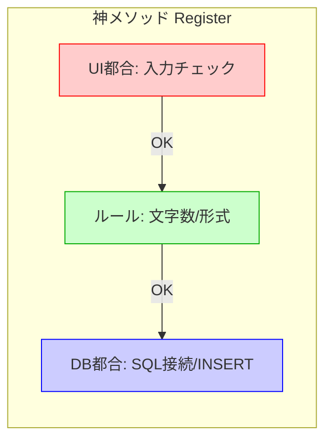

# 第01章：レイヤードってなに？🌈（まずは感覚）

## この章でできるようになること🎯✨

* 「レイヤード（層）」が **何を解決する考え方なのか** を、ざっくり説明できる😊
* コードを見たときに「あ、これ混ざってるかも…！」って **違和感センサー** が働く🔍⚡
* “神クラス・神メソッド” が起きる理由と、どう防ぐかの方向性がわかる😇➡️🧹

---

## 1. レイヤード＝「役割が違うものを混ぜない」🧹✨


レイヤードアーキテクチャって、めちゃ一言でいうと👇

* **同じ種類の仕事を、同じ場所に集める**
* **違う種類の仕事は、境界で分ける**🚪

たとえばね🍳
キッチンに「歯ブラシ」「服」「電池」「鍋」が全部ぐちゃっと置かれてたら…探すだけで疲れるよね🥲
コードも同じで、**責任（役割）が混ざるほど地獄**になるの…💥

---

## 2. 何がうれしいの？😊（変更に強い／読みやすい／テストしやすい）


レイヤードのご褒美はこれ👇🎁

### 変更に強い💪✨

「画面デザイン変えたい」だけなのに、保存処理やルールまで壊れる…って事故が減る😮‍💨
（“変更が波及しにくい” ってこと！）

### 読みやすい📚✨

「このファイルは何の担当？」が一瞬で分かるようになる👀
迷子になりにくい🧭

### テストしやすい🧪🍰

とくに **ルール（ドメイン）** がちゃんと分かれてくると、テストが超ラクになる✨
（第19章で「うまぁ…🍰」ってなるやつ）

---

## 3. よくある事故：神クラス・神メソッド😇💥


### 神クラスってなに？😇

ざっくりいうと👇
1つのクラスが、**なんでも屋** になっちゃう状態😇💦

* UIの入力を読む
* バリデーション（チェック）する
* DBに保存する
* ログも出す
* 例外処理も全部そこでやる
* しかも2000行…😇😇😇

### 神メソッドってなに？😇

1つのメソッドが **50行・100行・300行** になって、全部そこでやってるやつ😇💥
読めない・直せない・怖いの三重苦😭

---

## 4. 「混ざってる」と何が起きる？🤯（なぜつらいのか）

混ざると、こうなる👇💣

* 変更のたびに **どこを触ればいいか分からない**🌀
* ちょっと直しただけで **別の機能が壊れる**（副作用ドーン💥）
* テストしようとしても、DBやUIが絡んで **準備が面倒すぎる**😵‍💫
* 結果、怖くて触れないコードになる😇🧊

---

## 5. ミニ体験：混ざったコードの「におい」を嗅ぐ🐶🔍


次のコード、動くかもしれないけど…“混ざり具合” を見てみてね👀✨
（短い例だから安心してね😊）

```csharp
public class RegisterUserController
{
    public string Register(string name, string email)
    {
        // UI都合っぽい入力チェック
        if (string.IsNullOrWhiteSpace(name)) return "名前が空です";
        if (!email.Contains("@")) return "メールが変です";

        // ルールっぽい処理（本当はもっと複雑になりがち）
        if (name.Length > 20) return "名前は20文字まで";

        // DBっぽい処理（ここが特に混ざりがち）
        using var conn = new SqlConnection("...");
        conn.Open();

        var cmd = new SqlCommand(
            "INSERT INTO Users(Name, Email) VALUES(@Name, @Email)", conn);
        cmd.Parameters.AddWithValue("@Name", name);
        cmd.Parameters.AddWithValue("@Email", email);
        cmd.ExecuteNonQuery();

        return "OK";
    }
}
```

### “混ざりセンサー” チェック✅🐶



この中に、少なくとも次の種類が混ざってるよね👇

* 入力の見た目・UI都合の判断（空文字とか）🎨
* ルール（名前20文字まで、みたいな）💎
* DB保存（SQLとか接続とか）🗄️


レイヤードは、この混ざりを **「分けようね」** っていう考え方だよ🧹✨

---

## 6. レイヤードは「仕事の種類」で分ける📦✨（ざっくり予告）


この教材の4層モデルは、ざっくりこんな担当イメージ👇🧱
（第2章で地図をちゃんと描くから、ここは“ふんわり”でOK😊）

* Presentation：画面・入力・表示（薄く）🎨
* Application：手順（ユースケースの進行役）📋
* Domain：ルール・意味・禁止事項（コア）💎
* Infrastructure：DB・外部API・ファイル（詳細）🗄️

「**変わりやすいものは外側へ**」って発想が、あとで効いてくるよ〜🧊✨
（.NETのアーキテクチャ解説でも、論理的な“層”と物理的な“ティア”を分けて説明されてるよ📚）([Microsoft Learn][1])

---

## 7. いまの段階のゴールは「分ける気持ち」だけでOK🙆‍♀️🌱

第1章は、完璧に分割できなくていいよ😊
まずはこれができれば合格💮✨

### 合格ライン✅

* 「このメソッド、UIの話とDBの話が混ざってるな…」が分かる👀
* 「ルールはどこに置くのが自然かな？」って考えられる🧠
* “神クラス化しそう” を早めに止められる🛑😇

---

## 8. ちいさな練習問題✍️✨（5分でできる）

### 問題：この処理、何種類の仕事が混ざってる？🧩

さっきの `Register` を見て👇の3つに色分けしたつもりで分類してみてね🎨

1. UI都合（入力・表示の都合）
2. ルール（守るべき意味・制約）
3. 外部（DB・通信・ファイル）

できたら、心の中でこう言ってOK👇
「うん、これはそのうち分けるやつだね😊🧹」

---

## 9. AI相棒の使い方🤖💡（この章から使える！）

### ① 混ざり検出プロンプト🔍

CopilotやCodexに、こう聞くと超便利だよ✨

* 「このメソッドに含まれる責任を列挙して、UI/ルール/DBに分類して」🧠📦
* 「神メソッド化している兆候を指摘して、分割方針を提案して」😇➡️🧹

### ② “分け方のたたき台” を作らせる🧱

* 「このコードをレイヤードを意識した構造に分割するなら、どんなクラスに分ける？」✨
* 「Domainに置くべきルール候補だけ抽出して」💎

※AIの提案は“叩き台”として最高だけど、最後は「それ本当にその層の責任？」って目でチェックすると強いよ👀✅

---

## 10. まとめ🎀✨

* レイヤードは **役割を混ぜない** ための考え方🧹
* 混ざると、変更に弱く・読みにくく・テストしづらくなる😵‍💫
* まずは「混ざってる匂い」を嗅げるようになればOK🐶🔍
* AI相棒に「責任の列挙＆分類」をやらせると一気に上達する🤖💡

---

## 章末チェックリスト✅💖

* [ ] “神クラス・神メソッド” のにおいを説明できる😇
* [ ] 「UI都合／ルール／外部」の3種類を意識できる📦
* [ ] 分ける必要がありそうな場所を見つけられる👀🧹

---

次の第2章では、4層モデルを「地図」としてしっかり描いていくよ🗺️🧱✨
（今のC#は .NET 10 と一緒に進化してて、C# 14の解説もMicrosoft公式でまとまってるよ📚）([Microsoft][2])

[1]: https://learn.microsoft.com/en-us/dotnet/architecture/modern-web-apps-azure/common-web-application-architectures?utm_source=chatgpt.com "Common web application architectures - .NET"
[2]: https://dotnet.microsoft.com/en-US/download/dotnet/10.0?utm_source=chatgpt.com "Download .NET 10.0 (Linux, macOS, and Windows) | .NET"

