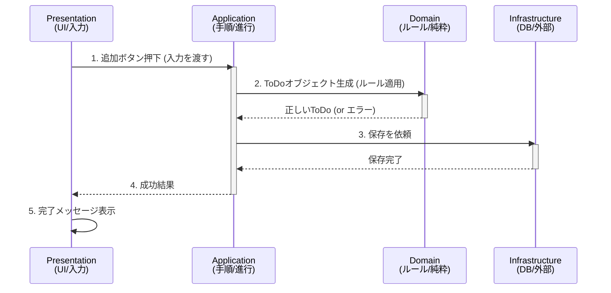

# 第02章：4層モデルの全体像🧱（地図を持つ）

この章は「**4つの層を“役割の違う部屋”としてイメージできるようになる**」のがゴールだよ😊✨
（このあと第3章で“依存の向きルール➡️”をガッチリやるから、今日はまず全体地図！）

---

## この章でできるようになること✅✨

* 「この処理、どの層に置く？」がだいたい即答できる🙌
* 4層それぞれの **やること / やらないこと** をざっくり言える🧠
* “境界（層のドア🚪）”って何？を説明できる✨
* ありがちな事故（神クラス😇）を、構造で防ぐ感覚がつく🛡️

---

## 1) まず4層を「お店」でたとえる🍰🏬

イメージが一番大事なので、たとえるね😊

* **Presentation（表示・入力）**：お客さんと話す店員さん👩‍🍳
  → ボタン押された！入力もらった！じゃあ依頼する！📣

* **Application（手順・進行）**：店長の「注文をさばく手順書」📋
  → 「在庫確認→会計→伝票→通知」みたいに順番を組み立てる🧩

* **Domain（ルール・意味）**：この店の“決まり”と“価値”そのもの💎
  → 「未成年にお酒は売れない」みたいな“守るべきルール”🍷🚫
  → “無効な状態を作らない”の中心🔒

* **Infrastructure（外部との接続）**：冷蔵庫・レジ・倉庫・仕入れ先📦
  → DB、ファイル、HTTP、外部API、メール送信…ぜんぶここ寄せ🛰️

---

## 2) 4層の「持つ / 持たない」ざっくりルール✋✨

| 層              | 主な責任💡         | ここに置きがち（OK例）✅                                   | 置かない（NG例）🙅‍♀️             |
| -------------- | -------------- | ----------------------------------------------- | -------------------------- |
| Presentation   | 入力→呼び出し、結果表示🎨 | Controller / UI Handler / ViewModel（薄め）         | DB直アクセス、業務ルール（値チェック本体）     |
| Application    | ユースケースの手順書📋   | UseCase / ApplicationService / Tx制御             | ルールの本体（ドメインの判断）            |
| Domain         | ルールとモデル💎      | Entity / ValueObject / DomainService / 例外(ドメイン) | EF/SQL、HTTP、UI都合、フレームワーク依存 |
| Infrastructure | 外部との接続・詳細📦    | Repository実装 / EF DbContext / API Client        | “意味”の判断（ルール本体）             |

💡ポイント：**「変わりやすいものほど外側へ」**が基本だよ🧊
（DBや外部APIは変わりやすい＝端っこに追い出す！）

※2026時点では、最新の **.NET 10（LTS）** が提供されていて、C#は **C# 14** が最新として案内されてるよ（IDEは Visual Studio 2026 で試せる）✨([Microsoft][1])

---

## 3) 層の境界ってなに？🚪✨（=「責任のドア」）

層と層の間にはドアがある感じ😊🚪

* ドアの役目：**「中に何があるか隠す」**
* つまり：上の層は、下の層の“中身”を知らなくていい🙆‍♀️

たとえば保存（DB）って、上の層から見るとこう👇

* Application/Domain：「保存してね」💬
* Infrastructure：「了解、DBにこう書くね」🗄️

このときに便利なのが **インターフェース（契約）** だよ🤝
「保存のお願い窓口」だけ見せて、実装は隠すのが綺麗✨

---

## 4) 1本の処理がどう流れるか（ToDo追加の例）📝➡️

**ToDoを追加**する処理の流れを、超シンプルに書くね😊

1. Presentation：入力を受け取る（タイトル文字列など）🖊️
2. Application：手順を進める（追加ユースケース開始）🎮
3. Domain：ルールで“正しいToDo”を作る（空タイトル禁止とか）🔒
4. Infrastructure：保存する（DBにINSERT）🗄️
5. Presentation：結果を表示する（追加できた！）🎉

図にするとこんな感じ👇

Presentation
⬇️（呼ぶ）
Application
⬇️（モデル/ルール使う）
Domain
⬇️（保存を依頼する）
Infrastructure

---

## 5) 各層の“キャラ設定”をもう一段だけ具体化😆✨

## Presentationは「薄くてえらい」🎨✨

* **やる：** 画面入力→UseCase呼び出し、結果表示
* **やらない：** 「空ならダメ！」みたいな本気の業務ルールを抱えない🙅‍♀️
  （※軽い入力チェックはOK。でも“意味の判断”はDomain寄りが強いよ）

## Applicationは「段取り屋さん」📋🧩

* **やる：** 手順・調整・境界の管理
* **やらない：** “この判断は正しい？”の本体は持たない⚠️
  （判断の本体＝Domainへ）

## Domainは「王様」👑💎

* **やる：** ルールと意味、無効状態を作らない
* **やらない：** DBやHTTPなどの“技術の都合”は知らない🙅‍♀️
  → Domainは“純度高め”だとテストが超ラクになる🍰🧪

## Infrastructureは「何でも屋だけど意味は決めない」📦🛰️

* **やる：** DB/外部API/ファイル/メール…現実世界と接続する
* **やらない：** 「これは正しいToDo！」みたいな意味の判断はしない🙅‍♀️

---

## 6) よくある事故パターン💥（先に知ると回避できる）

* **事故①：UIがDBを直接叩く**🗄️💥
  → 画面都合がDB設計に侵食しやすい

* **事故②：Applicationに業務ルールが増殖**📋😱
  → “手順書”が“法律”になって読めなくなる

* **事故③：DomainがEFやHttpClientを持つ**💎⚙️
  → Domainが汚れてテストが重くなる

* **事故④：DTOがDomainを乗っ取る**📦👻
  → Domainがただのデータ袋（貧血モデル）になりやすい

---

## 7) ミニ演習🎯「これ、どの層？」（答え付き）

次の“置き場所”を考えてみてね😊✨

1. 画面で入力された文字を受け取る
2. 「タイトルは1〜50文字」ルールで弾く
3. 「ToDo追加」の手順（作る→保存する）
4. SQLを書いてDBへ保存
5. 外部APIに通知を送る
6. 追加完了メッセージを画面に出す

**答え**🎉
1=Presentation 🎨
2=Domain 💎（※軽い入力チェックはPresentationでもOKだけど、“ルール本体”はDomain寄せ）
3=Application 📋
4=Infrastructure 🗄️
5=Infrastructure 🛰️
6=Presentation 🎨

---

## 8) AI（Copilot/Codex）に手伝ってもらうプロンプト例🤖✨

そのままコピペで使えるやつ置いとくね🙌

* 層の分類を相談する💬
  「このコードはPresentation/Application/Domain/Infrastructureのどれに置くべき？理由も。層をまたぐなら分割案も出して」

* “持つ/持たない”違反チェック✅
  「このクラスがDomainに置かれている前提で、インフラ依存（DB/HTTP/UI）を含んでないかレビューして。違反箇所と直し方を提案して」

* ユースケースの骨組みを作る📋
  「ToDo追加のUseCaseの最小実装を作って。DomainのルールはDomain側に寄せて、Infrastructureはインターフェース越しに呼ぶ構造で」

---

## 章末まとめ🌟（ここだけ覚えればOK）

* 4層は「役割の違う部屋」🏠
* **Domainが中心💎、外部の都合はInfrastructureへ📦**
* Applicationは手順書📋、Presentationは薄く🎨
* 境界（ドア🚪）を意識すると、壊れにくい✨

---

## 章末チェックリスト✅😆

* [ ] 「ルール本体」はDomainに寄せられてる？💎
* [ ] UIがDBや外部APIを直接触ってない？🙅‍♀️
* [ ] Applicationが“判断”を抱えすぎてない？📋💦
* [ ] Infrastructureが“意味の判断”をしてない？📦🧠🚫

---

次の第3章は、いよいよ **依存の向きルール➡️（最重要）** を固定して、「参照できる/できない」をビシッと決める回だよ😊🔥

[1]: https://dotnet.microsoft.com/ja-jp/platform/support/policy/dotnet-core?utm_source=chatgpt.com ".NET および .NET Core の公式サポート ポリシー"

