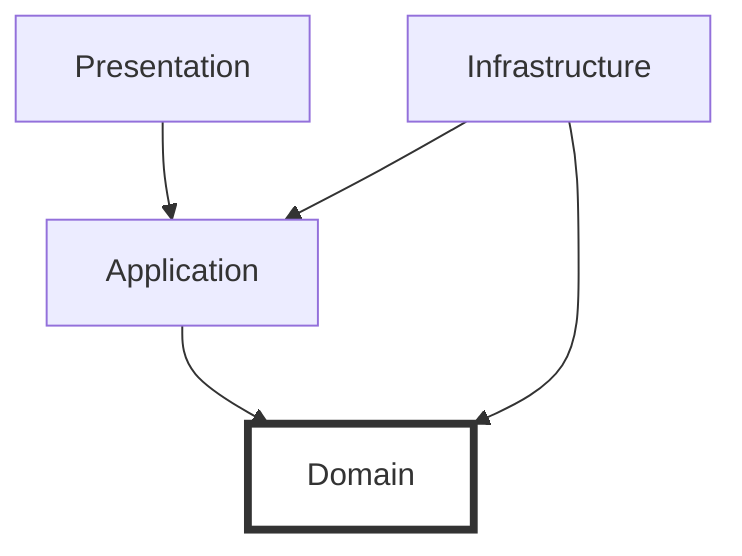

# 第03章：依存の向きルール➡️（これが最重要）

（レイヤードアーキテクチャ初心者さん向け／やさしめ口調＆絵文字多めでいくよ〜🥳）

---

## 0. 今日のゴール🎯💡

この章が終わったら、こんな状態になってたら勝ちです✨

* 「依存って何？」を“コード目線”で説明できる🧠
* 4層（Presentation / Application / Domain / Infrastructure）で**依存の矢印を迷わない**🧭
* よくある違反パターンを見て「それダメなやつ〜！」って気づける👀💥
* 直し方の“型”を1つ持って帰れる🧰✨

---

## 1. そもそも「依存」ってなに？🤔🔗


ここ、最初にハッキリさせると一気にラクになります😊

### ✅ この章で言う「依存」＝**ソースコードの依存**🧾

つまり、ざっくり言うとこういうの👇

* `using` してる（型名を知ってる）📦
* `new` してる（生成してる）🧪
* メソッドを呼んでる（コンパイル時に参照してる）📞
* 継承してる / 実装してる（関係が固定される）🧬
* プロジェクト参照してる（Assembly参照）🏗️

このへんが増えるほど「結びつき」が強くなって、後で変更がしんどくなりがちです😵‍💫

---

## 2. 依存の向きルール➡️＝「内側は外側を知らない」🧊✨


このルール、言い方はいろいろあるけど、本質は同じです👇

> **依存（ソースコードの矢印）は、外側 → 内側へ向ける**
> **内側は外側の名前を知らない**🙅‍♀️

これは Clean Architecture の「Dependency Rule」としても超有名で、
「ソースコードの依存は内側へ向く」って説明されています。([Clean Coder Blog][1])

---

## 3. 4層の“矢印の正解”🧱➡️


今回の教材の4層を、依存の向きで描くとこうです👇

* Presentation（UI）
* Application（ユースケース）
* Domain（ルールの中心）
* Infrastructure（DB/HTTP/外部I/Oなど）

### ✅ 依存の矢印（コンパイル時の参照）はこう！

```
Presentation  ───▶ Application ───▶ Domain
Infrastructure ───▶ Application ───▶ Domain
（Domainはどこにも依存しない）
（Domainはどこにも依存しない）
```



ポイントはここ👇

* **Domain は “中心” なので、外側の事情を知らない**👑
* **Infrastructure は “外側” なので、内側に依存してOK**（むしろそうする）🧱
* 「DB変えたい」「UI変えたい」が起きても、Domain が巻き込まれないのが理想です😊

※ ちなみに **C# 14 は .NET 10 でサポート**、Visual Studio 2026 に .NET 10 SDK が入るよ〜という最新状況です。([Microsoft Learn][2])

---

## 4. なんでこのルールが大事なの？🥹🛡️


理由はシンプルで、**変わりやすいもの**から守りたいからです✨

* UIは変わる（画面、入力、見た目）🎨
* DBも変わる（SQL、NoSQL、クラウド移行）🗄️
* 外部APIも変わる（仕様変更、停止、認証方式）🌐
* でも **業務ルール（Domain）はできるだけ安定させたい**👑

Dependency Rule の説明でも、外側は低レベルな詳細で、内側ほど抽象度が高くなる、って語られています。([Clean Coder Blog][1])

---

## 5. ルール違反が起きる典型パターン💥（あるある集）


ここ、初心者がめっちゃハマるポイントを“事故例”で覚えるのが早いです🤣

### ❌ パターンA：DomainがDBを触りたくなる🗄️👉💎

「在庫を確認したいから Domain からDB読もう！」みたいなやつ。
これをやると Domain が EF Core や SQL に縛られて、DB変更が地獄になります😇

* 症状：DomainプロジェクトにDB系NuGet入れ始める
* 結果：Domainが“中心”じゃなくなる（外側の都合が侵入）🏴‍☠️

---

### ❌ パターンB：ApplicationがUIを触りたくなる🎮👉🎨

「入力チェック、画面の都合でここでやっちゃえ！」
…これもありがち💥

* Application が `MessageBox` とか UI クラスを知り始める
* UI変更が Application に波及しやすくなる🌊

---

### ❌ パターンC：層をまたぐ“便利クラス”で全部つながる🧨

`Utils` とか `Common` とかに何でも入れて、全層から参照しちゃうやつ😇

* 一見便利
* 実際は「結合のハブ」になって破壊力MAX💣

---

## 6. じゃあどう直すの？🛠️✨（最強の型：抽象を内側へ）


違反が起きたときの基本ムーブはこれです👇

### ✅ 直し方の型（テンプレ）📌

1. **内側が必要とする“役割”を interface にする**（内側に置く）🧩
2. **外側（Infrastructure）が実装する**🔧
3. **差し込む（DI）**🧷（これは後の章で本格的にやるよ！）

この考え方は「高レベルの方針が、低レベルの詳細に引きずられないようにする」ってやつで、Clean Architecture系の説明でもよく出てきます。([Clean Coder Blog][1])

---

## 7. ミニ例：ToDoで“依存の矢印”を体感しよ〜📝✨

ここでは超ミニで「矢印だけ」掴みます😊（実装ガチは後の章でOK👌）

### 🎯 やりたいこと

「ToDoを追加する」

---

### ✅ 正しいイメージ（依存の矢印）

* Presentation：ボタン押された！→ Application呼ぶ📞
* Application：手順を進める（登録する）📋
* Domain：ToDoのルールを守る（空文字禁止とか）🔒
* Infrastructure：保存する（DB/ファイル等）💾

---

### ✨ “依存”が正しい例（概念コード）

```csharp
// Domain（中心）: ルールを持つ
public sealed class TodoTitle
{
    public string Value { get; }
    public TodoTitle(string value)
    {
        if (string.IsNullOrWhiteSpace(value))
            throw new ArgumentException("タイトルは必須だよ🥺");
        Value = value;
    }
}
```

ここで大事なのは👇

* Domain は **UIもDBも知らない**🙅‍♀️
* “タイトルは必須”みたいな**ルールだけ**を握る🔒✨

---

## 8. 「参照できる／できない」を先に固定✅（超重要）

後から直すのが一番つらいので、**ルールは最初に決めて、機械的に守る**のが勝ち筋です🏆

### ✅ ルール（この教材のおすすめ）

* Presentation → Application（OK）
* Application → Domain（OK）
* Infrastructure → Application / Domain（OK）
* Domain → （どこにも参照しない）（OK）

この形だと、Domain が一番守られて、長期で効いてきます🧊✨

---

## 9. 依存違反を“早期発見”するコツ👀🚨

### ✅ 目で見て気づけるサイン

* Domain に `Microsoft.*` の外部都合っぽい NuGet が増える📦💥
* Application が UI クラス名を `using` してる🎨💥
* Infrastructure の都合（DBのテーブル名等）が Domain に漏れてる🗄️💥

### ✅ 機械で守る（アーキテクチャテスト）🧪

「ルールは人が頑張る」より、**テストで守る**が最強です🔥
.NET だと NetArchTest.Rules みたいなライブラリで層の依存を検査できます。([GitHub][3])

（この辺は第19章の“ご褒美”で気持ちよくやるのが最高🍰）

---

## 10. AI（Copilot/Codex）にやらせると超ラク🤖✨

あなたが毎回チェックする代わりに、AIに“監視員”やってもらいましょ😎

### ✅ 依存違反チェック用プロンプト例🕵️‍♀️

* 「このソリューション構成で、Domain が外側に依存してる箇所を指摘して。理由も添えて」
* 「Presentation → Domain を直接参照してる箇所を列挙して。代替案も出して」
* 「このクラスはどの層に置くべき？根拠と、置き場所を変えた場合の影響も説明して」

### ✅ リファクタ支援プロンプト例🧹

* 「依存の向きルールを守るように、interface 抽出して配置案を3パターン出して」
* 「この依存を壊さずにテストしやすくする設計に直して」

---

## 章末チェックリスト✅🎀

最後にこれだけ確認してね😊

* [ ] Domain が UI / DB / 外部API の型名を知らない（`using` してない）🧊
* [ ] 依存の矢印が「外側 → 内側」になってる➡️
* [ ] “便利Common”が結合ハブになってない🧨
* [ ] ルール違反が起きたら「抽象（interface）を内側へ」の型で直せる🧩

---

## まとめ🍀✨

依存の向きルールは、レイヤードの心臓です🫀
ここがブレると、どんなに層を分けてもだんだん混ざっていきます😇

次の章（第4章）では、題材を小さく決めて🌱、この矢印ルールを守りながら育てていく準備に入ろうね〜🪴✨

[1]: https://blog.cleancoder.com/uncle-bob/2012/08/13/the-clean-architecture.html?utm_source=chatgpt.com "Clean Architecture - Clean Coder Blog - Uncle Bob"
[2]: https://learn.microsoft.com/en-us/dotnet/csharp/whats-new/csharp-14?utm_source=chatgpt.com "What's new in C# 14"
[3]: https://github.com/BenMorris/NetArchTest?utm_source=chatgpt.com "BenMorris/NetArchTest: A fluent API for .Net that can ..."

