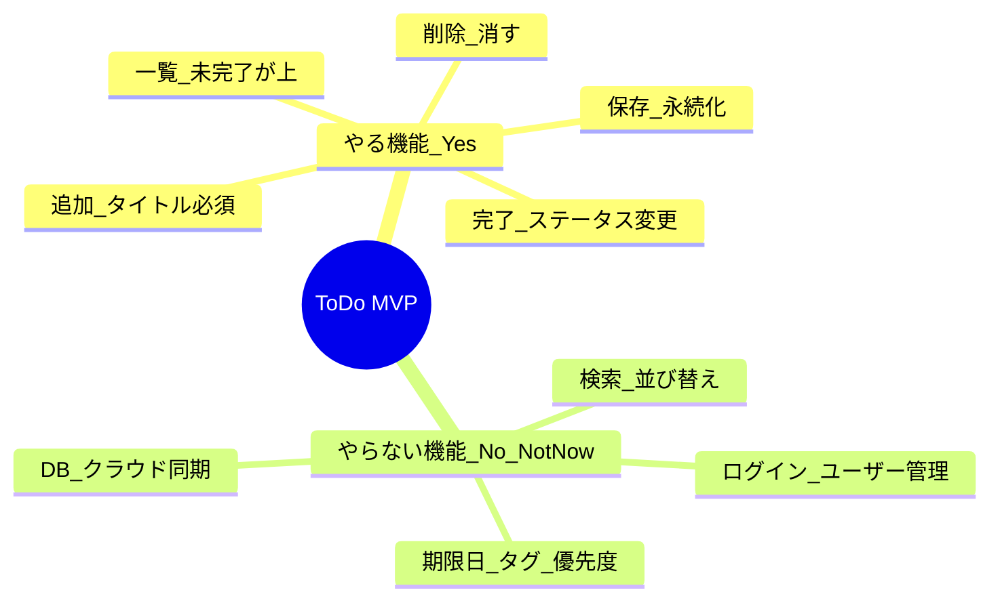

# 第04章：題材決め＆最小要件（YAGNIでいく）🌱

この章は「作るものを決める」回なんだけど、実は **レイヤードがうまくいくかどうか** を左右する超重要ポイントだよ〜！😳💥
ここでスコープを小さく、でも“設計の学びが出る題材”を選べると、後の章がスルスル進むよ🛝💨

---

## 4.0 この章のゴール🎯


ゴールは3つだけ！💡

1. 20章通して育てる「題材」を1つ決める🪴
2. **最小要件（MVP）** をカチッと決める✅
3. “今やらないこと” を明文化して、YAGNIで守る🛡️✨

---

## 4.1 レイヤード学習に向く題材の条件🧩

題材は何でも良い…んだけど、**学びが出やすい条件** があるよ😊✨

### ✅ ちょうどいい題材はこういうやつ！

* **CRUD** がある（追加・一覧・更新・削除）🧺
* **ちょいルール** がある（入力制約、状態遷移など）🔒
* **保存先** がある（最初はファイルでもOK、あとでDBにできる）💾
* 画面は **1〜2画面** で成立する📱
* “あとで拡張できそう” が見える（でも今はやらない）👀✨

### ❌ 初心者が爆死しやすい題材（避けよ🥹）

* 認証・ユーザー管理（ログイン、権限）🔐
* 決済、外部API連携だらけ💳🌐
* リアルタイム同期、チャット、通知だらけ🔔💬
* 画面が多すぎる業務アプリ🗂️

---

## 4.2 題材おすすめ3選🍀（迷ったらこのどれかでOK！）

ここは “設計の練習としておいしい” 三銃士！⚔️😎

### A. ToDo（最強の定番）✅

* 学び：状態（未完了/完了）・期限・並び替え・検索が作れる
* 拡張ネタが多い（タグ、優先度、繰り返し）
* 初心者が理解しやすい😊

### B. 家計簿（ルールが出ておいしい）💰

* 学び：金額の扱い、カテゴリ、集計（の入口）
* “ルール” をDomainに置く練習がしやすい
* でも集計をやり始めると増えがちなので要件を絞るのがコツ🧊

### C. 蔵書管理（“物”の管理が分かりやすい）📚

* 学び：本・著者・貸出など、モデル化が楽しい
* UIはシンプルにしやすい
* ただし貸出・履歴を入れ始めると膨らむのでMVPで止める✋

---

## 4.3 最小要件（MVP）の決め方🧱✨

ここからが本番！🔥
MVPは「小さく作れる」だけじゃなくて、**レイヤードの勉強になる最小** にするのがコツだよ😊

### 4.3.1 “1画面MVP” の型📦

まずはこの型に当てはめると失敗しにくいよ〜！

* **入力**：新規追加のフォーム（項目は2〜3個）📝
* **表示**：一覧（並び替えは後回しでもOK）📃
* **操作**：1つだけ（完了にする / 金額を登録する / ステータス変更）✅
* **保存**：永続化（最初はローカルでもOK）💾

---

## 4.4 ToDo題材の「MVP例」✅（これくらい小さく！）

例として ToDo のMVPを“ガチで小さく”切るとこうなるよ👇✨

### ✅ MVP（第4章で確定させる範囲）

**機能**

1. ToDoを追加できる（タイトル必須）➕
2. ToDo一覧を見られる（未完了が上）👀
3. ToDoを完了にできる✅
4. ToDoを削除できる🗑️
5. アプリを閉じても残る（保存される）💾

**ルール（Domainのタネ🌱）**

* タイトルは空文字NG🙅‍♀️
* 完了済みをもう一回完了にするのは不可（または無視）🔒

### 🚫 “今はやらない（Not-now）” 例（超大事！）

* ログイン/ユーザー別管理🔐
* 期限日、タグ、優先度、繰り返し📅🏷️
* 検索、フィルタ、並び替えの細かいUI🔎
* DB（最初はファイル/簡易ストレージでOK）🗄️
* 同期、クラウド保存☁️

ここを最初に書くと、未来の自分が助かるよ…！🥹🫶



---

## 4.5 受け入れ条件（Acceptance Criteria）を1行で書く✍️✨

要件はフワッとしがちだから、**“できた判定”** を付けようね😊

ToDoの例だとこんな感じ👇

* 追加：タイトルが空ならエラー表示され、追加されない⚠️
* 一覧：追加したToDoが表示される📃
* 完了：完了にすると一覧で状態が変わる✅
* 削除：削除したら一覧から消える🗑️
* 保存：アプリ再起動しても残っている💾

---

## 4.6 “レイヤード視点”で要件を仕分ける🧠🧱

この章の裏テーマはここ！✨
要件を見た瞬間に「どの層が責任か」うっすら分かるようになると強いよ💪

### 4.6.1 ざっくり仕分けルール（初心者版）

* **Presentation**：入力・表示・クリックの受け口🎨
* **Application**：手順（追加→保存→返す）📋
* **Domain**：ルール（空はダメ、状態遷移）💎
* **Infrastructure**：保存や外部（ファイル/DB/通信）🚪

### 4.6.2 ToDo MVPを仕分けると…👀

* 「タイトル空NG」→ **Domain** 💎
* 「追加ボタン押したら登録」→ **Presentation + Application** 🎨📋
* 「保存して再起動でも残る」→ **Infrastructure** 🚪💾
* 「一覧の表示」→ **Presentation（表示）** / **Application（取得手順）** 🎨📋

---

## 4.7 この章で作る“成果物セット”🎁✨（超おすすめ）

「頭の中だけ」で進めると、次章で迷子になるよ〜🥺
なので **これだけ** 作っておこう！

### ✅ 成果物（コピペでOK）

1. 題材名（例：ToDo）🪴
2. MVP要件（5個くらい）✅
3. Not-nowリスト（10個くらい）🚫
4. 用語集ミニ（10語くらい）📚
5. 画面ラフ（手書きでもOK）🖍️

---

## 4.8 AIを“スコープ守護神”にするプロンプト🤖🛡️

AIは増やす方向にノリノリになりがちだから、**最初に縛り** を入れると安定するよ😊✨
（Copilot/Codex等のIDE AI前提でOKだよ〜）

### 4.8.1 題材選び：候補を絞る🧠

```text
レイヤードアーキテクチャ学習用に、小さく作れてCRUDと軽いルールが入る題材を3つ提案して。
各題材について「MVPを5機能以内」「今やらないこと10個」もセットで出して。
認証・決済・外部API・画面多数は禁止。
```

（この縛りは“YAGNI保険”だよ🛡️✨）

### 4.8.2 MVPチェック：増やしすぎ警察🚓

```text
以下のMVP要件が大きすぎないかレビューして。
「学習価値は高いが今は削るべき要件」と「後で追加するなら第何章あたりが良いか」も提案して。
```

### 4.8.3 レイヤー仕分け：どこに置くべき？🧱

```text
次の要件を Presentation / Application / Domain / Infrastructure に仕分けて。
「初心者が置きがちな間違い」も添えて。
要件: （ここにコピペ）
```

GitHub Copilotの機能例として「リファクタ・デザインパターンへの整理・ビジネスロジック分離」みたいな用途も公式に案内されてるので、こういう“設計レビュー係”にすると相性いいよ〜😊✨ ([GitHub Docs][1])

---

## 4.9 章末チェックリスト✅✨

終わる前にこれだけ確認してね🫶

* [ ] MVPが **5機能以内** になってる✅
* [ ] 画面が **1〜2画面** で成立してる📱
* [ ] Not-nowが **ちゃんと書かれてる** 🚫
* [ ] ルールが **1〜2個だけ** 入ってる（Domainの練習用）💎
* [ ] 次章でプロジェクト分割しても違和感がない🧱

---

## 4.10 次章へのつながり🔜🧰

次の第5章では、いよいよ **Visual Studioでソリューション構成** を作って、プロジェクト分割していくよ〜！🏗️✨
ちなみに本日時点の最新は **.NET 10（例：10.0.2 が 2026-01-13 の最新リリース）** で、C# 14 は .NET 10 対応だよ。 ([Microsoft][2])
そして **Visual Studio 2026** のリリースノートも 2026-01-13 更新が出てるので、この章から“最新版前提”で進めてOK〜！💪✨ ([Microsoft Learn][3])

---

もし「ToDo / 家計簿 / 蔵書管理」のどれで行くか迷ったら、いったん **ToDo** にしちゃうのが一番スムーズだよ✅😊
（次章以降の例も合わせやすい✨）

[1]: https://docs.github.com/en/copilot/get-started/features?utm_source=chatgpt.com "GitHub Copilot features"
[2]: https://dotnet.microsoft.com/en-US/download/dotnet/10.0?utm_source=chatgpt.com "Download .NET 10.0 (Linux, macOS, and Windows) | .NET"
[3]: https://learn.microsoft.com/ja-jp/visualstudio/releases/2026/release-notes?utm_source=chatgpt.com "Visual Studio 2026 リリース ノート"

