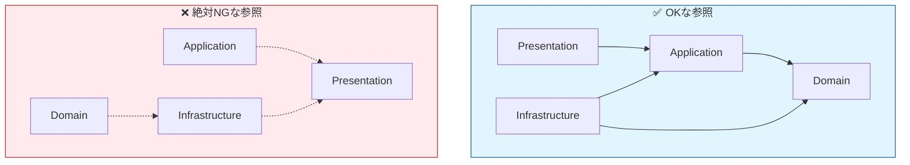

# 第05章：Visual Studioでソリューション構成を作る🧰

[](https://learn.microsoft.com/th-th/visualstudio/get-started/tutorial-projects-solutions?view=vs-2022&utm_source=chatgpt.com)


この章は「土台づくり回」だよ〜！ここでちゃんと分けておくと、後ろの章（DTO・Repository・DI・テスト）がぜんぶ楽になるよ🥰💕

---

## 5.0 今日のゴール🎯✨

### できあがり（最終形）

* ソリューション配下に 4プロジェクト（Presentation / Application / Domain / Infrastructure）を作る🏗️
* **プロジェクト参照（依存）を固定**して「逆流（逆参照）」を防ぐ🚫
* ついでに **チームで揉めない共通設定**も入れる（NuGetの中央管理とか）📦✨

---

## 5.1 まず“完成図”を見よう👀🗺️

### 物理フォルダ構成（おすすめ）

こんな感じにしておくと迷子にならないよ🧭✨

```text
TodoApp/
  TodoApp.sln
  src/
    TodoApp.Presentation/
    TodoApp.Application/
    TodoApp.Domain/
    TodoApp.Infrastructure/
  Directory.Packages.props   （NuGetのバージョン一括管理📦）
  Directory.Build.props      （全プロジェクト共通のMSBuild設定🛠️）
```

> `src` の下にプロジェクトをまとめると、あとで `tests` を増やすときも綺麗だよ🧪✨

---

## 5.2 Visual Studioで作る手順🪄（いちばんラク！）

### 手順A：Presentation（Web API）から作って、あとで追加する方法🚀

「まず動くもの」を作ってから分割していく流れで安心感あるよ☺️💕

1. **新規プロジェクト作成**

* 「ASP.NET Core Web API」を選ぶ（Presentation用🎨）
* プロジェクト名：`TodoApp.Presentation`
* ソリューション名：`TodoApp`
* （チェックがある場合）「ソリューションとプロジェクトを同じディレクトリに配置」系はONにすると整理しやすい🧹✨

2. **追加で3つのクラスライブラリを作る📚**

* ソリューションを右クリック → **追加** → **新しいプロジェクト**
* 「クラス ライブラリ」を3回作る

  * `TodoApp.Domain` 💎
  * `TodoApp.Application` 🎮
  * `TodoApp.Infrastructure` 🚪

3. **src 配下に置きたいときのコツ📁**

* “ソリューションフォルダ”は見た目だけ（仮想）なので、**物理的に src に置きたいなら**

  * 追加する時点で Location を `...\TodoApp\src\TodoApp.Domain` みたいに指定するのが一番きれい👍✨
  * すでに作っちゃった場合は、エクスプローラーで移動してから再読み込みでもOK🧹

---

## 5.3 VS Code（CLI）で作る手順💻✨（コピペで一撃！）

「VSじゃなくてCLIで一気に作りたい」派はこちら🥳
PowerShellで `TodoApp` フォルダを作って、その中で実行してね👇

```powershell
mkdir TodoApp
cd TodoApp

dotnet new sln -n TodoApp

mkdir src

dotnet new webapi  -n TodoApp.Presentation  -o src/TodoApp.Presentation
dotnet new classlib -n TodoApp.Application   -o src/TodoApp.Application
dotnet new classlib -n TodoApp.Domain        -o src/TodoApp.Domain
dotnet new classlib -n TodoApp.Infrastructure -o src/TodoApp.Infrastructure

dotnet sln TodoApp.sln add src/TodoApp.Presentation/TodoApp.Presentation.csproj
dotnet sln TodoApp.sln add src/TodoApp.Application/TodoApp.Application.csproj
dotnet sln TodoApp.sln add src/TodoApp.Domain/TodoApp.Domain.csproj
dotnet sln TodoApp.sln add src/TodoApp.Infrastructure/TodoApp.Infrastructure.csproj
```

---

## 5.4 いちばん大事：参照ルール（依存）を固定する🔗✅


ここが“レイヤードの心臓”だよ🫀✨
**OKな参照だけを許可**して、事故を物理的に起こせなくする！

### ✅おすすめ参照（超定番）

* `Presentation` → `Application`（ユースケース呼び出し）
* `Presentation` → `Infrastructure`（DI登録のためだけに参照することが多い）
* `Application` → `Domain`
* `Infrastructure` → `Application` / `Domain`（実装がインターフェースにぶら下がる）

### ❌禁止しがち（やると地獄🥲）

* `Domain` → `Infrastructure`（ドメインがDB都合に汚染される…）
* `Application` → `Presentation`（UI都合が逆流…）
* `Infrastructure` → `Presentation`（もうカオス🌀）



---

## 5.5 Visual Studioで参照を付ける方法🔧✨

### 参照の付け方（Project Reference）

* Solution Explorerで、参照を追加したいプロジェクトを開く
* `Dependencies` を右クリック → **Add Project Reference** → チェックしてOK
  この流れが王道だよ🧡 ([Microsoft Learn][1])

### “参照”と“依存関係”の見え方

* `Dependencies` ノードで参照を管理できるよ（新しい形式）📌 ([Microsoft Learn][1])

---

## 5.6 依存の確認（見える化）もしよう👀✅

### ① Project Dependencies（ビルド順・依存の確認）

Visual Studio上で、
**Project → Build Dependencies → Project Dependencies** から見れるよ🧭 ([Microsoft Learn][2])

> ただし！基本は「プロジェクト参照を付ければビルド順も自動でOK」だから、
> **“確認用”として使う**のがちょうどいい😊✨

### ② Solution Explorerを使い倒す🧰

Solution Explorerの右クリックメニュー、実はめっちゃ強い！
依存関係系の操作もここにまとまってるよ🧡 ([Microsoft Learn][3])

---

## 5.7 ついでに“最新のおすすめ”を土台に入れちゃおう📦✨

### ① .NETは「.NET 10（LTS）」が基準にしやすいよ🧡

いまのLTSとして .NET 10 が整理しやすい（学習にも運用にも◎）([Microsoft Learn][4])

### ② NuGetのバージョンを一括管理（中央パッケージ管理）📦✨

プロジェクトが増えると、NuGetのバージョンが散らかって泣く😭
だから **Directory.Packages.props** で一括管理が気持ちいいよ〜！

* 有効化：`ManagePackageVersionsCentrally` を `true`
* CLIで雛形作成：`dotnet new packagesprops` ([Microsoft Learn][5])

例（リポジトリ直下に置く）👇

```xml
<!-- Directory.Packages.props -->
<Project>
  <PropertyGroup>
    <ManagePackageVersionsCentrally>true</ManagePackageVersionsCentrally>
  </PropertyGroup>

  <ItemGroup>
    <!-- 例：ここに使うパッケージのバージョンを集約 -->
    <PackageVersion Include="Microsoft.Extensions.DependencyInjection" Version="10.0.0" />
  </ItemGroup>
</Project>
```

> 実際のバージョンはプロジェクトに合わせてね（ここは例だよ）💡

### ③ 全プロジェクト共通のビルド設定（Directory.Build.props）🛠️✨

“毎回 csproj に同じ設定を書く”のは疲れるので、共通化しちゃおう😊

```xml
<!-- Directory.Build.props -->
<Project>
  <PropertyGroup>
    <Nullable>enable</Nullable>
    <ImplicitUsings>enable</ImplicitUsings>
    <TreatWarningsAsErrors>true</TreatWarningsAsErrors>
  </PropertyGroup>
</Project>
```

---

## 5.8 よくある事故と直し方💥🩹

### 事故①：DomainからInfrastructureを参照しちゃった😇

**症状**：DomainでEF CoreやHTTPクライアントを触り始める
**直し方**：その参照を外す。必要なら「インターフェース（契約）」をDomain or Application側に置いて、Infrastructureが実装する（この後の章でやるやつ）✨

### 事故②：PresentationがDomainを直接触りたくなる🥲

**症状**：ControllerでEntityを直接newしてゴリゴリ加工
**直し方**：PresentationはDTOに寄せて、ApplicationのUseCaseに渡す（第6〜10章で綺麗にするよ）📦✨

### 事故③：循環参照になってビルドが死ぬ🌀

**直し方**：参照を一旦ぜんぶ紙に書く✍️→ “禁止方向” が混ざってないか見る
Project Dependencies画面で確認もできるよ🧭 ([Microsoft Learn][2])

---

## 5.9 AI相棒（Copilot/Codex）に頼むときのプロンプト例🤖💡

### ✅プロジェクト構成のレビュー

* 「このソリューションの参照関係がレイヤードとして正しいかチェックして。Domain→Infrastructure参照があったら指摘して」

### ✅csprojの整理

* 「Directory.Build.props と Directory.Packages.props 前提で、各 csproj を最小化して」

### ✅“DI登録だけ”参照になってるか確認

* 「PresentationがInfrastructureを参照してる箇所を列挙して。DI登録以外で使ってたら危険度つきで教えて」

---

## 章末ミニ課題📝✨（10分）

1. 4プロジェクトを作る
2. 参照を **おすすめ構成どおり** に付ける
3. わざと禁じ手：`Domain → Infrastructure` を付けようとしてみて、「それがダメな理由」を自分の言葉で1行メモ✍️💕

---

## 章末チェックリスト✅💖

* [ ] `TodoApp.sln` に4プロジェクトが入ってる
* [ ] `Domain` は “だれも参照しないもの” を参照してない（孤高💎）
* [ ] 参照ルールが固定されて、逆流が起きにくい
* [ ] `Directory.Packages.props` を導入して、NuGet地獄を予防した📦 ([Microsoft Learn][5])
* [ ] Solution Explorerで依存確認できた🧰 ([Microsoft Learn][3])

---

次の第6章では、この土台の上に **Presentationを“薄くする”**（Controller/Handlerは呼ぶだけ📞✨）をやって、いよいよレイヤードっぽくなってくよ〜🥳💗

[1]: https://learn.microsoft.com/en-us/visualstudio/ide/managing-references-in-a-project?view=visualstudio&utm_source=chatgpt.com "Manage references in a project - Visual Studio (Windows)"
[2]: https://learn.microsoft.com/en-us/visualstudio/ide/how-to-create-and-remove-project-dependencies?view=visualstudio&utm_source=chatgpt.com "Create and remove project dependencies - Visual Studio ..."
[3]: https://learn.microsoft.com/en-us/visualstudio/ide/use-solution-explorer?view=visualstudio&utm_source=chatgpt.com "Learn about Solution Explorer - Visual Studio (Windows)"
[4]: https://learn.microsoft.com/en-us/dotnet/core/whats-new/dotnet-10/overview?utm_source=chatgpt.com "What's new in .NET 10"
[5]: https://learn.microsoft.com/ja-jp/nuget/consume-packages/central-package-management?utm_source=chatgpt.com "中央パッケージ管理 (CPM)"

