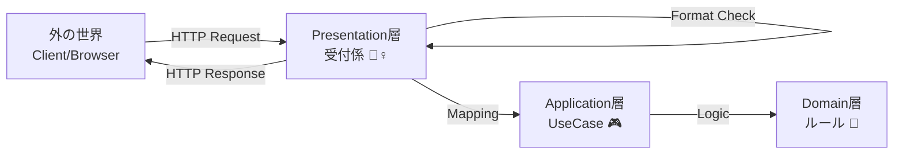

# 第06章：Presentation層入門🎨（UIは薄く）


この章は「**UIは“受付係”**」「**アプリ本体（UseCase）に仕事を渡す**」って感覚をつかむ回だよ〜😊📞
ゴールはこれ👇

* Presentation層が **“何をやる層”** なのか言えるようになる✨
* **薄いUI**（Controller/Endpointが太らない）を体験する🪶
* 画面/API都合（DTO）を **Domainに持ち込まない** 練習をする🙅‍♀️📦
* エラーを **APIっぽい形（ProblemDetails等）** に整える入口を作る⚠️📮

※ここで扱うベース環境は、今どきの **.NET 10（LTS）** で進めるよ〜（.NET 10 は 2025-11-11 リリースのLTS、サポートは 2028-11-14 まで）([Microsoft][1])
IDEは **Visual Studio 2026** 系が前提でOK（VS 2026 のリリースノートが公開されてる）([Microsoft Learn][2])

---

## 6-1. Presentation層って結局なに？🤔🎯


Presentation層の仕事は、ざっくり **「外の世界」と「アプリ本体」をつなぐ翻訳係** だよ😊✨
Web APIなら「HTTP ↔ UseCase」の通訳さん🗣️🔁

### ✅ Presentation層がやること（やってOK）🙆‍♀️

* リクエスト受け取り（URL/HTTPメソッド/ボディ）📩
* 入力の **形式チェック**（必須・文字数・型・JSONの形）✅
* DTO → コマンド/クエリへの変換（Mapping）🧩
* UseCase呼び出し（Application層へ）📞
* 結果をレスポンスへ変換（DTO化、HTTPステータス決め）📤
* 例外/エラーをHTTP向けに整形（ProblemDetailsなど）⚠️📮
* 認証/認可、ログ、レート制限など“入口の関心事”🔐🪵

### ❌ Presentation層がやっちゃダメ（やりがち）🙅‍♀️

* **業務ルール**（「期限は営業日だけ」みたいな本質ルール）をここに書く
* Domain Entityをそのまま返す（UI都合が混ざって壊れやすい）💥
* DBアクセスを直接やる（後で地獄）🗄️🔥
* HttpContext をApplication/Domainへ渡す（層の汚染）🧪

合言葉：**「UIは薄く、判断は内側へ」** 🪶➡️💎



---

## 6-2. “薄いUI”って、どれくらい薄いの？🪶✨


目安はこれ👇

### 👍 良い薄さ（理想）😊

* Endpoint/Controllerの中が **「受け取る→渡す→返す」** の3点セットだけ
* if文が増えるとしても **入力形式チェック** まで（業務ルールはしない）

### 👎 太いUI（危険）😵

* 「登録できる条件」をUIが全部判定してる
* 似たifがあちこちの画面/エンドポイントでコピペ増殖🧟‍♀️🧟‍♂️
* 後で仕様が変わるたびにUI全部修正になる🔧💦

---

## 6-3. DTOの考え方📦✨（画面/APIの都合を隔離する）


Presentation層には **DTO（Request/Response）** を置くのが基本だよ😊
DTOは「外に見せる形」だから、Domainとは別物でOK🙆‍♀️

例（ToDoの作成）👇

* Request：`title` が必須、最大50文字…みたいな **入口仕様** を表現
* Response：`id` と `title` と `isDone`…みたいな **返す形** を表現

---

## 6-4. プロジェクト/フォルダ配置のおすすめ📁🧠


Presentationプロジェクトの中は、こう分けるとスッキリするよ〜✨

* `Endpoints/`（または `Controllers/`）…入口
* `Dtos/` … Request/Response
* `Mapping/` … 変換だけ担当
* `Filters/` … 入力チェック（Minimal APIなら Endpoint Filter が便利）
* `ErrorHandling/` … 例外→HTTP整形
* `Auth/` `Logging/` … 入口の横断関心事

---

## 6-5. ハンズオン🛠️：Minimal APIで“薄いPresentation”を作る（ToDo題材）📝✨

ここは **Minimal API** でやるよ〜！（公式チュートリアルもこの流れだよ）([Microsoft Learn][3])
Controller派でも後半でミニ例を出すね😊

### ① Presentation側のDTOを作る📦

```csharp
// Todo.Presentation/Dtos/CreateTodoRequest.cs
namespace Todo.Presentation.Dtos;

public sealed record CreateTodoRequest(string Title, string? Note);

// Todo.Presentation/Dtos/TodoResponse.cs
namespace Todo.Presentation.Dtos;

public sealed record TodoResponse(Guid Id, string Title, string? Note, bool IsDone);
```

### ② Application層に「呼び出し口（UseCase）」を用意する📞🎮

※この章はPresentation集中なので、UseCaseは“仮のインメモリ実装”でOK👌
（保存の本格実装は後の章でやる感じにして、今はUIの薄さに集中〜🪶）

```csharp
// Todo.Application/UseCases/ITodoUseCases.cs
namespace Todo.Application.UseCases;

public sealed record CreateTodoCommand(string Title, string? Note);
public sealed record TodoDto(Guid Id, string Title, string? Note, bool IsDone);

public interface ITodoUseCases
{
    Task<TodoDto> CreateAsync(CreateTodoCommand cmd, CancellationToken ct);
    Task<TodoDto?> GetAsync(Guid id, CancellationToken ct);
    Task<IReadOnlyList<TodoDto>> ListAsync(CancellationToken ct);
}
```

インメモリ実装（学習用）👇

```csharp
// Todo.Application/UseCases/InMemoryTodoUseCases.cs
using System.Collections.Concurrent;

namespace Todo.Application.UseCases;

internal sealed class InMemoryTodoUseCases : ITodoUseCases
{
    private static readonly ConcurrentDictionary<Guid, TodoDto> Store = new();

    public Task<TodoDto> CreateAsync(CreateTodoCommand cmd, CancellationToken ct)
    {
        var id = Guid.NewGuid();
        var dto = new TodoDto(id, cmd.Title, cmd.Note, IsDone: false);
        Store[id] = dto;
        return Task.FromResult(dto);
    }

    public Task<TodoDto?> GetAsync(Guid id, CancellationToken ct)
        => Task.FromResult(Store.TryGetValue(id, out var dto) ? dto : null);

    public Task<IReadOnlyList<TodoDto>> ListAsync(CancellationToken ct)
        => Task.FromResult((IReadOnlyList<TodoDto>)Store.Values.OrderBy(x => x.Title).ToList());
}
```

DI登録（Application側に拡張メソッド）👇

```csharp
// Todo.Application/ServiceCollectionExtensions.cs
using Microsoft.Extensions.DependencyInjection;
using Todo.Application.UseCases;

namespace Todo.Application;

public static class ServiceCollectionExtensions
{
    public static IServiceCollection AddApplication(this IServiceCollection services)
    {
        services.AddSingleton<ITodoUseCases, InMemoryTodoUseCases>();
        return services;
    }
}
```

### ③ PresentationのProgram.cs（薄いEndpoint）✨🪶

```csharp
using Microsoft.AspNetCore.Mvc;
using Todo.Application;
using Todo.Application.UseCases;
using Todo.Presentation.Dtos;

var builder = WebApplication.CreateBuilder(args);

builder.Services.AddApplication();
builder.Services.AddEndpointsApiExplorer();
builder.Services.AddSwaggerGen();

// ProblemDetails & 例外ハンドリング（あとで 6-6 で実装するよ）
builder.Services.AddProblemDetails(); // ProblemDetailsサービス登録 :contentReference[oaicite:3]{index=3}
builder.Services.AddExceptionHandler<GlobalExceptionHandler>(); // IExceptionHandler方式 :contentReference[oaicite:4]{index=4}

var app = builder.Build();

app.UseExceptionHandler(); // 例外→ProblemDetailsに寄せる :contentReference[oaicite:5]{index=5}

app.UseSwagger();
app.UseSwaggerUI();

var todos = app.MapGroup("/todos").WithTags("Todos");

todos.MapPost("/", async (
        CreateTodoRequest req,
        ITodoUseCases useCases,
        CancellationToken ct) =>
    {
        // ここは“形式チェック”だけ（業務ルールは内側へ！）
        // ※より綺麗にするために、次の 6-5④ で Filter に移すよ🪶
        if (string.IsNullOrWhiteSpace(req.Title))
        {
            return Results.ValidationProblem(new Dictionary<string, string[]>
            {
                ["title"] = new[] { "title は必須だよ😊" }
            });
        }

        if (req.Title.Length > 50)
        {
            return Results.ValidationProblem(new Dictionary<string, string[]>
            {
                ["title"] = new[] { "title は50文字以内にしてね🙏" }
            });
        }

        var cmd = new CreateTodoCommand(req.Title.Trim(), req.Note?.Trim());
        var created = await useCases.CreateAsync(cmd, ct);

        var res = new TodoResponse(created.Id, created.Title, created.Note, created.IsDone);
        return Results.Created($"/todos/{created.Id}", res);
    })
    .WithName("CreateTodo")
    .Produces<TodoResponse>(StatusCodes.Status201Created)
    .ProducesValidationProblem();

todos.MapGet("/{id:guid}", async (Guid id, ITodoUseCases useCases, CancellationToken ct) =>
    {
        var todo = await useCases.GetAsync(id, ct);
        return todo is null
            ? Results.NotFound()
            : Results.Ok(new TodoResponse(todo.Id, todo.Title, todo.Note, todo.IsDone));
    })
    .WithName("GetTodo")
    .Produces<TodoResponse>(StatusCodes.Status200OK)
    .Produces(StatusCodes.Status404NotFound);

todos.MapGet("/", async (ITodoUseCases useCases, CancellationToken ct) =>
    {
        var list = await useCases.ListAsync(ct);
        var res = list.Select(x => new TodoResponse(x.Id, x.Title, x.Note, x.IsDone));
        return Results.Ok(res);
    })
    .WithName("ListTodos")
    .Produces<IEnumerable<TodoResponse>>(StatusCodes.Status200OK);

app.Run();

public sealed class GlobalExceptionHandler : Microsoft.AspNetCore.Diagnostics.IExceptionHandler
{
    private readonly IProblemDetailsService _problemDetails;
    private readonly ILogger<GlobalExceptionHandler> _logger;

    public GlobalExceptionHandler(IProblemDetailsService problemDetails, ILogger<GlobalExceptionHandler> logger)
    {
        _problemDetails = problemDetails;
        _logger = logger;
    }

    public async ValueTask<bool> TryHandleAsync(HttpContext httpContext, Exception exception, CancellationToken cancellationToken)
    {
        _logger.LogError(exception, "Unhandled exception");

        var status = exception switch
        {
            ArgumentException => StatusCodes.Status400BadRequest,
            _ => StatusCodes.Status500InternalServerError
        };

        httpContext.Response.StatusCode = status;

        var pd = new ProblemDetails
        {
            Status = status,
            Title = status == 400 ? "リクエストが不正だよ🥺" : "サーバー側でエラーが起きたよ💦",
            Detail = status == 400 ? exception.Message : "時間をおいて再試行してね🙏"
        };

        return await _problemDetails.TryWriteAsync(new ProblemDetailsContext
        {
            HttpContext = httpContext,
            ProblemDetails = pd
        });
    }
}
```

> `AddProblemDetails()` と `IExceptionHandler` を使う形は、最新のASP.NET Coreドキュメントでも案内されてるよ ([Microsoft Learn][4])

---

## 6-5④ 入力チェックを “Endpoint Filter” に追い出して、さらに薄くする🪶✨


Minimal APIには **Filter** があるよ〜！
「前後に共通処理を差し込む」「引数をチェックする」みたいな用途にピッタリ😊
（Minimal API filters は公式ドキュメントにあるよ）([Microsoft Learn][5])

フィルタ👇

```csharp
// Todo.Presentation/Filters/CreateTodoValidationFilter.cs
using Microsoft.AspNetCore.Http;
using Microsoft.AspNetCore.Routing;
using Todo.Presentation.Dtos;

namespace Todo.Presentation.Filters;

public sealed class CreateTodoValidationFilter : IEndpointFilter
{
    public async ValueTask<object?> InvokeAsync(EndpointFilterInvocationContext context, EndpointFilterDelegate next)
    {
        var req = context.GetArgument<CreateTodoRequest>(0);

        var errors = new Dictionary<string, string[]>(StringComparer.Ordinal);

        if (string.IsNullOrWhiteSpace(req.Title))
            errors["title"] = new[] { "title は必須だよ😊" };

        if (!string.IsNullOrEmpty(req.Title) && req.Title.Length > 50)
            errors["title"] = new[] { "title は50文字以内にしてね🙏" };

        if (errors.Count > 0)
            return Results.ValidationProblem(errors);

        return await next(context);
    }
}
```

Endpoint側は、こうして **もっと薄く** できるよ🪶✨

```csharp
using Todo.Presentation.Filters;

// MapPostの最後にこれを追加
.AddEndpointFilter<CreateTodoValidationFilter>();
```

これでEndpoint本体はほぼ「渡すだけ」になって気持ちいい😊🎉

---

## 6-6. エラーは “入口でHTTP向けに整える” ⚠️📮（ProblemDetails）


Web APIでよくある悩み👇

* 例外がそのまま500で落ちる💥
* エラー形式がバラバラでフロントが泣く😭

そこで **ProblemDetails** を使うと整うよ〜✨
`AddProblemDetails()` でサービス登録して、例外は `IExceptionHandler` でまとめるのが最近の流れだよ ([Microsoft Learn][4])

この章ではまず「全部ここで受けて最低限整える」でOK👌
Domain/Applicationのエラー分類を本格化するのは後半章で強化できるよ💪🔥

---

## 6-7. “薄いPresentation”の鉄板ルール集📌✨

* **HTTPのことはPresentationだけ**（ステータス/ヘッダー/ProblemDetails）🌐
* **DTOはPresentationに置く**（Domainに置かない）📦
* **入力チェックは形式まで**（業務ルールはUseCase/Domainへ）✅➡️💎
* **Mappingは分離**（増えると地味に効く）🧩
* **キャンセルは流す**（`CancellationToken`）🧯
* **ログは入口で取る**（でも業務の判断ログは内側でも）🪵

---

## 6-8. よくある事故あるある💥😂（と直し方）

### 事故①：Controller/Endpointが肥大化🍔

**症状**：ifが50個、画面都合が混ざる、同じ判定が他にもある
**対策**：

* 入力形式はFilterへ🪶
* 変換はMapperへ🧩
* 業務ルールはUseCase/Domainへ💎

### 事故②：Domainモデルをそのまま返しちゃう😇

**症状**：UIに合わせたプロパティ追加→Domainが汚れる
**対策**：Response DTO を必ず作る📦✨

### 事故③：HttpContextを内側に渡す🧪

**症状**：テストしづらい／層が溶ける
**対策**：必要情報だけDTOやコマンドに詰め替える📮

---

## 6-9. ミニ課題🎒✨（手を動かすと身につく！）

1. `PUT /todos/{id}/done` を追加してみよう✅

* Presentation：ルーティング・id受け取り・レスポンス整形
* UseCase：`MarkDone(id)` 的なメソッド追加
* ルールはUseCase側に寄せる（例：存在しなければNotFound）

2. `title` のトリムや空白系の扱いを統一しよう🧼

* Presentationで “入力の整形” をするのはOK（形式側の都合だから）😊

---

## 6-10. 章末チェックリスト✅🎀

* [ ] Endpoint/Controllerが「受け取る→渡す→返す」になってる？🪶
* [ ] DTOをDomainに置いてない？📦
* [ ] 業務ルールをPresentationに書いてない？🙅‍♀️
* [ ] エラー形式が揃ってる？（ProblemDetailsなど）⚠️
* [ ] Mappingの置き場が決まってる？🧩

---

## 6-11. AI（Copilot/Codex）に頼るプロンプト例🤖✨

コピペでどうぞ〜😊💕

* **薄さレビュー**
  「このProgram.cs（Minimal API）のEndpointが太くなってないかレビューして。Presentation層に置くべきでない処理（業務ルール・永続化・ドメイン判断）が混ざってたら具体的に指摘して、Filter/Mapper/UseCaseへ分離する案を出して」

* **DTO設計レビュー**
  「Request/Response DTOがUI都合に寄りすぎてDomainを汚していないか、境界の観点で改善案を出して」

* **エラー整形レビュー**
  「ProblemDetailsの設計を、フロントが扱いやすい形（title/detail/instance/errors等）に整える改善案を提案して」

---

次の第7章では、いよいよ **Application層（UseCaseの置き場）** をガッツリ作って「UIが薄くなる理由」を体感するよ〜🎮✨

[1]: https://dotnet.microsoft.com/ja-jp/platform/support/policy/dotnet-core?utm_source=chatgpt.com ".NET および .NET Core の公式サポート ポリシー"
[2]: https://learn.microsoft.com/en-us/visualstudio/releases/2026/release-notes?utm_source=chatgpt.com "Visual Studio 2026 Release Notes"
[3]: https://learn.microsoft.com/en-us/aspnet/core/tutorials/min-web-api?view=aspnetcore-10.0&utm_source=chatgpt.com "Tutorial: Create a Minimal API with ASP.NET Core"
[4]: https://learn.microsoft.com/en-us/aspnet/core/fundamentals/error-handling-api?view=aspnetcore-10.0&utm_source=chatgpt.com "Handle errors in ASP.NET Core APIs"
[5]: https://learn.microsoft.com/en-us/aspnet/core/fundamentals/minimal-apis/min-api-filters?view=aspnetcore-10.0&utm_source=chatgpt.com "Filters in Minimal API apps"

