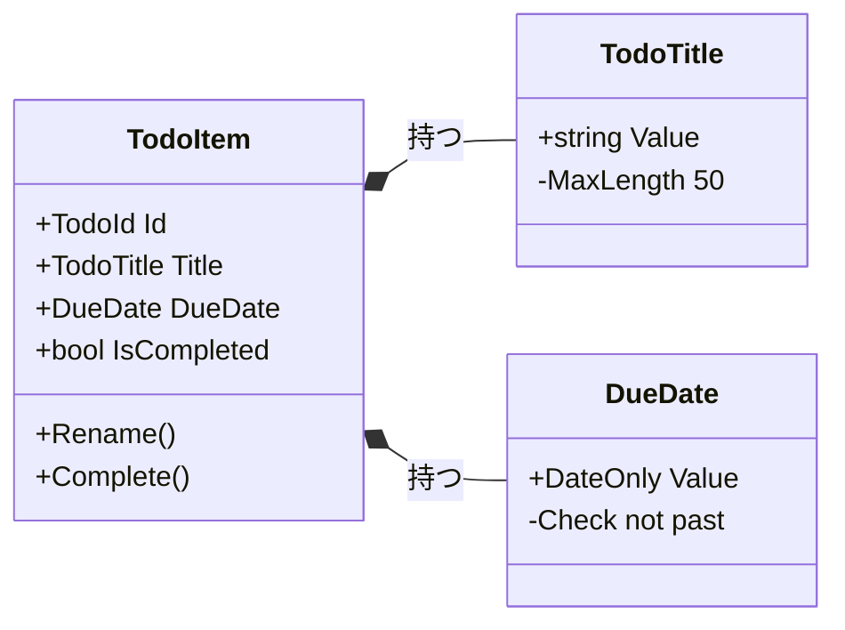

# 第08章：Domain層入門①💎（モデルとルール）


この章は「Domain層って何を置くの？」「EntityとValueObjectって何が違うの？」を、**いちばんやさしく**体験していく回だよ〜😊✨
**結論：Domain層は“アプリの世界のルール”を守る場所**！そしてコツは **「無効な状態を作らない」** だよ🔒💕

（ミニ最新メモ📌：いまは **.NET 10 がLTS** で、**C# 14 は .NET 10 でサポート**、Visual Studio も **2026系** が出てるよ〜🧠✨ ([Microsoft][1])）

---

## 🎯 この章でできるようになること

* Domain層の役割を「言葉」で説明できる🗣️✨
* **Entity / ValueObject** を見分けられる👀
* ルール（制約）を **Domainに寄せる理由** がわかる💡
* **“無効な状態を作らない”** を C# で体験できる🔒✨

---

## 8.1 Domain層ってなに？💎（いちばん大事な箱）

Domain層は、ざっくり言うと…

✅ **“このアプリの世界では、こうあるべき”** を置く場所
✅ **データ＋ルール（振る舞い）** を置く場所
✅ 画面・DB・通信みたいな「外側の都合」を持ち込まない場所🚫

たとえば ToDoアプリなら、こんな“世界のルール”があるよね👇

* タイトルは空っぽ禁止🙅‍♀️
* 期限が過去はダメ（運用的にダメなら）⏳
* 完了したら「完了日時が入る」みたいな整合性📌

こういうのを **画面側（Presentation）やApplication層でバラバラにチェックし始める** と、すぐ事故る💥
だから **Domainが責任を持って守る** のが超大事だよ〜😊✨

---

## 8.2 Entity と ValueObject を超やさしく🍰


## ✅ Entity（エンティティ）

* **“同一性（アイデンティティ）”がある**
* 中身が変わっても「同じもの」として追いかけたい👣

例：ToDo の「1件」
タイトル変えても、期限変えても、その ToDo はその ToDo だよね📝✨
→ だから **ID（識別子）** を持つことが多いよ！

## ✅ ValueObject（値オブジェクト）

* **“値そのもの”が本体**
* 同じ値なら同じもの（等価）として扱いたい🎀
* できれば **不変（immutable）** が気持ちいい✨

例：ToDoタイトル、メールアドレス、金額、期間、住所…
「タイトル」という値は “ただのstring” に見えるけど、実は **ルール付きの値** だったりするよね😊

---

## 8.3 “無効な状態を作らない” 🔒✨（この章の主役）


初心者が一番やりがち事故👇

💥 「とりあえず string と int で持っといて、あとで画面でチェックすればいいや」

これ、最初はラクなんだけど…
そのうち **別画面・別API・別バッチ** が増えて、チェック漏れして壊れる😇

だから発想を逆にするよ！

✅ **不正な値が“そもそも作れない”ようにする**
✅ **不正な操作が“できない”ようにする**

これが **Domain層の強さ** だよ〜💪✨

---

## 8.4 ハンズオン：ToDoドメインを作ってみよう🧪📝

ここでは “最小のドメイン” を作るよ！
（Entity＝ToDoItem、ValueObject＝Title / DueDate / Id みたいなイメージ）

---

## 8.4.1 Domain例外（Domainが怒る言葉）😡➡️🙂

まず、Domainがルール違反を検知したときの“専用エラー”を用意しよう。

```csharp
namespace MyApp.Domain;

public class DomainException : Exception
{
    public DomainException(string message) : base(message) { }
}
```

> 例外を使う/使わない問題は後の章で整えるとして、今は「Domainが自分の言葉で怒れる」だけでOK👌✨

---

## 8.4.2 ValueObject：ToDoタイトル（空は禁止！）📝🚫

タイトルは string だけど、ルールがあるよね！
だから ValueObject にしてしまう😊✨

```csharp
namespace MyApp.Domain.Todos;

public readonly record struct TodoTitle
{
    public string Value { get; }

    public TodoTitle(string value)
    {
        value = (value ?? "").Trim();

        if (value.Length == 0)
            throw new DomainException("タイトルは空にできません🥺");

        if (value.Length > 50)
            throw new DomainException("タイトルは50文字までだよ〜📏");

        Value = value;
    }

    public override string ToString() => Value;
}
```

ポイント🌟

* 作る瞬間にチェックする（= 無効な状態を作らない）🔒
* record struct だから「値として等価」になりやすい🎀

---

## 8.4.3 ValueObject：期限（過去はダメにする例）⏳🚫




「過去がダメ」はアプリ次第だけど、今回は“例”として入れるね😊

```csharp
namespace MyApp.Domain.Todos;

public readonly record struct DueDate
{
    public DateOnly Value { get; }

    public DueDate(DateOnly value, DateOnly today)
    {
        if (value < today)
            throw new DomainException("期限に過去日は指定できません⏳💦");

        Value = value;
    }

    public override string ToString() => Value.ToString();
}
```

ここで超大事な気づき👀✨

* Domainの中で「今日」を直接 DateTime.Now で取ると、テストしづらくなる💦
* だから今回は **today を外から渡す** 形にしてるよ（この考え方、あとでDIやテストで効いてくる！）🧩✨

---

## 8.4.4 Entity：ToDoItem（状態とルールをまとめる）🧱💎


Entityは「同一性」が大事だから ID を持たせるよ！

```csharp
namespace MyApp.Domain.Todos;

public readonly record struct TodoId(Guid Value)
{
    public static TodoId NewId() => new(Guid.NewGuid());
    public override string ToString() => Value.ToString();
}

public class TodoItem
{
    public TodoId Id { get; }
    public TodoTitle Title { get; private set; }
    public DueDate? DueDate { get; private set; }

    public bool IsCompleted { get; private set; }
    public DateTimeOffset? CompletedAt { get; private set; }

    public TodoItem(TodoId id, TodoTitle title, DueDate? dueDate)
    {
        Id = id;
        Title = title;
        DueDate = dueDate;
    }

    public void Rename(TodoTitle newTitle)
    {
        // ルールが増えるならここに書ける✨
        Title = newTitle;
    }

    public void ChangeDueDate(DueDate? newDueDate)
    {
        // 例：完了後は期限変更できない、などもここで制御できるよ😊
        if (IsCompleted)
            throw new DomainException("完了後の期限変更はできません🙅‍♀️");

        DueDate = newDueDate;
    }

    public void Complete(DateTimeOffset now)
    {
        if (IsCompleted)
            throw new DomainException("すでに完了してます✅");

        IsCompleted = true;
        CompletedAt = now;
    }
}
```

ここが “Domainっぽさ” 💎✨

* 完了状態の整合性（完了なら CompletedAt が入る）を **Entityが守る**
* 期限変更の禁止など、操作ルールも **Entityが守る**
* だから「どこから呼ばれても壊れにくい」🛡️

---

## 8.5 ありがち事故あるある集😇（Domainを汚さない）


## 🚫 事故1：Domainに画面都合の項目を混ぜる

例：「画面で赤く表示したいから IsRed 追加」とか
→ それは Presentation の都合だよ〜🎨💦

## 🚫 事故2：DomainにDB都合を混ぜる

例：Entityに ORマッパー依存の属性ベタ貼り、DBのカラム名最優先の命名…
→ DBはInfrastructure側の都合だよ〜🗄️💦

## ✅ 迷ったら合言葉

**「それ、世界のルール？それとも外側の都合？」** 🧠✨

---

## 8.6 AI相棒（Copilot/Codex）で爆速チェック🤖✨

この章はAIがめちゃ相性いいよ〜！💕

## ✅ 生成に使うプロンプト例（そのまま投げてOK）

* 「TodoTitle という ValueObject を作って。空白禁止、最大50文字、Trim必須。DomainException を投げてね。」
* 「TodoItem Entity を作って。Complete() は二重完了を禁止、完了時刻を必ず入れる設計にして。」

## ✅ レビューに使うプロンプト例（ここが強い）

* 「このDomainモデル、無効な状態を作れる穴がないか探して！」
* 「string/int のままの値で、ValueObject化した方がいい候補を指摘して！」
* 「DomainにUI/DB都合が混ざってないかチェックして！」

Visual Studio 2026 側でも Copilot 周りの統合がどんどん強化されてるので、**“AIに設計レビューさせる癖”** を今から付けると伸びるよ〜😊✨ ([Microsoft Learn][2])

---

## 章末まとめ🌸（今日のキモ）

* Domain層は **世界のルールを守る場所** 💎
* Entity＝同一性、ValueObject＝値そのもの🎀
* 最重要は **「無効な状態を作らない」** 🔒✨

---

## ✅ チェックリスト（この章のゴール確認）

* [ ] タイトル空っぽを「画面チェック」じゃなく「Domainで禁止」にできた？
* [ ] ValueObject を “ただのstring” から独立させられた？
* [ ] 完了状態の整合性（CompletedAt）を Entity が守ってる？
* [ ] 「今日」や「現在時刻」を Domain に直書きせず、外から渡す形を意識できた？

---

## 💪 ミニ課題（10〜20分）🕒✨

1. TodoTitle のルールをもう1個追加してみて（例：禁止ワード、先頭が「!」禁止など）🙅‍♀️
2. TodoItem に「Reopen（完了取り消し）」を追加して、整合性を守ってみて🔁
3. AIに「穴探しレビュー」をさせて、指摘されたら1個だけ直してみて🤖🛠️

---

次の第9章では、いよいよ「貧血モデル（ただの入れ物）」から卒業して、**“振る舞いがあるドメイン”** を育てるよ〜🧠✨

[1]: https://dotnet.microsoft.com/en-us/platform/support/policy/dotnet-core ".NET and .NET Core official support policy | .NET"
[2]: https://learn.microsoft.com/en-us/visualstudio/releases/2026/release-notes "Visual Studio 2026 Release Notes | Microsoft Learn"

