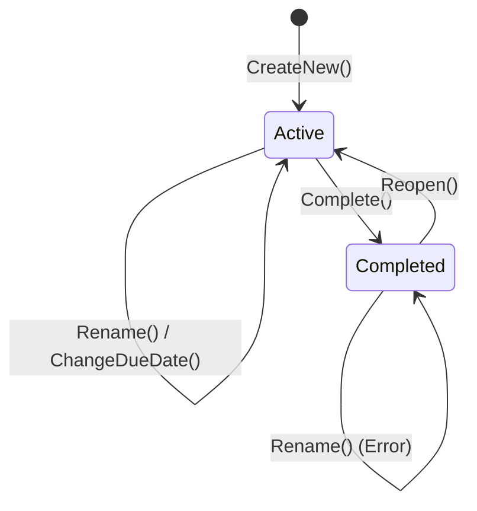

# 第09章：Domain層入門②🧠（振る舞いを持たせる）


この章のゴールはこれ！🎯
**「Domain＝データ＋ルール＋振る舞い」**を体で覚えて、**貧血モデル（ただのDTO）から卒業**するよ〜！🌸✨

ちなみに今どき環境だと、**C# 14 が最新で .NET 10 上で動く**よ（Visual Studio 2026 に .NET 10 SDK が同梱）🆕✨ ([Microsoft Learn][1])
.NET 10 の最新版SDK（10.0.2）は **2026-01-13** 更新だったよ📅 ([Microsoft][2])

---

## 1) 「貧血モデル」ってなに？🥲


**貧血モデル（Anemic Domain Model）**はざっくり言うと、

* Entity が **プロパティだけ**
* ルール（バリデーションや状態遷移）が **Application層やUI層に散らばる**
* 「どこが正しいルール？」が迷子になる😵‍💫

って状態のこと！

### ありがちな例（よくある事故）💥

* Todo のタイトルが空でも保存できる
* 完了済みなのに「期限変更」できる
* 禁止したい状態がいくらでも作れる

つまり… **「無効な状態を作れちゃう」**のが最大の問題😇💣

---

## 2) Domainに「振る舞い」を入れると何が嬉しい？😊✨

Domainに振る舞い（メソッド）を持たせると…

* ✅ ルールが **1箇所に集まる**
* ✅ 無効な状態を **そもそも作れない**
* ✅ テストが **めちゃ簡単**（第19章で爆発するご褒美🍰）
* ✅ Application層が薄くなる（手順書っぽくなる📋）

---

## 3) 振る舞いの入れ方：基本ルール3つ🧩

### ルール①：プロパティは“勝手に”いじれないようにする🔒


* `set` を `private` にする
* 変更は **必ずメソッド経由**にする（＝ルールを通す）✨

### ルール②：状態が変わる操作は「動詞メソッド」にする🏃‍♀️


* `Rename(...)`
* `Complete(...)`
* `ChangeDueDate(...)`

みたいに、「何をしたいか」が見える名前にするのがコツ👀✨

### ルール③：不正ならDomainが止める✋

* 例外でもOK（章18でエラー設計を整理するよ⚠️）
* もしくは Result型でもOK（好み）

この章では理解しやすく **例外**でいくね😊

---

## 4) 実装してみよう！ToDoのDomainモデル🧠✨

ここからは「ToDo」を題材に、**貧血→卒業**の流れを作るよ〜📚🌸

### 4-1) まずは「貧血モデル」例（やめたい形）🥲

```csharp
// ❌ ただの箱。どこでも自由にいじれてしまう…
public class TodoItem
{
    public Guid Id { get; set; }
    public string Title { get; set; } = "";
    public bool IsCompleted { get; set; }
    public DateOnly? DueDate { get; set; }
}
```

これだと、UIでもApplicationでもInfrastructureでも、誰でも自由に…

* `Title = ""` とか
* `IsCompleted = true` のまま `DueDate = ...` とか

できちゃうよね😇💥

---

## 5) 改善：ValueObjectで「Title」を守る🛡️✨

「タイトルは空ダメ」「長すぎダメ」みたいな**小さくて強いルール**は ValueObject が得意💎

```csharp
public sealed class TodoTitle
{
    public const int MaxLength = 100;

    public string Value { get; }

    private TodoTitle(string value) => Value = value;

    public static TodoTitle Create(string value)
    {
        if (string.IsNullOrWhiteSpace(value))
            throw new DomainException("タイトルは必須だよ📝");

        var trimmed = value.Trim();

        if (trimmed.Length > MaxLength)
            throw new DomainException($"タイトルは{MaxLength}文字までだよ✂️");

        return new TodoTitle(trimmed);
    }

    public override string ToString() => Value;
}
```

ValueObject化のいいところ👇😊

* 「Titleは必ず正しい」状態でしか存在しない✅
* いろんな場所で同じバリデーションを書かなくて済む✅

---

## 6) 改善：Entityに「振る舞い」を持たせる✊✨

次に Entity（TodoItem）を、**状態遷移を管理できる子**に育てるよ🪴

```csharp
public sealed class TodoItem
{
    public Guid Id { get; }
    public TodoTitle Title { get; private set; }
    public bool IsCompleted { get; private set; }
    public DateOnly? DueDate { get; private set; }

    private TodoItem(Guid id, TodoTitle title)
    {
        Id = id;
        Title = title;
        IsCompleted = false;
    }

    public static TodoItem CreateNew(string title)
        => new TodoItem(Guid.NewGuid(), TodoTitle.Create(title));

    public void Rename(string newTitle)
    {
        EnsureNotCompleted("完了済みのTodoは名前を変えられないよ🧊");
        Title = TodoTitle.Create(newTitle);
    }

    public void Complete()
    {
        if (IsCompleted) return; // 二重完了は無害にしておく（好みで例外でもOK）
        IsCompleted = true;
    }

    public void Reopen()
    {
        if (!IsCompleted) return;
        IsCompleted = false;
    }

    public void ChangeDueDate(DateOnly? dueDate)
    {
        EnsureNotCompleted("完了済みのTodoは期限を変えられないよ🧊");
        DueDate = dueDate;
    }

    private void EnsureNotCompleted(string message)
    {
        if (IsCompleted)
            throw new DomainException(message);
    }
}
```

### ここで超重要ポイント💡


* `private set;` にしたから、外から `IsCompleted = true` とかできない🙅‍♀️
* 更新は `Complete()` や `Rename()` を通るから、**ルールが必ず通る**✅
* “無効な状態”が作れなくなる🔒✨



---

## 7) Domain例外（最小セット）⚠️

章18で「例外をどう扱う？」はちゃんとやるけど、今は最小でOK👌

```csharp
public sealed class DomainException : Exception
{
    public DomainException(string message) : base(message) { }
}
```

---

## 8) Application層はどう薄くなる？📋✨（ちょい見せ）


Domainに振る舞いがあると、Application層は「手順」だけになるよ😊

```csharp
public sealed class CompleteTodoUseCase
{
    private readonly ITodoRepository _repo;

    public CompleteTodoUseCase(ITodoRepository repo) => _repo = repo;

    public async Task ExecuteAsync(Guid todoId)
    {
        var todo = await _repo.GetAsync(todoId)
                   ?? throw new InvalidOperationException("Todoが見つからないよ😢");

        todo.Complete(); // ✅ ルールはDomainが面倒見る

        await _repo.SaveAsync(todo);
    }
}
```

いいねポイント👇✨

* 「完了のルール」は UseCase に書かなくてOK
* UseCaseは **読むだけで流れがわかる**📖🌸

---

## 9) ミニ演習（手を動かすよ〜！🖐️✨）

### 演習A：禁止ルールを1個追加してみよう🚫

例：

* 期限は「今日より前」禁止（過去日はダメ🙅‍♀️）
* 完了済みは「Reopenしたら期限を消す」など

→ 追加先は **Domain** だよ！🎯

### 演習B：貧血モデル撲滅チャレンジ🔥

あなたの既存クラスで、

* `public set;` が多い子
* Application層に `if (xxxxx) throw ...` が散ってる子

を見つけて、**Domainメソッドへ吸い上げ**してみてね🧲✨

---

## 10) AI（Copilot/Codex）に頼るときのプロンプト例🤖💡

AIに投げると、油断するとDTO寄りになりがちなので、最初に釘を刺すのがコツだよ🔨✨

### レビュー用プロンプト✅

* 「この Domain モデルが貧血になってないかチェックして。**public set を減らして、状態遷移をメソッド化**して」
* 「無効な状態（空タイトル、完了後の期限変更など）を**作れない設計**になってるか見て」

### テスト生成プロンプト🧪

* 「`TodoItem` の `Rename/Complete/ChangeDueDate` の仕様から、**落ちるべきケース**（例外になるケース）を含めて xUnit テストを書いて」

---

## 章末チェックリスト✅✨（これだけ見ればOK）

* [ ] Entityの重要プロパティが `public set;` になってない？🔒
* [ ] ルールがApplication層に散ってない？（`if` が多すぎない？）🧹
* [ ] 「状態が変わる操作」が `Rename/Complete` みたいな動詞メソッドになってる？🏃‍♀️
* [ ] 無効な状態を “作れない” になってる？（作ってから弾く、じゃなくて）🛡️
* [ ] Domainは外の都合（画面の形、DB都合）を知らない？🚫

---

次の第10章では、**DTOとDomainの境界変換**をやるよ📦✨
「画面の形をDomainに持ち込まない」っていう、事故防止の超重要ポイントに入っていくよ〜！🧯🔥

[1]: https://learn.microsoft.com/en-us/dotnet/csharp/whats-new/csharp-14?utm_source=chatgpt.com "What's new in C# 14"
[2]: https://dotnet.microsoft.com/en-US/download/dotnet/10.0?utm_source=chatgpt.com "Download .NET 10.0 (Linux, macOS, and Windows) | .NET"

