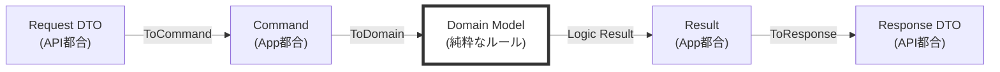

# 第10章：DTOと境界変換📦（画面の形をDomainに入れない）


この章、めっちゃ大事です…！🥹💖
レイヤードで「キレイに分けたはずなのに、いつの間にかドメインが画面都合まみれ」って事故を防ぐ回だよ〜🚧💥

---

## 0. この章でゴールにしたいこと🎯✨

読み終わったら、こんな状態になってるのが理想！😊

* DTOって何で必要なのか、**説明できる**📦
* 「Domainモデル」と「DTO」を**混ぜない習慣**がつく🧼
* 変換（Mapping）を**どこに置くか迷わない**🧭
* DTOが増えても**散らからない整理術**がわかる🧹✨
* AI（Copilot/Codex）で**変換コードをラクに作って、でも設計は崩さない**🤖🧠

---

## 1. DTOってなに？📦（超ざっくりでOK！）

DTO（Data Transfer Object）は、いってしまえば

> 「境界をまたぐときの、運搬用の箱」📦🚚

です！

* **UI ⇄ API** のやりとり
* **Presentation ⇄ Application** のやりとり
* 外部サービスとの連携 などなど

「境界」をまたぐときに、**必要な形だけ**を運ぶために使うよ😊✨

Microsoftのドキュメントでも、DBエンティティをそのまま外に出すのは良くないことがあるよ〜って話が出てくるよ。([Microsoft Learn][1])

---

## 2. なぜDTOが必要？（Domainを守るため💎🛡️）

DTOがないと、だいたいこうなる👇💥

* 画面都合の項目（表示用の文字列、チェックボックス、画面専用フラグ）が **Domainに侵入**😇➡️😱
* APIの仕様変更が **Domainモデルの変更**になってしまう🌀
* そのうち「このプロパティ何のため？」が増える🥲

DTOを使うと嬉しいことは、特にこの3つが強い💪✨

### ① セキュリティ（Overposting対策）🔐

「送ってほしくない項目」まで受け取っちゃう事故を減らせるよ！
ASP.NET Coreでも、Overposting対策として **ViewModel（＝DTO的なもの）推奨**って書かれてる👍([Microsoft Learn][2])

### ② API/UIの“形”とDomainの“意味”を分離できる🧠✂️

* DTOは **都合の形**（表示・通信・入力フォーム）
* Domainは **意味とルール**（正しい状態・不変条件）

これが分かれると、強い✨

### ③ 変更に強くなる🧱

DTOの変更＝契約（外との約束）の変更
Domainの変更＝業務ルールの変更
…って分かれると、影響範囲が小さくなるよ😊

---

## 3. DTOの種類を整理しよ📦📦📦（これで迷子にならない）

DTOって一口に言っても、用途があるよ〜✨

* **Request DTO**：受け取る用（例：CreateTodoRequest）
* **Response DTO**：返す用（例：TodoResponse）
* **ViewModel**：画面専用（MVCやフロント向けに整形）
* **Command/Query**：Application層の入出力（ユースケースの言葉）
* **Integration DTO**：外部API連携用（相手の仕様に合わせる）
* **Persistence Model**：DB都合（※これはInfrastructureで扱うことが多い）

ポイントはこれ👇💡
**「DTOは“目的別に分ける”ほど安全」**🛡️✨
「万能DTO」を作ると、だいたい育って神クラス化するよ😇💥

---

## 4. 変換（Mapping）をどこに置く？🧩（ここが第10章の芯！）

### 結論：**“境界の近く”に置く**🚪✨

境界の近く＝「その形を知っていい場所」だよ！

#### ✅ 基本ルール（迷ったらこれ！）

* **Presentation**：Request/Response DTO ⇄ Application入力（Command/Query）
* **Application**：UseCase入力 ⇄ Domainモデル（必要なら）
* **Domain**：DTOを知らない🙅‍♀️（ここが超重要💎）

> Domainは「画面の形」「APIの形」「DBの形」を知らないのが美しい✨



---

## 5. ハンズオン：ToDoでDTOと変換を体験しよ🐟📝✨

ここでは分かりやすく **Minimal API**っぽい形で例を出すね！
（Minimal API自体は公式チュートリアルもあるよ🧑‍🏫）([Microsoft Learn][3])

### 🎬 シナリオ：ToDoを追加する

* クライアント → API：`CreateTodoRequest`
* Application：`CreateTodoCommand`
* Domain：`TodoItem` を生成（ルールで守る🔒）
* API → クライアント：`TodoResponse`

---

### 5-1. Presentation側DTO（受け取り用・返す用）📦✨

```csharp
// Presentation層（例: *.Presentation）
// 受け取り用（入力フォームの形）
public sealed record CreateTodoRequest(
    string Title,
    string? Note
);

// 返す用（表示したい形）
public sealed record TodoResponse(
    Guid Id,
    string Title,
    string? Note,
    bool IsDone
);
```

> recordはDTOに相性いいよ〜😊（“運搬用”だから）📦✨
> ちなみにC#の最新は C# 14（.NET 10対応）だよ。([Microsoft Learn][4])

---

### 5-2. Application側（ユースケースの言葉）🎮📋

```csharp
// Application層（例: *.Application）
public sealed record CreateTodoCommand(
    string Title,
    string? Note
);

public interface ITodoService
{
    Task<TodoResult> CreateAsync(CreateTodoCommand command, CancellationToken ct);
}

public sealed record TodoResult(
    Guid Id,
    string Title,
    string? Note,
    bool IsDone
);
```

ここで大事なのは👇
**Applicationの入出力は “ユースケースの言葉”**📋✨
APIの都合（JSONの形）とは切り離すよ〜😊

---

### 5-3. Domain（意味とルールの世界）💎🔒

```csharp
// Domain層（例: *.Domain）
public sealed class TodoItem
{
    public Guid Id { get; }
    public string Title { get; private set; }
    public string? Note { get; private set; }
    public bool IsDone { get; private set; }

    private TodoItem(Guid id, string title, string? note)
    {
        if (string.IsNullOrWhiteSpace(title))
            throw new ArgumentException("Titleは必須だよ！", nameof(title));

        Id = id;
        Title = title.Trim();
        Note = note;
        IsDone = false;
    }

    public static TodoItem CreateNew(string title, string? note)
        => new(Guid.NewGuid(), title, note);

    public void MarkDone() => IsDone = true;
}
```

✅ DomainはDTOを一切知らない！
これが **“守りの強さ”** になるよ🛡️💎

---

## 6. 変換はどう書く？（まずは手書きが最強✍️✨）

初心者のうちは、まず **手書きマッピング推奨**！✍️
理由は「何がどこへ流れてるか」が体に入るから😊

### 6-1. Presentation → Application（境界変換）🚪📦

```csharp
// Presentation層に置くのが分かりやすい（DTOの形を知っていい場所）
public static class TodoMappings
{
    public static CreateTodoCommand ToCommand(this CreateTodoRequest req)
        => new(req.Title, req.Note);

    public static TodoResponse ToResponse(this TodoResult result)
        => new(result.Id, result.Title, result.Note, result.IsDone);
}
```

### 6-2. Application → Domain（必要なら）🧩💎

「ApplicationがDomain生成の入口になる」イメージ✨

```csharp
// Application層（Domainを組み立てるのはOK）
public static class DomainMappings
{
    public static TodoItem ToDomain(this CreateTodoCommand cmd)
        => TodoItem.CreateNew(cmd.Title, cmd.Note);
}
```

---

## 7. DTOが増えた時の整理術🧹✨（散らからない仕組み）

DTOが増えるときは、だいたいこの2パターンで増えるよ📈

* 画面やAPIが増える（表示項目が違う）📱🖥️
* 外部連携が増える（相手仕様が違う）🌍🔌

### ✅ おすすめ整理ルール（すぐ効く！）

* **機能（Feature）単位でフォルダを切る**📁✨
  例：`Todos/Create/` `Todos/List/` `Todos/Detail/`
* **Request/Responseを分ける**（同じDTOを使い回さない）🧠✂️
* **Mappingも同じFeature内に置く**（迷子防止）🧭

---

## 8. 自動マッピングどうする？🤖✨（使いどころが大事！）

### 8-1. AutoMapperについて（2026時点の注意点⚠️）

AutoMapperは便利なんだけど、**v15からライセンスが必要**になってるよ。([docs.automapper.io][5])
NuGetの最新版としては 16.0.0 などが出てる（時期によって変わる）よ。([NuGet][6])

> 学習用・小規模なら手書きで十分✨
> 仕事で使うなら、チームの方針とライセンスを要確認だよ〜🧐

### 8-2. いま人気の流れ：Source Generator系（例：Mapperly）⚡

Mapperlyは **ビルド時にマッピングコードを生成**してくれるタイプ！
公式でも「source generator」「高速」「生成コードが読める」って説明されてるよ。([Mapperly][7])

（おまけ）「ランタイム魔法」より「生成されたコードが読める」方が、設計学習には相性よいこと多いよ😊✨

---

## 9. よくある事故パターン集🚑💥（先に潰す！）

### ❌ 事故①：DomainにDTOを置く

* Domainが「画面の形」を知ってしまう
  → 将来、画面都合でDomainが壊れる😇💥

### ❌ 事故②：DTOを“共通化”して全画面で使う

* 「一覧に要る項目」と「詳細に要る項目」が違うのに同じ箱で運ぶ
  → DTOが肥大化してカオス化📦🐘

### ❌ 事故③：Controller/Endpointで全部やる（薄くない）

* Validation
* Mapping
* UseCase
* 例外処理
* ログ
  …が全部入り、すぐ太る🐷💥

👉 変換はOKだけど、**“変換だけ”**にしようね✨

---

## 10. 章末ミニ演習🎓📝✨（手を動かすと定着する！）

### 演習A：DTOを分けてみよう📦

* `CreateTodoRequest` と `TodoResponse` を作る
* Domainには入れない（入れたくなったら負け😇）

### 演習B：表示都合の項目を足してもDomainを汚さない🌸

例：Responseに `StatusText`（"未完了"/"完了"）を追加
→ これ、Domainに持ち込まないでResponse側で作れる？😊

### 演習C：マッピングのユニットテスト🧪

「Titleが空ならDomainで弾かれる」をテストしてみよう✨

---

## 11. 章末チェックリスト✅✨（これ通ったら勝ち！）

* [ ] Domain層にDTOが1個もいない🙅‍♀️💎
* [ ] Request/Response DTOを分けてる📦📦
* [ ] 変換コードが“境界の近く”にある🚪✨
* [ ] DTOが肥大化してきたらFeature単位に整理できる📁🧹
* [ ] 「画面都合の項目」をDomainに入れずに済む😊🌸

---

## 12. よくある質問Q&A🙋‍♀️💬

### Q1. DTOって絶対必要？小さいアプリでも？

小さいうちは「最小限でOK」だよ😊
でも、**境界（外と約束）があるならDTOは強い**！
特にAPIは後から仕様が変わりやすいから、DTOあると守りが固い🛡️✨

### Q2. “ApplicationのCommand”もDTOみたいなもの？

そうそう！😊
ただし役割が違うよ👇

* Request DTO：外との約束（入力の形）
* Command/Query：ユースケースの言葉（中の手順の入口）

### Q3. 変換コード、どこに置くか毎回迷う…

迷ったらこれ！👇
**「その“形”を知っていい場所に置く」**🚪✨
APIの形はPresentation、ユースケースの形はApplication、Domainは知らない🙅‍♀️💎

---

## 13. AI活用プロンプト例🤖✨（便利だけど主導権はこっち！）

### ✅ DTO設計を相談する

```text
ToDo追加APIを作っています。
Domain(TodoItem)を汚さずに、Request/Response DTOを分けたいです。
DTOの設計案と、各層（Presentation/Application/Domain）に置くべき型を提案して。
ついでに「やりがちな事故」も指摘して。
```

### ✅ マッピングコードを生成してもらう（でもレビュー必須！）

```text
CreateTodoRequest → CreateTodoCommand → TodoItem の変換を手書きで作りたい。
拡張メソッド or Mapperクラスの形で、読みやすい実装を出して。
置き場所は「境界の近く」を守って。
```

### ✅ レイヤー違反チェックをしてもらう

```text
この差分で、Domain層がPresentationやInfrastructureの型に依存していないかチェックして。
依存が混ざっていたら、どこに移すべきかも提案して。
```

---

## 14. （最新事情メモ🗞️）2026時点で押さえておくと良い話✨

* .NET 10 は 2025/11/11 にリリースされたLTSで、サポート表も公開されてるよ📅([Microsoft][8])
* C# 14 が最新で、.NET 10でサポートされてるよ✨([Microsoft Learn][4])
* AutoMapperは v15 からライセンスが必要（導入時に注意⚠️）([docs.automapper.io][5])
* MapperlyみたいなSource Generator系マッパーも選択肢として広く使われてるよ⚡([Mapperly][7])

---

次の章（第11章）は「Infrastructure層の考え方🚪（外側に押し出す）」だから、
この第10章で作った“境界の感覚”がめっちゃ効いてくるよ〜😊✨

[1]: https://learn.microsoft.com/en-us/aspnet/web-api/overview/data/using-web-api-with-entity-framework/part-5?utm_source=chatgpt.com "Create Data Transfer Objects (DTOs)"
[2]: https://learn.microsoft.com/en-us/aspnet/core/mvc/models/model-binding?view=aspnetcore-10.0&utm_source=chatgpt.com "Model Binding in ASP.NET Core"
[3]: https://learn.microsoft.com/en-us/aspnet/core/tutorials/min-web-api?view=aspnetcore-10.0&utm_source=chatgpt.com "Tutorial: Create a Minimal API with ASP.NET Core"
[4]: https://learn.microsoft.com/en-us/dotnet/csharp/whats-new/csharp-14?utm_source=chatgpt.com "What's new in C# 14"
[5]: https://docs.automapper.io/en/stable/15.0-Upgrade-Guide.html?utm_source=chatgpt.com "15.0 Upgrade Guide"
[6]: https://www.nuget.org/packages/automapper/?utm_source=chatgpt.com "AutoMapper 16.0.0"
[7]: https://mapperly.riok.app/docs/intro/?utm_source=chatgpt.com "Introduction | Mapperly"
[8]: https://dotnet.microsoft.com/en-us/platform/support/policy?utm_source=chatgpt.com "The official .NET support policy"

