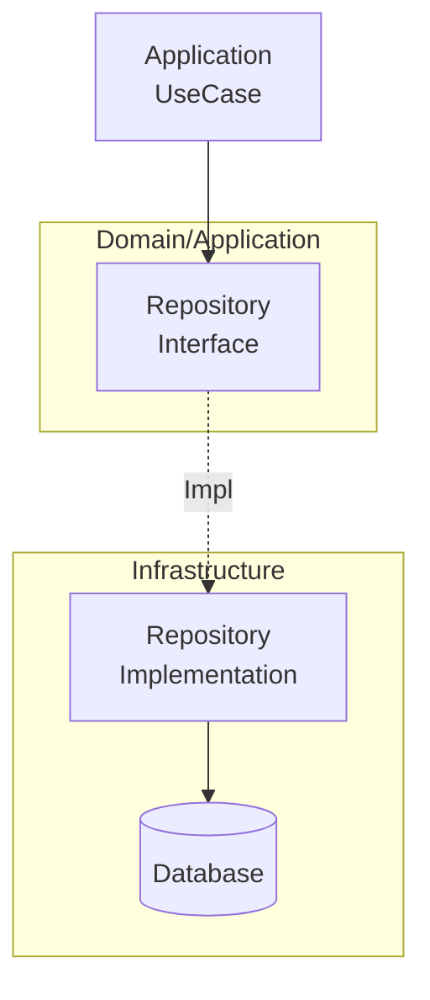
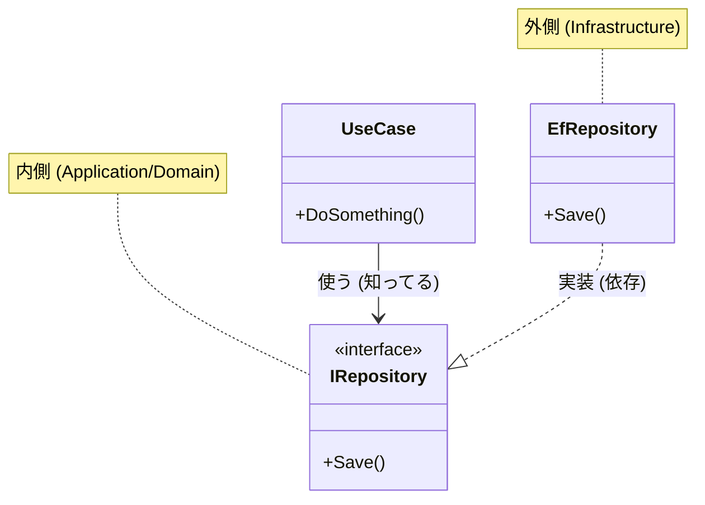

# 第11章：Infrastructure層の考え方🚪（外側に押し出す）

この章は「**DB・HTTP・ファイル・外部サービス**みたいな、変わりやすいものを **“端っこ（Infrastructure）に追い出す”** 感覚」をつかむ回だよ〜！😊🌸
次章（第12章）で「実際にDBアクセスをどこに置く？」をやる前に、まず **頭の地図🗺️** を作ろうね✨

---

## 0. まず結論：Infrastructureは「外の世界との接点」🌍🔌


Infrastructure層はひとことで言うと👇



* **外部の仕組み（DB / Web API / ファイル / メール / 時刻 / OS / ネットワーク）** と話すところ📮
* “詳細” はここに閉じ込めて、内側（Domain / Application）を守る🛡️

そして超大事な合言葉はこれ👇
**「変わりやすいものは端っこに」** 🧊➡️📦

---

## 1. 2026年のC#開発目線で「外側に追い出す」って超現実的💡

2026時点の最新の土台としては、.NET 10 が LTS で、パッチも継続提供されてるよ〜（例：10.0.2 が 2026-01-13 に提供）🧰✨ ([Microsoft][1])
EF Core も EF Core 10 が .NET 10 世代の LTS で、サポートも長め（〜2028-11-10）📚🗄️ ([Microsoft Learn][2])
Visual Studio も .NET 10 世代に合わせたリリースがあり、C#の新しめ機能サポートも進んでるよ🤖✨ ([Microsoft for Developers][3])

…つまり何が言いたいかというと👇
**外部ライブラリや仕組みは進化が早い** → だから **Domainに混ぜるとしんどい** 😵‍💫
→ **Infrastructureに隔離**すると、内側の設計が安定する✨

---

## 2. Infrastructure層に入るもの／入らないもの（超重要）✅🙅‍♀️

### ✅ Infrastructureに入るもの（外部と話す“手”🖐️）

* DB（EF Core / Dapper / ADO.NET など）🗄️
* Web API 呼び出し（HttpClient など）🌐
* ファイルI/O（CSV/JSON/画像/ログ/ストレージ）📁
* メール送信・通知（SMTP / Push / Slack）📨
* メッセージング（Queue / PubSub）📦➡️📦
* OS依存（環境変数、時刻、乱数、GUID発番など）🕰️🎲

### 🙅‍♀️ Infrastructureに入れないもの（内側の“方針”🧠）

* 業務ルール（割引の計算、状態遷移、禁止事項など）💎
* ユースケースの手順（登録→検証→保存→通知…の並び）📋
* “画面都合” のデータ形（第10章のDTOの話）📦

> コツ：**「それって外の仕組みが変わったら一緒に変わる？」**
> YESなら Infrastructure の可能性大！💡

---

## 3. 「Policy（方針）と Detail（詳細）」で分ける🧠✨


レイヤードを気持ちよくする考え方👇

* **Policy（方針）＝Domain / Application**
  例：「未完了ToDoは最大20件まで」など💎
* **Detail（詳細）＝Infrastructure**
  例：「保存先はSQL Server」「APIはREST」など🧩

Policyは “プロダクトの価値” で、Detailは “入れ替え可能な実装” だよ😊
Detailを内側に入れると、方針まで一緒に揺れるのが事故ポイント💥

---

## 4. 依存の形：内側は「欲しいこと」を宣言、外側が「やり方」を担当📣🛠️


### イメージ図（言葉で）🧱

* Domain / Application：
  「**保存してね**」「**現在時刻ちょうだい**」「**外部API呼んでね**」と **“お願い（契約）”** を定義する📜
* Infrastructure：
  そのお願いを **EF Core で実装**したり、**HttpClient で実装**したりする🛠️



ここで効いてくるのが **DI**（第15章〜第17章で本格的にやるやつ）🧩
.NET は DI が標準で用意されてるので、このスタイルがやりやすいよ✨ ([Microsoft Learn][4])

---

## 5. 例1：時刻（DateTime.Now）をDomainに直書きしない🕰️🙅‍♀️


### ありがち事故💥

DomainやApplicationで `DateTime.Now` を使うと…

* テストがしんどい（時間が固定できない）😵
* タイムゾーンや仕様変更で地獄👹

### 解決：IClock（“時刻ポート”）を作る⌚✨

**内側（例：Application）にインターフェースを置く**👇

```csharp
public interface IClock
{
    DateTimeOffset Now { get; }
}
```

**外側（Infrastructure）で実装する**👇

```csharp
public sealed class SystemClock : IClock
{
    public DateTimeOffset Now => DateTimeOffset.Now;
}
```

これでテストでは `FakeClock` に差し替えられる🎁✨
（「差し替え」こそ、Infrastructure分離のご褒美🍰）

---

## 6. 例2：外部API（HttpClient）をApplicationに直書きしない🌐🙅‍♀️

### ありがち事故💥

ApplicationのUseCaseに `new HttpClient()` が出てくると…

* リトライ/タイムアウト/ログ/認証が散らばる😵‍💫
* テストがしんどい（ネットワークが絡む）🌩️

### “おすすめの型”：IHttpClientFactory を使う🧰✨

.NET では **IHttpClientFactory** を使うのが推奨されていて、Typed client も推されてるよ👍 ([Microsoft Learn][5])

ここでも考え方は同じ👇

* 内側：`IWeatherApi` みたいな **契約** を置く📜
* 外側：HttpClient（IHttpClientFactory）で **実装** する🛠️

（実装の具体例は、章のテーマ的に “次章以降でやろう” でOKだよ😊）

---

## 7. 例3：DBも同じ（EF CoreをDomainへ漏らさない）🗄️🙅‍♀️

EF Core 10 は .NET 10 世代で LTS だよ〜📚 ([Microsoft Learn][2])
でも、どれだけ安定でも「DB方式」や「テーブル設計」や「ORMの都合」は **Detail（詳細）**。

だから基本方針👇

* **Domain/Applicationは “保存したい” を表現**（Repositoryのインターフェースなど）📜
* **Infrastructureが EF Coreで実装**🛠️

例（内側：インターフェース）👇

```csharp
public interface ITodoRepository
{
    Task<Todo?> FindAsync(TodoId id, CancellationToken ct);
    Task SaveAsync(Todo todo, CancellationToken ct);
}
```

外側（Infrastructure：EF Core 実装）👇

```csharp
public sealed class EfTodoRepository : ITodoRepository
{
    private readonly AppDbContext _db;

    public EfTodoRepository(AppDbContext db) => _db = db;

    public async Task<Todo?> FindAsync(TodoId id, CancellationToken ct)
        => await _db.Todos.FirstOrDefaultAsync(x => x.Id == id, ct);

    public async Task SaveAsync(Todo todo, CancellationToken ct)
    {
        _db.Update(todo);
        await _db.SaveChangesAsync(ct);
    }
}
```

> 注意：このコードは“雰囲気”の例だよ😊
> Domain設計（Entity/VO）とEFのエンティティ設計を同一にするかは、方針次第で変わる！（第12〜14章で丁寧にやる✨）

---

## 8. “漏れてる”サイン（においチェック）👃💥


次が見えたら「Infrastructureが内側に漏れてる」可能性大👇

* Applicationのクラスが `DbContext` を受け取ってる🗄️😱
* Domainが EF Core 属性（`[Key]` みたいな）を持ってる🏷️😱
* Applicationで `File.ReadAllText` とかが普通に出てくる📁😱
* UseCaseの中に `HttpClient` 設定がベタ書きされてる🌐😱
* “外部サービスの戻り値DTO” が Domain にそのまま入ってくる📦😱

この章のゴールは、これらを **「うわ、漏れてる！」って嗅ぎ分けられる**ようになることだよ🐶✨

---

## 9. じゃあInfrastructureってどんなフォルダ構成が多い？📁✨


よくある “わかりやすい” 分け方👇

* Infrastructure

  * Persistence（DB）🗄️
  * ExternalServices（外部API/メール/通知）🌐📨
  * FileStorage（ファイル/クラウドストレージ）📁
  * System（時刻/環境変数/OS依存）🕰️🪟

ポイントは「**外部の種類で分ける**」こと。
初心者ほど “機能で混ぜる” とゴチャりやすいから、外部ごとに分けると楽だよ😊🎀

---

## 10. 章末ミニ課題（手を動かす）✍️🧪

### 課題A：時刻の直書きを追放しよう⌚🔥

1. どこかのUseCaseに `DateTimeOffset.Now` を入れる
2. `IClock` を作って差し替える
3. テストで `FakeClock` にして、固定時刻でテストが通るのを確認🎉

### 課題B：ファイル読み書きの漏れを止めよう📁🧯

1. Applicationに `File.ReadAllText(...)` を書いちゃう
2. `ITextFileReader` を内側に置く
3. Infrastructureで `SystemTextFileReader` 実装
4. テストでは `InMemoryTextFileReader` に差し替え✨

---

## 11. チェックリスト✅（この章の合格ライン🎓✨）

* [ ] 「外部の仕組み」はInfrastructureに寄せる感覚がある🌍📦
* [ ] 内側は “欲しいこと（契約）” だけを宣言できる📜
* [ ] `DbContext` / `HttpClient` / `File` が内側に侵入してたら気づける👀💥
* [ ] “差し替え可能” がテストのご褒美だと理解できた🍰✨

---

## 12. AIに手伝ってもらうプロンプト例🤖💡（コピペOK）

※そのまま貼って使える感じで書くね😊✨

* 「このプロジェクトで **Infrastructureに置くべき依存** を列挙して、漏れてる箇所があれば指摘して」🔍
* 「このUseCaseから `DbContext/HttpClient/File` を追い出して、**ポート（interface）設計案** を出して」🧩
* 「Domainに混ざってる “詳細（Detail）” を見つけて、Infrastructureへ隔離するリファクタ案を出して」🧹✨
* 「依存の向き（上位→下位）を壊してる参照がないか、プロジェクト構成からチェックして」➡️✅

---

## 次章予告🎬✨

次は **「DBアクセス、結局どこに書くの？」問題** を、ちゃんと “置き場所のルール” として解決するよ〜！🗄️🔥
この章で作った **“外側に押し出す感覚”** が、そのまま効いてくるからね😊👍

[1]: https://dotnet.microsoft.com/en-us/platform/support/policy/dotnet-core?utm_source=chatgpt.com "NET and .NET Core official support policy"
[2]: https://learn.microsoft.com/en-us/ef/core/what-is-new/ef-core-10.0/whatsnew?utm_source=chatgpt.com "What's New in EF Core 10"
[3]: https://devblogs.microsoft.com/dotnet/dotnet-conf-2025-recap/?utm_source=chatgpt.com "Celebrating .NET 10, Visual Studio 2026, AI, Community, & ..."
[4]: https://learn.microsoft.com/en-us/dotnet/core/extensions/dependency-injection?utm_source=chatgpt.com "Dependency injection - .NET"
[5]: https://learn.microsoft.com/en-us/dotnet/fundamentals/networking/http/httpclient-guidelines?utm_source=chatgpt.com "Guidelines for using HttpClient"

