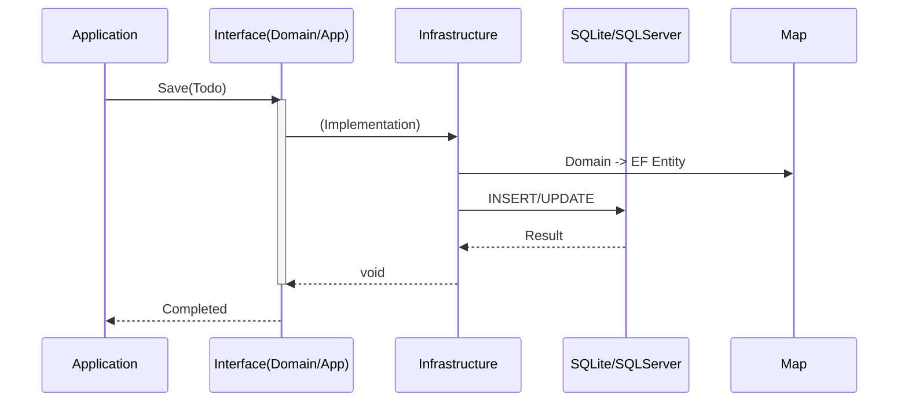

# 第12章：DBアクセスの置き方（Infrastructure実例）🗄️

今日のゴールは「DBまわりのコードを、正しく“外側（Infrastructure）”に閉じ込める」ことだよ〜！🥳
レイヤードでいちばん事故りやすいのが **DBアクセスの置き場所** なので、ここで“勝ちパターン”を作っちゃおう💪💖

---

## 0) まず結論：DBアクセスはどこに置く？📌


**置く場所は Infrastructure 層**（DBは“詳細”＝変わりやすいから端っこへ）🧊🚪
そして大事なのはこれ👇

* Application / Domain は **EF Core（DbContext）を直接知らない** 🙅‍♀️
* Application から見えるのは **インターフェース（抽象）だけ** 👀✨
* Infrastructure が **EF Coreで実装**して差し替え可能にする🔁



ちなみに本日時点だと、.NET は **.NET 10 が LTS**（長期サポート）で、EF Core も **EF Core 10 が LTS**だよ📅✨（EF Core 10 は .NET 10 が必要） ([Microsoft][1])

---

## 1) “どこに何を書く？”迷子にならない配置図🗺️✨

## ✅ Domain（ルールの中心）💎

* Entity / ValueObject
* ルール（不正な状態を作らない）🔒
* **DBの都合（主キーがintとか、カラム長とか）を基本持ち込まない** 🙅‍♀️

## ✅ Application（手順書）📋

* ユースケース（Create / Update / Get など）
* **DB保存は「こうやって保存してね」という抽象にお願いする**🙏

  * `ITodoItemStore` みたいなインターフェースを置く（※次章でRepositoryとして整えるよ💾）

## ✅ Infrastructure（DBの現実を引き受ける）🧰

* EF Core の `DbContext` 🧱
* Entityのマッピング（Fluent API）🧩
* マイグレーション（テーブル作るやつ）🛠️
* 接続設定の読み取り補助（登録メソッドなど）🔧

---

## 2) 今回の題材：ToDo を“最小”でDB保存してみる📝

「読み書き」だけでOK👌（ここで機能増やすと沼るからね🫠）

## 今章で作るミニ構成（イメージ）🏗️

* Presentation：API/UI（ここからUseCaseを呼ぶ）
* Application：UseCase + `ITodoItemStore`
* Domain：`TodoItem`（ルール）
* Infrastructure：EF Core 実装（SQLiteでOK）

---

## 3) EF Core の選び方（2026の今どれ？）🧠✨

* **EF Core 10 = LTS（安定・長期サポート）** ✅ ([Microsoft Learn][2])
* EF Core 9 は STS（短期サポート） ✅ ([Microsoft Learn][3])

教材としては **EF Core 10（.NET 10）** をベースに進めるのが安心だよ〜😌💕

---

## 4) 実装ステップ（手を動かすよ〜！）🧑‍💻💖

## Step A：Domain を“DB無関係”にして作る💎

例：`TodoItem` は「タイトル空はダメ」だけ守る感じでOK✨

```csharp
namespace MyApp.Domain.Todos;

public sealed class TodoItem
{
    public Guid Id { get; private set; } = Guid.NewGuid();
    public string Title { get; private set; }
    public bool IsDone { get; private set; }

    private TodoItem() { } // EF用に必要になることがあるけど、Domain的には隠したい…後で説明するね🙏

    public TodoItem(string title)
    {
        if (string.IsNullOrWhiteSpace(title))
            throw new ArgumentException("タイトルは必須だよ🥺", nameof(title));

        if (title.Length > 100)
            throw new ArgumentException("タイトルは100文字までだよ🥺", nameof(title));

        Title = title;
    }

    public void MarkDone() => IsDone = true;
}
```

> 💡ここでは DataAnnotation（`[Key]` とか）を貼らないのがポイント！
> DBの都合は Infrastructure 側で吸収しようね🧽✨

---

## Step B：Application に“保存窓口（抽象）”を置く📋

（次章でRepositoryとして育てる前の、仮の窓口だよ💾✨）

```csharp
using MyApp.Domain.Todos;

namespace MyApp.Application.Todos;

public interface ITodoItemStore
{
    Task AddAsync(TodoItem item, CancellationToken ct);
    Task<TodoItem?> FindAsync(Guid id, CancellationToken ct);
    Task SaveChangesAsync(CancellationToken ct);
}
```

UseCase はこうなる👇（DBのこと何も知らないのが気持ちいい😊）

```csharp
using MyApp.Domain.Todos;

namespace MyApp.Application.Todos;

public sealed class CreateTodoItemUseCase
{
    private readonly ITodoItemStore _store;

    public CreateTodoItemUseCase(ITodoItemStore store)
        => _store = store;

    public async Task<Guid> ExecuteAsync(string title, CancellationToken ct)
    {
        var item = new TodoItem(title);
        await _store.AddAsync(item, ct);
        await _store.SaveChangesAsync(ct);
        return item.Id;
    }
}
```

---

## Step C：Infrastructure に DbContext を置く🗄️

SQLite を使うとローカルで軽くて楽ちん😺
（もちろん SQL Server に変えるのも後で簡単だよ🔁）

```csharp
using Microsoft.EntityFrameworkCore;
using MyApp.Domain.Todos;

namespace MyApp.Infrastructure.Data;

public sealed class AppDbContext : DbContext
{
    public DbSet<TodoItem> TodoItems => Set<TodoItem>();

    public AppDbContext(DbContextOptions<AppDbContext> options) : base(options) { }

    protected override void OnModelCreating(ModelBuilder modelBuilder)
    {
        modelBuilder.Entity<TodoItem>(b =>
        {
            b.ToTable("TodoItems");
            b.HasKey(x => x.Id);

            b.Property(x => x.Title)
             .HasMaxLength(100)
             .IsRequired();

            b.Property(x => x.IsDone)
             .IsRequired();
        });
    }
}
```

> ✅ **マッピングはInfrastructureで！**
> こうすると Domain を汚さずに “DBの現実” を扱えるよ🧼✨

---

## Step D：Infrastructure が ITodoItemStore を実装する🔧

```csharp
using Microsoft.EntityFrameworkCore;
using MyApp.Application.Todos;
using MyApp.Domain.Todos;
using MyApp.Infrastructure.Data;

namespace MyApp.Infrastructure.Todos;

public sealed class EfTodoItemStore : ITodoItemStore
{
    private readonly AppDbContext _db;

    public EfTodoItemStore(AppDbContext db) => _db = db;

    public Task AddAsync(TodoItem item, CancellationToken ct)
        => _db.TodoItems.AddAsync(item, ct).AsTask();

    public Task<TodoItem?> FindAsync(Guid id, CancellationToken ct)
        => _db.TodoItems.FirstOrDefaultAsync(x => x.Id == id, ct);

    public Task SaveChangesAsync(CancellationToken ct)
        => _db.SaveChangesAsync(ct);
}
```

---

## Step E：DI登録（Infrastructureを“登録だけ”で差し込む）🧩

登録用の拡張メソッドを Infrastructure 側に作ると整理しやすいよ✨

```csharp
using Microsoft.EntityFrameworkCore;
using Microsoft.Extensions.Configuration;
using Microsoft.Extensions.DependencyInjection;
using MyApp.Application.Todos;
using MyApp.Infrastructure.Data;
using MyApp.Infrastructure.Todos;

namespace MyApp.Infrastructure;

public static class DependencyInjection
{
    public static IServiceCollection AddInfrastructure(
        this IServiceCollection services,
        IConfiguration config)
    {
        var cs = config.GetConnectionString("Default");

        services.AddDbContext<AppDbContext>(opt =>
            opt.UseSqlite(cs));

        services.AddScoped<ITodoItemStore, EfTodoItemStore>();

        return services;
    }
}
```

DbContext のライフサイクルは、Webなら基本 **Scoped** が定番だよ（リクエスト単位）🧠✨ ([Microsoft Learn][4])

---

## Step F：Presentation 側で呼ぶ（Composition Root）🏗️

`Program.cs` で Infrastructure を追加するだけにするのがキレイ😍

```csharp
using MyApp.Infrastructure;

var builder = WebApplication.CreateBuilder(args);

builder.Services.AddInfrastructure(builder.Configuration);
builder.Services.AddScoped<MyApp.Application.Todos.CreateTodoItemUseCase>();

var app = builder.Build();

app.MapPost("/todos", async (string title, MyApp.Application.Todos.CreateTodoItemUseCase useCase, CancellationToken ct) =>
{
    var id = await useCase.ExecuteAsync(title, ct);
    return Results.Created($"/todos/{id}", new { id });
});

app.Run();
```

---

## 5) マイグレーション（テーブル作成）🛠️✨

ここ、初心者がつまずきやすいので丁寧にいくよ〜！🫶

EF Core の CLI ツール（`dotnet ef`）は

* **--project**：マイグレーションを置く側（Infrastructure）
* **--startup-project**：実行して設定を読む側（Presentation）
  を分けられるよ👌 ([Microsoft Learn][5])

例（PowerShell想定）👇

```powershell
dotnet tool install --global dotnet-ef
```

```powershell
dotnet ef migrations add Init `
  --project .\MyApp.Infrastructure\MyApp.Infrastructure.csproj `
  --startup-project .\MyApp.Presentation\MyApp.Presentation.csproj
```

適用（DB作成）👇

```powershell
dotnet ef database update `
  --project .\MyApp.Infrastructure\MyApp.Infrastructure.csproj `
  --startup-project .\MyApp.Presentation\MyApp.Presentation.csproj
```

> 🧠「マイグレーションを別プロジェクトに置く」考え方も公式に説明があるよ（必要になったら採用しよう） ([Microsoft Learn][6])

---

## 6) ありがち事故まとめ（ここ超大事）💥😇

## ❌ 事故1：Application が DbContext を参照しちゃう

* `Application` から `Microsoft.EntityFrameworkCore` が見えてたら黄色信号🚨
* 直す：**インターフェース越しにする**（今回の `ITodoItemStore` みたいに）✅

## ❌ 事故2：Domain に `[Table]` とか貼り始める

* “今は便利”だけど、後から **設計が濁って**つらい😵‍💫
* 直す：Fluent API を Infrastructure に寄せる✅

## ❌ 事故3：接続文字列を Infrastructure にベタ書き

* 環境で変わるので危険💣
* 直す：Presentation の設定から読んで注入する✅

---

## 7) 章末チェックリスト✅💕

* [ ] DbContext は Infrastructure にある？🗄️
* [ ] Application/Domain は EF Core を参照してない？🙅‍♀️
* [ ] 保存はインターフェース越し？🧩
* [ ] マッピングは Infrastructure 側にある？🧼
* [ ] `dotnet ef` で migrations / update できた？🛠️

---

## 8) Copilot / Codex に投げると強いプロンプト集🤖💡

## 設計レビュー用👀

* 「Application 層が EF Core に依存していないかチェックして、依存してたら修正案を出して」
* 「Domain に DB都合が混ざってないか（属性、DataAnnotation等）レビューして」

## 実装補助🧑‍💻

* 「この Domain モデルに対して、Infrastructure 側の Fluent API 設定を作って」
* 「SQLite 用の AddInfrastructure 登録メソッドを作って」

## マイグレーション沼脱出🛟

* 「このソリューション構成で dotnet ef migrations add を通すコマンドを組んで」
  （`--project` と `--startup-project` を必ず含めてね、って添えると◎） ([Microsoft Learn][5])

---

## 9) 次章（第13章）へのつなぎ💾✨

今日は「DBアクセスを Infrastructure に閉じ込める土台」を作ったよ🎉
次はこれを **Repository として“ちゃんとした形”に育てる**回！

* interface はどこ？
* 実装はどこ？
* Query はどうする？
  …をスッキリ整理していくよ〜😊💕

---

必要なら、この第12章の内容を「ToDoじゃなく家計簿/蔵書管理」に差し替えた版も同じ構造で作れるよ📚✨

[1]: https://dotnet.microsoft.com/ja-jp/platform/support/policy?utm_source=chatgpt.com "公式の .NET サポート ポリシー | .NET"
[2]: https://learn.microsoft.com/ja-jp/ef/core/what-is-new/ef-core-10.0/whatsnew?utm_source=chatgpt.com "EF Core 10 の新機能"
[3]: https://learn.microsoft.com/en-us/ef/core/what-is-new/ef-core-9.0/whatsnew?utm_source=chatgpt.com "What's New in EF Core 9"
[4]: https://learn.microsoft.com/en-us/ef/core/dbcontext-configuration/?utm_source=chatgpt.com "DbContext Lifetime, Configuration, and Initialization"
[5]: https://learn.microsoft.com/ja-jp/ef/core/cli/dotnet?utm_source=chatgpt.com "EF Core ツールのリファレンス (.NET CLI)"
[6]: https://learn.microsoft.com/en-us/ef/core/managing-schemas/migrations/projects?utm_source=chatgpt.com "Using a Separate Migrations Project - EF Core"

