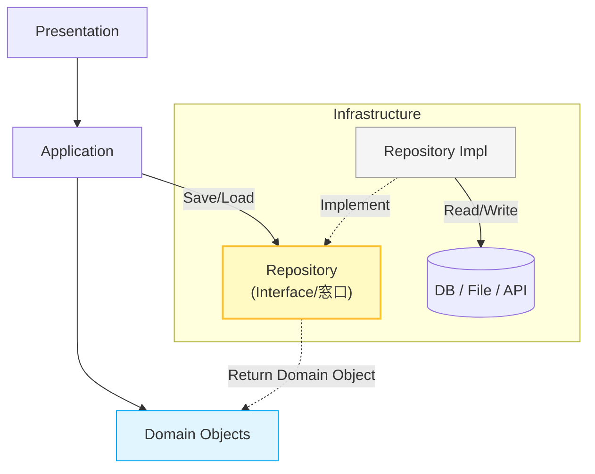

# 第13章：Repository入門💾（保存の窓口）

前の章で「DBアクセスを書く場所」は見えてきたはず🗄️✨
この章はそこから一歩進んで、**“保存の窓口（Repository）” を作って、上の層にDB事情を見せない**練習をするよ〜！🚪💎

---

## 1. この章でできるようになること✅✨

* Repositoryが **何のために存在するか** を説明できる😊
* 「Domain/Applicationから見た保存」＝ **“コレクションっぽい窓口”** を作れる📦
* Repositoryが守るべき **3つの約束**（漏らさない・寄せる・意図で語る）を理解できる🧠
* “テストが楽になる” を体験できる🧪🎁

---

## 2. Repositoryってなに？（超ざっくりイメージ）🧸✨


Repositoryは一言でいうと…

**「保存（DB/ファイル/外部API）のやり方を隠して、ドメインの “保存したい/取り出したい” だけを提供する窓口」**💾🚪

たとえばDomainやApplicationは、保存先がSQL ServerでもSQLiteでも、Web APIでも気にしないでOKにする🎯
（保存方法はInfrastructure側の“詳細”だからね）



**ポイントはここ！** 💡
* Applicationは **「Domainの型（クラス）」** を使ってRepositoryと会話する🗣️
* 実際のDBアクセス（SQLなど）は **Infrastructure（詳細）** に隠す🫣
* すると、Applicationは「データがどこにあるか」を気にしなくて済む！🎉

---

## 3. なんでRepositoryが嬉しいの？🎁✨（痛みが消える）

## 3.1 「上の層がDBの都合まみれ」問題💥

Repositoryがないと、Applicationがこうなりがち：

* SQLっぽい条件が散らばる😵‍💫
* EF Coreの`DbContext`や`DbSet`が上の層に漏れる🧪しんどい
* テストが「DB準備ありき」になって辛い🥲

## 3.2 Repositoryがあるとこうなる😊

* Application/Domainは **“保存したい” “取り出したい”** だけ言えばいい📣
* 保存先が変わっても、Repository実装の差し替えで耐えやすい🔁
* テストが **Fake Repository** で超ラクになる🧪✨

ちなみにMicrosoftのアーキテクチャガイドでも、`DbContext`を直接使うのが最短な場合がある一方で、**カスタムRepositoryには「層を切り離す」「モックしやすい」などの利点がある**と説明されてるよ📚✨ ([Microsoft Learn][1])

---

## 4. Repositoryが守るべき “3つの約束”🤝✨


## 約束①：上の層に「保存技術」を漏らさない🚫

* EF Coreの型（`DbContext`, `DbSet`, `IQueryable` など）を、Application/Domainへ出さない🙅‍♀️
* SQLやテーブル都合の概念を、Domainへ持ち込まない🙅‍♀️

## 約束②：Repositoryは “集約ルート単位” で考える📦


Repositoryは「何でも入る万能箱」じゃなくて、基本は **集約（Aggregate）ごと** に作るのが定石だよ🧱✨
（＝ドメインのまとまり単位で保存する） ([Microsoft Learn][2])

## 約束③：メソッド名は “意図” を表す🎯

* `FindById`よりも、ケースによっては`GetTodoOrNull`とか、**意図が分かる名前**が勝つ✨
* 「クエリの都合」じゃなく「ユースケースの都合」を優先📋

---

## 5. ハンズオン：ToDo題材でRepositoryを作る🛠️✨

ここでは **Domainモデル（Todo）** を例に、Repositoryの形だけ先に作るよ！

## 5.1 Domain：IDをValueObjectにしてみる💎

「IDをただの`Guid`にしない」だけで、読みやすさが上がるよ〜😊

```csharp
namespace MyApp.Domain.Todos;

public readonly record struct TodoId(Guid Value)
{
    public static TodoId New() => new(Guid.NewGuid());
}
```

## 5.2 Domain：Entity（ふるまい付き）を書く🧠✨

```csharp
namespace MyApp.Domain.Todos;

public class TodoItem
{
    public TodoId Id { get; }
    public string Title { get; private set; }
    public bool IsDone { get; private set; }

    public TodoItem(TodoId id, string title)
    {
        if (string.IsNullOrWhiteSpace(title))
            throw new ArgumentException("Title is required.", nameof(title));

        Id = id;
        Title = title.Trim();
        IsDone = false;
    }

    public void Rename(string newTitle)
    {
        if (string.IsNullOrWhiteSpace(newTitle))
            throw new ArgumentException("Title is required.", nameof(newTitle));

        Title = newTitle.Trim();
    }

    public void MarkDone() => IsDone = true;
}
```

---

## 6. Repositoryインターフェース（“保存の窓口”）を定義する🚪💾

ここがこの章の主役！✨
Repositoryは **「保存先が何であっても変わらない“約束”」** を定義するよ。

ポイントは👇

* 返す/受け取るのは **Domainの型**
* 非同期＋`CancellationToken`を付ける（今どきは基本これ）⚡
  EF Coreも非同期を推奨してるよ🧵 ([Microsoft Learn][3])

```csharp
namespace MyApp.Domain.Todos;

public interface ITodoRepository
{
    Task<TodoItem?> GetByIdAsync(TodoId id, CancellationToken ct = default);
    Task<IReadOnlyList<TodoItem>> ListAsync(CancellationToken ct = default);

    Task AddAsync(TodoItem item, CancellationToken ct = default);
    Task SaveChangesAsync(CancellationToken ct = default);
}
```

## 💡「Update/Deleteがないの？」って思った？

初心者向けの最小構成では、まずこれでOK👌
EF CoreみたいなORMだと「追跡して変更→`SaveChanges`」で更新できることが多いので、最初は “保存の流れ” が分かる方が大事😊

---

## 7. Application層からの使い方（UseCaseっぽく）🎮📋


「完了にする」ユースケースを例にするね！

```csharp
using MyApp.Domain.Todos;

namespace MyApp.Application.Todos;

public class CompleteTodoUseCase
{
    private readonly ITodoRepository _repo;

    public CompleteTodoUseCase(ITodoRepository repo)
    {
        _repo = repo;
    }

    public async Task ExecuteAsync(Guid rawId, CancellationToken ct = default)
    {
        var id = new TodoId(rawId);

        var todo = await _repo.GetByIdAsync(id, ct);
        if (todo is null) return; // ここは後の章でエラー設計に進化できるよ⚠️

        todo.MarkDone();

        await _repo.SaveChangesAsync(ct);
    }
}
```

ここで大事なのは、UseCaseが **DBのこと何も知らない** こと😊✨
「保存しといて〜」ってRepositoryにお願いするだけ💾🙏

---

## 8. テストが一気にラクになる🎁🧪（Fake Repository）


Repositoryを作る最大のご褒美の一つがこれ！🍰✨
DB無しで “UseCaseの手順” をテストできるようになるよ〜！

```csharp
using MyApp.Domain.Todos;

namespace MyApp.Tests.Fakes;

public class InMemoryTodoRepository : ITodoRepository
{
    private readonly List<TodoItem> _items = new();

    public Task<TodoItem?> GetByIdAsync(TodoId id, CancellationToken ct = default)
        => Task.FromResult(_items.FirstOrDefault(x => x.Id == id));

    public Task<IReadOnlyList<TodoItem>> ListAsync(CancellationToken ct = default)
        => Task.FromResult((IReadOnlyList<TodoItem>)_items.ToList());

    public Task AddAsync(TodoItem item, CancellationToken ct = default)
    {
        _items.Add(item);
        return Task.CompletedTask;
    }

    public Task SaveChangesAsync(CancellationToken ct = default)
        => Task.CompletedTask; // InMemoryなので何もしない
}
```

## xUnitでテスト例🧪✨

```csharp
using MyApp.Application.Todos;
using MyApp.Domain.Todos;
using MyApp.Tests.Fakes;
using Xunit;

public class CompleteTodoUseCaseTests
{
    [Fact]
    public async Task ExecuteAsync_marks_todo_done()
    {
        var repo = new InMemoryTodoRepository();
        var useCase = new CompleteTodoUseCase(repo);

        var todo = new TodoItem(TodoId.New(), "Buy milk");
        await repo.AddAsync(todo);

        await useCase.ExecuteAsync(todo.Id.Value);

        var loaded = await repo.GetByIdAsync(todo.Id);
        Assert.NotNull(loaded);
        Assert.True(loaded!.IsDone);
    }
}
```

---

## 9. ここで知っておくと強い：DbContextって実は…🧠✨

Microsoftの資料では、**`DbContext`は Unit of Work と Repository の考え方に基づく**と説明されてるよ📚 ([Microsoft Learn][1])

だから「Repositoryいらなくない？」論争も起きるんだけど、教材としてはこう整理するとスッキリするよ👇

* 小さいCRUDだけなら`DbContext`直でも最短🏃‍♂️💨
* でも層を守って成長させたいなら、Repositoryで **境界を固定** する価値がある🔒✨
  （テスト・差し替え・責務分離が効いてくる） ([Microsoft Learn][1])

---

## 10. 初心者がやりがち地雷💣（先に回避！）


## 地雷①：`IRepository<T>`みたいな “何でも屋” を作る😇

```csharp
// ❌例：汎用Repositoryで IQueryable を返すのは漏れやすい
public interface IRepository<T>
{
    IQueryable<T> Query();
}
```

これをやると…

* 上の層でSQLっぽい条件が書けちゃう（境界が崩壊）💥
* 永続化の都合がアプリに侵食する🧟‍♀️

👉 対策：**「ユースケースに必要なメソッドだけ」置く**📌✨

## 地雷②：RepositoryがDTOを返し始める📦💥

Repositoryは原則 **Domainの集約ルート（Entity）** を扱うのが基本🧱 ([Microsoft Learn][2])
DTOは「境界で変換」だったよね（第10章）📦✨

---

## 11. ミニ課題（手を動かすやつ）🏃‍♀️💨

1. `ListAsync`に「未完了だけ」版を追加してみよう😊

* `ListIncompleteAsync()` みたいに “意図名” にするのがコツ🎯

2. `RenameTodoUseCase` を作って、Fake Repositoryでテストしよう🧪✨

* 変更→`SaveChangesAsync`の流れを体に入れる🔥

3. 「取得できなかったとき」を `return` じゃなくて、後のエラー設計（第18章）を見据えてコメントしておこう⚠️📝

---

## 12. 章末チェックリスト✅🎀

* Repositoryは **Domain型だけ** を扱ってる？（EF型・SQL都合が漏れてない？）🚫
* Repositoryメソッド名が **意図** になってる？🎯
* `CancellationToken` を受け取ってる？⛑️
* テストでFakeに差し替えられる？🧪
* “万能`IRepository<T>`” になってない？😇💥

---

## 13. よくある質問Q&A🙋‍♀️✨

## Q1. Repositoryの戻り値って`IQueryable`じゃダメ？

**初心者段階では基本ダメ🙅‍♀️**
クエリの自由度が高すぎて、上の層に永続化の都合が漏れやすいからだよ💥
まずは「必要な取得メソッドを作る」方が安全😊

## Q2. `SaveChangesAsync`はRepositoryに置くの？

最小構成なら置いてOK👌
将来はUnit of Workに分ける設計もあるけど、最初は「保存の流れ」が見える方が大事✨
（次の章以降で置き場所や参照ルールをカチッと決めていけるよ🔗）

## Q3. RepositoryはDomain？Application？どっちに置くの？

ここは流派が分かれるけど、**“Domainの概念として保存が必要”**ならDomain寄りになりやすいよ💎
ただし「参照ルール事故」が起きやすいので、**次章（第14章）で正しい置き方を固定する**よ〜！🚧✨

---

## 14. AIプロンプト例🤖✨（Copilot/Codex向け）

## 14.1 Repository設計レビュー（漏れチェック）🔍

```text
次のITodoRepository設計をレビューして。
- Domain/ApplicationにEF Coreの型が漏れていないか
- IQueryableを返していないか
- メソッド名がユースケースの意図になっているか
改善案も出して。
```

## 14.2 Fake Repository自動生成🧪

```text
ITodoRepositoryのFake実装（InMemory）を作って。
要件:
- List<TodoItem>で保持
- GetByIdAsync / ListAsync / AddAsync / SaveChangesAsyncを実装
- 例外は投げずにシンプルに
```

## 14.3 UseCaseからRepository抽出（リファクタ）🧹

```text
このUseCaseはDbContext直叩きしている。Repositoryに切り出して層違反を直して。
- Repository interface案
- UseCaseの修正版
- 最小のテスト例
```

---

## ちょい予告📣✨（次章につながる！）

第13章でRepositoryの“意味と形”ができたから、次は **「どこに置く？」「参照方向が逆転しない？」** をガッチリ固めるよ🔗🚫
第14章、事故防止回いくぞ〜！💪💖

[1]: https://learn.microsoft.com/en-us/dotnet/architecture/microservices/microservice-ddd-cqrs-patterns/infrastructure-persistence-layer-implementation-entity-framework-core?utm_source=chatgpt.com "Implementing the infrastructure persistence layer with ..."
[2]: https://learn.microsoft.com/ja-jp/dotnet/architecture/microservices/microservice-ddd-cqrs-patterns/infrastructure-persistence-layer-design?utm_source=chatgpt.com "インフラストラクチャ永続化レイヤーの設計 - .NET"
[3]: https://learn.microsoft.com/en-us/ef/core/miscellaneous/async?utm_source=chatgpt.com "Asynchronous Programming - EF Core"

