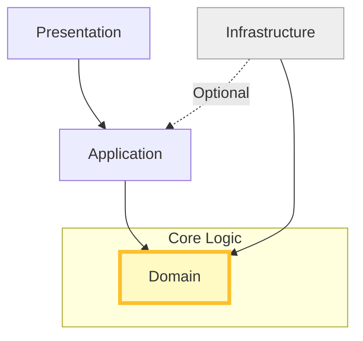

# 第14章：Repositoryの置き場所＆参照ルール🔗（事故防止回）

この章は「Repositoryをどこに置くか」でレイヤードが崩壊しないようにする回だよ〜！😆🧱
一度ルールを決めると、あとがめっちゃ楽になるやつ💡

ちなみに今の最新前提だと、.NET は **.NET 10 (LTS)** が現行で、2026-01-13 に **10.0.2** の更新が出てるよ🆕 ([Microsoft][1])
EF Core も **EF Core 10** が .NET 10 前提で動く設計になってる（つまりレイヤー境界に EF の型を漏らすと後で痛い）😇 ([Microsoft Learn][2])
C# は **C# 14** が最新で、.NET 10 / Visual Studio 2026 で試せるよ〜✨ ([Microsoft Learn][3])
（ここまでが “今どき基準” の足場ね🦶）

---

## 1) 今日のゴール🎯✨

この章が終わるとこうなるよ👇

* Repository の **interface** と **実装** を「迷わず置ける」📍
* 参照方向（依存の向き）が **絶対に逆転しない** ルールが作れる🚫
* “うっかり Infrastructure を参照しちゃう事故” を **設計で封じ込め** できる🔒

---

## 2) まず結論：参照ルールはこう固定🧊➡️


4層（Presentation / Application / Domain / Infrastructure）なら、基本はこれでOK！✅



* **Presentation → Application**
* **Application → Domain**
* **Infrastructure → Domain**（※必要なら Application も）
* **Domain → （どこも参照しない）** 🏝️✨

この「Domain が孤島🏝️」って状態が、レイヤードの健康診断で超大事だよ〜🩺

---

## 3) “Repository置き場所” で起きがちな事故あるある💥😱

### 事故A：Domain が EF Core を参照し始める🗄️➡️💎

* `DbContext` とか `DbSet` とかが Domain に登場
* 結果：Domain が “DBの都合” に汚染される😵‍💫

### 事故B：Application が Infrastructure の “実装クラス” を new しだす🧱➡️🧰

* `new SqlTodoRepository()` とか
* 結果：テスト差し替え不能＆依存逆転が崩壊💥

### 事故C：Repository interface が Infrastructure に置かれる📦

* Domain / Application から見て「保存の入口」が “外側” にある
* 結果：参照方向が変になって、地味に循環参照が生まれやすい🔁💣

この章は、これらを **構造で起きなくする** のが目的だよ🧯✨

---

## 4) Repository interface はどこに置く？（3パターン）📦📍

### パターン①：**Domain に interface / Infrastructure に実装**（いちばん王道👑）


おすすめ度：★★★★★ 😆✨

**向いてるケース**

* “保存したいもの” がドメイン概念として自然（例：`TodoItem` を保存したい）
* Domain のユースケースが「保存」を前提にしてる

**メリット**

* Domain が「保存できる」という能力（抽象）だけ知れる
* 保存手段（EF/SQL/ファイル等）は Infrastructure に閉じ込められる🔐

**参照関係**

* Application → Domain（interface を使う）
* Infrastructure → Domain（interface を実装する）

---

### パターン②：**Application に interface / Infrastructure に実装**（クエリ寄りに強い🔎）


おすすめ度：★★★★☆ 😊

**向いてるケース**

* Domain の概念というより、画面・一覧・検索の都合が強い
  （例：一覧表示用 DTO を返したい、集計したい）
* “UseCaseに必要な読み取り” を最適化したい（CQRSの入口っぽい感じ✨）

**メリット**

* Domain を汚さずに「読み取り専用の口」を作れる
* 返す型も Application 側の DTO にできる📦

**参照関係**

* Presentation → Application（DTOもここで完結できる）
* Infrastructure → Application（interface 実装のため）

---

### パターン③：**Contracts/Abstractions 専用プロジェクト**（大規模向け🏢）

おすすめ度：★★★☆☆ 🤔

**向いてるケース**

* 複数アプリから共通利用する
* 外部公開SDK・共有契約が必要

今回はまず **①か②** で十分だよ〜👌✨

---

## 5) この教材ではこうしよう（おすすめ運用）🧭✨


まず迷ったら、こう切るとスッキリするよ😊

* **書き込み系（保存・更新）**：パターン①（Domainに interface）
* **読み取り系（一覧・検索・集計）**：パターン②（Applicationに interface）

理由はシンプルで👇

* 書き込みは **ドメインの整合性（ルール）** に近い💎
* 読み取りは **画面都合（形が変わりやすい）** に寄りがち🎨

---

## 6) 具体例：ToDo の Repository を正しく配置してみよう🧩✨

ここでは「書き込み系」想定で、パターン①（Domain interface）で行くよ〜！💨

### 6.1 Domain に interface を置く💎📍

```csharp
// MyApp.Domain/Todos/ITodoRepository.cs
namespace MyApp.Domain.Todos;

public interface ITodoRepository
{
    Task<TodoItem?> FindAsync(TodoId id, CancellationToken ct = default);
    Task AddAsync(TodoItem item, CancellationToken ct = default);
    Task SaveChangesAsync(CancellationToken ct = default);
}
```

ポイント✅

* 返り値・引数は **Domainの型だけ**（`TodoItem`, `TodoId`）
* `IQueryable` とか `DbContext` とか **絶対出さない** 🙅‍♀️💥
  （出した瞬間、EFの都合が上に漏れるよ〜）

---

### 6.2 Infrastructure に EF Core 実装を置く🗄️📍

```csharp
// MyApp.Infrastructure/Todos/TodoRepository.cs
using Microsoft.EntityFrameworkCore;
using MyApp.Domain.Todos;

namespace MyApp.Infrastructure.Todos;

public sealed class TodoRepository : ITodoRepository
{
    private readonly AppDbContext _db;

    public TodoRepository(AppDbContext db) => _db = db;

    public Task<TodoItem?> FindAsync(TodoId id, CancellationToken ct = default)
        => _db.TodoItems.SingleOrDefaultAsync(x => x.Id == id, ct);

    public async Task AddAsync(TodoItem item, CancellationToken ct = default)
        => await _db.TodoItems.AddAsync(item, ct);

    public Task SaveChangesAsync(CancellationToken ct = default)
        => _db.SaveChangesAsync(ct);
}
```

ここで EF Core 10 は .NET 10 前提で動くから、Domain に EF を漏らすと “依存の形” が固定されちゃうのが怖いところ⚠️ ([Microsoft Learn][2])

---

## 7) 参照設定（Visual Studioでやること）🔗✅


### ✅ 正しい参照（最小セット）

* **MyApp.Presentation**

  * 参照：MyApp.Application
* **MyApp.Application**

  * 参照：MyApp.Domain
* **MyApp.Infrastructure**

  * 参照：MyApp.Domain
  * （パターン②の場合は MyApp.Application も）
* **MyApp.Domain**

  * 参照：基本なし（BCLだけで生きる）🏝️✨

### ❌ 禁止（ここが事故の入口）

* Domain → Infrastructure（絶対ダメ🙅‍♀️）
* Application → Infrastructure（原則ダメ🙅‍♀️）
* Presentation → Domain / Infrastructure（薄く保つため基本ダメ🙅‍♀️）

---

## 8) “参照逆転事故” を防ぐ小ワザ集🛡️✨

### ワザ①：命名で境界を見える化👀

* `MyApp.Domain`
* `MyApp.Infrastructure`
* `MyApp.Application`
* `MyApp.Presentation`

この命名だと、`using MyApp.Infrastructure...` が見えた瞬間「うわっ」って気づける🤣

---

### ワザ②：Repository interface のメソッドは “保存の言葉” に寄せる🗣️


* `AddAsync`, `FindAsync`, `SaveChangesAsync` みたいに
* 「DBっぽい言葉（SQL/Query/Join）」はなるべく避ける

---

### ワザ③：読み取り最適化は “別口” に分ける🔎📦

一覧・検索が欲しくなったら、Repository を肥大化させずに👇

* Application に `ITodoQueryService` を作る（DTO返し）
* Infrastructure がそれを実装する

って分けるとキレイだよ✨（パターン②）

---

## 9) 演習：わざと事故って、直してみよう💥➡️🧯

### 演習A（やってみて！）

1. Domain に `Microsoft.EntityFrameworkCore` を追加してみる
2. `DbContext` を Domain に置いてみる

👉 「うわ、これレイヤード壊れる」って感覚が掴める😇

### 演習B（修理）

* `DbContext` を Infrastructure に戻す
* Domain には interface と純粋なモデルだけ残す💎

---

## 10) AI（Copilot/Codex）で “違反チェック” させるプロンプト🤖✅

コピペで使えるやつ置いとくね〜💌✨

### 依存違反レビュー用

```text
このソリューションは Presentation / Application / Domain / Infrastructure の4層です。
禁止ルール：
- Domain は他プロジェクト参照禁止
- Application は Infrastructure 参照禁止
- Presentation は Domain / Infrastructure 参照禁止
現在の参照関係と using を確認し、違反箇所と修正案（どこへ移動・どのinterfaceを切るか）を列挙してください。
```

### Repository設計レビュー用

```text
この ITodoRepository のメソッド設計が、Domain をDB都合で汚染していないかレビューしてください。
- EF Core の型（DbContext, DbSet, IQueryable など）を返していないか
- 引数/戻り値が Domain 型 중심になっているか
- 読み取り最適化が必要なら QueryService 分離案も提案して
```

---

## 章末チェックリスト✅🎀

* [ ] Domain に EF/SQL/HTTP の型が出てきてない？🙅‍♀️
* [ ] Repository interface は Domain か Application のどっちかに置けてる？📍
* [ ] Infrastructure は “実装” だけになってる？🧰
* [ ] Application が Infrastructure を参照してない？（原則）🚫
* [ ] 読み取り（一覧・検索）を Repository に詰め込みすぎてない？🔎💦

---

## よくある質問Q&A🙋‍♀️✨

### Q1. Repository の interface を Domain に置くと、Domain が “保存前提” にならない？

A. “保存する仕組み” は知らないけど、“保存できるという抽象” は知ってOKだよ😊
保存の実体（EF/SQL等）を知らなければ、汚染じゃない✨

### Q2. `SaveChangesAsync()` は Repository に入れていい？

A. 初学者のうちは入れてOK👌（わかりやすい）
慣れてきたら Unit of Work に分ける選択肢もあるけど、まずはシンプル優先でいこ〜🌱

### Q3. Repository から `IQueryable` を返したい…だめ？

A. やめとこ！🙅‍♀️
それは「クエリの都合」が上に漏れて、Infrastructure を引きずり出しがち💥
一覧・検索は QueryService 分離が安心だよ🔎✨

### Q4. Infrastructure が Application を参照するのってアリ？

A. パターン②（Applicationに interface）を採用した時はアリ👌
ただし “参照が増えるほど事故率UP” だから、必要最低限にね🧊

---

次の第15章は、いよいよ **DI（new しない世界）** に入るよ〜🧩✨
この第14章で interface と参照ルールを固めたから、DI がめっちゃ気持ちよくハマるはず😆🎁

[1]: https://dotnet.microsoft.com/ja-jp/platform/support/policy/dotnet-core?utm_source=chatgpt.com ".NET および .NET Core の公式サポート ポリシー"
[2]: https://learn.microsoft.com/en-us/ef/core/what-is-new/ef-core-10.0/whatsnew?utm_source=chatgpt.com "What's New in EF Core 10"
[3]: https://learn.microsoft.com/ja-jp/dotnet/csharp/whats-new/csharp-14?utm_source=chatgpt.com "C# 14 の新機能"

