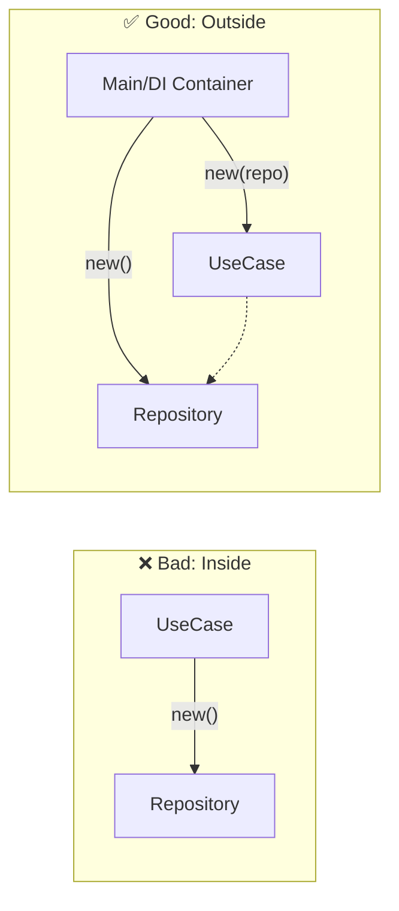

# 第15章：DI入門🧩（newしない世界へ）

([Past chat][1])([Past chat][1])([Past chat][1])([Past chat][2])([Past chat][3])

〜「差し替えできる設計」に一歩入る回だよ〜😊✨

---

## 0. いま章でできるようになること🎯

この章が終わると、こんなことができるようになります👇

* 「中で `new` しない」ってどういう意味か、腹落ちする😊
* コンストラクタ注入（Constructor Injection）の型を覚える✨
* Repositoryを **テスト用に差し替え**できるようになる🎁
* DIコンテナ（.NET標準）に登録する“雰囲気”まで触れる（深掘りは次章🏗️）

> ちなみに2026年1月時点の最新は **.NET 10（LTS）** で、C#は **C# 14** が最新です。([Microsoft][4])
> （Visual Studio 2026に .NET 10 SDK が入るよ、という公式記述もあります）([Microsoft Learn][5])

---

## 1. まず「DI」ってなに？🧠💡（めっちゃ一言）


DI（Dependency Injection）＝ **必要な部品を“外から渡す”こと** です😊

* ❌ 悪い例：クラスの中で勝手に `new` して部品を作る
* ✅ 良い例：クラスの外で部品を作って、**コンストラクタで渡す**



これだけで、なにが嬉しいかというと……

* 部品（Repositoryなど）を **本物／偽物（テスト用）に差し替え**できる🎁
* 上位の層が「下位の実装」に縛られにくくなる🔗✨
* つまり **レイヤードの“境界”が守りやすくなる**🚪✅

---

## 2. 「中でnewしない」って、何がダメなの？😢💥

例として、ToDo題材でいきます（家計簿/蔵書管理でも置き換えOKだよ📚✨）

### 2-1. ありがちな事故コード🚨（ApplicationがInfraを握ってる）

```csharp
// Application層（のつもり）
public class AddTodoUseCase
{
    public void Execute(string title)
    {
        var repo = new SqlTodoRepository(); // ← ここが地雷💣（Infrastructureの実装を直new）
        repo.Add(new Todo(title));
    }
}
```

これの何が困るかというと👇

* `SqlTodoRepository` に変えたい事情が出たら **UseCaseが巻き添えで改修**😵
* テストでDBを使いたくなくても、UseCaseが勝手にDBへ行く🗄️💥
* 依存の方向がグチャっとしやすい（「レイヤー違反」誘発）😇

---

## 3. DIの基本形：コンストラクタ注入✨（これが8割）

### 3-1. 「UseCaseはRepositoryの“インターフェースだけ”を知る」📍


まず、UseCaseは **具体クラスじゃなくて interface** に依存します。

```csharp
// 例：Application（またはDomain）側に置く想定
public interface ITodoRepository
{
    void Add(Todo todo);
}
```

次に、Infrastructureで実装します。

```csharp
// Infrastructure層
public class SqlTodoRepository : ITodoRepository
{
    public void Add(Todo todo)
    {
        // DBへ保存する処理（ここは詳細）
    }
}
```

そしてUseCaseはこうなる👇（コンストラクタで受け取る！）

```csharp
// Application層
public class AddTodoUseCase
{
    private readonly ITodoRepository _repo;

    public AddTodoUseCase(ITodoRepository repo)
    {
        _repo = repo;
    }

    public void Execute(string title)
    {
        _repo.Add(new Todo(title));
    }
}
```

✅ これでUseCaseは「保存方法（SQLとか）」を知らない子になった！えらい！🥳✨

---

## 4. じゃあ部品はどこで作るの？🤔（ここが次章の入口🏗️）

DIは「外から渡す」なので、**どこかで組み立て**ます。

### 4-1. まずは手で配線（手動DI）🧵（理解用に最高）


Presentation側（例えばConsoleやAPIの入口）でこうします👇

```csharp
// Presentation層（入口）
var repo = new SqlTodoRepository();
var useCase = new AddTodoUseCase(repo);

useCase.Execute("牛乳を買う");
```

これだけで「中でnewしない」が成立🎉
**“組み立ては外、利用は中”** って覚えると気持ちいいよ😊✨

---

## 5. .NET標準のDIコンテナ（超さわり）🧰✨


.NET（ASP.NET Core系）には標準のDIがあって、`IServiceCollection` に登録します。([Microsoft Learn][6])

```csharp
// Program.cs（雰囲気）
// builder.Services は IServiceCollection

builder.Services.AddScoped<ITodoRepository, SqlTodoRepository>();
builder.Services.AddScoped<AddTodoUseCase>();
```

* `AddScoped` / `AddTransient` / `AddSingleton` が出てきて「うっ…」となるけど大丈夫😌
* ライフサイクルは次章以降で育てればOK🌱

---

## 6. ライフサイクル超入門⏳（今は“事故らない”が目標）

DI登録には「寿命」があります👶➡️👵

### 6-1. ざっくり3兄弟👨‍👩‍👧‍👦


* **Transient**：呼ばれるたびに新しい（使い捨て）🧻
* **Scoped**：同じ“範囲”では同じ（Webなら1リクエスト単位が多い）📦
* **Singleton**：アプリ起動中ずっと同じ（共有）♾️

公式ドキュメントでも、スコープ周りの注意（例：ミドルウェアでの注入方法など）が説明されています。([Microsoft Learn][6])

### 6-2. 初心者の安全運転ルール🚗💨（まずこれでOK）

* DBアクセス系（Repository / DbContext系）は **Scoped** に寄せる🗄️
* 状態を持たない処理（フォーマッタ等）は **Transient** でもOK✨
* Singletonは「不変」「スレッド安全」なものだけにする（最初は控えめ）🧊

---

## 7. DIの本当のご褒美：テストで差し替え🧪🍰

ここが一番気持ちいいところ！🥹✨

### 7-1. テスト用Repository（インメモリ偽物）を作る🎭

```csharp
public class InMemoryTodoRepository : ITodoRepository
{
    public List<Todo> Added { get; } = new();

    public void Add(Todo todo)
    {
        Added.Add(todo);
    }
}
```

### 7-2. UseCaseに差し替えてテスト🎉

```csharp
using Xunit;

public class AddTodoUseCaseTests
{
    [Fact]
    public void Execute_AddsTodo()
    {
        var fakeRepo = new InMemoryTodoRepository();
        var useCase = new AddTodoUseCase(fakeRepo);

        useCase.Execute("テスト用ToDo");

        Assert.Single(fakeRepo.Added);
        Assert.Equal("テスト用ToDo", fakeRepo.Added[0].Title);
    }
}
```

✅ DBなしで爆速テストできる！うれしい！🍰✨
（レイヤードの“分けた価値”がここで回収できるのが最高ポイントです😆）

---

## 8. DIでやりがちな落とし穴集⚠️（先に避けよう）

### 8-1. “Service Locator”しちゃう問題🕵️‍♀️


```csharp
public class AddTodoUseCase
{
    public AddTodoUseCase(IServiceProvider sp) // ← なんでも取れる魔法
    {
        var repo = sp.GetService<ITodoRepository>(); // ← 依存が見えなくなる
    }
}
```

* これ、依存がコードから見えなくなって「設計が濁る」😭
* 基本は **必要なものをコンストラクタに並べる** のが正解✅

### 8-2. コンストラクタ引数が増えすぎる問題🐙

引数が8個とかになってきたら、だいたい👇のどれかが起きてます

* クラスの責務が大きい（分割の合図）✂️
* “まとめ役”が必要（後の章のComposition RootやFacadeの出番）🏗️
* 似た依存が多い（設定・ファクトリ・ポリシー化が候補）🧩

---

## 9. Visual Studioで楽する小技🪄✨（DIは量産なので）

* `Ctrl + .` で **コンストラクタ生成**（フィールドも自動）🛠️
* “Extract Interface” で interfaceを切り出し📎
* “Find All References” で `new` を検索して「DI化の対象」を炙り出す🔍

---

## 10. ミニ課題🎮（手を動かすと一気にわかる）

### 課題A：`new` 撲滅チャレンジ🧹

1. Application層の中で `new SqlTodoRepository()` を探す
2. `ITodoRepository` に置き換える
3. Presentation側で手動DIする（`new AddTodoUseCase(repo)`）

### 課題B：偽物Repositoryでテスト🧪

* `InMemoryTodoRepository` を作って
* `Execute()` が呼ばれたら `Added` に入ることをテストで確認✅

---

## 11. 章末チェックリスト✅（これを満たせば勝ち）

* [ ] UseCaseの中に `new Sql...Repository()` がいない🧟‍♂️❌
* [ ] UseCaseは **interface** に依存してる🎯
* [ ] 依存は **コンストラクタ** で受け取ってる📦
* [ ] テストでRepositoryを **差し替え**できた🎁
* [ ] `IServiceProvider` を乱用してない🕵️‍♀️❌

---

## 12. よくあるQ&A🙋‍♀️

### Q1. 「DIって、結局 `new` する場所が移動しただけ？」🤔

A. うん、まずはそれで正解😊✨
でも「移動した」ことで、**差し替え**と**境界の維持**ができるようになったのが本質🎁

### Q2. 「全部DIにしないとダメ？」😵

A. 最初は「外部に触るやつ」優先でOK！
Repository / HTTP / File / Clock（現在時刻）みたいな“変わりやすい子”からやると失敗しにくいよ🧊✨

### Q3. 「どこまでinterface切るの？」✂️

A. まずは **差し替えたいものだけ** で十分🌱
（“全部interface病”はつらいので、YAGNI精神で🙆‍♀️）

---

## 13. AIプロンプト例🤖✨（Copilot/Codexに手伝わせよ）

### レイヤー違反チェック✅

* 「このUseCaseの `new` がレイヤー違反にならないように、DI（コンストラクタ注入）へリファクタして。必要なinterfaceの追加も提案して。」

### テスト自動生成🧪

* 「`AddTodoUseCase` をxUnitでテストしたい。DBに触れない `InMemoryTodoRepository` を用意して、最小のテストを生成して。」

### “引数が増えすぎ”相談🐙

* 「このクラスのコンストラクタ引数が多すぎる。責務分割の候補と、依存をまとめる設計案を複数出して。」

---

## まとめ🎀

DIは「難しい道具」というより、**レイヤードを守るための“習慣”**です😊✨
この章は「形を覚えた」だけで十分！次の第16章で、依存を**1か所で組み立てる（Composition Root）**に進むと、世界が一気に整理されます🏗️💖

[1]: https://chatgpt.com/c/696ba21c-adf8-8321-bfb7-b43ae5942c10 "設計優先度の記憶"
[2]: https://chatgpt.com/c/696b9d32-f370-8321-8318-b90410907f06 "教材目次確認"
[3]: https://chatgpt.com/c/6965813b-c8e8-8324-8b94-98d8ad44224a "第9章 高凝集命名ガイド"
[4]: https://dotnet.microsoft.com/en-us/platform/support/policy/dotnet-core?utm_source=chatgpt.com "NET and .NET Core official support policy"
[5]: https://learn.microsoft.com/en-us/dotnet/csharp/whats-new/csharp-14?utm_source=chatgpt.com "What's new in C# 14"
[6]: https://learn.microsoft.com/en-us/aspnet/core/fundamentals/dependency-injection?view=aspnetcore-10.0&utm_source=chatgpt.com "Dependency injection in ASP.NET Core"

