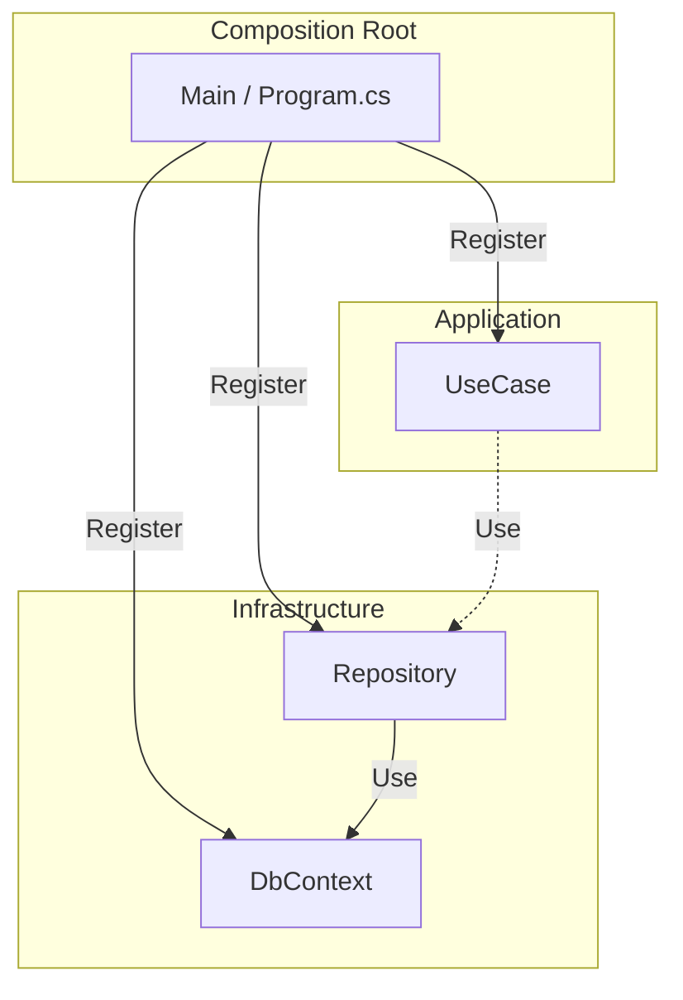

# 第16章：DI実践①（Composition Rootの考え方）🏗️

〜「依存を組み立てる場所」を1か所に集めて、迷子ゼロへ😊🗺️〜

---

## 1. まず結論！Composition Rootってなに？🌟


**Composition Root（コンポジション・ルート）**は、超ざっくり言うと…

✅ **アプリの“入口”で、必要な部品（依存）をぜんぶ組み立てる場所**です🔧
✅ **「ここ以外で依存を組み立てない！」と決める場所**です🚪
✅ すると… **「どこでnewするの？どこで注入するの？」が一気に解決**します😊🎉

ASP.NET Core（いま主流のテンプレ）だと、**Program.cs がほぼComposition Root**になります👍（DIの登録もここから始める流れが基本です）([Microsoft Learn][1])

---

## 2. なんで必要なの？（“迷子”が消える）🧠💭


DIをやってると、初心者がハマりやすいのがコレ👇

### 😵あるある事故

* 「Controllerでは注入してるのに、UseCaseの中でnewしちゃった…」💥
* 「Repositoryどこで差し替えるんだっけ？」😵‍💫
* 「テストの時だけFakeにしたいのに、あちこち直す羽目…」😇

### 😍Composition Rootがあると

* 依存の組み立てが**1か所**→探さない🔍❌
* 差し替えが**登録の1行**→楽ちん🎁
* “newが散らばる”のを防げる→層がキレイ✨🧹

---

## 3. イメージ図（頭の中を1枚絵に）🧩🧱


「依存オブジェクトのつながり（Object Graph）」を、入口で作る感じだよ〜😊



* Presentation（入口）🚪

  * Program.cs（Composition Root）で「組み立て」🔧
* Application（手順書）📋

  * UseCaseは **“必要なものをお願いするだけ”** 🙏
* Domain（ルール）💎

  * できるだけ純粋に✨
* Infrastructure（外部の詳細）📦

  * DBやHTTPなどの実装（差し替え対象）🔁

---

## 4. “やっていいnew / ダメなnew” ルール🔥


### ✅やっていい（ほぼここだけ）

* **Composition Root（Program.cs 付近）での登録・組み立て**

  * ただしASP.NET Coreでは、実際は `AddScoped` 等で登録するのが基本（直接newは最小限）([Microsoft Learn][1])

### ❌やっちゃダメ（散らかる原因）

* UseCaseやDomainの中で `new SqlSomething()` みたいな“実装直呼び”
* `IServiceProvider` を注入して、必要な時に `GetService()` する（Service Locator化）⚠️

  * 「どこで何が必要か」がコードから読めなくなって、テストもしんどいです😵‍💫

---

## 5. 具体例：ToDo題材で “Composition Root化” してみよう🎮📝

ここから、ミニ例で「組み立てが1か所になる」体験をしよ〜！🥳

### 5.1 Application：UseCaseは“お願いするだけ”🙏


```csharp
// Application
public interface ITodoRepository
{
    Task AddAsync(TodoItem item, CancellationToken ct);
}

public sealed class AddTodoUseCase
{
    private readonly ITodoRepository _repo;

    public AddTodoUseCase(ITodoRepository repo)
        => _repo = repo;

    public Task HandleAsync(string title, CancellationToken ct)
    {
        var item = TodoItem.Create(title); // Domainのルールで生成✨
        return _repo.AddAsync(item, ct);
    }
}
```

ポイント😍

* UseCaseは `ITodoRepository` **という“約束（interface）”だけ知ってる**
* DBがSQLでもSQLiteでも、UseCaseは気にしない🙆‍♀️

---

### 5.2 Domain：ルールはここで守る🔒💎

```csharp
// Domain
public sealed class TodoItem
{
    public string Title { get; }

    private TodoItem(string title) => Title = title;

    public static TodoItem Create(string title)
    {
        if (string.IsNullOrWhiteSpace(title))
            throw new ArgumentException("Title is required.");

        if (title.Length > 100)
            throw new ArgumentException("Title is too long.");

        return new TodoItem(title.Trim());
    }
}
```

---

### 5.3 Infrastructure：実装（差し替え対象）📦🔁

まずは分かりやすく **InMemory版**にしちゃう（後でDB版に差し替えOK）😊

```csharp
// Infrastructure
public sealed class InMemoryTodoRepository : ITodoRepository
{
    private readonly List<TodoItem> _items = new();

    public Task AddAsync(TodoItem item, CancellationToken ct)
    {
        _items.Add(item);
        return Task.CompletedTask;
    }
}
```

---

## 6. そして本題！Program.cs が Composition Root 🎯🏗️

ASP.NET Coreでは **Program.cs でDI登録するのが基本**だよ〜（Minimal Hostingモデルで1ファイルにまとまってるのが今の主流）([Microsoft Learn][1])

```csharp
// Presentation (Program.cs)
var builder = WebApplication.CreateBuilder(args);

// ✅ Composition Root：ここで依存を組み立てる！
builder.Services.AddControllers();

// Application
builder.Services.AddScoped<AddTodoUseCase>();

// Infrastructure（いまはInMemory）
builder.Services.AddSingleton<ITodoRepository, InMemoryTodoRepository>();

var app = builder.Build();
app.MapControllers();
app.Run();
```

これで…
🎉 「UseCaseが欲しいものはDIが渡してくれる」
🎉 「Repository差し替えはProgram.csの1行」
になりました！😊✨

---

## 7. Program.csが太る問題…どうする？😵 → “登録をまとめる”✨


規模が増えると、Program.csが `AddScoped` だらけでつらくなるよね💦
そこで、公式ドキュメントでもよく出てくる定番が👇

✅ **登録を “Add{Group}” の拡張メソッドにまとめる** ([Microsoft Learn][1])

### 7.1 Application側：AddApplication() を作る📦✨

```csharp
// Application project
using Microsoft.Extensions.DependencyInjection;

public static class DependencyInjection
{
    public static IServiceCollection AddApplication(this IServiceCollection services)
    {
        services.AddScoped<AddTodoUseCase>();
        return services;
    }
}
```

### 7.2 Infrastructure側：AddInfrastructure() を作る🗄️✨

```csharp
// Infrastructure project
using Microsoft.Extensions.DependencyInjection;

public static class DependencyInjection
{
    public static IServiceCollection AddInfrastructure(this IServiceCollection services)
    {
        services.AddSingleton<ITodoRepository, InMemoryTodoRepository>();
        return services;
    }
}
```

### 7.3 Program.cs：超スッキリ😍

```csharp
var builder = WebApplication.CreateBuilder(args);

builder.Services.AddControllers();
builder.Services.AddApplication();
builder.Services.AddInfrastructure();

var app = builder.Build();
app.MapControllers();
app.Run();
```

これが「Composition Rootは入口、でも登録は散らかさない」最強スタイルです💪✨

---

## 8. “差し替え”が気持ちよすぎる例🎁（テスト・環境別）


### 8.1 テストのときだけFakeにする🧪

テストプロジェクトで、Composition Root相当の場所に…👇

```csharp
services.AddSingleton<ITodoRepository, FakeTodoRepository>();
```

たったこれだけで、UseCaseはそのまま！😳✨
（だからDIは“テストしやすさ”がご褒美なんだよ〜🍰）

### 8.2 本番だけDB実装にする（登録の1行だけ）🔁

```csharp
// 例：InMemory → Sql版に変更
services.AddScoped<ITodoRepository, SqlTodoRepository>();
```

---

## 9. 初心者がハマる罠ベスト3（ここ超大事）⚠️💥

### 罠①：UseCaseの中で `new` しちゃう

→ DIの意味が半減🥲（差し替えできない）

### 罠②：`IServiceProvider` を注入して取り出す（Service Locator）


→ “必要な依存”が見えなくなる😵‍💫

### 罠③：登録場所が複数に分裂

→ 「どこで登録した？」ゲームが始まる🎮（地獄）

---

## 10. 章末チェックリスト✅🎀

* [ ] 依存の組み立ては **Program.cs（入口）に集まってる？** 🏗️
* [ ] UseCase/Domain内で **具体実装をnewしてない？** 🙅‍♀️
* [ ] `AddApplication()` / `AddInfrastructure()` で **登録が整理されてる？** 🧹
* [ ] 差し替えは **登録1行でできる？** 🔁

---

## 11. ミニ課題（やると一気に身につく）💪📝

### 課題A：通知を差し替えよう📮

`INotificationSender` を作って、

* Dev：Console通知📢
* Prod：Email通知📧
  に差し替えてみよう！（差し替えはProgram.cs側だけで！）

### 課題B：UseCaseをテストしよう🧪

FakeRepositoryを使って `AddTodoUseCase` のテストを書いてみよう😊

---

## 12. AI相棒（Copilot/Codex）に頼むときのプロンプト例🤖✨

そのままコピペでOKだよ〜📋💕

* 「Application層に `AddApplication()` 拡張メソッドを作って、UseCase登録をまとめて」
* 「Infrastructure層に `AddInfrastructure()` を作って、Repository実装登録をまとめて」
* 「UseCase内の `new` をなくして、DIで注入する形にリファクタして」
* 「Service Locatorになってる箇所がないかレビューして、改善案も出して」

---

## おまけ：今どきの.NETの“前提として知っておくと安心”メモ📌✨

* .NET 10 は **LTS**として提供されていて、サポートポリシー上も長期運用向きだよ〜📦🛡️（2026-01-13時点の最新パッチ情報も公開されています）([Microsoft for Developers][2])
* DIは `IServiceCollection` に登録して、`IServiceProvider` が解決する仕組み（公式ドキュメントもここを軸に説明してるよ）([Microsoft Learn][3])

---

次の第17章では、ここで組み立てた依存たちの「寿命（ライフサイクル）」を、事故らない範囲でサクッと掴んでいくよ〜⏳😊✨

[1]: https://learn.microsoft.com/en-us/aspnet/core/fundamentals/dependency-injection?view=aspnetcore-10.0&utm_source=chatgpt.com "Dependency injection in ASP.NET Core"
[2]: https://devblogs.microsoft.com/dotnet/announcing-dotnet-10/?utm_source=chatgpt.com "Announcing .NET 10"
[3]: https://learn.microsoft.com/en-us/dotnet/core/extensions/dependency-injection-usage?utm_source=chatgpt.com "Tutorial: Use dependency injection in .NET"

