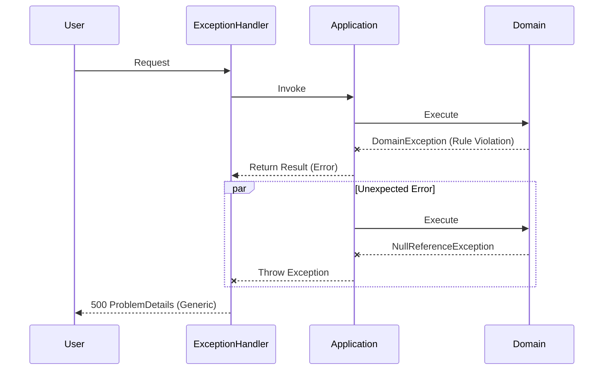

# 第18章：エラー設計①⚠️（境界で握る・変換する）

この章は、**「エラーが起きた時に、アプリが“ぐちゃっ”とならない設計」**を身につける回だよ〜🧯✨
レイヤードで作るとき、エラーは放っておくと **層をまたいで汚染**しがちなので、ここで“型”を作っておくのが超大事🥺💡

ちなみに2026時点の最新系（.NET 10 / C# 14）では、ASP.NET Coreの例外ハンドリング＆ProblemDetails周りがかなり整ってるよ🙌
（.NET 10 と C# 14 の組み合わせ、そして最近のサービス更新も確認済み）([Microsoft for Developers][1])

---

## 1. 今日のゴール🎯✨

この章を終えると、こうなるよ👇

* **エラーを3種類に分けて考えられる**（Domain / Application / Infrastructure）🧩
* **「どこで例外を捕まえる？」に迷わなくなる**🧤
* **UI/APIに返すエラーの形を統一できる**（ProblemDetailsなど）📮
* 「ログに出すべきもの／出しすぎないもの」も判断できる👀📝

---

## 2. ありがちな事故💥（設計してないとこうなる）


例：ToDoアプリで「タイトル空」で登録しようとした時…

* Domainで例外スロー😱
* Applicationで握りつぶす😵‍💫
* Presentationで `catch(Exception ex)` して文字列返す😇
* UIには「System.NullReferenceException」とか出てしまう（最悪）☠️

これ、**“何が悪いか”が伝わらない**し、**後から直すのも地獄**🥲

だからここで方針を固定するよ💪✨

---

## 3. エラーを3種類に分けよう🧩⚠️


まず分類！これが最初の勝ち筋🏆

### A) Domainエラー💎（業務ルール違反・想定内）

* 「タイトルは必須」
* 「期限は過去にできない」
* 「残高が足りない」みたいなやつ💸
  ➡️ **想定内**。ユーザーに“丁寧に”伝えたい。

### B) Applicationエラー🎮（ユースケース都合・やり取りの失敗）

* 「指定IDのToDoが存在しない」
* 「同名が重複している」
* 「権限がない」
  ➡️ Domainというより **“手順として成立しない”** 系。

### C) Infrastructureエラー🗄️🌩️（外部要因・想定外寄り）

* DB接続失敗
* HTTPタイムアウト
* ファイル書き込み不可
  ➡️ 多くはユーザーに詳細を見せない。**運用/ログで追う**。

---

## 4. 例外（Exception）と Result、どっち使うの？🤔


ここも迷いどころだけど、初心者向けの強いルールはこれ👇

### ✅ ルール（超実用）

* **想定内（Domain/Applicationの“起こりうる失敗”）→ Resultで返す**📦
* **想定外（バグ・外部障害・取りこぼし）→ 例外で上に飛ばす**🚀
* そして **境界（Presentation）で例外をまとめて握って、返す形に変換**🧤📮

APIの場合、その“返す形”として **ProblemDetails（RFC 7807）**が定番だよ🧾✨
ASP.NET Coreも「例外ハンドラーでRFC 7807準拠のエラーペイロードを返す」例を公式で案内してるよ([Microsoft Learn][2])

---

## 5. どこで例外を捕まえる？🧤（境界で握る、が基本）


レイヤードの考え方で、こう分担すると超ラク👇

* **Domain層**：基本 catch しない（ルール違反はResultで返す）💎
* **Application層**：Resultを集約・変換する（ユースケースとしてのエラーへ）🎮
* **Infrastructure層**：外部例外は投げてもOK（Applicationまで上げる）🗄️
* **Presentation層**：

  * ResultはHTTP/画面表示用に整形📮
  * 例外はグローバルに捕捉して ProblemDetails 等に変換🧯



ASP.NET Core なら、例外ハンドリングは **Exception Handler Middleware** を使うのが基本ルートだよ([Microsoft Learn][3])

---

## 6. 実装してみよう：最小 Result 型📦✨（まずは自作でOK）


外部ライブラリ（FluentResults等）もあるけど、最初は“仕組みを理解”したいので小さく自作しよ🧠💡

```csharp
namespace MyApp.Domain.Shared;

public sealed record Error(string Code, string Message);

public sealed class Result<T>
{
    public bool IsSuccess { get; }
    public T? Value { get; }
    public Error? Error { get; }

    private Result(bool isSuccess, T? value, Error? error)
    {
        IsSuccess = isSuccess;
        Value = value;
        Error = error;
    }

    public static Result<T> Ok(T value) => new(true, value, null);
    public static Result<T> Fail(Error error) => new(false, default, error);
}
```

ポイント🎀

* **ResultはDomain寄りの共有**（Shared）に置くと、層の依存が崩れにくいよ✅
* “失敗は値として返す”感じ📦

---

## 7. Domainエラーを定義する💎⚠️（コードとメッセージは分ける）


「画面に出す文言」をDomainに直接埋め込むと、UI都合に引っ張られやすい🥲
なのでまずは **Code中心**にするのがおすすめ！

```csharp
namespace MyApp.Domain.Todos;

using MyApp.Domain.Shared;

public static class TodoErrors
{
    public static readonly Error TitleRequired
        = new("todo.title.required", "タイトルは必須です。");

    public static readonly Error TitleTooLong
        = new("todo.title.too_long", "タイトルが長すぎます。");
}
```

※Messageは日本語でもOKだけど、将来「UI層で翻訳したい」なら **MessageはUIで持つ**方がさらに強いよ💪✨（今は理解優先でOK〜）

---

## 8. ValueObjectで“無効な状態を作らない”🔒✨

タイトルをValueObjectにして、作れないならResultで返す！

```csharp
namespace MyApp.Domain.Todos;

using MyApp.Domain.Shared;

public sealed record TodoTitle(string Value)
{
    public const int MaxLength = 50;

    public static Result<TodoTitle> Create(string? value)
    {
        if (string.IsNullOrWhiteSpace(value))
            return Result<TodoTitle>.Fail(TodoErrors.TitleRequired);

        var trimmed = value.Trim();
        if (trimmed.Length > MaxLength)
            return Result<TodoTitle>.Fail(TodoErrors.TitleTooLong);

        return Result<TodoTitle>.Ok(new TodoTitle(trimmed));
    }
}
```

これでDomainは常に「正しいデータだけ」を扱えるようになるよ〜💎✨
（**例外に頼らない**のがミソ！）

---

## 9. Applicationで“境界変換”する🎮📮

例：ToDo追加ユースケース（UseCase）が、UI/HTTPに返す形へ整える前段を担当するよ✨

```csharp
namespace MyApp.Application.Todos;

using MyApp.Domain.Shared;
using MyApp.Domain.Todos;

public sealed class AddTodoUseCase
{
    private readonly ITodoRepository _repo;

    public AddTodoUseCase(ITodoRepository repo)
    {
        _repo = repo;
    }

    public async Task<Result<TodoId>> ExecuteAsync(string? title, CancellationToken ct)
    {
        var titleResult = TodoTitle.Create(title);
        if (!titleResult.IsSuccess)
            return Result<TodoId>.Fail(titleResult.Error!);

        // Domain的に正しい値だけがここに来る✨
        var todo = TodoItem.CreateNew(titleResult.Value!);

        // DBなどの例外はここで起きる可能性あり（インフラ要因）
        await _repo.SaveAsync(todo, ct);

        return Result<TodoId>.Ok(todo.Id);
    }
}
```

ここで大事なのは👇

* **DomainエラーはResultで戻す**
* **インフラ例外は例外のまま上に上げてOK**（後で境界で握る）🧯

---

## 10. Presentationで“UIに返す形”へ📮✨（APIならProblemDetails）

ASP.NET Coreでは ProblemDetails が定番！
公式ドキュメントでも ProblemDetails の仕組みや `AddProblemDetails` が説明されてるよ([Microsoft Learn][2])

### 10-1) Result → 400/200 に変換（想定内）

最小API例（ResultをHTTPへ）👇

```csharp
app.MapPost("/todos", async (AddTodoUseCase useCase, TodoCreateRequest req, CancellationToken ct) =>
{
    var result = await useCase.ExecuteAsync(req.Title, ct);

    if (result.IsSuccess)
        return Results.Created($"/todos/{result.Value}", new { id = result.Value });

    // 想定内エラー → 400 (BadRequest) でProblemDetailsを返す
    return Results.Problem(
        statusCode: StatusCodes.Status400BadRequest,
        title: "入力が正しくありません",
        detail: result.Error!.Message,
        extensions: new Dictionary<string, object?>
        {
            ["errorCode"] = result.Error!.Code
        }
    );
});

public sealed record TodoCreateRequest(string? Title);
```

### 10-2) 例外 → グローバルで握る（想定外）

ASP.NET Coreは **Exception Handler Middleware** が基本✨([Microsoft Learn][3])
さらに `.NET 8+` で `IExceptionHandler` が導入されて、**例外→ProblemDetails変換**を整理しやすくなったよ([Microsoft Learn][3])

---

## 11. グローバル例外ハンドラ（IExceptionHandler）を作る🧯✨


「想定外」をここで **まとめてProblemDetails化**しよう！

```csharp
using Microsoft.AspNetCore.Diagnostics;

public sealed class GlobalExceptionHandler : IExceptionHandler
{
    private readonly ILogger<GlobalExceptionHandler> _logger;

    public GlobalExceptionHandler(ILogger<GlobalExceptionHandler> logger)
    {
        _logger = logger;
    }

    public async ValueTask<bool> TryHandleAsync(
        HttpContext httpContext,
        Exception exception,
        CancellationToken cancellationToken)
    {
        var traceId = httpContext.TraceIdentifier;

        // ログはここで一括（詳細はログ、レスポンスは安全に）
        _logger.LogError(exception, "Unhandled exception. TraceId={TraceId}", traceId);

        httpContext.Response.StatusCode = StatusCodes.Status500InternalServerError;

        await httpContext.Response.WriteAsJsonAsync(new
        {
            type = "https://example.com/problems/unhandled",
            title = "サーバー側で問題が発生しました",
            status = 500,
            detail = "時間をおいて再度お試しください。",
            traceId
        }, cancellationToken);

        return true; // ここで処理完了
    }
}
```

> ここでは分かりやすく “自前JSON” にしたけど、ProblemDetailsサービスを使ってもっと統一することもできるよ（次章以降でもOK）([Microsoft Learn][2])

---

## 12. Program.cs（登録とミドルウェア順）🔧✨

`IExceptionHandler` は `AddExceptionHandler<T>()` で登録して、`UseExceptionHandler()` を有効化する流れが基本だよ([Microsoft Learn][3])

```csharp
using Microsoft.AspNetCore.Builder;

var builder = WebApplication.CreateBuilder(args);

// ProblemDetailsのサービス（標準のProblemDetails生成基盤）
builder.Services.AddProblemDetails(); // :contentReference[oaicite:8]{index=8}

builder.Services.AddExceptionHandler<GlobalExceptionHandler>(); // :contentReference[oaicite:9]{index=9}

builder.Services.AddScoped<AddTodoUseCase>();

var app = builder.Build();

// 例外はグローバルで捕まえる（開発/本番で挙動変えるのが一般的）
app.UseExceptionHandler(); // :contentReference[oaicite:10]{index=10}

app.MapPost("/todos", /* さっきのやつ */);

app.Run();
```

📝ちょい最新トピック：
.NET 10以降、例外を「処理済み」としたときの診断（ログ/メトリック）出し方にオプションが増えてるよ。必要なら `SuppressDiagnosticsCallback` で制御できる🧪([Microsoft Learn][3])

---

## 13. “漏らしちゃダメ情報”に注意🕵️‍♀️💥

レスポンスにこれを出すのは危険になりがち👇

* 例外メッセージ全文（SQL文とかパスとか出る）☠️
* スタックトレース（内部構造がバレる）🧨
* 接続先情報（ホスト名等）🔓

代わりにおすすめは👇

* ユーザー向け：短く・安全な文言
* 開発/運用向け：ログに詳細
* つなぎ：`traceId` を返して「問い合わせ時にこれ言ってね」方式📎✨

---

## 14. ミニ演習✍️🧪（手を動かすと一気に理解できる！）

### 演習1：Domainエラーを増やす💎

* `Title` に「禁止ワード」を入れたら `todo.title.forbidden` を返すようにしてみよ😈

### 演習2：Infrastructure例外を再現🗄️

* Repositoryでわざと例外を投げて、グローバルハンドラが動くのを確認🔥

### 演習3：HTTPステータスを分ける📮

* `NotFound` 系（例：更新対象が存在しない）を 404 にしてみよ👣

---

## 章末チェックリスト✅✨

* [ ] Domainの“想定内失敗”を例外で投げてない？（Resultになってる？）
* [ ] Presentationで **戻り値(Result)と例外(Exception)** を分けて扱えてる？
* [ ] エラーのレスポンス形式が統一されてる？（ProblemDetailsなど）([Microsoft Learn][2])
* [ ] ログにだけ詳細を出して、レスポンスは安全？🧯
* [ ] `traceId` 的な追跡キーがある？📎

---

## よくある質問Q&A🙋‍♀️💬

### Q1. Domainでも例外投げちゃダメ？

A. **“想定内”なら投げない方がラク**だよ📦✨（入力不足やルール違反など）
ただし、**「絶対起こらないはず（バグ）」**は例外でOK（不変条件が破れた等）💥

### Q2. Result型ってどこに置くのがいい？

A. 依存の向きを壊さないために、Domain側の **Shared（共通）**に置くのが安定✅
（Presentation→Domain方向の参照が増えるのを防げるよ）

### Q3. APIでエラーなのに 200 を返して `{ success:false }` にしていい？

A. 初心者ほどハマるけど、基本は **HTTPステータスを正しく返す**のが後々ラク！📮
ProblemDetailsと相性も良いよ([Microsoft Learn][2])

---

## AIプロンプト例🤖✨（Copilot/Codexに投げる用）

そのままコピペでOKだよ〜💕

1. **エラー分類レビュー**

* 「このコードのエラーを Domain / Application / Infrastructure に分類して、各層でどう扱うべきか提案して。層の依存ルールも守ってね。」

2. **Result化リファクタ**

* 「例外で投げている“想定内エラー”を Result パターンに置き換えて。ErrorCodeも提案して。」

3. **ProblemDetails設計**

* 「APIの失敗レスポンスを ProblemDetails 形式で統一したい。404/409/400/500 の使い分けルールと、extensionsに入れるべき項目（errorCode/traceId等）を提案して。」([Microsoft Learn][2])

4. **グローバル例外ハンドラ**

* 「IExceptionHandler を使って例外を ProblemDetails に変換する実装例を、ログ設計（情報漏洩防止）込みで出して。」([Microsoft Learn][3])

---

次の第19章は、このエラー設計ができてると **テストがめちゃ楽になる**“ご褒美回”だよ〜🍰🧪✨

[1]: https://devblogs.microsoft.com/dotnet/introducing-csharp-14/?utm_source=chatgpt.com "Introducing C# 14 - .NET Blog"
[2]: https://learn.microsoft.com/en-us/aspnet/core/fundamentals/error-handling-api?view=aspnetcore-10.0&utm_source=chatgpt.com "Handle errors in ASP.NET Core APIs"
[3]: https://learn.microsoft.com/en-us/aspnet/core/fundamentals/error-handling?view=aspnetcore-10.0&utm_source=chatgpt.com "Handle errors in ASP.NET Core"

