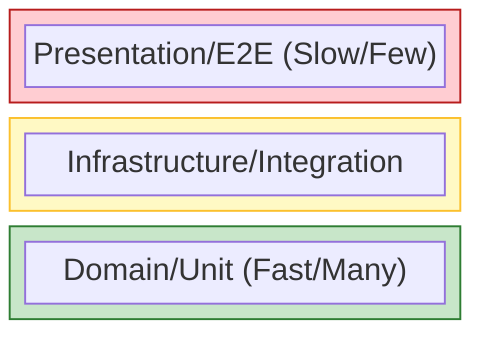

# 第19章：テスト設計🧪（層分けのご褒美）

レイヤードで「ぐちゃぐちゃが起きにくい」状態を作れたら…次に来るご褒美が **テストがラクになる** こと！🎁✨
この章では、**どの層をどうテストするのが気持ちいいか** を、実戦寄りにまとめるよ〜！💪😊

---

## 1) まず結論：テストは「層ごとに得意分野」がある🏗️🧠


レイヤードのテストは、ざっくりこう分けるとハマりにくいよ👇

* **Domain**：ユニットテストの天国🍰（最速・最強）
* **Application**：モック/フェイクで「手順」を検証🎮
* **Infrastructure**：DB/外部I/Oは統合テストで「最低限の線」✍️
* **Presentation**：薄いので「数は少なめ」、必要なら統合テストでOK🎨

> ちなみに `dotnet test` は **VSTest** か **Microsoft Testing Platform (MTP)** を使って実行できて、MTPは .NET 10 SDK 以降で使えるよ🚀 ([Microsoft Learn][1])

---

## 2) テストの「ピラミッド」感覚を持つ🔺✨


理想の比率はこんな感じ（目安だよ）👇

* **ユニットテスト（多）**：Domain中心🍰🍰🍰
* **サービス/ユースケーステスト（中）**：Application🎮🎮
* **統合テスト（少）**：Infrastructure/Presentation🧪

多い順に「速い・壊れにくい・原因特定が簡単」になりがち😌✨
逆に統合テストを増やしすぎると、遅い＆不安定になりやすい⚠️



---

## 3) ソリューション構成：テスト用プロジェクトを“層別”にする📦🧩


おすすめはこう👇（例：ToDo題材）

* `MyApp.Domain`
* `MyApp.Application`
* `MyApp.Infrastructure`
* `MyApp.Presentation`

テスト側は…

* `MyApp.Domain.Tests`
* `MyApp.Application.Tests`
* `MyApp.Infrastructure.Tests`（統合テスト置き場）
* `MyApp.Presentation.Tests`（必要なら）

**参照ルールのコツ**🔗✨

* `Domain.Tests` → `Domain` だけ参照
* `Application.Tests` → `Application`（＋必要なら `Domain`）
* `Infrastructure.Tests` → `Infrastructure`（＋ `Application`/`Domain`）
* `Presentation.Tests` → `Presentation`（統合寄りならここで `Program` まで）

---

## 4) どのテストフレームワークがいい？🧰✨（迷いを減らす）

ここは「好み」でOKなんだけど、最新事情としてはこんな感じ👇

* **xUnit**：v3系が進んでる（リリースノートにまとまってる） ([xUnit.net][2])
* **MSTest**：MTP対応が進んでて、MSTest runnerが “軽量ランナー” になってきてるよ🪶 ([Microsoft Learn][3])

この教材ではサンプルを **xUnit** で書くね（一般に読みやすいから）😊
※どれを使っても「層ごとのテスト設計」は同じ！

---

## 5) Domainのユニットテストが一番おいしい🍰✨


### ✅ Domainテストのルール（超大事）

* **DB触らない**🙅‍♀️
* **HTTP触らない**🙅‍♀️
* **日時や乱数に依存しない**（必要なら注入）⏰🎲
* **モック少なめ**（できればゼロ）✨

### 例：ValueObject（ToDoタイトル）をテストする🧠

#### Domain側（例）

```csharp
namespace MyApp.Domain;

public sealed class TodoTitle
{
    public string Value { get; }

    private TodoTitle(string value) => Value = value;

    public static TodoTitle Create(string value)
    {
        if (string.IsNullOrWhiteSpace(value))
            throw new ArgumentException("タイトルは必須です");

        if (value.Length > 50)
            throw new ArgumentException("タイトルは50文字以内です");

        return new TodoTitle(value.Trim());
    }
}
```

#### Domain.Tests側（例）

```csharp
using Xunit;
using MyApp.Domain;

public class TodoTitleTests
{
    [Fact]
    public void Create_空文字なら例外()
    {
        Assert.Throws<ArgumentException>(() => TodoTitle.Create(""));
    }

    [Fact]
    public void Create_前後の空白はトリムされる()
    {
        var title = TodoTitle.Create("  hello  ");
        Assert.Equal("hello", title.Value);
    }

    [Fact]
    public void Create_51文字なら例外()
    {
        var s = new string('a', 51);
        Assert.Throws<ArgumentException>(() => TodoTitle.Create(s));
    }
}
```

### ✅ Domainテストの「観点テンプレ」🎯

* 不正入力（null/空/範囲外）🚫
* 境界値（ちょうど50、51など）📏
* 状態遷移（未完了→完了など）🔁
* 不変条件（絶対に崩れないルール）🔒

---

## 6) Applicationは「手順書」をテストする🎮🧪（モックが効く！）


Application層は「順番の調整係」📋
だからテストはこうなるよ👇

* **Domainルールの再テストはしない**（それはDomainでやる🍰）
* **外部依存（Repositoryなど）はモック/フェイクで差し替え**🧩
* **“呼ばれたか” “渡した値” “分岐したか”** を見る👀✨

### Moqで “保存が呼ばれた” を検証する例🪄

Moq の最新は NuGet に出てるよ（例：4.20.72） ([nuget.org][4])

#### Application側（例）

```csharp
namespace MyApp.Application;

public interface ITodoRepository
{
    Task AddAsync(TodoItem item, CancellationToken ct);
}

public sealed class AddTodoUseCase
{
    private readonly ITodoRepository _repo;

    public AddTodoUseCase(ITodoRepository repo) => _repo = repo;

    public async Task ExecuteAsync(string title, CancellationToken ct)
    {
        var item = TodoItem.Create(title); // Domainに寄せる
        await _repo.AddAsync(item, ct);
    }
}
```

#### Application.Tests側（例）

```csharp
using Moq;
using Xunit;
using MyApp.Application;

public class AddTodoUseCaseTests
{
    [Fact]
    public async Task ExecuteAsync_RepositoryにAddが呼ばれる()
    {
        var repo = new Mock<ITodoRepository>();
        var useCase = new AddTodoUseCase(repo.Object);

        await useCase.ExecuteAsync("buy milk", CancellationToken.None);

        repo.Verify(r => r.AddAsync(It.IsAny<TodoItem>(), It.IsAny<CancellationToken>()), Times.Once);
    }
}
```

---

## 7) Infrastructureの統合テスト：ここは“最低限の線”でOK✍️🧪


DBや外部I/Oを含むところは、統合テストで「動く保証」を取る場所😊
ただし増やしすぎ注意⚠️（遅い＆壊れやすい）

### ✅ EF Coreは「SQLite in-memory」がおすすめ寄り🧀

EF Coreのテストでは、プロバイダーの **InMemory** は挙動が本番DBとズレることがあるので、**SQLite** のほうが相性が良い、という案内があるよ📌 ([Microsoft Learn][5])

#### 例：SQLite in-memoryでRepositoryを統合テスト

```csharp
using Microsoft.Data.Sqlite;
using Microsoft.EntityFrameworkCore;
using Xunit;

public class TodoRepositoryIntegrationTests
{
    [Fact]
    public async Task AddしてReadできる()
    {
        // SQLite in-memory は接続を開いたままにするのがコツ🧠
        using var conn = new SqliteConnection("DataSource=:memory:");
        await conn.OpenAsync();

        var options = new DbContextOptionsBuilder<AppDbContext>()
            .UseSqlite(conn)
            .Options;

        await using (var setup = new AppDbContext(options))
        {
            await setup.Database.EnsureCreatedAsync();
        }

        await using (var db = new AppDbContext(options))
        {
            var repo = new EfTodoRepository(db);

            await repo.AddAsync(TodoItem.Create("hello"), CancellationToken.None);
            var list = await repo.ListAsync(CancellationToken.None);

            Assert.Single(list);
        }
    }
}
```

### ✅ もっと本番に寄せたいなら Testcontainers🐳

Dockerで“使い捨てDB”を立ち上げてテストするやつ！
Testcontainers for .NET は NuGet で配布されてるよ（例：4.10.0） ([nuget.org][6])

---

## 8) Presentationのテスト：薄いなら少なめでOK🎨✨

Presentationは「入力を受けて呼ぶだけ」になってるはずなので、ユニットテストを頑張りすぎないのがコツ😊

### Webなら統合テストが強い💪（必要な分だけ）

ASP.NET Core の統合テストは公式ドキュメントがまとまってるよ📚 ([Microsoft Learn][7])
（`WebApplicationFactory` でアプリを立ち上げて、HTTPで叩くやつ！）

---

## 9) コードカバレッジ：数字は“健康診断”🩺📈


Visual Studio 2026 ではテスト実行と一緒にコードカバレッジが見やすくなってるよ（テストメニューやTest Explorerから実行できる）🧪✨ ([Microsoft Learn][8])

### 注意：MTPとCoverletの相性⚠️

`coverlet.collector` は **VSTest向け** で、**Microsoft Testing Platform ではそのまま使えない** という注意があるよ📌 ([Microsoft Learn][9])
MTP側でカバレッジ取りたいなら、別手段（ツール）を使う方針にすると安全💡

---

## 10) よくある事故🔥（先に潰す！）

* **DomainでRepositoryを呼びたくなる** → それ、層が崩れるサイン🚨
* **EF Coreをモックし始める** → だいたい苦行😇（SQLiteやTestcontainersで統合テストへ） ([Microsoft Learn][5])
* **統合テストが増えすぎて遅い** → “最低限の線” に戻す✍️
* **テストが読みにくい** → AAA（Arrange/Act/Assert）で整える🧹✨

---

## 章末ミニ演習🎒🧪

### 演習A（Domain）🍰

* `TodoTitle.Create` のルールを追加してテスト追加

  * 例：「絵文字だけはOK」😊 とか、「禁止ワード」🚫 とか

### 演習B（Application）🎮

* `CompleteTodoUseCase` を作ってテスト

  * repositoryの `SaveAsync` が呼ばれること
  * “存在しないID” のときの分岐（エラー設計①とつなげる）⚠️

### 演習C（Infrastructure）🗄️

* SQLite in-memory で「Add→List」まで通す統合テストを1本

  * “DBが壊れてない” 保険になるよ😊

---

## 章末チェックリスト✅✨

* [ ] Domainは **外部なし** でテストできる🍰
* [ ] Applicationは **モックで分岐** をテストできる🎮
* [ ] Infrastructureは **統合テストを最低限** にした✍️
* [ ] Presentationは **薄い**（テスト増やしすぎてない）🎨
* [ ] カバレッジは“目安”として使ってる🩺📈

---

## AIプロンプト例🤖💡（テストが一気に進むやつ）

### ① Domainの境界値を洗い出す🧠

「このクラスの不変条件を列挙して、境界値テストケースを10個提案して。例外メッセージも一緒に。」

### ② Applicationの分岐表を作る🎮

「このUseCaseの分岐を表にして、各分岐に必要なテストを最小本数で提案して。モックのVerifyも含めて。」

### ③ 統合テストの“最低限の線”を決める✍️

「このRepository実装に対して、統合テストは何を1本通せば“壊れてない保証”になる？テストケース案を3つ。」

---

次の第20章は、ここまで作った構成を **AIと一緒に運用していく方法**（違反チェック、レビュー相棒、変更時の質問テンプレ）を“型”にしていくよ〜！🤖✨

[1]: https://learn.microsoft.com/en-us/dotnet/core/tools/dotnet-test?utm_source=chatgpt.com "dotnet test command - .NET CLI"
[2]: https://xunit.net/releases/?utm_source=chatgpt.com "Release Notes"
[3]: https://learn.microsoft.com/en-us/dotnet/core/testing/unit-testing-mstest-runner-intro?utm_source=chatgpt.com "Microsoft.Testing.Platform support in MSTest (MSTest runner)"
[4]: https://www.nuget.org/packages/moq/?utm_source=chatgpt.com "Moq 4.20.72"
[5]: https://learn.microsoft.com/en-us/ef/core/testing/?utm_source=chatgpt.com "Overview of testing applications that use EF Core"
[6]: https://www.nuget.org/profiles/Testcontainers?utm_source=chatgpt.com "Testcontainers"
[7]: https://learn.microsoft.com/en-us/aspnet/core/test/integration-tests?view=aspnetcore-10.0&utm_source=chatgpt.com "Integration tests in ASP.NET Core"
[8]: https://learn.microsoft.com/en-us/visualstudio/releases/2026/release-notes?utm_source=chatgpt.com "Visual Studio 2026 Release Notes"
[9]: https://learn.microsoft.com/en-us/dotnet/core/testing/microsoft-testing-platform-extensions-code-coverage?utm_source=chatgpt.com "Microsoft.Testing.Platform Code Coverage extensions - .NET"

