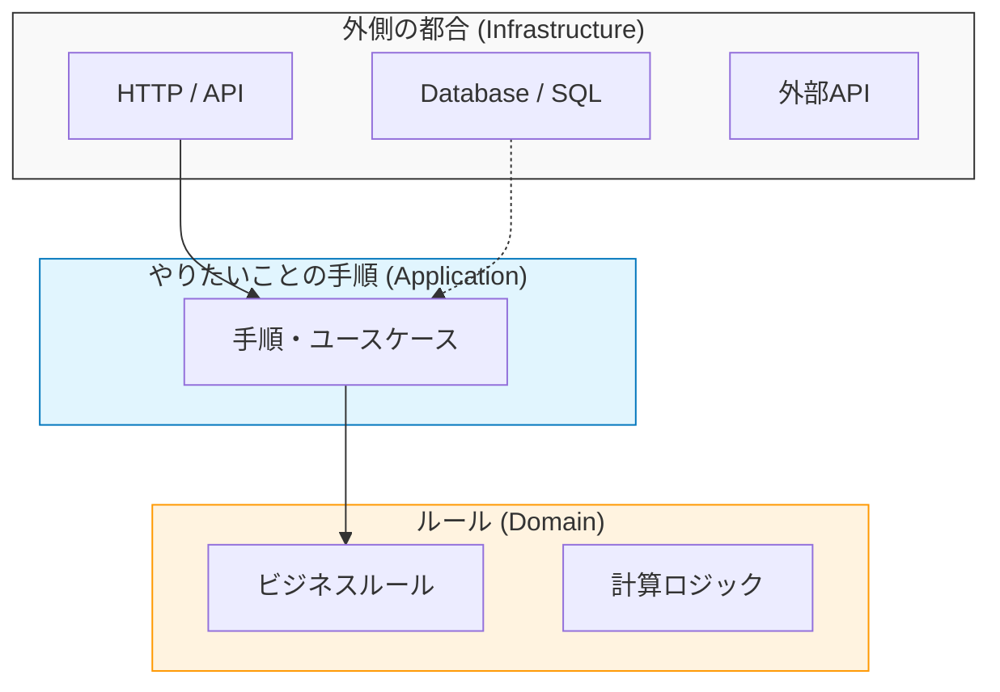

# 第01章：ごちゃ混ぜ地獄から脱出しよう😵‍💫➡️😊

この章は「レイヤードの必要性」を、頭じゃなくて“肌感”でつかむ回だよ〜🧠💓
最初にわざと **ぐちゃっとした実装** を見て、「うわ…これ怖い😇」ってなるのが正解👍✨

---

## 1) まず結論：混ざると何が困るの？💥


いきなりだけど、混ぜこぜの典型的な末路はこの3つ👇

* **変更が怖い**😱
  ちょっと仕様を足しただけで、あちこち壊れそうになる
* **テストできない**🧪💔
  DBやHTTPが絡まりすぎて、ユニットテストが書けない（or 書いても重い）
* **どこ直すの？が分からない**🔎🌀
  “原因の場所”にたどり着くまでに体力が削られる

これ、1人開発でも普通に起きるよ〜（むしろ1人の方が直撃しがち）🥲

---

## 2) いったん「混ぜこぜ」例を見よう👀💣（※わざとだよ！）

題材は「ToDoを追加するAPI」みたいなやつにするね📝
**1ファイルに全部入ってる**感じの例👇

```ts
// server.ts（※わざと混ぜこぜ）
import express from "express";
import sqlite3 from "sqlite3";

const app = express();
app.use(express.json());

// DBの準備（アプリ起動でいきなり触る）
const db = new sqlite3.Database("./todo.db");
db.serialize(() => {
  db.run(`
    CREATE TABLE IF NOT EXISTS todos (
      id TEXT PRIMARY KEY,
      title TEXT NOT NULL,
      done INTEGER NOT NULL,
      created_at TEXT NOT NULL
    )
  `);
});

// API：追加
app.post("/todos", (req, res) => {
  // 1) HTTP入力の取り出し（Presentationっぽい）
  const title = String(req.body?.title ?? "");

  // 2) バリデーション（ここはどこ担当？）
  if (title.trim().length === 0) {
    return res.status(400).json({ message: "title is required" });
  }
  if (title.length > 50) {
    return res.status(400).json({ message: "title is too long (max 50)" });
  }

  // 3) ドメインルール（…っぽいものがここに混ざる）
  // 例：禁止ワード（急に仕様が増えた想定）
  const banned = ["死", "BAN", "spam"];
  if (banned.some(w => title.includes(w))) {
    return res.status(400).json({ message: "title contains banned word" });
  }

  // 4) 永続化（Infrastructureど真ん中）
  const id = crypto.randomUUID();
  const createdAt = new Date().toISOString();
  db.run(
    `INSERT INTO todos(id, title, done, created_at) VALUES(?, ?, ?, ?)`,
    [id, title, 0, createdAt],
    (err) => {
      if (err) {
        // 5) エラー処理（握り方が雑だと地獄に）
        return res.status(500).json({ message: "db error", detail: String(err) });
      }

      // 6) レスポンス整形（UI都合が混ざりやすい）
      return res.status(201).json({
        id,
        title,
        done: false,
        createdAt,
        // なんか急に表示都合が混ざる例（よくある）
        uiBadgeColor: "pink",
      });
    }
  );
});

// API：一覧
app.get("/todos", (req, res) => {
  const onlyDone = String(req.query?.done ?? "all"); // "true" / "false" / "all"

  // クエリ組み立て（SQLがそのまま出てくる）
  let sql = "SELECT id, title, done, created_at FROM todos";
  if (onlyDone === "true") sql += " WHERE done = 1";
  if (onlyDone === "false") sql += " WHERE done = 0";
  sql += " ORDER BY created_at DESC";

  db.all(sql, (err, rows) => {
    if (err) return res.status(500).json({ message: "db error" });

    // doneがINTEGERのままなのでここで整形
    const result = rows.map((r: any) => ({
      id: r.id,
      title: r.title,
      done: r.done === 1,
      createdAt: r.created_at,
    }));

    return res.json({ items: result, total: result.length });
  });
});

app.listen(3000, () => {
  console.log("http://localhost:3000");
});
```

---

## 3) ミニ演習：このコードの「困りポイント探し」🔎🧩

紙でもメモでもOK✍️
上のコードを見て、次の質問に答えてみてね🙂

### Q1：このファイルの中に、何の仕事が混ざってる？🌀

最低でもこれだけは見つかるはず👇

* HTTPの受け取り・返し（ルーティング/ステータスコード）🌐
* 入力チェック（空/長さ/禁止ワード）🛡️
* “やりたいことの手順”（追加→保存→返す）🎮
* DBテーブル作成・SQL発行🗄️
* 画面都合っぽい整形（uiBadgeColor みたいな）🎨

### Q2：「仕様変更」が来たらどこが怖い？😱

例えば👇みたいな変更が来たとするね。

* 「title の最大長を 80 にして」📏
* 「禁止ワードをDB管理にして」🗃️
* 「一覧に “未完了のみ” をデフォルトにして」🔁
* 「DBをSQLiteから別のにしたい」🚚

→ それぞれ **何行ぐらい触りそう？** どこまで波及しそう？ を想像してみて✨

### Q3：「テスト書く」としたら何が邪魔？🧪💦

* DBが勝手に動く
* HTTPが絡む
* コールバック地獄で分岐が増える
* ルール（禁止ワード等）が “APIハンドラの中” に埋まってる

このへん、引っかかったら大当たり🎯

---

## 4) “混ぜこぜ”が起きる理由（超やさしく）🙂🍬

だいたい原因はこれ👇

### ✅ 1ファイルに「時間の都合」が集まる⏳

最初は早い。けど、後から自分が困る😂

### ✅ 「どこに書くべき？」が決まってない🧭

置き場所ルールが無いから、近いところに置いちゃう🏃‍♀️

### ✅ import依存が雪だるま化する☃️

そのうち「AがBを読む」「BがCを読む」みたいに絡まって、ほどけなくなる🧶

---

## 5) レイヤードは何を“約束”してくれるの？🤝🏗️（超ざっくり予告）

細かい地図は後の章で作るんだけど、まず雰囲気だけ🫶

* **外側の都合（HTTP/DB/外部API）** を “外側” に置く🚪
* **やりたいことの手順（ユースケース）** を真ん中寄りに置く🎮
* **ルール（ドメイン）** はさらに内側に閉じ込める💎

こうすると何が嬉しいかというと👇

* DBを変えても、ルールが壊れにくい🔁
* ルール単体のテストがしやすい🧪✨
* 変更点が「どの層か」で当たりが付く🎯




---

## 6) AI活用：混ざってる場所を“指摘してもらう”🤖💡

Copilot Chat には「責務の分解」みたいな相談がかなり相性いいよ〜🧠✨
Copilot Chat や inline suggestions など、IDE内で使える機能も整理されてるよ。 ([GitHub Docs][1])

### そのままコピペで使えるプロンプト例📌

**① 責務の洗い出し**

* 「この server.ts の中で、やってる仕事をカテゴリ別に列挙して。HTTP/バリデーション/ビジネスルール/永続化/レスポンス整形に分けてね」

**② “どこに置くべきか” の仕分け**

* 「このコードを Presentation / Application / Domain / Infrastructure に仕分けすると、どの処理がどこ？理由も一緒に教えて」

**③ 変更シミュレーション**

* 「title最大長を80に変更する場合、今の実装だとどこを修正する？将来の変更がラクになる設計案も出して」

**④ テストしにくい理由**

* 「ユニットテストが書きにくいポイントを具体的に指摘して。依存（DB/時間/乱数/HTTP）も列挙して」

---

## 7) 小ネタ：最近のTypeScript/Node/VS Codeの“空気感”🌬️✨（最新情報）

設計の学習そのものとは別だけど、今どきの道具はこういう流れだよ〜という話🙂

* Node.js は **Active LTS / Maintenance LTS** を使うのが基本、プロダクション用途はそこに寄せるのが推奨されてるよ。 ([Node.js][2])
  2026-01-12 更新の一覧だと、v24 が Active LTS、v22 が Maintenance LTS、v25 が Current になってる。 ([Node.js][2])
  さらに 2026-01-13 に複数ラインのセキュリティ更新が出てるので、定期アップデート大事🛡️ ([Node.js][3])

* TypeScript は新機能が継続的に入りつつ、パフォーマンス強化の大きい流れもあるよ（コンパイラのネイティブ化の話が進行中）。 ([InfoWorld][4])
  ちなみに TypeScript 5.9 では “import defer” のサポートも入ってる（起動時コストや副作用の制御の考え方に関わる話）。 ([typescriptlang.org][5])

* VS Code は 2026年1月の Insiders が version 1.109、ページ更新日は 2026-01-14 になってるよ。 ([Visual Studio Code][6])
  （安定版の案内も同ページ上で出てる） ([Visual Studio Code][6])

---

## 8) 章末チェック✅🎀（言葉にできたら勝ち！）

次の3つ、サクッと答えられたらOK🙆‍♀️✨

* 「このコードの中で、DBの都合はどこに出てる？」🗄️
* 「このコードの中で、ルールっぽいものはどこにある？」💎
* 「変更が来たとき、なぜ怖いの？」😱

---

## 9) 今日のゴール🎯✨

この章の到達点はこれだけ！

* **“混ざってる”こと自体を発見できた**🔎
* **混ざってる理由を自分の言葉で説明できた**🗣️
* **AIに貼って、責務の分解を手伝わせられた**🤖💡

次の章からは「混ぜないためのコツ（TypeScript視点）」に入って、だんだん“設計っぽく”していくよ〜😊🏗️

---

* [theverge.com](https://www.theverge.com/news/669339/github-ai-coding-agent-fix-bugs?utm_source=chatgpt.com)
* [itpro.com](https://www.itpro.com/software/development/github-copilot-ai-model-deprecation-openai-anthropic-google?utm_source=chatgpt.com)

[1]: https://docs.github.com/en/copilot/get-started/features "GitHub Copilot features - GitHub Docs"
[2]: https://nodejs.org/en/about/previous-releases "Node.js — Node.js Releases"
[3]: https://nodejs.org/en/blog/vulnerability/december-2025-security-releases?utm_source=chatgpt.com "Tuesday, January 13, 2026 Security Releases"
[4]: https://www.infoworld.com/article/4100582/microsoft-steers-native-port-of-typescript-to-early-2026-release.html?utm_source=chatgpt.com "Microsoft steers native port of TypeScript to early 2026 ..."
[5]: https://www.typescriptlang.org/docs/handbook/release-notes/typescript-5-9.html "TypeScript: Documentation - TypeScript 5.9"
[6]: https://code.visualstudio.com/updates/v1_109 "January 2026 Insiders (version 1.109)"
