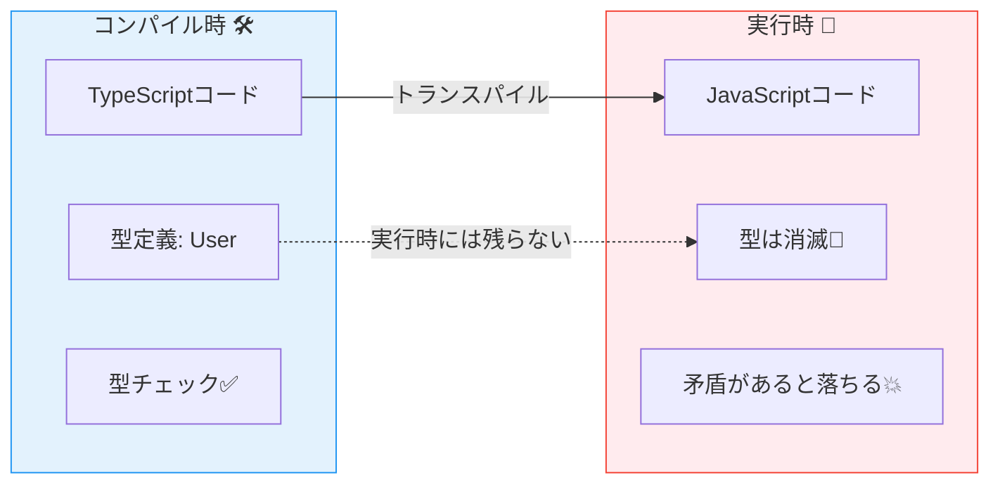
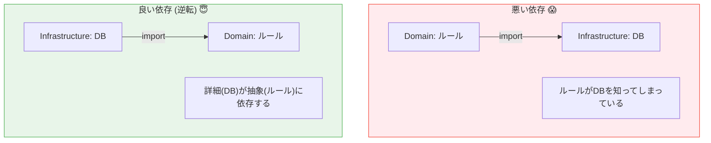

# 第02章：TypeScriptで設計するときの“3つの軸”🧭✨

（型・import・any の3点セットで「事故りにくい設計」へ😊）

---

## 0) まず今日のゴール🎯✨


この章を終えると、こんな感覚がつきます👇

* **型（コンパイル時）**は強いけど、**実行時**は守ってくれない⚠️
* **import**は便利だけど、設計（依存の向き）を一瞬で壊す📦💥
* **any**は一度使うと増殖しがち。できるだけ「封印」して、代役を使う😇

---

## 2026年の“いま”メモ📝✨（最新情報）

* **TypeScriptの安定版は 5.9.x 系**（GitHub Releases上は 5.9.3 が確認できます） ([GitHub][1])
* **TypeScript 6.0/7.0 は 2026年初頭に向けた大きな節目**（6.0は“橋渡し”、7.0はネイティブ移行の話が進んでいます） ([Microsoft for Developers][2])
* VS Code は **内蔵TypeScript** と **プロジェクト（node_modules）のTypeScript** を切り替えできます（コマンド `TypeScript: Select TypeScript Version`） ([Visual Studio Code][3])
* Node.js は 2026年1月時点で **v24 が Active LTS、v25 が Current** という整理です ([Node.js][4])

> つまり：教材は“今ふつうに使う安定版”をベースにしつつ、近い将来の変化も「へ〜そうなんだ！」くらいで押さえておくと安心😊🌱

---

# 軸①：型（compile時）と検証（run時）は別もの⚠️🧩

## 1-1) ここが超重要ポイント💡

TypeScriptの型は **実行時には消えます**。
公式ドキュメントでも「型注釈は実行時の動作を変えない」ってハッキリ言っています。 ([TypeScript][5])

だから👇

* 「型があるのに落ちる」
* 「型があるのに変な値が混ざる」
  が普通に起きます😇




---

## 1-2) “型だけあるのに壊れる”あるある例😵‍💫

たとえば API から来たデータを「それっぽく」信じると…👇

```ts
type User = { id: number; name: string };

function showUser(u: User) {
  // id は number のはず！
  console.log(u.id.toFixed(0));
}

// でも実際のデータは外から来る（信用できない）
const raw = JSON.parse(`{"id":"1","name":"A"}`);

// 「型をつければ安心♪」と思って…
showUser(raw as User); // ← ここはコンパイル通る
```

実行すると👇

* `id` が `"1"`（文字列）なので、`toFixed` で落ちる💥

**型は“あなたのコード側の約束”を整えるだけ**で、
**外から来るデータを自動で矯正はしてくれない**んです😢

---

## 1-3) 解決の基本：境界で `unknown` → 検証 → 変換✅✨

外から来るものはまず `unknown` 扱いが超おすすめです🛡️

### ✅ ざっくり手順（これだけ覚えよ！）

1. 外部入力（HTTP/JSON/フォーム/DBなど）を `unknown` として受ける
2. 形をチェック（実行時）
3. OKなら「ちゃんとした型」に変換して中へ渡す

```ts
type User = { id: number; name: string };

function isUser(x: unknown): x is User {
  if (typeof x !== "object" || x === null) return false;
  const o = x as Record<string, unknown>;
  return typeof o.id === "number" && typeof o.name === "string";
}

const raw: unknown = JSON.parse(`{"id":"1","name":"A"}`);

if (!isUser(raw)) {
  console.log("ユーザー形式じゃないよ🥲");
} else {
  console.log(raw.id.toFixed(0)); // 安全✨
}
```

> ポイント：**`as User` で信じる**より、**`unknown` から確かめる**ほうが設計が安定します😊🧡

---

# 軸②：importの依存が設計を壊しやすい📦➡️💥

## 2-1) import は「ただの読み込み」じゃないよ😳

import は、設計的には **“依存の線”を引く行為**です✍️
一行で👇みたいな事故が起きます😇

* 内側（Domain）が外側（DB/HTTP）に引っ張られる
* 差し替えができなくなる
* テストが重くなる（外部に繋がる）
* 循環参照でカオスになる🌀




---

## 2-2) ちょい最新：`import defer` って何？（知識として）🆕

TypeScript 5.9 では、将来提案に沿った **`import defer`** が紹介されています。
「importした瞬間にモジュールが評価される（副作用が走る）」問題を、遅延できる方向性の話です。 ([TypeScript][6])

```ts
import defer * as feature from "./some-feature.js";
```

> 初心者さんは「へ〜 import って副作用もあるんだ〜😳」くらいでOK！
> 大事なのは **“import が依存線であり、設計を固定する”** って感覚です😊

---

## 2-3) “typeだけのimport”を分けると事故りにくい🧼✨

型だけ使うなら `import type` で分けるのがスッキリしやすいです🎀
（スタイルガイドでも紹介されています） ([Google GitHub][7])

```ts
import type { User } from "./types"; // 型だけ
import { createUser } from "./usecase"; // 値（実行時に必要）
```

---

## 2-4) VS Code 的にも大事：TypeScriptの“どのバージョン”で見てる？👀

VS Code は、状況によって

* **VS Code 内蔵の TypeScript**
* **プロジェクトの node_modules の TypeScript**
  を使い分けます。切り替えもできます。 ([Visual Studio Code][3])

「人によって補完の挙動が違う😭」が起きたら、ここを疑うのがコツです🧠✨

---

# 軸③：`any` は最終兵器（できれば封印）😇🧨

## 3-1) `any` の怖さ：型安全が“消し飛ぶ”💨

`any` を入れると、その値は「なんでもアリ」になって、周りにも伝染します🦠💦

```ts
const x: any = "hello";
console.log(x.toFixed(2)); // コンパイル通る → 実行時に落ちる💥
```

---

## 3-2) 代役①：`unknown`（まずこれ！）🛡️✨

* `any`：なんでもできちゃう（危険）
* `unknown`：**確かめるまで何もできない（安全）**

```ts
const x: unknown = "hello";
// x.toFixed(2); // ❌ できない（安全）
if (typeof x === "number") {
  console.log(x.toFixed(2)); // ✅ 確認したらOK
}
```

---

## 3-3) 代役②：`satisfies`（“形は合ってる？”チェック）🎯

「型に合わせたいけど、余計な型変換で潰したくない」時に便利な演算子です。 ([TypeScript][8])

```ts
type Config = { mode: "dev" | "prod"; port: number };

const config = {
  mode: "dev",
  port: 3000,
  // typo: "porrt": 3000,
} satisfies Config;
```

---

# ミニ演習🧩（“イメージする”だけでもOKだよ😊）

## 演習1：「型だけあるのに壊れる例」を自分で作ってみよ🔧💥

1. `JSON.parse` で `{ price: "100" }` を作る
2. `type Item = { price: number }` を用意
3. `as Item` して計算して落とす
4. `unknown` + ガードで直す✨

---

## 演習2：import事故を嗅ぎ分けゲーム👃📦

次のうち「設計が崩れやすい匂い」がするのはどれ？（複数OK）

* A：`domain/Order.ts` が `infra/db.ts` を import
* B：`app/CreateOrder.ts` が `domain/Order.ts` を import
* C：`infra/OrderRepo.ts` が `domain/Order.ts` を import

> 直感でOK：A がいちばん危険な匂い💥（内側→外側になりやすい）

---

## 演習3：`any` を1個だけ消すチャレンジ😇🔥

どこか1個 `any` を `unknown` にして、必要なチェック（`typeof` など）を足してみよ！

---

# AI活用🤖✨（Copilot/Codex/ChatGPT向けプロンプト例）

## そのまま貼って使えるやつ📋💖

* 「この `as Xxx` をやめて、`unknown` から安全に変換する方法を提案して🙏 例もつけて」
* 「この `any` を `unknown`/ジェネリクスで置き換えて、影響範囲が小さくなる案ちょうだい」
* 「このimport関係、レイヤード的にまずい匂いがする場所を指摘して。直し方も3案で！」

---

# チェック✅（言えたら勝ち🏆✨）

* 型は **コンパイル時の道具**で、**実行時の安全とは別**って説明できる？ ([TypeScript][5])
* 外部入力は `unknown` → 検証 → 変換、の流れを言える？
* import が「依存線」で、設計を固定しちゃう感覚がある？
* `any` の代わりに `unknown` を選べる？

---

## 次章につながる一言🌷

第3章では、この“3つの軸”を踏まえて、**4層（Presentation/Application/Domain/Infrastructure）を地図みたいに整理**していくよ🗺️🧱✨

[1]: https://github.com/microsoft/typescript/releases?utm_source=chatgpt.com "Releases · microsoft/TypeScript"
[2]: https://devblogs.microsoft.com/typescript/progress-on-typescript-7-december-2025/?utm_source=chatgpt.com "Progress on TypeScript 7 - December 2025"
[3]: https://code.visualstudio.com/docs/typescript/typescript-compiling?utm_source=chatgpt.com "Compiling TypeScript"
[4]: https://nodejs.org/en/about/previous-releases?utm_source=chatgpt.com "Node.js Releases"
[5]: https://www.typescriptlang.org/docs/handbook/2/basic-types.html?utm_source=chatgpt.com "TypeScript: Documentation - The Basics"
[6]: https://www.typescriptlang.org/docs/handbook/release-notes/typescript-5-9.html?utm_source=chatgpt.com "Documentation - TypeScript 5.9"
[7]: https://google.github.io/styleguide/tsguide.html?utm_source=chatgpt.com "Google TypeScript Style Guide"
[8]: https://www.typescriptlang.org/docs/handbook/release-notes/typescript-4-9.html?utm_source=chatgpt.com "Documentation - TypeScript 4.9"
