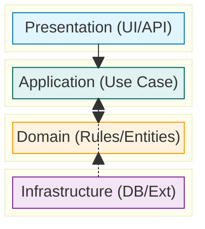
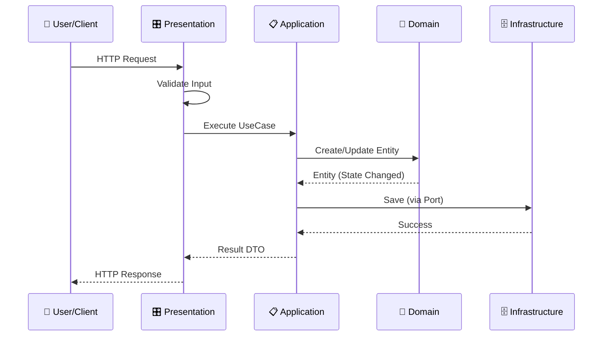

# 第03章：レイヤードの地図を作る🗺️🧱

[](https://herbertograca.com/2017/08/03/layered-architecture/?utm_source=chatgpt.com)

この章はね、「4層それぞれの役割を**言葉で決めて**」「どのコードをどこに置くか」を迷わなくする回だよ〜😊💕

---

## 1) まず“地図”ってなに？🗺️


レイヤードでいう地図はこれ👇

* **どの層が、何をする？**（責務）
* **どの層が、何をしない？**（やらないこと）
* **どう流れる？**（入力→処理→保存→出力の道筋）

これが決まると、実装中に
「これ…どこに置くんだっけ？😵‍💫」が激減するよ✨

---

## 2) 4層の“ざっくりイメージ”🍰

レイヤードは、だいたいこの4人組👭👬

* **Presentation**：入口と出口（HTTP/画面イベント）🎛️
* **Application**：手順書（ユースケース）📋🎮
* **Domain**：ルール本体（概念・制約）💎🔒
* **Infrastructure**：外側の都合（DB/外部API/ファイル）🗄️📡



---

## 3) いちばん大事：「やること / やらないこと」表✅

ここが“地図の中心”だよ🧭✨
（迷ったらこの表に戻ってくる！）

| 層              | やること👍                            | やらないこと🙅‍♀️                   |
| -------------- | --------------------------------- | ----------------------------- |
| Presentation   | 入力受付、形式チェック、ユースケース呼び出し、結果返す       | ビジネスルールを書かない／DB直叩きしない         |
| Application    | ユースケースの手順、トランザクション的な流れの調整、Portを呼ぶ | 画面の見た目都合を持ち込まない／DBの詳細を知らない    |
| Domain         | 不変条件、状態遷移、ドメイン概念（Entity/VO）       | HTTPやDBの型・ライブラリに依存しない         |
| Infrastructure | DB/外部APIの実装、設定、リトライ、永続化形式         | ルールの中心にならない（Domainの代わりに判断しない） |

---

## 4) 1枚でわかる “処理の流れ”🔁✨

ToDoアプリ（追加・一覧・完了）を例にすると、こう流れるよ👇

```text
[HTTPリクエスト]
   ↓
Presentation（入力を受け取る・軽くチェック）
   ↓
Application（ユースケース手順を進める）
   ↓
Domain（ルールに従って状態を変える）
   ↓
Application（Port経由で保存/取得を依頼）
   ↓
Infrastructure（DBや外部APIで実行）
   ↓
Application（結果をDTOにまとめる）
   ↓
Presentation（HTTPレスポンスとして返す）
```

ポイントはここ💡
**Domainは“中心”だから、外の都合（HTTP/DB）を知らない**のが基本だよ〜😊💎



---

## 5) “何をどこに置く？”仕分けのコツ🧺✨（超実用）

迷ったら、この順番で仕分けしてね👇

### Step A：機能を「入力→したいこと→結果」に分解する✂️

例：ToDoを追加する

* 入力：`title`（文字列）
* したいこと：ToDoを新規作成して保存
* 結果：作ったToDoの情報を返す

### Step B：「名詞」と「動詞」を抜き出す📝

* 名詞（概念）→ Domain候補 💎

  * `TodoItem`, `TodoTitle`, `TodoId`
* 動詞（操作）→ Application（ユースケース）候補 🎮

  * `AddTodo`, `CompleteTodo`, `ListTodos`

### Step C：外部に触るところをマーキングする🚪

* DB保存/取得、外部API呼び出し、ファイルIO
  → Infrastructure候補 🗄️📡
  （Applicationからは **Port(interface)** 経由で呼ぶのが定番）

---

## 6) ミニ題材：ToDoの“層別の置き場所”🧩💡

ここから一気に具体化しよ〜😊✨

### ✅ Presentation（HTTP）🎛️

* 受け取る：`req.body`
* 返す：`res.json(...)`
* やるのは **「受け取って、渡して、返す」だけ** 🧼

```ts
// src/presentation/http/todoRoutes.ts
import { addTodoHandler } from "./todoHandlers";

export function registerTodoRoutes(app: any) {
  app.post("/todos", addTodoHandler);
}
```

```ts
// src/presentation/http/todoHandlers.ts
import { AddTodoUseCase } from "../../application/usecases/AddTodoUseCase";

const addTodoUseCase = new AddTodoUseCase(/* 後でComposition Rootで差し込む */);

export async function addTodoHandler(req: any, res: any) {
  const input = { title: req.body?.title }; // 入力DTOっぽいもの
  const result = await addTodoUseCase.execute(input);
  res.status(201).json(result);
}
```

> ここで**ルール（タイトル空禁止とか）をゴリゴリ書き始めたら**、Domainに寄せるサインだよ🚦✨

---

### ✅ Application（ユースケース）📋🎮

* “手順”を担当するよ
* Domainを呼んで、保存はPort経由で依頼するよ🔌

```ts
// src/application/ports/TodoRepository.ts
import { TodoItem } from "../../domain/TodoItem";

export interface TodoRepository {
  save(todo: TodoItem): Promise<void>;
}
```

```ts
// src/application/usecases/AddTodoUseCase.ts
import { TodoRepository } from "../ports/TodoRepository";
import { TodoItem } from "../../domain/TodoItem";
import { TodoTitle } from "../../domain/TodoTitle";

export class AddTodoUseCase {
  constructor(private readonly repo: TodoRepository) {}

  async execute(input: { title: string }) {
    const title = TodoTitle.create(input.title);   // ルールはDomainへ💎
    const todo = TodoItem.create(title);

    await this.repo.save(todo);

    // 出力DTO（Domainそのまま返さないのが基本）
    return { id: todo.id.value, title: todo.title.value, done: todo.done };
  }
}
```

---

### ✅ Domain（ルールの中心）💎🔒

* 「無効な状態を作らせない」
* 「状態遷移を守る」
  こういうのがDomainの仕事だよ😊✨

```ts
// src/domain/TodoTitle.ts
export class TodoTitle {
  private constructor(public readonly value: string) {}

  static create(raw: string) {
    const v = (raw ?? "").trim();
    if (v.length === 0) throw new Error("タイトルは空にできません🥺");
    if (v.length > 50) throw new Error("タイトルが長すぎます🥺");
    return new TodoTitle(v);
  }
}
```

```ts
// src/domain/TodoId.ts
export class TodoId {
  private constructor(public readonly value: string) {}

  static new() {
    // ここは簡易（本番はUUID等にしたくなるけど、まずは気楽でOK😊）
    return new TodoId(`todo_${Date.now()}`);
  }
}
```

```ts
// src/domain/TodoItem.ts
import { TodoId } from "./TodoId";
import { TodoTitle } from "./TodoTitle";

export class TodoItem {
  private constructor(
    public readonly id: TodoId,
    public readonly title: TodoTitle,
    public readonly done: boolean
  ) {}

  static create(title: TodoTitle) {
    return new TodoItem(TodoId.new(), title, false);
  }

  complete() {
    if (this.done) throw new Error("すでに完了です🥺");
    return new TodoItem(this.id, this.title, true);
  }
}
```

---

### ✅ Infrastructure（DBとか外部の都合）🗄️📡

* ApplicationのPort（interface）を実装するよ
* DomainにDB都合を入れないための“吸収材”だよ〜😊🧽

```ts
// src/infrastructure/db/InMemoryTodoRepository.ts
import { TodoRepository } from "../../application/ports/TodoRepository";
import { TodoItem } from "../../domain/TodoItem";

export class InMemoryTodoRepository implements TodoRepository {
  private readonly store = new Map<string, TodoItem>();

  async save(todo: TodoItem): Promise<void> {
    this.store.set(todo.id.value, todo);
  }
}
```

---

## 7) フォルダ構成（迷子防止の“地図そのもの”🧭）

まずはこれくらいシンプルでOKだよ😊🌱

```text
src/
  presentation/
    http/
  application/
    usecases/
    ports/
  domain/
  infrastructure/
    db/
```

ポイント💡

* `domain` は軽く・純粋に（HTTP/DBのライブラリを置かない）💎
* `infrastructure` は“外の詳細”を全部引き受ける🗄️
* `application` は“手順”と“窓口（ports）”を持つ📋🔌

---

## 8) よくある“置き間違い”あるある😇（そして直し方）

### あるある①：Presentationが太る🍔

* Controller/Handlerに「完了済みなら〜」とか書き始める
  ✅ → DomainのメソッドやVOに寄せる💎

### あるある②：ApplicationがDBの型を知ってる🧟‍♀️

* `Prisma.xxx` みたいなのがUseCaseに出てくる
  ✅ → Port(interface)を切って、Infrastructureへ🗄️🔌

### あるある③：Domainがimport地獄📦💥

* DomainがDBやHTTPをimport
  ✅ → 「Domainは中心、外を知らない」を合言葉に☺️
  （依存の向きは次章でガッツリやるよ➡️🚧）

---

## 9) AI活用（Copilot/Codex）🤖💡：この章の使いどころ

“地図作り”にAIはめちゃ便利だよ〜😊✨
（ただし最後に判断するのはあなた🫶）

### プロンプト例①：層に仕分けしてもらう🗂️

* 「ToDoの追加・一覧・完了がある。各処理をPresentation/Application/Domain/Infrastructureに仕分けして、理由も書いて」

### プロンプト例②：“やらないこと”の抜け漏れチェック🔎

* 「この層がやってはいけないことを列挙して。特にDomainが外部依存しそうな点を指摘して」

### プロンプト例③：命名案を出してもらう🏷️

* 「ユースケース名を Command/Query っぽく揃えて提案して（例：AddTodo / ListTodos / CompleteTodo）」

---

## 10) 演習🧩：層仕分けゲーム（15分）🎮✨

### お題：ToDoに「期限」を追加したい📅

機能説明👇

* 期限は未来日だけOK
* 期限が過ぎたら “期限切れ” 表示
* 一覧で「期限が近い順」に並べたい

#### やること✍️

1. 期限のルールはどこ？（Domain / Application / Presentation / Infrastructure）
2. 並び順はどこ？（ヒント：どの目的の並び？👀）
3. “期限切れ表示”はどこ？（表示は…？🎛️）

#### 目標✅

* それぞれの判断に「理由」を1行つけられたら勝ち🏆💕

---

## 11) チェック✅：この章を終えたら言えるようになること

* 4層それぞれの役割を説明できる😊
* 各層の「やらないこと」を言える🙅‍♀️✨
* ToDo機能を層に仕分けできる🗂️
* “置き間違い”に気づける（Presentation肥大、Domain汚染など）👀💡

---

## 12) 2026ミニトピック（最新事情ちょいメモ🧷✨）

* TypeScriptは **Node向けの安定モード**が整理されてきてて、`--module node18` / `--module node20` みたいに “固定ターゲット”を選びやすくなってるよ（ESM周りの事故を減らす方向）🧯✨ ([TypeScript][1])
* Node.jsは 2026年初頭時点で **v24 が Active LTS**、v22 は Maintenance LTS、v25 が Current という並びだよ🧠📌 ([Node.js][2])
* VS Codeは 2026年1月に **1.108 系**のアップデートが出てるよ🛠️✨ ([code.visualstudio.com][3])

（この章の結論としては：**import/依存で崩れやすい時代だからこそ、層の地図が効く**ってことだね☺️🧱）

---

## 次章予告📣：第4章は「依存の向きを固定する」➡️🚧

第3章で地図は描けた！
次は、その地図が**崩れないためのルール（import事故防止）**を作るよ〜😊💥

---

必要なら、この章の内容をベースにして「ToDo以外（読書ログ/推し活支出メモ💸）」でも同じ仕分けを一緒にやるよ🫶✨

[1]: https://www.typescriptlang.org/docs/handbook/release-notes/typescript-5-8.html?utm_source=chatgpt.com "Documentation - TypeScript 5.8"
[2]: https://nodejs.org/en/about/previous-releases?utm_source=chatgpt.com "Node.js Releases"
[3]: https://code.visualstudio.com/updates?utm_source=chatgpt.com "December 2025 (version 1.108)"
