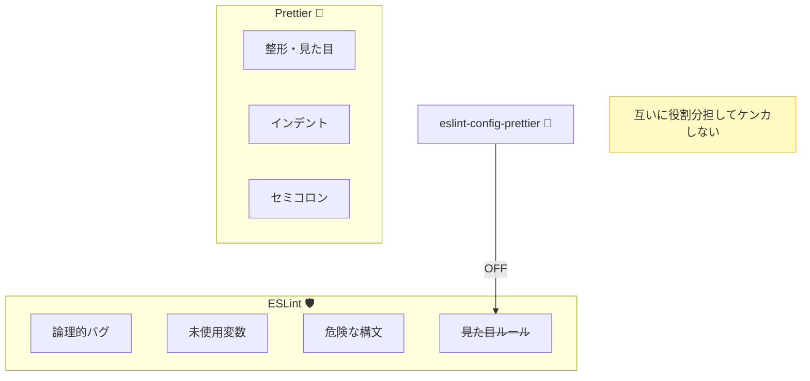
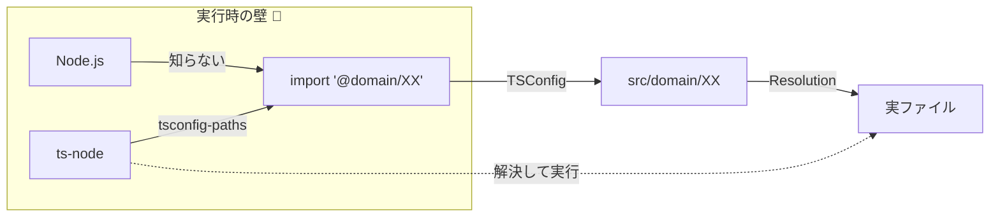

# 第05章：VS Code＋2026 TSの土台づくり🛠️✨

この章は「レイヤードを学ぶ前の地ならし」だよ〜😊🌱
ここで“早めに気づける設定”と“揉めない整形”を入れておくと、後の章がスイスイ進む✨

---

## この章のゴール🎯✨


* TypeScriptで**ミスを早めに見つける**設定ができる🔒🧠
* **保存したら整う**（フォーマット）状態を作れる🧼💅
* **importが読みやすくなる**（パス別名）を入れられる🧵📦
* “最小テンプレ”が完成して、次章から題材に集中できる🌱🚀

---

## 2026/01/18時点の「今これが現実ライン」📌🆕

※バージョンは「今日の安定版」寄りで紹介するね（教材が壊れにくい）😊

* TypeScript：**v5.9.3**（npmのlatest） ([npmjs.com][1])
* Node.js：**v24 LTS（Krypton）** がLTSの中心、**v25** がCurrent
* ESLint：**v9.39.2**（安定）／**v10.0.0-rc.0**（RC） ([eslint.org][2])
* Prettier：**v3.8.0** ([prettier.io][3])
* typescript-eslint：ESLintのflat config向け導線が公式で整理されてる（`eslint.config.mjs`推奨） ([typescript-eslint.io][4])

---

## まず作る「最小テンプレ」構成🧩📁

レイヤードに繋げるため、最初からフォルダだけ用意しちゃう😊✨

```text
my-layered-app/
  src/
    presentation/
    application/
    domain/
    infrastructure/
    main.ts
  .vscode/
    settings.json
  eslint.config.mjs
  tsconfig.json
  .prettierrc.json
  .editorconfig
  package.json
```

---

## Step 0：プロジェクト作成（最短）🏁✨

PowerShellでもOKだよ💻✨

```bash
mkdir my-layered-app
cd my-layered-app
npm init -y
```

---

## Step 1：TypeScriptを“ミス検出強め”にする🔒🧠

### 1-1. TypeScript入れる📦✨

```bash
npm i -D typescript
npx tsc --init
```

### 1-2. tsconfig.json を「strict寄り」に整える🧩🔧

ここが本章のコア！💎
“あとで泣かないための設定”を、最初に入れちゃう😊

```json
{
  "compilerOptions": {
    "target": "ES2023",
    "module": "CommonJS",
    "moduleResolution": "Node",

    "rootDir": "src",
    "outDir": "dist",

    "strict": true,
    "noUncheckedIndexedAccess": true,
    "exactOptionalPropertyTypes": true,
    "useUnknownInCatchVariables": true,

    "esModuleInterop": true,
    "skipLibCheck": true,

    "baseUrl": ".",
    "paths": {
      "@presentation/*": ["src/presentation/*"],
      "@application/*": ["src/application/*"],
      "@domain/*": ["src/domain/*"],
      "@infrastructure/*": ["src/infrastructure/*"]
    }
  },
  "include": ["src/**/*.ts"]
}
```

### 💡ここで入れた“強め設定”の意味（ざっくり）🍰

* `strict: true`：雑な型のまま進めると**すぐ怒ってくれる**⚡（結果、バグが減る）
* `noUncheckedIndexedAccess`：配列や辞書の取り出しで**undefinedの可能性**を忘れにくい🧷
* `exactOptionalPropertyTypes`：`?` の意味を厳密にして**曖昧さを減らす**🎯
* `paths`：importが読みやすくなるやつ🧵

  * ただしこれは「TypeScriptの解決ルール」なので、**実行時（Node）が理解するとは限らない**よ（後で対策する） ([TypeScript][5])

---

## Step 2：ESLint（バグ予防）を入れる🧯✨

ESLintは「危ない書き方を止める係」🚨
今はESLintの新しい設定方式（flat config）が基本になってるよ〜 ([eslint.org][6])

### 2-1. 公式推奨の入れ方でインストール📦✨

typescript-eslint公式のQuickstartがこれ👇 ([typescript-eslint.io][4])

```bash
npm i -D eslint @eslint/js typescript typescript-eslint
```

### 2-2. eslint.config.mjs を作る🧩✨

```js
// @ts-check
import eslint from "@eslint/js";
import { defineConfig } from "eslint/config";
import tseslint from "typescript-eslint";

export default defineConfig(
  eslint.configs.recommended,
  tseslint.configs.recommended,
  // ちょい強め（バグ減らし向け）✨
  tseslint.configs.strict
);
```

* `defineConfig()` はESLint側が用意してるヘルパーで、設定を破綻しにくくしてくれるよ🧠✨ ([eslint.org][7])

### 2-3. 実行してみる🏃‍♀️💨

```bash
npx eslint .
```

---

## Step 3：Prettier（見た目統一）を入れる🧼✨

Prettierは「見た目の統一担当」💅
公式はローカル導入＋`--save-exact`（固定）を推してるよ📌 ([prettier.io][8])

### 3-1. インストール📦✨

```bash
npm i -D --save-exact prettier
```

### 3-2. 設定ファイルを作る🧩✨

```json
{
  "semi": true,
  "singleQuote": false,
  "printWidth": 100,
  "trailingComma": "all"
}
```

### 3-3. エディタと連携しやすくする（EditorConfig）🧷✨

```ini
root = true

[*]
charset = utf-8
end_of_line = lf
insert_final_newline = true
indent_style = space
indent_size = 2

[*.md]
trim_trailing_whitespace = false
```

---

## Step 4：ESLintとPrettierの“ケンカ”を止める🤝💥➡️😊

やり方は2つあるんだけど、教材では一番スッキリな方にするね✨

### ✅ 方針：Prettierは“整形だけ”、ESLintは“危険検知だけ”

* 整形：Prettier（`npm run format`）
* 危険検知：ESLint（`npm run lint`）

そして **ESLint側の「見た目系ルール」を止める**ために `eslint-config-prettier` を使うよ🧯

ただし⚠️：過去に `eslint-config-prettier` に**悪性バージョン混入**があったので、変なバージョン指定はしないで「最新の安全版」を入れるのが大事😇（脆弱性情報としてはNVD等でも追跡されてる） ([ANDPAD Tech Blog][9])

```bash
npm i -D eslint-config-prettier
```

そして `eslint.config.mjs` に「最後に」足す：

```js
// @ts-check
import eslint from "@eslint/js";
import { defineConfig } from "eslint/config";
import tseslint from "typescript-eslint";
import prettierConfig from "eslint-config-prettier";

export default defineConfig(
  eslint.configs.recommended,
  tseslint.configs.recommended,
  tseslint.configs.strict,
  // Prettierと衝突する“見た目系”ルールをオフ🧼✨
  prettierConfig
);
```



---

## Step 5：VS Codeで「保存したら自動で整う」状態にする🪄✨

`.vscode/settings.json` を作ってこれ👇

```json
{
  "editor.formatOnSave": true,
  "editor.defaultFormatter": "esbenp.prettier-vscode",

  "editor.codeActionsOnSave": {
    "source.fixAll.eslint": "explicit"
  },

  "eslint.useFlatConfig": true,
  "eslint.validate": ["typescript"],

  "typescript.tsdk": "node_modules/typescript/lib"
}
```

ポイント😊✨

* `typescript.tsdk` を指定すると、VS Code内のTSが**プロジェクトのTypeScript**に寄る（バージョン差で困りにくい）🧠
* `eslint.useFlatConfig` で “flat config” を前提に動くようにする🧩

---

## Step 6：パス別名（alias）を“実行時も”動かす🚀🧵

`paths` はTypeScriptの解決なので、Nodeの実行ではそのままだと詰まりがち😵‍💫 ([TypeScript][5])
教材のテンプレでは「実行時もaliasが効く」ように、素直な方法でいくよ😊✨

### 6-1. 実行用ツールを入れる📦

```bash
npm i -D ts-node tsconfig-paths
```

### 6-2. package.json にスクリプト追加🧩

```json
{
  "scripts": {
    "typecheck": "tsc --noEmit",
    "lint": "eslint .",
    "format": "prettier . --write",
    "dev": "ts-node -r tsconfig-paths/register src/main.ts"
  }
}
```



---

## Step 7：動作確認ミニコード🧪✨（aliasが効くかチェック）

### 7-1. src/domain/TodoTitle.ts

```ts
export class TodoTitle {
  private constructor(public readonly value: string) {}

  static create(value: string): TodoTitle {
    const v = value.trim();
    if (v.length === 0) throw new Error("タイトル空はダメだよ😇");
    if (v.length > 50) throw new Error("タイトル長すぎだよ😇");
    return new TodoTitle(v);
  }
}
```

### 7-2. src/main.ts（aliasでimportしてみる🧵）

```ts
import { TodoTitle } from "@domain/TodoTitle";

const title = TodoTitle.create("レイヤード学習スタート✨");
console.log("OK:", title.value);
```

### 7-3. 実行✅

```bash
npm run dev
```

---

## ミニ演習🧩✨（この章の“手を動かす”）

1. `npm run typecheck` が通る✅
2. `npm run lint` が通る✅
3. `npm run format` を走らせて、全体が整う✅
4. `@domain/*` など alias import のまま `npm run dev` できる✅

---

## AI活用🤖💡（この章でめちゃ効くやつ）

### 💬 その1：設定ファイルの意図を“言葉で説明”させる🧠

* `tsconfig.json` を貼って「この設定って何を守ってるの？」って聞く
* `eslint.config.mjs` を貼って「strictってどんなバグを減らす？」って聞く

### 💬 その2：strictで怒られた時の“直し方パターン集”を作らせる📚✨

* エラーを貼って「初心者向けに、直し方の選択肢を3つ出して」

  * 例：`undefined` 対策、型の絞り込み、早期return など🌸

---

## よくある詰まりポイント😵‍💫➡️😊（先に潰す）

* **ESLintが動かない**：拡張機能がflat config認識してないことがある→ `eslint.useFlatConfig: true` を確認🧩
* **Prettierが効かない**：VS Codeの既定フォーマッタが別になってる→ `editor.defaultFormatter` を確認🧼
* **alias importで実行エラー**：`paths` はTS側の話→ `ts-node -r tsconfig-paths/register` が入ってるか確認🧵 ([TypeScript][5])

---

## チェック✅（言えたら勝ち🏆✨）

* strictにすると何が嬉しい？🔒
* ESLintとPrettierは何が役割違う？🤝
* `paths` は“どこまで”面倒を見てくれる？🧵 ([TypeScript][5])

---

次の章（第6章）では、このテンプレの上に「題材」を置いて、最小要件でスッとレイヤードに入っていくよ〜🌱😊🎮

[1]: https://www.npmjs.com/package/typescript?utm_source=chatgpt.com "TypeScript"
[2]: https://eslint.org/blog/2025/12/eslint-v9.39.2-released/?utm_source=chatgpt.com "ESLint v9.39.2 released"
[3]: https://prettier.io/blog/2026/01/14/3.8.0?utm_source=chatgpt.com "Prettier 3.8: Support for Angular v21.1"
[4]: https://typescript-eslint.io/getting-started/ "Getting Started | typescript-eslint"
[5]: https://www.typescriptlang.org/tsconfig/paths.html?utm_source=chatgpt.com "TSConfig Option: paths"
[6]: https://eslint.org/blog/2025/05/eslint-v9.0.0-retrospective/?utm_source=chatgpt.com "ESLint v9.0.0: A retrospective"
[7]: https://eslint.org/blog/2025/03/flat-config-extends-define-config-global-ignores/?utm_source=chatgpt.com "Evolving flat config with extends"
[8]: https://prettier.io/docs/install?utm_source=chatgpt.com "Install · Prettier"
[9]: https://tech.andpad.co.jp/entry/2026/01/16/100000?utm_source=chatgpt.com "乗り換えるなら今！ Prettier から Oxfmt への移行を試してみた"
