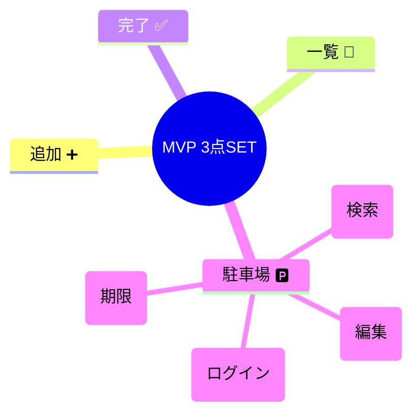

# 第06章：題材を決めて、最小要件でスタート🌱😊

この章はね、「作りたいもの」を決めて、**最小サイズ（MVP）**で気持ちよく走り出す回だよ〜🏃‍♀️💨
レイヤードは、題材の選び方で難易度が激変するから、ここで勝ちパターン作っちゃおう🥳🧡

---

## この章のゴール🎯✨

この章が終わったら、手元にこの3点セットができてる状態にしよう〜💪💕

1. **題材（プロダクト）を1つ決定**🎁
2. **機能は3つだけ**に絞る（追加・一覧・完了）✅
3. **ユーザーストーリー3本＋受け入れ条件**（＝できた判定）📋✅

---

## 1) 題材の選び方🧭✨（迷ったらこのルール！）

題材は「面白そう😍」だけで選ぶと、途中で爆発しがち💥
初心者が勝つのは、次の条件を満たす題材だよ🍀

### 題材チェック5問✅（YESが多いほど良い！）

* ✅ **ルールが自分の言葉で説明できる**（業務知識いらない）🙂
* ✅ **状態が少ない**（例：未完了/完了 くらい）🔁
* ✅ **入力が少ない**（フォーム項目が多いと地獄😇）
* ✅ **外部APIなしでも成立**（最初はローカルでOK）🧘‍♀️
* ✅ **将来の拡張を妄想できる**（でも今はやらない！）🧠💭

### 題材のおすすめ3つ🎀

* 📝 **ToDo**：王道！状態（未完了/完了）がわかりやすい
* 📚 **読書ログ**：本のタイトル＋感想、進捗の更新もできる
* 💸 **推し活支出メモ**：金額やカテゴリで“ルール”を作りやすい

---

## 2) 最小要件（MVP）を決める🧩✨：盛りすぎ防止のコツ🍰🚫


ここが超大事！！
**「いつか要るかも」＝今は要らない**（YAGNI）だよ〜😌🧡

### MVPの“3つだけ”ルール🔒

今回は、機能をこれだけに固定しよう👇

1. ➕ **追加**（新しいアイテムを作る）
2. 📃 **一覧**（今あるアイテムを並べる）
3. ✅ **完了**（状態を切り替える）

それ以外（編集・削除・検索・期限・タグ・ログイン…）は、全部いったん封印〜🙅‍♀️✨
やりたくなったら「駐車場🅿️」にメモしておくだけ✍️



---

## 3) 「できた判定」＝受け入れ条件を作る✅📋

レイヤード設計って、**“何が完成か”**が曖昧だと迷子になるの🥺
だから先に **受け入れ条件（Acceptance Criteria）**を作るよ✨

### テンプレ（超よく使う✨）

* **Given**（前提）
* **When**（操作）
* **Then**（結果）

例：ToDo追加ならこんな感じ👇

* Given：一覧が空
* When：「牛乳を買う」を追加
* Then：一覧に「牛乳を買う（未完了）」が表示される

---

## 4) 演習🧩：ユーザーストーリーを3つだけ書こう✍️💕

ここで「作るもの」が一気にハッキリするよ〜✨
ユーザーストーリーはこの形がおすすめ👇

### ユーザーストーリーの型🍀

「**私は（誰として）〜したい。なぜなら（価値）〜だから。**」

---

### ✅ ストーリー1：追加➕

**私は利用者として、ToDoを追加したい。なぜなら、やることを忘れたくないから。**📝✨

受け入れ条件✅

* タイトルが空のときは追加できない（エラーになる）🙅‍♀️
* 追加したら一覧に表示される📃
* 追加直後は「未完了」になっている🔁

---

### ✅ ストーリー2：一覧📃

**私は利用者として、ToDo一覧を見たい。なぜなら、今やるべきことを把握したいから。**👀✨

受け入れ条件✅

* 登録済みのToDoがすべて表示される
* 未完了/完了が区別できる（表示が違う、など）✅/⬜
* まだ何もなければ「0件」とわかる表示になる🙂

---

### ✅ ストーリー3：完了✅

**私は利用者として、ToDoを完了にしたい。なぜなら、終わったものを片づけたいから。**🎉✨

受け入れ条件✅

* 指定した1件だけが「完了」になる
* すでに完了のものを完了にしても壊れない（エラーにするか無視するかは決める）🛡️
* 一覧に「完了」状態が反映される✅

---

## 5) “盛りたい欲”の受け止め方🅿️😂（YAGNIガード！）

作ってると、こういう欲が出るのよね〜🤣💦

* 「期限ほしい📅」
* 「タグつけたい🏷️」
* 「検索したい🔍」
* 「ログインしたい🔐」
* 「スマホ対応したい📱」

ぜんぶ **駐車場🅿️メモ**に書くだけ！
今やるのは **3ストーリーだけ**💪✨

---

## 6) AI活用🤖💡：この章で一番おいしい使い方🍭

ここはAIが超強いよ〜！
“要件を文章で渡して、整理してもらう”のが最強🧠✨

### ① 要件を整理してもらう（スコープ固定）🔒

Copilot/Codex などに👇を投げてみてね💬

```text
次の機能だけでMVPを作りたいです：
- 追加
- 一覧
- 完了

この範囲を超えないように、MVPの定義（やらないことリスト）を作ってください。
ついでに「やりたくなりがちな追加要件」を駐車場として列挙してください。
```

### ② “責務”を提案してもらう（次章への助走）🧱

```text
このMVP（追加・一覧・完了）に対して、
Presentation / Application / Domain / Infrastructure に分けると、
それぞれに置く責務の候補を箇条書きで出してください。
（まだコードは書かなくてOK）
```

### ③ 受け入れ条件の穴を見つけてもらう🔎

```text
以下は受け入れ条件です。抜け漏れや曖昧な点を指摘して、改善案をください。
（Given/When/Then形式が嬉しい）
...
```

※ GitHub Copilot は「Agent mode」でタスク単位に進める使い方も用意されてるよ（ファイル候補を選んだり、変更案をまとめたり）🤖🧩 ([GitHub Docs][1])

---

## 7) ミニコラム📰✨：今どきTS/VS Codeまわり（2026年1月）

* TypeScript の公式リリースノートは 5.8 が **2026-01-12 更新**になってるよ📌 ([TypeScript][2])
* VS Code は 1.108 のリリースノートが **2026-01-08**（December 2025版）として出てる🧠✨ ([code.visualstudio.com][3])
* Node.js は 24 系が Active LTS として扱われていて、**2026-01-13 に 24.13.0 のセキュリティリリース**も出てるよ🔐 ([Node.js][4])

（このへんは「今の標準がどう動いてるか」を知っておく程度でOKだよ〜😊）

---

## 章末チェック✅🎀

* ✅ 題材が1つ決まった
* ✅ 機能を「追加・一覧・完了」だけに絞った
* ✅ ユーザーストーリー3本を書けた
* ✅ 受け入れ条件で「できた判定」が作れた
* ✅ “盛りたい要素”は駐車場に逃がせた🅿️✨

---

## 次章予告👀💎

次はついに **Domain入門①：不変条件を型で守る🔒** だよ〜！
「無効なデータを最初から作れない」っていう、めちゃ気持ちいい設計に入っていくよ🥳💕

---

もし題材で迷ってたら、今の気分で「ToDo / 読書ログ / 推し活支出メモ」のどれを選びそうかだけ教えて〜😊🎀（こっちで“3ストーリー＆受け入れ条件”をその題材に最適化して、完成形の例も作るよ💪✨）

[1]: https://docs.github.com/en/copilot/get-started/features?utm_source=chatgpt.com "GitHub Copilot features"
[2]: https://www.typescriptlang.org/docs/handbook/release-notes/typescript-5-8.html?utm_source=chatgpt.com "Documentation - TypeScript 5.8"
[3]: https://code.visualstudio.com/updates?utm_source=chatgpt.com "December 2025 (version 1.108)"
[4]: https://nodejs.org/en/about/previous-releases?utm_source=chatgpt.com "Node.js Releases"
