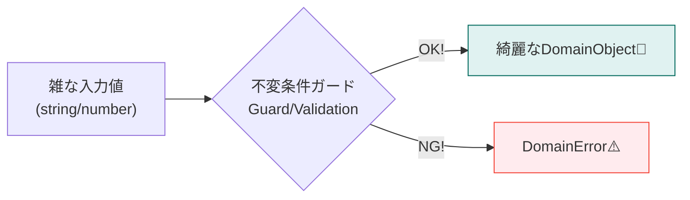
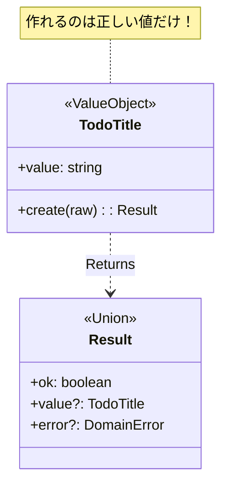

# 第07章：Domain入門① “不変条件”を型で守る🔒💎

この章はね、レイヤードの“ど真ん中”＝Domainを「壊れない核」にする回だよ〜！😊
結論から言うと **「無効な状態を“作れない”ようにする」** のがゴールです🛡️💕

ちなみに本日時点の安定版 TypeScript は **5.9.3**（npm の “latest”）だよ〜📦✨ ([npm][1])

---

## 7.1 まず「不変条件」ってなに？🤔💭


**不変条件（Invariant）** は「いつ見ても守られててほしいルール」のことだよ✅
例を出すね👇✨

* ToDoタイトルは **空文字ダメ** 🙅‍♀️
* 金額は **マイナス禁止** 💸❌
* “完了”のToDoには **完了日時が必須** 🕒✅（これは次章/次々章で本格的にやるよ🔁）

大事なのはこれ👇
**“入力が変でも”Domainの中は常に正しい状態でいてほしい** 💎✨



---

## 7.2 どうやって守るの？基本の考え方3点セット🧰✨


### ✅(1) 「生の値」をそのままDomainに入れない🙈

`string` や `number` をそのまま持つと、どこからでも雑に代入できちゃう😵‍💫

### ✅(2) “作る瞬間”に検証して固定する🔒

* 作るときにチェックして
* **作れたものは必ず正しい** って状態にする✨

### ✅(3) 一度作ったら基本いじれない（immutable気味）🧊

TypeScript の `readonly` は「書き換え禁止」を表現できるよ🧷 ([TypeScript][2])
（※実行時に完全ロックしたいなら、後で出てくる `#private` を使うのが強い🔥 ([MDN Web Docs][3])）

---

## 7.3 今日の主役：Domainの“小さな型”を作ろう🎀

ここでは ToDo の「タイトル」を例にするね✍️✨
ルールはこう👇

* 前後の空白を除いたあとに **1文字以上**
* **100文字以内**
* 改行はナシ（UIが崩れるの防止）🙅‍♀️



---

## 7.4 方式A：まずは超わかりやすい「Resultで返す」方式🎁✨


### 7.4.1 Result型を用意する📦

```ts
// domain/shared/Result.ts
export type Result<T, E> =
  | { ok: true; value: T }
  | { ok: false; error: E };
```

### 7.4.2 Domainエラーを定義する⚠️

```ts
// domain/shared/DomainError.ts
export type DomainError =
  | { type: "TodoTitleEmpty" }
  | { type: "TodoTitleTooLong"; max: number }
  | { type: "TodoTitleHasNewline" };
```

### 7.4.3 「TodoTitle」を“勝手に作れない型”にする🔒💎

ここで便利なのが **`unique symbol` を使ったブランド型**✨
「ただの string だけど、意味としては TodoTitle だよ」って区別できるの🪪
（`unique symbol` は TypeScript公式ドキュメントにもあるよ） ([TypeScript][4])

```ts
// domain/todo/TodoTitle.ts
import type { Result } from "../shared/Result";
import type { DomainError } from "../shared/DomainError";

declare const todoTitleBrand: unique symbol;

export type TodoTitle = string & { readonly [todoTitleBrand]: typeof todoTitleBrand };

const MAX_LEN = 100;

export const TodoTitle = {
  create(raw: string): Result<TodoTitle, DomainError> {
    const s = raw.trim();

    if (s.length === 0) return { ok: false, error: { type: "TodoTitleEmpty" } };
    if (s.length > MAX_LEN) return { ok: false, error: { type: "TodoTitleTooLong", max: MAX_LEN } };
    if (s.includes("\n") || s.includes("\r")) return { ok: false, error: { type: "TodoTitleHasNewline" } };

    // ここで「作れたなら正しい」に固定✨
    return { ok: true, value: s as TodoTitle };
  },
} as const;
```

### 7.4.4 使い方イメージ（Domain内でもOK）👀

```ts
import { TodoTitle } from "./TodoTitle";

const r = TodoTitle.create("  牛乳を買う  ");
if (!r.ok) {
  // ここではUIのことを知らないので「種類だけ返す」くらいがちょうどいい😊
  console.log(r.error);
} else {
  const title = r.value; // TodoTitle型✨
}
```

---

## 7.5 方式B：実行時もガチで隠す「#private クラス」方式🧱🔥


ブランド型は軽くて便利なんだけど、**実行時に“本当に隠したい”** ときはクラスが強い💪
JavaScriptの `#private` は **言語仕様でアクセスできない** のがポイントだよ🔐 ([MDN Web Docs][3])

```ts
// domain/todo/TodoTitle2.ts
import type { Result } from "../shared/Result";
import type { DomainError } from "../shared/DomainError";

const MAX_LEN = 100;

export class TodoTitle2 {
  #value: string;

  private constructor(v: string) {
    this.#value = v;
  }

  toString(): string {
    return this.#value;
  }

  static create(raw: string): Result<TodoTitle2, DomainError> {
    const s = raw.trim();

    if (s.length === 0) return { ok: false, error: { type: "TodoTitleEmpty" } };
    if (s.length > MAX_LEN) return { ok: false, error: { type: "TodoTitleTooLong", max: MAX_LEN } };
    if (s.includes("\n") || s.includes("\r")) return { ok: false, error: { type: "TodoTitleHasNewline" } };

    return { ok: true, value: new TodoTitle2(s) };
  }
}
```

> どっちが正解？🤔
> **最初は方式A（ブランド型）** が軽くておすすめ！
> 「守りたい値だけクラス化」みたいに後で強化もできるよ😊✨

---

## 7.6 「不変条件」探しのコツ🔎✨（ここ超大事！）


機能を見たら、まずこの3つをチェック✅

### ① 空/未設定がダメ？🙅‍♀️

* タイトル空禁止
* ID空禁止
* 日付未設定禁止 など

### ② 範囲/桁がある？📏

* 1〜100文字
* 0〜9999円
* 未来日だけOK など

### ③ 矛盾がダメ？⚔️

* “完了”なのに完了日時がない
* 開始日 > 終了日
* 残高がマイナスになる など

---

## 7.7 小演習🧩✨（手を動かすと一気にわかる！）

### 演習①：TodoTitleをあなたの題材向けに調整してみよう🎯

* 読書ログなら「本のタイトル」
* 推し活支出なら「支出メモのタイトル」など💖

追加ルール候補👇

* 絵文字OK/NG🙂
* 先頭に `#` 禁止（タグ表現とかぶる）🚫
* 連続スペース禁止🧹

### 演習②：Money（0以上）を作ろう💰✨

ルール例👇

* `0` 以上
* 小数禁止（整数だけ）🔢
* 上限 1,000,000 とか（暴走防止）🧯

（ヒント：`number` でもいいけど、**通貨の単位** を将来入れたくなるかもだよ〜👀）

---

## 7.8 AI活用🤖✨（コピペで使える！）

### 🎀プロンプト①：不変条件の洗い出し

「この機能のDomain不変条件を列挙して。空/範囲/矛盾の観点で、漏れがないかもチェックして。題材はToDoで、タイトル・期限・完了状態がある想定。」

### 🎀プロンプト②：TodoTitle.create の改善案

「TodoTitle.create の設計レビューして。エラーモデル（DomainError）を増やすならどんな分類が良い？UIに依存しない形で。」

### 🎀プロンプト③：境界のテスト観点（今は軽めでOK🧪）

「TodoTitle.create のテストケースを境界値で列挙して。空文字、空白のみ、100文字ちょうど、101文字、改行あり、など。」

---

## 7.9 理解チェック✅✨（口で説明できたら勝ち！）

* 「不変条件」ってなに？1文で言える？🗣️
* Domainに生の `string` を入れると何が怖い？😱
* “作るときに検証して固定する” の意味わかる？🔒
* `readonly` は何を守ってくれる？🧷 ([TypeScript][2])
* `unique symbol` を使うと何が嬉しい？🪪 ([TypeScript][4])

---

## 7.10 よくある事故あるある💥（先に潰そ〜！）


### 😵‍💫事故①：`type TodoTitle = string` だけ作って満足

→ それだと **空でも入れ放題** だよ〜😭

### 😵‍💫事故②：検証があちこちに散る

→ `create()` に寄せる✨
「作る道」を1本にすると迷子にならない🗺️

### 😵‍💫事故③：UI向けエラーメッセージをDomainに埋め込む

→ Domainは「種類（type）」だけ持つのがキレイ💎
文言は外側で変えられるようにね💌

---

## 7.11 次章へのつながり🎁✨

この章で作った「小さな型」は、次章でこう進化するよ😊

* **Entity / ValueObject に整理**して、もっと読みやすく📚✨
* 「IDで追うもの」と「値そのもの」を分ける🎀
* Domainが一気に“それっぽく”なるよ〜💎💕

---

必要なら、この章の題材を「推し活支出メモ💸💖」版に寄せた **Money / MemoTitle / Category** のセットも同じノリで一気に作れるよ😆✨

[1]: https://www.npmjs.com/package/typescript?activeTab=versions&utm_source=chatgpt.com "typescript"
[2]: https://www.typescriptlang.org/docs/handbook/classes.html?utm_source=chatgpt.com "Handbook - Classes"
[3]: https://developer.mozilla.org/en-US/docs/Web/JavaScript/Reference/Classes/Private_elements?utm_source=chatgpt.com "Private elements - JavaScript - MDN Web Docs"
[4]: https://www.typescriptlang.org/docs/handbook/symbols.html?utm_source=chatgpt.com "Symbols - TypeScript: Documentation"
