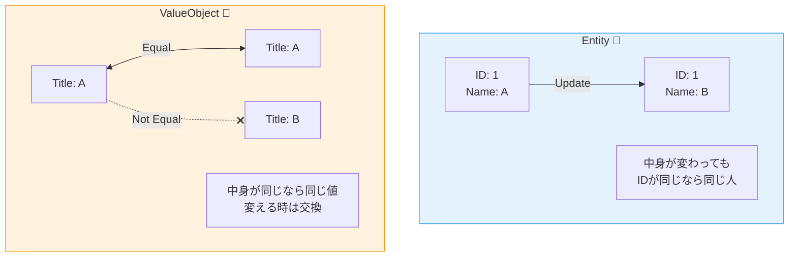
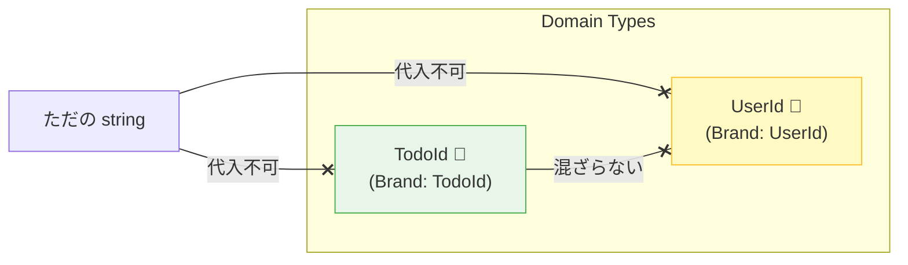

# 第08章：Domain入門② Entity/ValueObject をやさしく分ける🎀

[](https://speakerdeck.com/jgrodziski/introduction-to-domain-driven-design-entity-and-value-object?utm_source=chatgpt.com)

この章のゴールはこれだけ！🎯

* 「Entityっぽい子」と「ValueObjectっぽい子」を見分けられる👀✨
* TypeScriptで“壊れにくい”形に落とし込める🛡️
* プリミティブ地獄（string/numberだらけ）から1歩抜け出せる🚶‍♀️🌿

---

## 1) まずは“あるある事故”から😭💥


たとえば ToDo アプリで…

* ToDoのID（TodoId）もユーザーID（UserId）も、どっちも「ただのstring」
* うっかり入れ替えても、コンパイルが通っちゃう😇
* 実行してから「え、誰のToDo…？」みたいな事故が起きる🙃

これを防ぐのが、今日の主役✨

* **Entity**：IDで追いかける「個体」🪪
* **ValueObject（VO）**：値そのものに意味がある「値」💎

---

## 2) Entity と ValueObject の超ざっくり理解🍓


### Entity（エンティティ）🪪

* 「同じ人」「同じToDo」みたいに、**時間がたっても同一人物として追跡したい**
* だから **IDが命**🔥
* 状態は変わってOK（タイトル変更・完了など）🔁

### ValueObject（バリューオブジェクト）💎

* 「金額」「期間」「タイトル」みたいに、**値そのものが意味**
* **同じ値なら同じ**（等価性は“中身”で決まる）⚖️
* 基本は **不変（immutable）**：変えるなら“新しく作り直す”✨



---

## 3) 迷ったらコレ！Entity / VO 判定の5問クイズ🎮💡


次の質問に「YES」が多いほど…👇

### Entity寄り🪪

1. それを「同一のもの」として追跡したい？（時間がたっても同じ扱い？）⏳
2. 「同じ値でも別物」がありえる？（同姓同名の人、同じタイトルのToDoなど）👯
3. “履歴”や“状態の変化”が大事？（完了/未完了、住所変更など）📈
4. DBで独立して保存されるイメージ？🗄️
5. 「それ自体が主役」っぽい？🌟

### ValueObject寄り💎

1. 同じ値なら同じ扱いでOK？（中身が同じなら同一視）🤝
2. 作ったら変えないほうが自然？（変化＝差し替え）🔁
3. ルール（不変条件）がセットで付いてくる？（空文字禁止、範囲チェック等）🔒
4. いろんな場所で再利用したい？（入力検証・表示・比較など）♻️
5. 「属性っぽい」役割？（住所、金額、期間、メールなど）🏷️

---

## 4) この章の題材：ToDoを“ちゃんと分ける”🧩✨

* Entity：**TodoItem**（IDで追跡する主役）🪪
* VO：**TodoId / TodoTitle / DueDate** など（値に意味がある）💎

---

## 5) TypeScriptでVOを作る「ちょうどいい」型🧁✨

ここからが実装編！✍️
TypeScriptは「形が同じなら同じ型」になりやすい（構造的型付け）ので、**IDの取り違え事故**が起きやすいです。そこで「ブランド型（nominalっぽくする）」が便利です。([TypeScript][1])

さらに、TypeScriptの公式ダウンロードページでは、npmで入る最新版が 5.9 と明記されています（2026年初頭の時点でも 5.9 系が最新として案内）。([TypeScript][2])

---

### 5-1) まず「ドメイン用のエラー」🧨

（エラー設計は後の章でガッツリやるけど、最低限だけ先に用意🧸）

```ts
export class DomainError extends Error {
  constructor(message: string) {
    super(message);
    this.name = "DomainError";
  }
}
```

---

### 5-2) VO例①：TodoTitle（空文字禁止とか）📝🔒


ポイントは3つ🎯

* 作るときに検証して、以後は不変✨
* 生のstringをそのまま使わない（VOに閉じ込める）📦
* 比較は「中身」で⚖️

```ts
import { DomainError } from "./DomainError";

export class TodoTitle {
  private constructor(private readonly value: string) {}

  static create(raw: string): TodoTitle {
    const v = raw.trim();

    if (v.length === 0) {
      throw new DomainError("タイトルは空にできません🥺");
    }
    if (v.length > 50) {
      throw new DomainError("タイトルは50文字以内にしてね🙏");
    }

    return new TodoTitle(v);
  }

  toString(): string {
    return this.value;
  }

  equals(other: TodoTitle): boolean {
    return this.value === other.value;
  }
}
```

---

### 5-3) VO例②：ID取り違え事故を防ぐ（ブランド型）🪪🛡️


TypeScriptは構造的型付けなので、ただの string だと混ざりやすいです。公式の “nominal typing” の例でも、こういう「混ぜたくない値」を区別したいケースが紹介されています。([TypeScript][1])

ここでは「unique symbol」を使って “混ぜると怒られるID” にします✨

```ts
declare const TodoIdBrand: unique symbol;
export type TodoId = string & { readonly [TodoIdBrand]: "TodoId" };

export const TodoId = {
  from(raw: string): TodoId {
    const v = raw.trim();
    if (v.length === 0) throw new Error("TodoIdが空です🥺");
    return v as TodoId;
  },
};
```

これで、もし **UserId** を別ブランドで作ったら、間違って渡すとコンパイルで止まります🛑🎉



---

## 6) Entityを作る：TodoItem（主役）🪪🌟


Entityのコツはこれ👇

* 外からプロパティをベタ書きで変更させない🙅‍♀️
* 変更は「メソッド」を通す（不変条件を守る門番）🚪🔒

```ts
import { TodoId } from "./TodoId";
import { TodoTitle } from "./TodoTitle";

export type TodoStatus = "active" | "completed";

export class TodoItem {
  private status: TodoStatus;

  private constructor(
    private readonly id: TodoId,
    private title: TodoTitle,
    status: TodoStatus
  ) {
    this.status = status;
  }

  static createNew(id: TodoId, title: TodoTitle): TodoItem {
    return new TodoItem(id, title, "active");
  }

  getId(): TodoId {
    return this.id;
  }

  getTitle(): TodoTitle {
    return this.title;
  }

  getStatus(): TodoStatus {
    return this.status;
  }

  rename(newTitle: TodoTitle): void {
    // ここで「完了後はタイトル変更不可」とかルール追加もできる✨
    this.title = newTitle;
  }

  complete(): void {
    if (this.status === "completed") return; // 2回完了は無視（仕様ならOK）
    this.status = "completed";
  }
}
```

---

## 7) 「VO候補を3つ見つけるゲーム」🎮🔎✨（ミニ演習）

ToDoアプリで、次のうちVO候補っぽいのを **最低3つ** 選んでみてね👇

* タイトル📝
* 期限📅
* 優先度⭐
* タグ🏷️
* メモ本文📌
* 並び順（SortOrder）🔢
* URL🔗
* 金額（推し活支出メモなら！）💸

💡ヒント：
「ルールがある」「比較したい」「フォーマット変換したい」ものはVOにすると幸せになりがち🥰

---

## 8) AI活用🤖✨（Copilot / Codex向けプロンプト例）

そのまま貼って使えるやつ！📋💕

### 8-1) VO候補発掘

* 「このドメインで ValueObject 化すると事故が減る箇所を列挙して。理由も添えて。」

### 8-2) VO設計レビュー

* 「TodoTitle の不変条件が足りない/多すぎる点をレビューして。初心者向けに改善案も。」

### 8-3) “プリミティブ地獄”検知

* 「このコードの string/number の引数で、取り違え事故が起きそうな箇所を指摘して。ブランド型の導入案も出して。」

---

## 9) よくある落とし穴3つ⚠️（ここ超大事！）

### ① VOを作りすぎて疲れる😵‍💫

最初は **事故が多いもの・ルールが濃いもの** だけでOK👌
全部をVOにすると、学習段階では手が止まりやすいよ〜🧸

### ② Entityを「ただの箱」にしちゃう📦

Entityは「データ入れ」じゃなくて、**振る舞い（メソッド）でルールを守る子**にしようね🔒✨

### ③ DTOとDomainを混ぜる🍜

画面/HTTP都合の形（DTO）を、Domainにそのまま持ち込まない！
（このへんは後のDTO章で超スッキリさせるよ🧹✨）

---

## 10) 章末チェック✅💮（できたら勝ち！）

* Entity と VO の違いを「IDで追うか／値で見るか」で説明できる？🪪💎
* TodoTitle みたいに「作るときに検証して固定」ができた？🔒
* ブランド型で「ID取り違え事故」をコンパイルで止められた？🛑🎉
* Entityの変更をメソッド経由にできた？（直書き変更を減らした？）🚪✨

---

## おまけ：最近のTypeScript動向（超ざっくり）📰✨

* TypeScript 5.9 が最新として案内されていて、ドキュメント/ブログも 5.9 を中心に更新されています。([TypeScript][2])
* さらに先の動きとして、TypeScript の“ネイティブ版”プレビュー（Visual Studio 2026向け）など、コンパイル高速化の流れも出ています⚡([Microsoft Developer][3])

（でもこの章は「ドメインを堅くする」が主役なので、まずは VO/Entity を味方につけよ〜！💪💖）

---

次の章（第9章）では、**状態と遷移**をキレイにして「禁止操作を先に止める」方向に進むよ🔁🛑✨

[1]: https://www.typescriptlang.org/play/typescript/language-extensions/nominal-typing.ts.html?utm_source=chatgpt.com "Playground Example - Nominal Typing"
[2]: https://www.typescriptlang.org/download/?utm_source=chatgpt.com "How to set up TypeScript"
[3]: https://developer.microsoft.com/blog/typescript-7-native-preview-in-visual-studio-2026?utm_source=chatgpt.com "TypeScript 7 native preview in Visual Studio 2026"
