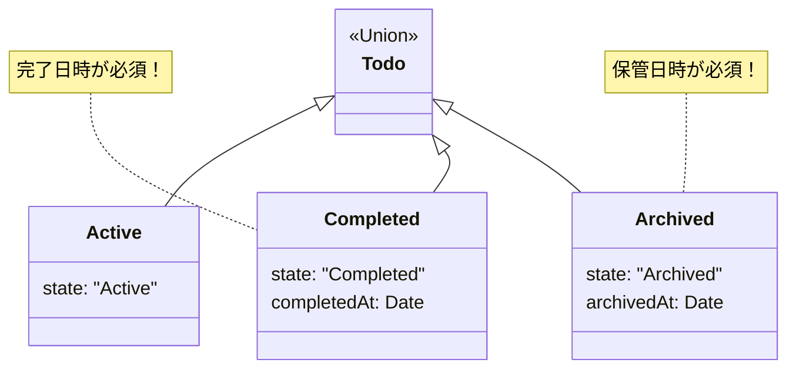

# 第09章：Domain入門③ 状態と遷移をキレイにする🔁✨

この章は **「うっかり禁止操作しちゃった😇」を“設計で起こりにくくする”** 回だよ〜！
状態（state）と遷移（transition）をちゃんと形にすると、**抜け漏れ・例外地獄・if地獄**が一気に減るよ🧹✨

---

## 1. 今日のゴール🎯


* 「状態」って何？を **ドメインの言葉**で説明できる😊
* 「許可される操作」と「禁止される操作」を **表（遷移表）**にできる🗒️
* TypeScriptで **“禁止遷移をコードで止める”** モデルを作れる🔒
* 「状態が増えても壊れにくい」書き方を選べる🧠✨

---

## 2. まず“あるある地獄”から🏜️😵‍💫


たとえばToDoで、こんなふうに作りがち👇

* `isDone: boolean`
* `doneAt?: Date`
* `isArchived: boolean`

…これ、**矛盾**を作れちゃうのがコワい😱

* `isDone = false` なのに `doneAt` が入ってる
* `isArchived = true` なのに編集できちゃう
* フラグの組み合わせが増えるほど、ifが爆増💥

✅ 解決の第一歩：**「状態は1つに寄せる」**
（フラグの寄せ集めをやめる🧹）

---

## 3. 状態（state）って何？🧩✨


**状態 = “今どのフェーズにいるか”** だよ😊
ドメイン的にはこう考えると気持ちいい👇

* 状態ごとに「できる操作」が違う
* 状態ごとに「持ってていいデータ」が違う

たとえばToDoなら：

* 未完了：完了できる、タイトル変更できる
* 完了：再開（未完了に戻す）できる、タイトル変更できる（ルール次第）
* アーカイブ：基本いじれない（ルール次第）

---

## 4. まずは“状態遷移表”を1枚作ろう🗒️✨（超重要）


### 例：ToDoの状態と操作🎛️

* 状態：`Active`（未完了） / `Completed`（完了） / `Archived`（保管）
* 操作：`complete` / `reopen` / `archive` / `rename`

遷移表はこんな感じ👇

| 現在の状態     | complete ✅ | reopen 🔁 | archive 🗄️ | rename ✏️ |
| --------- | ---------- | --------- | ----------- | --------- |
| Active    | Completed  | ❌         | Archived    | ✅         |
| Completed | ❌          | Active    | Archived    | ✅（ルール次第）  |
| Archived  | ❌          | ❌         | ❌           | ❌（基本）     |

ポイント💡

* ❌は「**禁止**」を意味するよ
* 「Completedでrenameできる？」みたいな**迷うところが設計ポイント**✨
  → チーム/プロダクトのルールとして決めよう😊

---

## 5. TypeScriptで“禁止遷移を起こしにくくする”２つの書き方🧱✨

### 方式A：`status` だけ持つ（シンプルで始めやすい）🌱

* 小さめアプリならこれで十分なこと多い👍
* ただし `status` と他のプロパティの整合が崩れやすい（例：completedAt）⚠️

### 方式B：**判別可能ユニオン（discriminated union）**（おすすめ！💎）

* 状態ごとに「持てるデータ」を型で分けられる
* “無効な組み合わせ”を作りにくい🔒✨
* レイヤードのDomainと相性めちゃ良い😊

この章では **方式B** をメインでいくよ〜🎀

---

## 6. 実装してみよう💻✨（判別可能ユニオンで状態を固定🔒）

### 6-1. ドメインのエラーも先に形にしちゃう⚠️

「禁止操作」は例外で投げっぱなしより、**ドメインエラーとして返す**のが扱いやすいよ（第18章にもつながる🌈）

```ts
// Result型（成功 or 失敗）を軽く用意✨
type Ok<T> = { ok: true; value: T };
type Err<E> = { ok: false; error: E };
type Result<T, E> = Ok<T> | Err<E>;

const ok = <T>(value: T): Ok<T> => ({ ok: true, value });
const err = <E>(error: E): Err<E> => ({ ok: false, error });

// ドメインエラー例
type TodoError =
  | { type: "AlreadyCompleted" }
  | { type: "NotCompletedYet" }
  | { type: "ArchivedTodoIsReadOnly" };
```

### 6-2. ToDoを“状態ごとに別の型”にする💎


```ts
type TodoId = string;

type TodoBase = {
  id: TodoId;
  title: string;
};

type ActiveTodo = TodoBase & {
  state: "Active";
};

type CompletedTodo = TodoBase & {
  state: "Completed";
  completedAt: Date;
};

type ArchivedTodo = TodoBase & {
  state: "Archived";
  archivedAt: Date;
};

// これが「ToDo」というドメインモデル✨
type Todo = ActiveTodo | CompletedTodo | ArchivedTodo;
```

✅ ここが最高ポイント🎉

* `Completed` のときだけ `completedAt` を“必須”にできる
* `Archived` のときだけ `archivedAt` を“必須”にできる
* 「完了なのに完了日時がない」みたいな矛盾を作りにくい🔒



---

## 7. “遷移”をドメイン関数として書く🔁✨


### 7-1. complete（未完了 → 完了）✅

```ts
function complete(todo: Todo, now: Date): Result<CompletedTodo, TodoError> {
  if (todo.state === "Archived") return err({ type: "ArchivedTodoIsReadOnly" });
  if (todo.state === "Completed") return err({ type: "AlreadyCompleted" });

  // ここに来るのは Active のみ✨
  return ok({
    ...todo,
    state: "Completed",
    completedAt: now,
  });
}
```

💡 `now` を外から渡してるのが大事！
Domainが勝手に `new Date()` しだすとテストもしにくいし、責務も混ざりがち😵‍💫
（時間は“外側の都合”寄りなので、Application/Presentationから渡すのがキレイ✨）

### 7-2. reopen（完了 → 未完了）🔁

```ts
function reopen(todo: Todo): Result<ActiveTodo, TodoError> {
  if (todo.state === "Archived") return err({ type: "ArchivedTodoIsReadOnly" });
  if (todo.state === "Active") return err({ type: "NotCompletedYet" });

  // ここに来るのは Completed のみ✨
  return ok({
    id: todo.id,
    title: todo.title,
    state: "Active",
  });
}
```

### 7-3. archive（未完了/完了 → 保管）🗄️

```ts
function archive(todo: Todo, now: Date): Result<ArchivedTodo, TodoError> {
  if (todo.state === "Archived") return err({ type: "ArchivedTodoIsReadOnly" });

  return ok({
    id: todo.id,
    title: todo.title,
    state: "Archived",
    archivedAt: now,
  });
}
```

---

## 8. “禁止遷移”を可視化できてる？👀✨（ドメインレビュー観点）


ここまでできたら、次の質問にYESなら勝ち🏆

* Archivedにしたら、ほんとに更新系操作が止まる？🛑
* Completedのときだけ必要な情報（completedAt）が型で担保されてる？🔒
* 「状態が増えたとき」どこを直せばいいか見える？🧭

---

## 9. ミニ演習🧩（手を動かすと理解が爆速💨）

### 演習1：状態遷移表を自分で作る🗒️✨

題材：読書ログ📚
状態：

* `Planning`（読む予定）
* `Reading`（読んでる）
* `Finished`（読み終わり）
* `Abandoned`（中断）

操作候補：

* start / finish / abandon / resume / changePlan

👉 まず表にして、❌を埋めてみてね😊

### 演習2：判別可能ユニオンでモデル化💎

* `Finished` のときだけ `finishedAt` を必須にする
* `Reading` のときだけ `startedAt` を必須にする
* `resume` は `Abandoned → Reading` のみ許可する

### 演習3：ドメインエラーを3つ決める⚠️

例：

* もうFinishedなのにfinishしようとした
* Abandonedなのにfinishしようとした
* Planningなのにresumeしようとした

---

## 10. AI活用🤖💡（この章で超強い使い方！）

コピペして使える「お願い文」テンプレ置いとくね🎁✨

### 10-1. 遷移表の抜け漏れチェック🔎

* 「この状態遷移表で、矛盾や抜け漏れがないかチェックして。想定される操作も追加で提案して」

### 10-2. 禁止遷移から“必要なドメインエラー”を作る⚠️

* 「この❌遷移に対応するドメインエラーを命名して、用途も説明して」

### 10-3. 判別可能ユニオンの型設計案💎

* 「状態ごとに必須プロパティが変わるので、discriminated unionで型設計して」

### 10-4. 仕様変更に強い提案をもらう🔁

* 「状態が増えたときに修正箇所が最小になる設計にしたい。改善案ある？」

---

## 11. よくある落とし穴🕳️😇（ここ踏むとしんどい）

* ✅ **フラグが増えて状態が“組み合わせ爆発”**（isDone × isArchived × …）💥
* ✅ 状態とデータの整合が崩れる（CompletedなのにcompletedAtが無い等）😱
* ✅ Domainが `Date.now()` とか外部都合を持ち始める（テストしんどい）🧪💦
* ✅ 「禁止遷移」を例外で雑に投げて、上で握りつぶされる（仕様が消える）🌫️

---

## 12. 発展：状態が複雑になったらどうする？🚀

状態が増えて、遷移も複雑で、UIとも絡みまくるなら
**状態機械ライブラリ**も選択肢になるよ🎛️✨

* XStateは v5 が公開されてるよ（actors中心の設計）([Stately][1])
* 分岐の網羅性を上げたいなら、`ts-pattern` みたいな「exhaustiveチェック」を使う手もあるよ🧠✨ ([GitHub][2])

ただし！最初から導入はやりすぎになりがちなので、
このカリキュラムでは **まずはDomainをユニオンで固める** のが超おすすめ😊💎

---

## 13. 理解チェック✅（3つ答えられたらOK🎉）

1. 状態をフラグで持つと何がツラい？😵‍💫
2. 状態遷移表の❌は、実装ではどう表現する？🛑
3. Completedのときだけ必要な情報を、型でどう担保する？🔒

---

## おまけ：TypeScript “最新系”の空気感🌸

本章の書き方（判別可能ユニオン＋網羅チェック）は、TypeScriptの進化と相性がよくて、今の主流感あるよ〜😊
ちなみにTypeScriptは 5.9.3 が “Latest” として出てるよ（2025-10-01のリリース一覧に載ってる）([GitHub][3])

---

次の第10章では、この **キレイに固めたDomain** を、Application層のユースケース（手順書）でどう呼ぶか🎮📋 に進むよ〜！✨

[1]: https://stately.ai/blog/2023-12-01-xstate-v5?utm_source=chatgpt.com "XState v5 is here"
[2]: https://github.com/gvergnaud/ts-pattern?utm_source=chatgpt.com "gvergnaud/ts-pattern: 🎨 The exhaustive Pattern Matching ..."
[3]: https://github.com/microsoft/typescript/releases "Releases · microsoft/TypeScript · GitHub"
