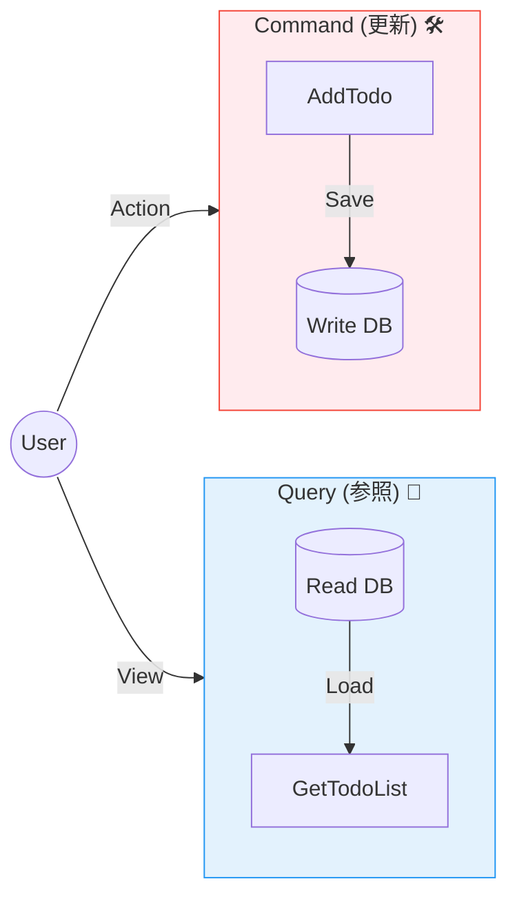
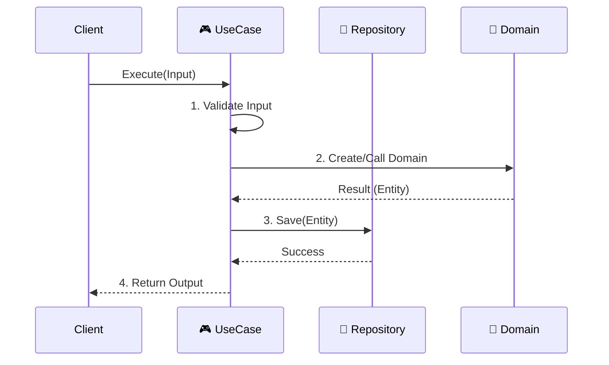

# 第10章：Application入門① ユースケース（手順書）を作る🎮📋

## この章のゴール🎯✨

この章が終わったら、こんな状態を目指すよ〜😊💡

* 「ユースケース＝手順書」って感覚がつかめる📋✨
* 更新（Command）と参照（Query）を分けて、頭がスッキリする🔁🧠
* Domainを呼ぶ順番・結果のまとめ方が書けるようになる🎮💎
* 「Domainに手順を書かない」理由が説明できるようになる🙆‍♀️

> ちなみに本日時点のTypeScriptは npm 上の最新が **5.9.3**（ダウンロードページでも “currently 5.9” と案内）だよ〜🧷✨ ([npm][1])
> （6.0/7.0は“これから”の話が中心なので、教材の基本は5.9系前提でOK👍） ([Microsoft for Developers][2])

---

## 1) ユースケースって何？🤔➡️「やりたいこと」単位だよ🎮✨


ユースケースは一言でいうと…

* **ユーザーの“やりたいこと”を実現する手順書**📋✨

例（ToDo題材）だとこんな感じ👇

* ✅ ToDoを追加する
* ✅ ToDoを完了にする
* ✅ ToDoを一覧で見る
* ✅（将来）期限で並べ替える…など

ここで大事ポイント💡

* ユースケースは **HTTPのエンドポイント** と1:1じゃなくてもOK🙆‍♀️
  （同じユースケースを「画面」からも「API」からも呼べたりするしね🎛️）
* Domainは **ルールの塊（核）**💎
  Application（ユースケース）は **手順・調整役**🎮
  → だから「手順」をDomainに置き始めると、Domainが太って事故りやすい😵‍💫💥

---

## 2) Command / Query の気持ち🔁✨（更新と参照を混ぜない💎）


ユースケースを作るとき、まずこの分け方を入れると世界が平和になるよ🕊️✨

### Command（更新する）🛠️

* 何かを **変更** する（作る／更新／削除）
* だいたい **副作用あり**（保存する・状態が変わる）
* 返り値は「成功したよ」「作ったIDこれだよ」くらいでOK🙆‍♀️

例：`AddTodo`, `CompleteTodo`

### Query（参照する）🔎

* 何かを **見るだけ**（一覧、詳細、検索）
* **状態は変えない**
* 返り値は表示に必要なデータ（DTOっぽい形）でOK📦✨
  ※ DTOの本格話は次章（第11章）でやるよ〜😊

> コツ：迷ったら「DBに書く？状態変える？」→ YESならCommand寄り📝
> 「見るだけ？」→ Query寄り👀✨



---

## 3) Application層の“持ち物”🧰✨（何を書いていい場所？）


Application層で書いていいのはこんな役割だよ👇😊

* ✅ **手順**（Domainをどういう順で呼ぶか）
* ✅ **調整**（複数のDomainオブジェクトをまたぐ流れ）
* ✅ **境界のまとめ**（成功・失敗の結果を整える）
* ✅ **外部への依存は“抽象（interface）”越し**（実装は外側）🔌
  ※ interfaceの本格は第12章で深掘りするけど、ここでも“薄く”使うよ👍

逆にApplication層に入れないほうがいいやつ🚫

* ❌ **ビジネスルールの本体**（それはDomain）
* ❌ **DBのSQLやHTTPクライアント直叩き**（それはInfrastructure寄り）
* ❌ **画面の表示整形どっぷり**（それはPresentation寄り）

---

## 4) ユースケース実装テンプレ🧩✨（困ったらこれ）


ユースケースはだいたいこの形になるよ👇🎮

1. 入力を受け取る（Command / Query）📥
2. （軽く）前提チェックする🧷
3. Repositoryなどから必要データを取る🔎
4. Domainのメソッドを呼ぶ（ルールはDomainに任せる）💎
5. 保存する（Commandのとき）🗄️
6. 結果を返す（成功/失敗）📤

> 「手順はApplication、ルールはDomain」って唱えると迷子になりにくいよ〜🧠✨



---

## 5) 例：ToDoを追加する（Command）📝✨


ここでは最小構成で、**ApplicationがDomainを呼ぶ順番**を体感しよう😊
（Domain側は「タイトル空は禁止」みたいな不変条件を持ってる想定💎）

```ts
// application/result.ts
export type Ok<T> = { ok: true; value: T };
export type Err<E> = { ok: false; error: E };
export type Result<T, E> = Ok<T> | Err<E>;

export const ok = <T>(value: T): Ok<T> => ({ ok: true, value });
export const err = <E>(error: E): Err<E> => ({ ok: false, error });
```

```ts
// application/ports/todoRepository.ts
import { TodoItem } from "../../domain/todo/todoItem.js";

export interface TodoRepository {
  save(todo: TodoItem): Promise<void>;
}
```

```ts
// application/usecases/addTodo.ts
import { Result, ok, err } from "../result.js";
import { TodoRepository } from "../ports/todoRepository.js";
import { TodoItem } from "../../domain/todo/todoItem.js";

export type AddTodoCommand = {
  title: string;
};

export type AddTodoError =
  | { type: "InvalidInput"; message: string }
  | { type: "DomainError"; message: string }
  | { type: "Unexpected"; message: string };

export type AddTodoOutput = {
  id: string;
};

export class AddTodoUseCase {
  constructor(private readonly repo: TodoRepository) {}

  async execute(command: AddTodoCommand): Promise<Result<AddTodoOutput, AddTodoError>> {
    // 1) 入口で軽くチェック（ガチの実行時バリデーションは第17章で✨）
    if (command.title.trim().length === 0) {
      return err({ type: "InvalidInput", message: "タイトルを入れてね🥺" });
    }

    // 2) Domainを生成（不変条件チェックはDomain側に寄せる💎）
    const created = TodoItem.create({ title: command.title }); // 例：Domain側でResultを返す想定
    if (!created.ok) {
      return err({ type: "DomainError", message: created.error.message });
    }

    // 3) 保存（永続化の詳細はInfrastructure、ここは抽象だけ🗄️）
    try {
      await this.repo.save(created.value);
      return ok({ id: created.value.id });
    } catch (e) {
      return err({ type: "Unexpected", message: "保存に失敗しちゃった😭" });
    }
  }
}
```

### ここでの“学びポイント”💡✨

* Applicationは **手順を書くだけ**（生成→保存→結果）🎮
* タイトル空禁止みたいなルールは **Domainに任せる**💎
* DBのやり方は知らない（`TodoRepository` という **抽象**だけ知ってる）🔌

---

## 6) 例：ToDoを一覧する（Query）📄✨

Queryは「保存しない・状態変えない」だから、よりスッキリしがち😊✨

```ts
// application/ports/todoQueryService.ts
export type TodoListItem = {
  id: string;
  title: string;
  isDone: boolean;
};

export interface TodoQueryService {
  list(): Promise<TodoListItem[]>;
}
```

```ts
// application/usecases/getTodoList.ts
import { TodoQueryService, TodoListItem } from "../ports/todoQueryService.js";

export class GetTodoListQuery {
  constructor(private readonly qs: TodoQueryService) {}

  async execute(): Promise<TodoListItem[]> {
    return this.qs.list();
  }
}
```

### Queryでありがちなコツ👀✨

* Queryは **“表示に必要な形”で返してOK**（Domainをそのまま返さなくてOK）📦
* 「DTOと境界変換」の整理は次章でガッツリやるよ〜🧩✨

---

## 7) ありがち事故集🚑💥（回避ワザ付き）


### 事故①：Domainに手順を書き始める😵‍💫

* 「保存して、通知して、ログして…」みたいな流れをDomainに書く
  ✅ 回避：**Domainはルールと状態遷移だけ**、流れはUseCaseへ🎮

### 事故②：UseCaseが巨大化する🦖

* 1つのexecuteが200行とかになる
  ✅ 回避：
* “ユースケースを分割”する（ユーザーの目的で分ける）
* 途中の処理を「小さいサービス」に切り出す（ただしDomain侵食しない）✂️

### 事故③：CommandとQueryをごっちゃにする🍲

* 一覧取得のついでに「古いデータを掃除」みたいな更新が混ざる
  ✅ 回避：**参照は参照だけ**、掃除は別Commandへ🧹

### 事故④：ApplicationがDB都合に染まる🧟‍♀️

* ApplicationでSQL文字列組み立て始める
  ✅ 回避：Repository/QueryServiceの **interface** 越しにする🔌

---

## 8) ミニ演習🧩✨（手を動かすよ〜！）

### 演習A：ユースケース名を決めよう✍️🎮

次を “ユースケース名” にしてみてね👇

* ToDoを追加
* ToDoを完了
* ToDoを一覧

💡ヒント：動詞から始めると迷いにくい（Add / Complete / Get…）✨

### 演習B：CommandとQueryを仕分けよう🔁✅

次はCommand？Query？どっちかな？

* 期限が近いToDoを表示する📅
* 完了済みをまとめて削除する🗑️
* 1件の詳細を表示する🔎
* タイトルを変更する✏️

### 演習C：テンプレで1本書こう🧩

「ToDoを完了にするCommand」を、テンプレ6ステップで組み立ててみよう😊
（入力→取得→Domain操作→保存→結果）

---

## 9) AI活用🤖✨（Copilot/Codexに頼るとこ、頼らないとこ）

### 使うと強い💪✨

* 「ユースケース名の候補出して〜」📝
* 「この処理、CommandとQueryどっち？」🔁
* 「このUseCase、責務が混ざってないかレビューして」👀
* 「例外じゃなくResultで返す形に整えて」🧩

### おすすめプロンプト例🗣️🤖

* 「この機能説明から、ユースケース一覧とCommand/Query分類を提案して。理由も添えて😊」
* 「このexecuteが太ってきた。責務の分割案を3つ出して、メリデメも書いて🙏」
* 「Domainに書くべきルール／UseCaseに書くべき手順を仕分けして✅」

---

## 10) チェックリスト✅✨（できたら合格〜！）

* [ ] ユースケースを「やりたいこと単位」で言える🎮
* [ ] CommandとQueryを混ぜないで説明できる🔁
* [ ] “手順はApplication、ルールはDomain” を自分の言葉で言える💎
* [ ] ApplicationがDB/HTTPの詳細を知らない形にできた🔌
* [ ] 成功/失敗の結果を（例外投げっぱなしじゃなく）扱う方針が見えた🧩

---

次章（第11章）では、今日ちらっと出てきた **DTOと境界変換（Mapping）** を、迷子にならない整理術つきでやるよ〜🧩📦✨

[1]: https://www.npmjs.com/package/typescript?activeTab=versions&utm_source=chatgpt.com "typescript"
[2]: https://devblogs.microsoft.com/typescript/progress-on-typescript-7-december-2025/?utm_source=chatgpt.com "Progress on TypeScript 7 - December 2025"
