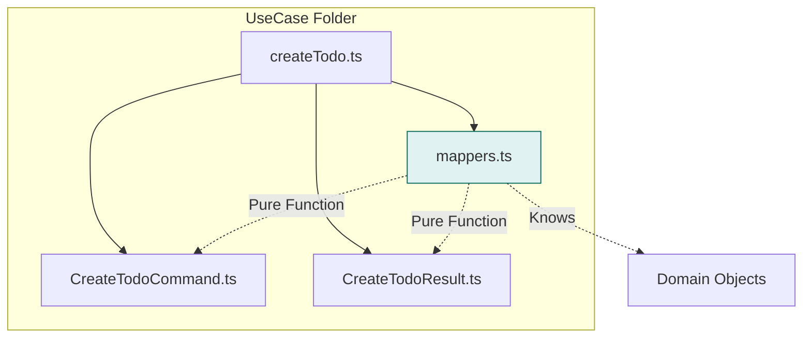

# 第11章：Application入門② DTOと境界変換（Mapping）🧩📦

## この章でできるようになること🎯✨

* **DTO（入出力の箱）**と**Domainモデル（ルールの宝石箱💎）**を混ぜずに扱える😊
* **「どこで変換するか？」**が迷わなくなる🚪🧭
* **変換だらけで迷子**にならない整理術が身につく🧹✨
* 「後でAPIや画面が変わっても、Domainが死なない」構造にできる🛡️💪

---

## 1) DTOってなに？🍱（超ざっくり）

DTOは **Data Transfer Object** の略で、ひとことで言うと…

> **外の世界（画面/HTTP/DB/外部API）とデータをやり取りするための“運搬用の箱”📦**

* **入力DTO**：フォームやHTTPで受け取る“入力の箱”📥
* **出力DTO**：画面やAPIレスポンスへ返す“出力の箱”📤

ここで大事なのは👇
DTOは **“都合の箱”** であって、**ルールの本体（Domain）ではない**ってこと🙂✨

---

## 2) なんでDomainと分けるの？💥（混ぜると事故る）

DTOとDomainを混ぜると、こういう事故が起きがち😵‍💫

### 事故あるある①：画面都合がDomainに侵入する🧟‍♀️

* 例：フォームが `title` じゃなくて `todo_title` になった
  → Domainのプロパティ名まで変える羽目に💥

### 事故あるある②：入力が文字列だらけ問題🧵

* HTTP入力はだいたい **string** で来る（数値でも日付でも！）
  → Domainが `string` まみれになってルールが崩壊😇

### 事故あるある③：テストがしんどい🧪💦

* DomainがHTTPや画面の形に寄るほど、テストが“外部依存”になる
  → **Domainが純粋じゃなくなる**＝ご褒美（テストの簡単さ🍰）が消える

---

## 3) “箱は3つ”で考えるとラク🧠✨


この章の結論はこれ👇

**入力DTO（外）**📥 → **Domain（核）**💎 → **出力DTO（外）**📤

イメージ図🗺️✨（超重要！）

```
Presentation(HTTP/画面) 🎛️
   ↓ 入力DTO 📥（外の形）
Application(UseCase) 🎮
   ↓ Domainへ変換 💎（ルールの形）
Domain(ルール) 💎
   ↑ Domainから変換 📦（表示の形）
Application(UseCase) 🎮
   ↑ 出力DTO 📤
Presentation(HTTP/画面) 🎛️
```

---

## 4) 「境界で変換する」ってどこ？🚪🧩

“境界”っていうのは、だいたいこの2つの境目だよ🙂

### ✅ 境界①：Presentation → Application（入口）🚪📥

* HTTP/画面イベントの都合をここで吸収する
* **UseCaseが欲しい形（入力DTO）**にして渡す

### ✅ 境界②：Application → Presentation（出口）🚪📤

* Domainの結果を、画面/レスポンス都合の形に整える
* **出力DTO**にして返す

👉 **Domain層はDTOを知らない**（importしない）
これが一生モノのルール🛡️✨

---

## 5) 実例：ToDo追加（最短でわかるやつ）🧵📝

### 想定する要件（超ミニ）🌱

* 入力：`title`（空はダメ🙅‍♀️）
* 出力：作成したToDoの `id`, `title`, `done`

---

### 5-1. フォルダ配置（迷子防止）🗂️✨

UseCase単位でまとまってると最高にラク😊

* `src/application/usecases/createTodo/`

  * `CreateTodoCommand.ts`（入力DTO）📥
  * `CreateTodoResult.ts`（出力DTO）📤
  * `createTodo.ts`（ユースケース本体）🎮
  * `mappers.ts`（変換をここに集約）🧩
* `src/domain/`

  * `Todo.ts`（Entity）🪪
  * `TodoTitle.ts`（VO）🔒
* `src/presentation/http/`

  * `createTodoHandler.ts`（HTTPの薄い層）🎛️

---

### 5-2. 入力DTO（Command）📥

```ts
// src/application/usecases/createTodo/CreateTodoCommand.ts
export type CreateTodoCommand = {
  title: string; // HTTPでは文字列で来る前提
};
```

---

### 5-3. 出力DTO（Result）📤

```ts
// src/application/usecases/createTodo/CreateTodoResult.ts
export type CreateTodoResult = {
  id: string;
  title: string;
  done: boolean;
};
```

---

### 5-4. Domain（例：Titleは空禁止🔒）💎

```ts
// src/domain/TodoTitle.ts
export class TodoTitle {
  private constructor(public readonly value: string) {}

  static create(raw: string): TodoTitle {
    const v = raw.trim();
    if (v.length === 0) throw new Error("TITLE_EMPTY");
    if (v.length > 50) throw new Error("TITLE_TOO_LONG");
    return new TodoTitle(v);
  }
}
```

---

### 5-5. 変換（Mapping）を“境界”に集める🧩🚪

ポイントは **副作用なし（pure）** ✨
「変換するだけ」「DB触らない」「HTTP知らない」👍

```ts
// src/application/usecases/createTodo/mappers.ts
import { TodoTitle } from "@/domain/TodoTitle";
import type { CreateTodoCommand } from "./CreateTodoCommand";
import type { CreateTodoResult } from "./CreateTodoResult";
import type { Todo } from "@/domain/Todo";

export function toDomainTitle(cmd: CreateTodoCommand): TodoTitle {
  return TodoTitle.create(cmd.title);
}

export function toResult(todo: Todo): CreateTodoResult {
  return {
    id: todo.id.value,
    title: todo.title.value,
    done: todo.done,
  };
}
```

---

### 5-6. UseCase本体（Application）🎮

UseCaseは「手順書」📋
Domainを呼んで、結果をDTOにして返すだけに寄せる😊

```ts
// src/application/usecases/createTodo/createTodo.ts
import type { CreateTodoCommand } from "./CreateTodoCommand";
import type { CreateTodoResult } from "./CreateTodoResult";
import { toDomainTitle, toResult } from "./mappers";
import { Todo } from "@/domain/Todo";
import type { TodoRepository } from "@/application/ports/TodoRepository";

export async function createTodo(
  repo: TodoRepository,
  cmd: CreateTodoCommand
): Promise<CreateTodoResult> {
  const title = toDomainTitle(cmd);        // DTO → Domain
  const todo = Todo.createNew(title);      // Domainルールで生成💎
  await repo.save(todo);                   // 外側はPort経由🔌
  return toResult(todo);                   // Domain → DTO
}
```

---

## 6) 入力は“型だけ”じゃ守れない問題🛡️（2026の定番）

HTTPやフォームの入力は **unknown** と思って扱うのが安全😊
そこでよく使われるのが **スキーマバリデーション**（実行時チェック）✨

* Zod：v4系が安定版になっていて、npmの最新は **4.3.5**（2026-01時点） ([Zod][1])
* Valibot：小さくてモジュラー設計、npmの最新は **1.2.0**（2025-11時点） ([Valibot][2])

（どっちが正解！ではなく、**プロジェクトの好み**でOKだよ😊）

---

### 6-1. Presentation側で「unknown→入力DTO」へ📥🚪

例としてZodでやってみるね✨（入口で弾くのが気持ちいい🧼）

```ts
// src/presentation/http/createTodoHandler.ts
import { z } from "zod";
import { createTodo } from "@/application/usecases/createTodo/createTodo";
import type { TodoRepository } from "@/application/ports/TodoRepository";

const CreateTodoSchema = z.object({
  title: z.string().min(1).max(50),
});

export async function createTodoHandler(
  repo: TodoRepository,
  body: unknown
) {
  const parsed = CreateTodoSchema.parse(body); // unknown → 安全な形へ🛡️

  // ここで “入力DTO” にする（Application入口へ）📥
  const cmd = { title: parsed.title };

  const result = await createTodo(repo, cmd);

  // resultは出力DTOなので、そのままレスポンスへ📤
  return { status: 201, json: result };
}
```

> ※ Zodは「TypeScriptの型は実行されない」問題を補ってくれる系の代表例だよ😊 ([npm][3])

---

## 7) 「変換だらけで迷子」防止の整理術🧹🧭

ここ、超大事！！✨ 迷子になる人めっちゃ多い😵‍💫

### ✅ ルール1：DTOは“ユースケース単位”で作る🎮📦

* `CreateTodoCommand` / `CreateTodoResult` みたいに
* でっかい共通DTOを作ると、だいたい腐る🍂

### ✅ ルール2：Mapperは“ユースケースの近く”に置く🧩

* 変換が散らばると追えない
* 1ユースケースに `mappers.ts` 1枚、めっちゃおすすめ😊

### ✅ ルール3：DomainはDTOをimportしない🙅‍♀️

* 逆に「DTOがDomainをimport」するのもなるべく避けたい
* 依存の向きが綺麗なほど勝ち🏆✨

### ✅ ルール4：変換は“副作用なし”にする🧼

* DBアクセスしない
* 時刻取得しない
* ネットワーク呼ばない
  → **ただの変換**にするとテストが秒で終わる🧪⚡

### ✅ ルール5：名前を統一する（地味に最強）🏷️

* 入力：`XxxCommand` / `XxxQuery`
* 出力：`XxxResult` / `XxxView`
* 変換：`toDomainXxx`, `toResult`, `toDto`
  命名が揃うと迷子率が激減😊✨



---

## 8) よくある失敗と直し方🙈➡️😊

### ❌ 失敗1：UseCaseがHTTPの形を直接受け取る

* `createTodo(repo, req.body)` とか
  ✅ **直し**：Presentationで `unknown→入力DTO` にしてから渡す📥

### ❌ 失敗2：Domainに表示用フィールドが混ざる

* `Todo` に `displayTitle` とか入れちゃう
  ✅ **直し**：それは出力DTO側で作る📤（整形は外）

### ❌ 失敗3：Mapperが巨大化して神クラス化👼💥

✅ **直し**：

* “ユースケース単位で分割”
* “VO生成は関数に切り出し”
* “DTOを小さくする”

---

## 9) ミニ演習🧩✍️（30〜45分くらいの手触り）

題材：ToDoに「締切（deadline）」を追加📅✨（でもDomainは日付ルール守る）

### やること

1. 入力DTOに `deadline?: string` を追加（HTTPは文字列）📥
2. Domainに `Deadline` VOを作る（過去日はNG🙅‍♀️ とか）💎
3. Mapperで `string → Deadline` へ変換🧩
4. 出力DTOは `deadline?: string` で返す（ISO文字列）📤
5. 「deadline無し」も通るようにする😊

### ゴール✅

* Domainが **string日付を知らない**
* Presentationが **unknownを信用してない**
* 変換が “境界にまとまってる” 🧹✨

---

## 10) AI活用プロンプト集🤖💡（そのままコピペOK）

* 「この `CreateTodoCommand` を見て、Domainに持ち込むべきでない項目があるかレビューして🙏」
* 「DTO→Domain→DTO の変換が増えた時、フォルダ/命名の整理案を3パターン出して😊」
* 「`mappers.ts` が肥大化しそう。責務分割の切り方を提案して！」
* 「入力の `unknown` を安全にするためのZod/Valibotスキーマ案を作って✨」 ([Valibot][2])

---

## 章末チェック✅🌟

* [ ] DTOとDomainを“別物”として説明できる🙂？
* [ ] 入口（Presentation→Application）で `unknown` を弾ける🛡️？
* [ ] DomainがDTOをimportしてない🙅‍♀️？
* [ ] Mapperが“副作用なし”になってる🧼？
* [ ] 「変換は境界に置く」が自分の言葉で言える🚪🧭？

---

### おまけ：2026っぽい最新トピック小話📣✨

* TypeScriptの最新安定版は **5.9系**（公式ダウンロードページでも “currently 5.9” と案内） ([TypeScript][4])
* さらに将来に向けて、コンパイラのネイティブ化（TypeScript 7 Native Preview）も進んでるよ⚡（ビルド高速化が大きなテーマ） ([Microsoft Developer][5])

---

次の第12章は、ここで出てきた `TodoRepository` みたいな **Port（interface）で依存を逆転**していくよ🔌➡️✨
その前に、もし今の章の題材を「読書ログ📚」とか「推し活支出メモ💸」に寄せた例も欲しかったら、同じ構造でサクッと作るね😊💕

[1]: https://zod.dev/v4?utm_source=chatgpt.com "Release notes"
[2]: https://valibot.dev/?utm_source=chatgpt.com "Valibot: The modular and type safe schema library"
[3]: https://www.npmjs.com/package/zod?utm_source=chatgpt.com "Zod"
[4]: https://www.typescriptlang.org/download/?utm_source=chatgpt.com "How to set up TypeScript"
[5]: https://developer.microsoft.com/blog/typescript-7-native-preview-in-visual-studio-2026?utm_source=chatgpt.com "TypeScript 7 native preview in Visual Studio 2026"
