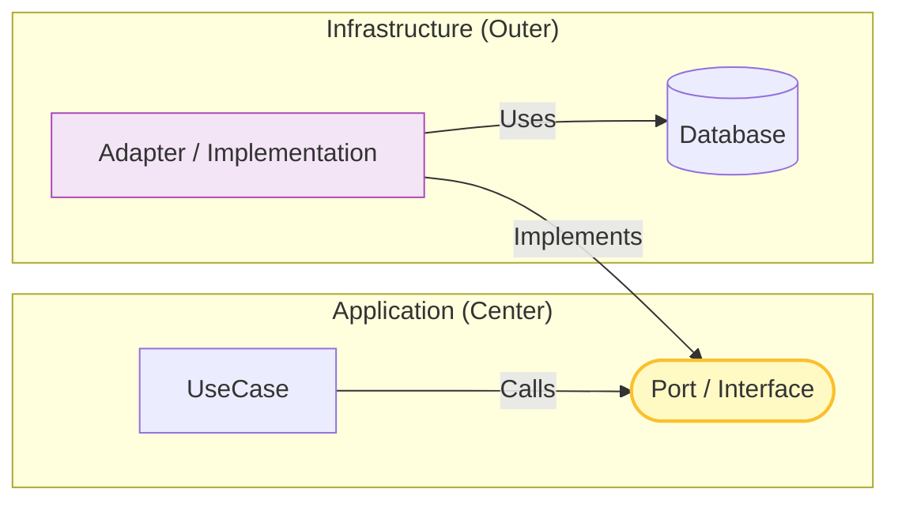

# 第12章：Port（interface）で依存を逆転する🔌➡️✨

（＝DBや外部APIに振り回されない“強い中心”を作る回だよ〜！😊）

---

## 0. この章でできるようになること🎯✨

* 「保存」「外部API呼び出し」みたいな**外側の都合**を、中心（Application/Domain）に持ち込まない🚫🌀
* Application側で **Port（interface）** を用意して、外側（Infrastructure）がそれを実装する形にできる🔁
* 「実装は後で差し替えOK」な状態を作って、開発スピードもテストもしやすくする🧪💨

ちなみに、TypeScriptの最新安定版は **5.9.3** だよ（本日時点）📌 ([npm][1])
（TS 6/7 の大きい動きも進んでるけど、まずは “いま使う設計の型” を固めるのが勝ち！🔥 ([GitHub][2])）

---

## 1. まず「Port」ってなに？🤔🔌


**Port = 内側（Application）が「外にお願いしたいこと」を“約束（interface）”として宣言したもの**だよ😊✨

たとえば ToDo アプリなら…

* 「ToDoを保存してね」🗄️
* 「ToDo一覧ちょうだい」📄
* 「今の時刻ちょうだい」⏰
* 「IDを発行してね」🪪

こういう “お願い” を **interface（Port）** にするの。

そして重要ポイント👇✨

* **内側（Application）は Port だけ知ってる**
* **外側（Infrastructure）が Port を実装する（Adapter）**
* だから **DBが変わっても中心のコードは壊れにくい** 🛡️

この考え方は「Ports & Adapters（Hexagonal / Clean）」でも超中心にあるやつだよ〜🏰✨ ([MaibornWolff][3])



---

## 2. ありがちな事故💥（Portが無い世界）


### 😵‍💫事故例：ApplicationがDBライブラリを直接import

* 「ToDo追加」のユースケースの中で Prisma/SQLite/Fetch などを直接触り始める
* すると…

  * DB変更でユースケースが全滅💥
  * テストでDB必須になって遅い＆面倒🧪😇
  * “中心” が外側の都合に引きずられる🌀

**Portを挟むと、この事故がスパッと止まるよ✂️✨**

---

## 3. 置き場所ルール🗂️✨（めっちゃ大事！）


Port（interface）は基本こう置くのがキレイ👇

* **Application層に置く**（ユースケースが欲しい機能だから）🎮

  * `src/application/ports/...`

Infrastructure側はこう👇

* **Infrastructure層に実装（Adapter）を置く**🚪

  * `src/infrastructure/...`

> ✅ Port は「内側の都合（欲しい形）」で決める
> ✅ 実装（DB/外部API）は「外側の都合」なので後で差し替え可能にする

---

## 4. 小さな題材で完成させよう🧩💛（ToDo）

ここからは「最小セット」でいくよ〜！🌱✨
**“保存Port” を作って、ユースケースが Port 経由で保存する**までを通す💪

---

### 4.1 フォルダ構成（この章で増える場所）📦✨

* `src/application/ports/todoRepositoryPort.ts`
* `src/application/usecases/addTodo.ts`
* `src/infrastructure/todo/inMemoryTodoRepository.ts`
* `src/main/compositionRoot.ts`（組み立て場所：第15章で本格化するけど、先にミニ版で体験😊）

---

### 4.2 Domain（超ミニ）💎（※雰囲気でOK）

```typescript
// src/domain/todo.ts
export type TodoId = string;

export class Todo {
  constructor(
    public readonly id: TodoId,
    public readonly title: string,
    public readonly isDone: boolean = false,
  ) {
    if (title.trim().length === 0) throw new Error("title is required");
  }
}
```

---

### 4.3 Port を定義する🔌✨（Application側）

「保存したい」「一覧がほしい」を Port にするよ〜！

```typescript
// src/application/ports/todoRepositoryPort.ts
import type { Todo, TodoId } from "../../domain/todo";

export interface TodoRepositoryPort {
  save(todo: Todo): Promise<void>;
  list(): Promise<Todo[]>;
  findById(id: TodoId): Promise<Todo | null>;
}
```

ポイント🌟

* `import type` を使うと、余計な実行時依存が混ざりにくいよ📦✨
* Port名は `...Port` とか `...Repository` とか、チームで統一すると迷子にならない🧭

---

### 4.4 ユースケース（Application）🎮📋

ユースケースは **Port だけ** に依存するよ！

```typescript
// src/application/usecases/addTodo.ts
import { Todo } from "../../domain/todo";
import type { TodoRepositoryPort } from "../ports/todoRepositoryPort";

export type AddTodoInput = {
  id: string;
  title: string;
};

export class AddTodoUseCase {
  constructor(private readonly repo: TodoRepositoryPort) {}

  async execute(input: AddTodoInput): Promise<void> {
    const todo = new Todo(input.id, input.title);
    await this.repo.save(todo);
  }
}
```

✅ ApplicationはDB知らない
✅ “保存する” という能力だけ欲しい
→ **Port最高〜！🔌✨**

---

### 4.5 Adapter（Infrastructure）で実装する🚪🗄️

まずは **インメモリ実装**でOK！（第13章でDB版に差し替えるイメージ💡）

```typescript
// src/infrastructure/todo/inMemoryTodoRepository.ts
import type { Todo, TodoId } from "../../domain/todo";
import type { TodoRepositoryPort } from "../../application/ports/todoRepositoryPort";

export class InMemoryTodoRepository implements TodoRepositoryPort {
  private readonly store = new Map<TodoId, Todo>();

  async save(todo: Todo): Promise<void> {
    this.store.set(todo.id, todo);
  }

  async list(): Promise<Todo[]> {
    return [...this.store.values()];
  }

  async findById(id: TodoId): Promise<Todo | null> {
    return this.store.get(id) ?? null;
  }
}
```

ここでの嬉しさ🍰

* DB無しで動く
* テストも速い
* でも Port があるから後で差し替え自由🔁✨

---

### 4.6 “組み立て” して動かす（ミニ Composition Root）🧩🏗️


```typescript
// src/main/compositionRoot.ts
import { AddTodoUseCase } from "../application/usecases/addTodo";
import { InMemoryTodoRepository } from "../infrastructure/todo/inMemoryTodoRepository";

export function createApp() {
  const repo = new InMemoryTodoRepository();
  const addTodo = new AddTodoUseCase(repo);

  return { addTodo, repo };
}
```

試しに呼ぶ（デバッグ用）👇

```typescript
// src/main/devRun.ts
import { createApp } from "./compositionRoot";

async function main() {
  const { addTodo, repo } = createApp();

  await addTodo.execute({ id: "1", title: "牛乳を買う🥛" });
  await addTodo.execute({ id: "2", title: "レイヤード勉強する🏗️✨" });

  console.log(await repo.list());
}

main().catch(console.error);
```

---

## 5. Port設計のコツ✂️✨（interface肥大化を防ぐ！）

### コツ①：Portは “ユースケース目線” で作る👀🎮


Portが「DBのテーブル操作セット」みたいになると太りがち😵‍💫

* ❌ `save/update/delete/findAll/findByX/findByY...` が無限に増える
* ✅ 「追加ユースケースが必要な能力」だけ置く

---

### コツ②：読みPortと書きPortを分ける📖✍️（ミニCQS気分）


例えばこう分割できるよ👇

```typescript
export interface TodoReaderPort {
  list(): Promise<Todo[]>;
  findById(id: TodoId): Promise<Todo | null>;
}

export interface TodoWriterPort {
  save(todo: Todo): Promise<void>;
}
```

すると…

* “読むだけのユースケース” は Writer を知らなくていい😊
* テスト用Fakeも作りやすい🧪✨

---

### コツ③：Portは “ドメイン言葉” に寄せる💎🗣️

* ❌ `selectTodoTable()` みたいなDBっぽい名前
* ✅ `saveTodo()` / `findTodoById()` みたいな業務っぽい名前

---

## 6. TypeScriptならではの注意点⚠️✨

### 6.1 interface は実行時に消える👻

TypeScriptの `interface` は型だけなので、実行時に存在しないよ〜。
だから依存注入は「オブジェクトを渡す」でOK👌✨

### 6.2 import事故を避ける🧯

* Portファイルで `import type` を使う
* Domain→Infrastructure を import しない（依存ルールを守る）➡️🚧

### 6.3 モジュールまわり（Node/TSの現代事情）📦

最近のTSは `import defer` みたいなモジュール関連の強化も入ってるよ📌 ([TypeScript][4])
また、`--module node18` のように Node 向け設定を安定させる選択肢も増えてきたよ〜⚙️ ([TypeScript][5])
（このへんは「importの混乱」が起きやすいので、設計ルール＋設定で守るのが大事！🛡️）

---

## 7. ミニ演習🧩✨（この章の“手を動かす”）

### 演習A：保存Portを “最小” にしてみよう✂️

今の `TodoRepositoryPort` からいったん `findById` を消して、
「追加ユースケースだけが必要な最小Port」にしてみてね😊

* `save(todo)` だけにする
* `AddTodoUseCase` が動くことを確認✅

---

### 演習B：時刻Port（ClockPort）を作ろう⏰✨


「作成日時を入れたい」ってなったとき、`Date.now()` を直呼びするとテストが辛い😇
だから Port にしちゃう！

* `ClockPort { now(): Date }`
* 本番：`SystemClockAdapter`
* テスト：`FixedClockFake`（いつも同じ時刻）

これ、気持ちよさが爆上がりするよ〜🧪💕

---

## 8. AI（Copilot/Codex）活用プロンプト例🤖💡

コピペで使えるやつ置いとくね〜！✨

* 「このユースケースに必要な Port を最小で提案して。メソッドを3つ以内にして、名前はドメイン寄りで」
* 「このPortが肥大化してないかレビューして。分割案（Reader/Writerなど）も出して」
* 「InMemory実装と、将来DB実装に差し替えるときの注意点を箇条書きで」
* 「Fake実装を作って、AddTodoUseCaseのテスト観点を列挙して」

---

## 9. よくあるミス集😵‍💫➡️😊

* ❌ Portが “DB操作API” になってる（SQLのラッパー化）
* ❌ DomainがInfrastructureをimportしてしまう（依存ルール崩壊）💥
* ❌ Portが巨大になって、実装クラスが神クラス化😇
* ✅ Portは小さく、ユースケース中心に✂️✨
* ✅ “実装は外側” を徹底🚪🗄️

---

## 10. チェック✅（この章のゴール達成？）

* [ ] Application層のユースケースが **Portだけ** に依存してる？🔌
* [ ] DBや外部APIの詳細が Application に入ってない？🚫
* [ ] InMemory実装で動く？（＝差し替え可能）🔁
* [ ] Portが “必要最小” になってる？✂️✨
* [ ] 「実装は外側」の意味を自分の言葉で言える？😊

---

次の第13章では、この Port を **本物の永続化（DB/Storage）実装**に差し替えて、
「中心はそのままなのに保存方法だけ変わる！」って快感を味わうよ〜🗄️🚪✨

[1]: https://www.npmjs.com/package/typescript?utm_source=chatgpt.com "TypeScript"
[2]: https://github.com/microsoft/TypeScript/issues/62785?utm_source=chatgpt.com "Iteration Plan for Typescript 5.10/6.0 ? · Issue #62785 ..."
[3]: https://www.maibornwolff.de/en/know-how/hexagonal-architecture/?utm_source=chatgpt.com "From layers to rings – hexagonal architectures explained"
[4]: https://www.typescriptlang.org/docs/handbook/release-notes/typescript-5-9.html?utm_source=chatgpt.com "Documentation - TypeScript 5.9"
[5]: https://www.typescriptlang.org/docs/handbook/release-notes/typescript-5-8.html?utm_source=chatgpt.com "Documentation - TypeScript 5.8"
