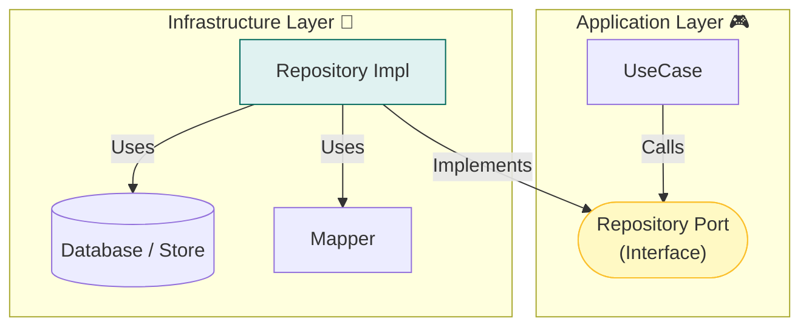

# 第13章：Infrastructure入門① 永続化（DB/Storage）を外側に閉じ込める🗄️🚪

この章はね、「保存の都合（DBの型やSQLやファイル形式）」を**中心（Domain/Application）に漏らさない**ための回です😊💡
ここを押さえると、あとでDBを変えても「え、全層修正…😇」みたいな地獄を回避できます✨

---

## 1) この章のゴール🎯💖

読み終わったら、こんなことができるようになります👇

* **Domainは保存方法を知らない**（DB/Storageの気配を消す🙈✨）
* **Port（interface）** を守りつつ、Infrastructureで **Repository実装** が作れる🔌📦
* **保存形式 ↔ ドメイン** の変換ポイント（マッピング）を迷わず置ける🧩
* インメモリ→SQLite→別DB みたいな **差し替え** を想像できる🔁😊

---

## 2) まず結論：DB/Storageは「詳細」📌🧠


レイヤードの考え方だと…

* **Domain**：概念とルール（核💎）
* **Application**：手順と調整（ユースケース🎮）
* **Infrastructure**：DB/外部I/O/フレームワーク（外側の都合🚪）

だから保存はこう👇

✅ Application：**「保存してね」と依頼する**（interfaceを呼ぶ）
✅ Infrastructure：**具体的に保存する**（SQLite/Prisma/Drizzle/ファイル/Redis…）
❌ Domain：**「PrismaClient import」とか絶対しない**（匂いがしたらアウト😇💥）



---

## 3) 今日の題材：ToDoを例にするよ📝✨

### Domain（例）

* `TodoId`（VO）
* `TodoTitle`（VO：空禁止とか）
* `TodoItem`（Entity：idで追跡🪪）

### Application

* `AddTodoUseCase`
* `CompleteTodoUseCase`
* `GetTodoListQuery`（参照系）

### Infrastructure（この章の主役👑）

* `TodoRepository` の**実装**（DB/Storageの具体）

---

## 4) 「Port」は内側に置く🔌（復習ちょい😊）


第12章で作った想定の `TodoRepository`（Port）は、**Application側**に置くのが分かりやすいです✨
（Domainに置く流派もあるけど、今は迷子防止でApplicationに寄せよ〜🧭）

例：Application側（Port）

```ts
// src/application/ports/TodoRepository.ts
import { TodoId } from "../../domain/todo/TodoId";
import { TodoItem } from "../../domain/todo/TodoItem";

export interface TodoRepository {
  save(todo: TodoItem): Promise<void>;
  findById(id: TodoId): Promise<TodoItem | null>;
  listAll(): Promise<TodoItem[]>;
}
```

ポイント👀💡

* `TodoRepository` は **Domainの型を返す**（DBのRowを返さない🙅‍♀️）
* メソッドは **小さめ**（欲張ると巨大interfaceになって破綻しがち✂️）

---

## 5) いきなりDBに行かない！まずインメモリで勝つ🧸✨


Infrastructureは「差し替え」を見せると理解が一気に進むよ😊
最初に **InMemory実装** を作って、ユースケースが動く状態にしよ〜🔁

```ts
// src/infrastructure/persistence/InMemoryTodoRepository.ts
import { TodoRepository } from "../../application/ports/TodoRepository";
import { TodoId } from "../../domain/todo/TodoId";
import { TodoItem } from "../../domain/todo/TodoItem";

export class InMemoryTodoRepository implements TodoRepository {
  private store = new Map<string, TodoItem>();

  async save(todo: TodoItem): Promise<void> {
    this.store.set(todo.id.value, todo);
  }

  async findById(id: TodoId): Promise<TodoItem | null> {
    return this.store.get(id.value) ?? null;
  }

  async listAll(): Promise<TodoItem[]> {
    return [...this.store.values()];
  }
}
```

これの良さ💖

* DBなしでユースケースがテストできる🧪✨
* 「Portを守ってる」感覚が身につく🔌😊

---

## 6) “保存形式”と“ドメイン”は別物だよ🧩📦


DBはだいたいこういう形になる👇

* DBの行：`{ id: string, title: string, is_done: 0/1, created_at: ... }`
* Domain：`TodoItem`（VOや不変条件つきで安全💎）

だから **マッピング（変換）** が必要✨
この変換が “境界” のお仕事です🚪

### ✅ 方針：Infrastructureに「DB用モデル」を置く


```ts
// src/infrastructure/persistence/models/TodoRow.ts
export type TodoRow = {
  id: string;
  title: string;
  completed: boolean;
  createdAt: Date;
};
```

そして変換関数👇

```ts
// src/infrastructure/persistence/mappers/TodoMapper.ts
import { TodoItem } from "../../../domain/todo/TodoItem";
import { TodoId } from "../../../domain/todo/TodoId";
import { TodoTitle } from "../../../domain/todo/TodoTitle";
import { TodoRow } from "../models/TodoRow";

export const TodoMapper = {
  toDomain(row: TodoRow): TodoItem {
    return TodoItem.rehydrate({
      id: TodoId.from(row.id),
      title: TodoTitle.from(row.title),
      completed: row.completed,
      createdAt: row.createdAt,
    });
  },

  toRow(todo: TodoItem): TodoRow {
    return {
      id: todo.id.value,
      title: todo.title.value,
      completed: todo.completed,
      createdAt: todo.createdAt,
    };
  },
};
```

ここ重要〜〜‼️😳✨

* `toDomain` は **不正データが来る可能性**がある（DBの中身は100%信用できない🙈）
  → `rehydrate` みたいな「復元用」入口を用意すると整理しやすいよ🧠

---

## 7) SQLiteで永続化する実装例🗄️✨（Prisma版）


ローカル学習でいちばん楽なのは **SQLite**（ファイル1つでDBになる📄✨）
そしてTypeScript界隈で強い選択肢が Prisma です。Prisma ORM 7.2.0 のリリースも出てます。([Prisma][1])

> ちなみにTypeScript自体は npm 上だと 5.9.3 が “Latest” 表示です（直近の安定版目安）。([npm][2])
> Nodeは v24 が Active LTS、v25 が Current という整理になってます。([Node.js][3])

### 7-1) Prismaのセットアップ（例）

```bash
npm i prisma @prisma/client
npx prisma init --datasource-provider sqlite
```

`prisma/schema.prisma`（例）

```prisma
model Todo {
  id        String   @id
  title     String
  completed Boolean  @default(false)
  createdAt DateTime @default(now())
}
```

マイグレーション＆生成👇

```bash
npx prisma migrate dev --name init
npx prisma generate
```

### 7-2) PrismaRepository実装（Infrastructure）

```ts
// src/infrastructure/persistence/PrismaTodoRepository.ts
import { PrismaClient } from "@prisma/client";
import { TodoRepository } from "../../application/ports/TodoRepository";
import { TodoId } from "../../domain/todo/TodoId";
import { TodoItem } from "../../domain/todo/TodoItem";
import { TodoMapper } from "./mappers/TodoMapper";

export class PrismaTodoRepository implements TodoRepository {
  constructor(private readonly prisma: PrismaClient) {}

  async save(todo: TodoItem): Promise<void> {
    const row = TodoMapper.toRow(todo);

    await this.prisma.todo.upsert({
      where: { id: row.id },
      create: {
        id: row.id,
        title: row.title,
        completed: row.completed,
        createdAt: row.createdAt,
      },
      update: {
        title: row.title,
        completed: row.completed,
      },
    });
  }

  async findById(id: TodoId): Promise<TodoItem | null> {
    const found = await this.prisma.todo.findUnique({
      where: { id: id.value },
    });
    if (!found) return null;

    return TodoMapper.toDomain({
      id: found.id,
      title: found.title,
      completed: found.completed,
      createdAt: found.createdAt,
    });
  }

  async listAll(): Promise<TodoItem[]> {
    const rows = await this.prisma.todo.findMany({
      orderBy: { createdAt: "desc" },
    });

    return rows.map((r) =>
      TodoMapper.toDomain({
        id: r.id,
        title: r.title,
        completed: r.completed,
        createdAt: r.createdAt,
      })
    );
  }
}
```

### 7-3) 接続はどこで作る？→ Composition Root で💡🏗️

Repositoryの `new` は “入口でまとめて” がキレイ✨

```ts
// src/main.ts (例: Composition Root的な場所)
import { PrismaClient } from "@prisma/client";
import { PrismaTodoRepository } from "./infrastructure/persistence/PrismaTodoRepository";
import { AddTodoUseCase } from "./application/usecases/AddTodoUseCase";

const prisma = new PrismaClient();
const todoRepo = new PrismaTodoRepository(prisma);

const addTodo = new AddTodoUseCase(todoRepo);
// ここからPresentationに渡す…みたいな感じ😊
```

---

## 8) もう1つの選択肢：Drizzle（TSファースト）🧁✨

Drizzleも人気で、公式サイトで機能更新が継続してます。([Drizzle ORM][4])
また、2026年1月時点で v1.0 のβ系バージョンが出ている動きも見えます。([Yarn][5])

なので選び分けイメージはこんな感じ👇

* Prisma：**型安全＋生成＋体験が統一**されてて学習がラクなこと多い🧠✨ ([Prisma][1])
* Drizzle：**TSでスキーマを書いて軽快**、進化が速い🚀 ([Drizzle ORM][4])

どっちでも大事なのは同じで👇
**Domain/ApplicationにDBの匂いを入れない**ことです🙈💎

---

## 9) Infrastructureがやること／やらないこと✅🙅‍♀️

### ✅ やること（Infrastructureの責務）🛠️

* DB接続・クエリ実行
* 永続化モデル（Row）との変換
* マイグレーション運用（仕組み側）
* DB起因の例外を “アプリ向け” に整える（第18章で本格化⚠️）

### ❌ やらないこと（混ぜると地獄）😇

* Domainルールの判断（例：タイトル空OK？など）
* ユースケース手順（保存前に何するとか）
* UI用の表示整形（それPresentation🎨）

---

## 10) よくある事故あるある💥（回避テクつき🧯）

### 事故①：DomainがDBの型を持ち始める

* `Domain/TodoItem` に `created_at` とか `dbId` とか…
  → **RowはInfrastructureだけ**に隔離🧱

### 事故②：Repositoryが肥大化して “なんでも屋” になる

* `searchByKeywordAndStatusAndDateRangeAnd...`
  → まずは **ユースケースに必要な最小**だけにする✂️✨

### 事故③：null/undefined地獄

DBは `null` を持てることが多い
→ `toDomain` で “復元時” にちゃんと弾く or 代替する🛡️

---

## 11) ミニ演習🧩✨（手を動かそ〜！）


### 演習A：差し替えをやってみる🔁

1. `InMemoryTodoRepository` を使ってユースケースが動くのを確認🧸
2. `PrismaTodoRepository` に差し替え🗄️
3. コード側（Application/Domain）を**一切変更せず**動いたら勝ち🏆✨

### 演習B：マッピングを増やしてみる🧩

* Domainに `TodoPriority`（VO）を追加（例：1〜3だけOK🔒）
* DBには `priority` カラム追加
* 変換は `TodoMapper` だけに閉じ込める🚪✨

---

## 12) AI活用🤖💡（この章と相性よすぎ！）

コピペして使ってOKな頼み方例だよ😊✨

* 「この `TodoMapper`、責務が漏れてない？境界として適切？🧩」
* 「Repository interface が大きすぎないかレビューして✂️」
* 「DBのnullや型ズレが起きた時に安全に `toDomain` する案を3つ出して🛡️」
* 「InMemory→SQLite に差し替えた時のテスト観点を列挙して🧪」

---

## 13) できたかチェック✅🌸

* [ ] DomainにDBライブラリのimportが1つも無い🙈✨
* [ ] Repositoryは `interface` を守って差し替えできる🔌
* [ ] Row/Schemaの都合はInfrastructureに閉じている🧱
* [ ] 変換（Mapper）が “迷子” になってない🗺️
* [ ] InMemory→DB に変えても、ユースケース側は無改造で動く🔁🏆

---

次の章（第14章）では、外部APIを同じノリで「翻訳」して、**外部のクセをDomainに絶対持ち込まない**やり方をやるよ〜📡🈂️✨

[1]: https://www.prisma.io/blog/announcing-prisma-orm-7-2-0?utm_source=chatgpt.com "Announcing Prisma ORM 7.2.0"
[2]: https://www.npmjs.com/package/typescript?utm_source=chatgpt.com "TypeScript"
[3]: https://nodejs.org/en/about/previous-releases?utm_source=chatgpt.com "Node.js Releases"
[4]: https://orm.drizzle.team/?utm_source=chatgpt.com "Drizzle ORM - next gen TypeScript ORM."
[5]: https://classic.yarnpkg.com/en/package/drizzle-orm?utm_source=chatgpt.com "drizzle-orm"
