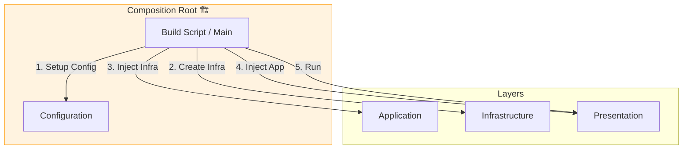
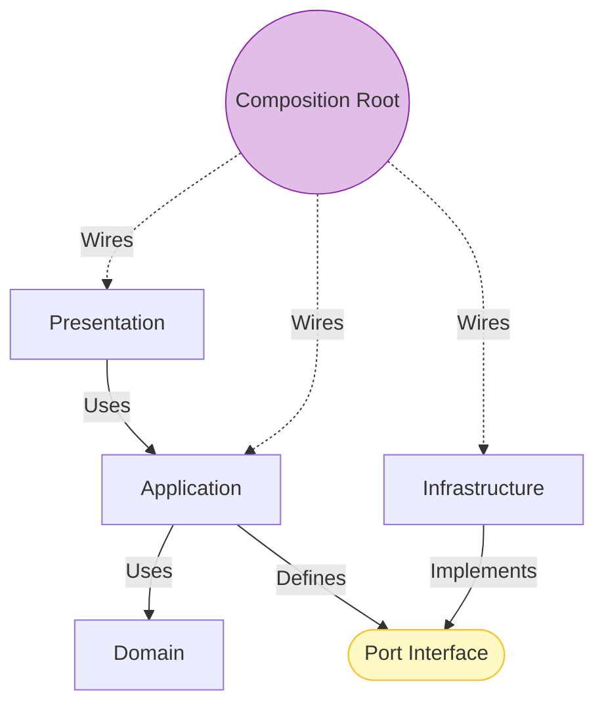

# 第15章：Composition Root（組み立て場所）を決める🏗️🧩

> この章のゴール🎯：
> 「依存（Repositoryや外部API実装など）を *どこで* どう組み立てるか」を1か所に集めて、レイヤードが崩れない形にできるようになる😊✨

---

## 15.1 Composition Rootってなに？🤔🧵


**Composition Root** は、ひとことで言うと…

* アプリで使う「本物の実装」を選んで
* 依存関係（オブジェクトのつながり）を組み立てて
* 最後に「入口（HTTP/画面/CLIなど）」へ渡す
  **たった1か所**の場所だよ〜！🎀

そして超大事ルール👇

* **“new しまくり” をアプリ中に散らかさない**🙅‍♀️
* **DIコンテナを使うなら、触るのは Composition Root だけ**（他の層は container を知らない）📦🚫
  この考え方は「Composition Root＝オブジェクトグラフの組み立て場所」って定義でよく説明されるよ🧠✨ ([Stack Overflow][1])



---

## 15.2 なんで必要なの？（ないとどうなる？）😵‍💫💥


### ✅ あると嬉しいこと

* Repository差し替えがラク（インメモリ→DB、ダミー→本物）🔁
* テストが爆速になる（Fakeを差すだけ）🧪✨
* 「依存の向き」が守りやすい（内側が外側を import しない）➡️🧱
* 設定値（APIキー等）が散らからない🔐

### ❌ ないと起きがち事故

* どこでも `new` してて「差し替え不能」地獄😇
* DomainやApplicationが外側実装を import して崩壊💥
* 循環参照（A→B→A）でビルド/実行が死ぬ🌀

---

## 15.3 「どこに置くの？」おすすめ配置📁✨


迷ったら、まずはこのどれかでOK🙆‍♀️

* Web APIなら：`src/main.ts` / `src/server.ts`
* CLIなら：`src/cli.ts`
* フロント（SPA）なら：`src/main.tsx`（ルートで組む）

ポイントはこれ👇

* **入口に近い場所**（Presentationのさらに外側でもOK）
* **“組み立てだけ” をやる**（ビジネス処理を書かない）🧼

---

## 15.4 まずは「手動DI」で勝つ💪（DIコンテナ無し）😊


初心者ほど、最初は **手動DI（Pure DI）** がわかりやすいよ✨
「必要になったらDIコンテナ」でも全然遅くない👍

### 例題の登場人物（層の役割おさらい）🧱

* Domain：`Todo` のルール💎
* Application：`AddTodoUseCase`（手順）🎮
* Port：`TodoRepository`（抽象）🔌
* Infrastructure：`SqlTodoRepository`（具体）🗄️
* Presentation：HTTP Handler🎛️

### フォルダ例📁

* `src/domain/...`
* `src/application/...`
* `src/application/ports/...`
* `src/infrastructure/...`
* `src/presentation/http/...`
* ✅ `src/main.ts` ← Composition Root（ここ！）🏗️

---

## 15.5 コードで「組み立て」を1か所に集める🏗️✨

### Port（抽象）🔌

```ts
// src/application/ports/TodoRepository.ts
import { Todo } from "../../domain/Todo";

export interface TodoRepository {
  save(todo: Todo): Promise<void>;
  findAll(): Promise<Todo[]>;
}
```

### Application（ユースケース）🎮

```ts
// src/application/usecases/AddTodoUseCase.ts
import { TodoRepository } from "../ports/TodoRepository";
import { Todo } from "../../domain/Todo";

export class AddTodoUseCase {
  constructor(private readonly repo: TodoRepository) {}

  async execute(input: { title: string }): Promise<void> {
    const todo = Todo.create(input.title); // Domainで不変条件チェック💎
    await this.repo.save(todo);
  }
}
```

### Infrastructure（実装）🗄️

```ts
// src/infrastructure/InMemoryTodoRepository.ts
import { TodoRepository } from "../application/ports/TodoRepository";
import { Todo } from "../domain/Todo";

export class InMemoryTodoRepository implements TodoRepository {
  private readonly data: Todo[] = [];

  async save(todo: Todo): Promise<void> {
    this.data.push(todo);
  }
  async findAll(): Promise<Todo[]> {
    return [...this.data];
  }
}
```

### Presentation（薄い）🎛️

```ts
// src/presentation/http/createTodoHandler.ts
import { AddTodoUseCase } from "../../application/usecases/AddTodoUseCase";

export function createTodoHandler(useCase: AddTodoUseCase) {
  return async function handler(req: { body: unknown }) {
    // 入力の検証はここ（第17章）🛡️
    const body = req.body as { title?: string };
    await useCase.execute({ title: body.title ?? "" });

    return { ok: true };
  };
}
```

### ✅ Composition Root（組み立て場所）🏗️🧩

```ts
// src/main.ts (Composition Root)
import { InMemoryTodoRepository } from "./infrastructure/InMemoryTodoRepository";
import { AddTodoUseCase } from "./application/usecases/AddTodoUseCase";
import { createTodoHandler } from "./presentation/http/createTodoHandler";

function build() {
  // 1) 実装を選ぶ（本物 or インメモリ）🔁
  const repo = new InMemoryTodoRepository();

  // 2) ユースケースを組む🎮
  const addTodo = new AddTodoUseCase(repo);

  // 3) ハンドラに注入🎛️
  const handler = createTodoHandler(addTodo);

  return { handler };
}

const app = build();

// ここから先はフレームワーク起動（Express/Fastify等）へつなぐだけ👍
```

💡ここでの美しさ✨

* Application は `InMemoryTodoRepository` を知らない🙈
* Infrastructure は Domain/Application の「抽象（Port）」に合わせるだけ🔌
* **差し替えは main.ts だけ**🎉

---

## 15.6 「設定値（Config）」もRootでまとめる🔐🧃


設定値が各所に散らばると、後で泣く😭
だから **Rootで読み、型のあるConfigにして渡す** のが安心だよ💕

例：環境変数を読み→`config`に詰める（※具体の読み方は何でもOK）

```ts
type AppConfig = {
  dbUrl: string;
  apiTimeoutMs: number;
};

function loadConfig(): AppConfig {
  return {
    dbUrl: process.env.DB_URL ?? "memory",
    apiTimeoutMs: Number(process.env.API_TIMEOUT_MS ?? "3000"),
  };
}

function build() {
  const config = loadConfig();

  // configを見て実装を選ぶ🔁
  const repo =
    config.dbUrl === "memory"
      ? new InMemoryTodoRepository()
      : new InMemoryTodoRepository(); // ここは将来DB実装に差し替えOK🗄️

  const addTodo = new AddTodoUseCase(repo);
  const handler = createTodoHandler(addTodo);
  return { handler };
}
```

---

## 15.7 依存の配線図を描こう🧵🗺️（めちゃ効く！）


紙でもメモでもOKだよ✍️
例（矢印は「知ってる/依存してる」）👇

* Presentation → Application → Domain
* Infrastructure → (Portを実装)
* Composition Root → 全部を組む🏗️

```text
[Presentation] --> [Application] --> [Domain]
      ^                 |
      |                 v
      |            (Port interface)
      |                 ^
      |                 |
      +---- Composition Root ---- [Infrastructure]
```



---

## 15.8 DIコンテナはいつ要る？🤖📦（2026の注意も添えて）


### ✅ 使うと便利なタイミング

* 依存が増えて “手動配線がつらい”😵‍💫
* ライフサイクル管理（Singleton/Request単位）が必要🧬
* プラグイン的に差し替えたい🔁

### ⚠️ TypeScriptのDIコンテナは「decorator依存」が多い

たとえば TSyringe は **`experimentalDecorators` / `emitDecoratorMetadata` と `reflect-metadata` を前提に書かれてる**よ📌 ([GitHub][2])
そして TypeScript 5以降は decorators が大きく変化してきてて（新旧decoratorsの共存など）、「ライブラリ側がどの方式前提か」は注意ポイントになりやすいよ⚠️（TSyringeでもその話題が出てる） ([GitHub][3])

### ざっくり現状（選び方の目安）🧭

* **InversifyJS**：npm上でも最近更新が続いていて元気め💪（8.0計画も公開されてる） ([npm][4])
* **TSyringe**：軽量で人気、ただdecorator/metadata前提は理解して使う🧩 ([npm][5])
* **TypeDI**：公開がかなり前で、採用は慎重が安心🙈 ([npm][6])

> なので学習としては：
> **「手動DI → つらくなったら DIコンテナ」** がいちばん安全で、理解も深まるよ😊✨

---

## 15.9 「最新の土台」ミニ豆知識🧁（今どき前提の差分）

* TypeScript は npm で **5.9.3** が最新として出てるよ📦 ([npm][7])
* TypeScript 5.9 の新機能（VS Codeのホバー改善など）も公式で案内されてるよ🧠✨ ([Microsoft for Developers][8])
* Node.js は **v24系がActive LTS** になってる（LTSを使うのが基本は安心）🟢 ([Node.js][9])
* そして 2026年1月にセキュリティリリースも出てるので、Nodeは定期更新が大事だよ🔒 ([Node.js][10])

（Composition Rootは、こういう「バージョン差」「設定差」を吸収するのにも強いんだ〜！💪✨）

---

## 15.10 ミニ演習🧩（30〜60分でOK）⏰💕

### 演習A：配線図を描く🧵

1. いま作ってる題材（ToDo等）を思い出す
2. 「Repository」「UseCase」「Handler」を箱で描く📦
3. 矢印が内側に向いてるか確認➡️💎

### 演習B：`new` を追放するゲーム🎮

1. プロジェクト全体検索で `new ` を探す🔎
2. ルール：**main.ts 以外の `new` を減らす**（Domainの生成は例外でOK🙆‍♀️）
3. 減らした分だけ「差し替えがラク」になるのを体感✨

### 演習C：差し替えスイッチを作る🔁

* `InMemoryTodoRepository` と `SqlTodoRepository`（仮でもOK）を用意して
* `build()` の中だけで切り替えられる形にする🎛️

---

## 15.11 AI活用🤖💡（そのままコピペでOK）

### 依存のレビュー依頼🧸

* 「この `main.ts`（Composition Root）を見て、依存が循環してないかチェックして。依存の向きルールに反してそうな import も疑って。」

### “new散らかり” 検出🧹

* 「このリポジトリ構成で `new` が散らばると何が起きる？main.ts に集める方針で、移動候補を列挙して。」

### 将来DIコンテナに移行したい相談📦

* 「この手動DI構成を、将来DIコンテナに移行するとしたら、移行の手順と注意点（decorators/metadata含む）を段階的に提案して。」

---

## 15.12 チェック✅（できたら勝ち！🎉）

* [ ] 「実装の差し替え」は **main.ts だけ**でできる🔁
* [ ] Application/Domain が **Infrastructure を import してない**🙈
* [ ] 設定値（Config）が散らばってない🔐
* [ ] テストで Fake を差すイメージが湧く🧪✨
* [ ] 「DIコンテナは必要になってからでOK」って腹落ちした😊

---

次の第16章では、**Presentation層を薄くして“Controller肥大化”を防ぐ**よ〜！🎛️✨

[1]: https://stackoverflow.com/questions/6277771/what-is-a-composition-root-in-the-context-of-dependency-injection?utm_source=chatgpt.com "What is a composition root in the context of dependency ..."
[2]: https://github.com/microsoft/tsyringe?utm_source=chatgpt.com "microsoft/tsyringe: Lightweight dependency injection ..."
[3]: https://github.com/microsoft/tsyringe/issues/225?utm_source=chatgpt.com "Is this compatible with TS 5 decorators? · Issue #225"
[4]: https://www.npmjs.com/package/inversify?utm_source=chatgpt.com "inversify"
[5]: https://www.npmjs.com/package/tsyringe?utm_source=chatgpt.com "tsyringe"
[6]: https://www.npmjs.com/package/typedi?utm_source=chatgpt.com "typedi"
[7]: https://www.npmjs.com/package/typescript?utm_source=chatgpt.com "TypeScript"
[8]: https://devblogs.microsoft.com/typescript/announcing-typescript-5-9/?utm_source=chatgpt.com "Announcing TypeScript 5.9"
[9]: https://nodejs.org/en/about/previous-releases?utm_source=chatgpt.com "Node.js Releases"
[10]: https://nodejs.org/en/blog/vulnerability/december-2025-security-releases?utm_source=chatgpt.com "Tuesday, January 13, 2026 Security Releases"
