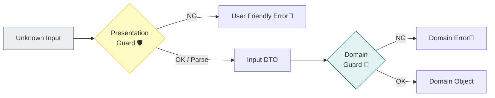
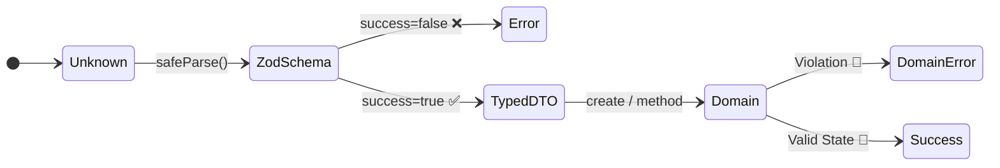

# 第17章：入力バリデーション（実行時チェック）🛡️✅

## この章のゴール🎯

* 「TypeScriptの型があるのに、なんでバリデーション要るの？」が腹落ちする😊
* **どの層で、何をチェックするか**（線引き）を迷わなくなる🧭
* 失敗したときに、ユーザーにやさしいエラーを返せるようになる💌

---

## 1) まず大前提：入力は“だいたい嘘”😇（型は守ってくれない）

HTTPの `req.body` やフォーム入力って、実体は **unknown（正体不明）** です💭
TypeScriptの型はコンパイル時の安心で、**実行時の値は別世界**🌍

だから現実はこう👇

* `"1"` が来ると思ったら `1` が来る（逆もある）🔁
* 空文字 `""`、空白 `"   "`、`null`、配列、謎オブジェクト…なんでも来る🎁
* “余計なフィールド”が混ざる（気づくと事故）💥

ここをちゃんと守るのが **入力バリデーション** だよ〜🛡️✨

---

## 2) レイヤードでの“線引き”🧱（ここ超大事！）


入力チェックは、ざっくり **2段ロック** がいちばん事故りにくいです🔐🔐

### A. Presentation（境界）でやるチェック🎛️

**目的：入口で早めに止める＆ユーザー向けの分かりやすいエラーを作る**😊

* 形チェック：オブジェクト？必要な項目ある？型合ってる？
* 文字列のトリム、数値の変換（必要なら）
* “エラーメッセージ設計”（この章の主役💌）

### B. Domain（中心）でやるチェック💎

**目的：何が起きてもドメインを壊さない最終防衛線**🔥

* 不変条件（空はダメ、範囲外はダメ、矛盾はダメ）を**生成時に固定**🔒
* Presentationをすり抜けた値でも、**無効な状態を作れない**ようにする🧱

> つまり：
> **入口（Presentation）＝説明が上手なガード**🛡️💬
> **中心（Domain）＝絶対に壊れない金庫**🏦✨



---

## 3) 2026の“実行時バリデーション”定番ルート🛠️✨

今は「スキーマ（schema）で unknown を parse して型付きにする」流れが王道です👑

### よく使われる選択肢（代表）

* **Zod**：スキーマ定義→型推論→parse/safeParse が分かりやすい。Zod 4 は安定版扱いでドキュメントも整備されてるよ📚✨ ([Zod][1])
* **Valibot**：軽量＆モジュール型。`safeParse` も公式に用意されてる🧩 ([valibot.dev][2])
* **TypeBox + Ajv**：JSON Schema を軸にしたいとき強い（OpenAPI 方面にも寄せやすい）📐 ([GitHub][3])

この章では、まず理解しやすい **Zod** で例を作るね😊
（`safeParse` が “try/catch不要” で扱いやすいのがポイント！） ([Zod][4])

---

## 4) 実装例：ToDo追加の入力バリデーション🧩📝

### 4-1. まずはスキーマを作る（Presentation側に置く）📦

Zod 4 のインストールはこんな感じ（v4系指定もOK）🧰 ([Zod][5])

```bash
npm i zod@^4
```

例：`title` は必須、空白だけはNG、最大80文字、`dueAt` は ISO datetime（タイムゾーン付き）だけ許可⏰
Zod 4 には `z.iso.datetime()` があるので、ISO形式チェックが楽ちん✨ ([Zod][6])

```ts
// src/presentation/http/validators/createTodoRequest.ts
import * as z from "zod";

export const CreateTodoRequestSchema = z.object({
  title: z.string().trim().min(1, "タイトルは必須だよ🥺").max(80, "タイトルは80文字までだよ📝"),
  // 例：締切は任意。ISO 8601の datetime（例: 2026-01-18T10:00:00+09:00）
  dueAt: z.iso.datetime({ offset: true }).optional(),
});

// これが「通った後の型」になる✨
export type CreateTodoRequest = z.infer<typeof CreateTodoRequestSchema>;
```

> ここでのコツ🍀
>
> * **trimしてから min(1)**： `"   "` みたいな入力をちゃんと弾ける😤
> * 形式チェックは **正規表現よりスキーマ**：意図が読みやすい📖✨

---

### 4-2. ハンドラで safeParse（失敗したら“丁寧に返す”）💌

`safeParse` は成功/失敗が分岐できて、例外で荒れにくいよ🌿 ([Zod][4])

```ts
// src/presentation/http/handlers/createTodoHandler.ts
import { CreateTodoRequestSchema } from "../validators/createTodoRequest";
import { createTodoUseCase } from "../../compositionRoot";

type HttpRequest = { body: unknown };
type HttpResponse = { status: number; body: unknown };

export async function createTodoHandler(req: HttpRequest): Promise<HttpResponse> {
  const parsed = CreateTodoRequestSchema.safeParse(req.body);

  if (!parsed.success) {
    // ユーザー向けに「どこがダメ？」を返す（この章の主役！）
    const fieldErrors: Record<string, string[]> = {};

    for (const issue of parsed.error.issues) {
      const key = issue.path.join(".") || "_";
      (fieldErrors[key] ??= []).push(issue.message);
    }

    return {
      status: 400,
      body: {
        message: "入力にまちがいがあるみたい🥺 直してもう一回送ってね✨",
        errors: fieldErrors,
      },
    };
  }

  // ✅ ここから下は型付きで安心して扱える！
  const dto = parsed.data;

  const result = await createTodoUseCase.execute(dto);

  return {
    status: 201,
    body: result,
  };
}
```

**ポイントまとめ🎀**

* `req.body` は unknown 扱い → **スキーマで parse**
* 失敗時は **400 + フィールド別エラー**（画面で表示しやすい！）
* 成功後は `dto` が型付き → Applicationに渡す✨

---

### 4-3. “変換”は境界でやる（DTO→Domain）🚪

たとえば Domain 側では「空はダメ」みたいな不変条件を守る✨
（第7章の内容とつながるやつだね🔒）

```ts
// src/domain/valueObjects/TodoTitle.ts
export class TodoTitle {
  private constructor(public readonly value: string) {}

  static create(raw: string): TodoTitle {
    const v = raw.trim();
    if (v.length === 0) throw new Error("TodoTitle: empty");
    if (v.length > 80) throw new Error("TodoTitle: too long");
    return new TodoTitle(v);
  }
}
```

> ここで二重に守る理由💡
>
> * Presentation：ユーザーに「タイトル必須だよ🥺」って優しく言える
> * Domain：**どこから呼ばれても**無効なタイトルを作らない
>
> “親切”と“安全”は役割が違うんだよ〜😊🛡️💎

---

## 5) バリデーション設計のコツ 10個🍓

1. **unknown → parse してから使う**（最優先！）🧱
2. 「必須」「型」「形式」は Presentation が得意🎛️
3. 「不変条件」「矛盾」は Domain の仕事💎
4. エラーは **フィールド単位**で返す（UIが助かる）🖼️
5. エラー文は **短く・具体的に・次の行動が分かる**💌
6. 余計なフィールドは無視せず、必要なら弾く（事故防止）🚫
7. 数値変換が必要なら **coerce** 系を検討（でも“勝手な変換”には注意）🧪 ([Zod][6])
8. 長さ上限はわりと重要（DoSっぽい事故も減る）📏
9. “境界”にバリデーションを集める（探しやすさUP）🧹
10. テストは「変な入力」を先に並べると強くなる💪🧪



---

## 6) ミニ演習🧩✨（手を動かすやつ！）

### 演習A：無効入力パターン表を作る📋

`title` だけでもこれくらいあるよ👇

* `title` が無い
* `title: null`
* `title: ""`
* `title: "   "`
* `title` が 81文字以上
* `title` が配列/オブジェクト

👉 これを **表にして**、期待するエラーメッセージも決めてね💌😊

### 演習B：`dueAt` のバリデーションを育てる⏰

* ISO datetime 形式じゃなかったら 400
* タイムゾーン無しを許す/許さないを選ぶ（`local: true` も使える）🧠 ([Zod][6])

---

## 7) AI活用テンプレ🤖✨（コピペで使える）

**1) 漏れチェック🔎**

> 「この入力DTOのバリデーション観点（型/必須/形式/境界値/悪意ある入力）を列挙して。ToDo追加APIで、titleとdueAtがある前提で！」

**2) エラーメッセ改善💌**

> 「このエラーメッセージを、ユーザーが次に何を直せばいいか分かる文章に直して（短く、やさしく、具体的に）」

**3) テストケース生成🧪**

> 「CreateTodoRequestSchema のテストケースを、正常系/異常系で最小セットに絞って提案して」

---

## 8) よくある事故⚠️（先に潰す！）

* **型があるから安心してしまう** → 実行時は別物😇
* **Presentationが肥大化** → バリデーション＆呼び出しだけに寄せる（薄く！）🎛️
* **Domainが“画面都合の文言”を持つ** → Domainはルール、文言は外側💎🗣️
* **変換しすぎる（勝手に正しいことにする）** → “直す”より“弾く”が安全な場面も多い🛑

---

## 9) まとめチェック✅✨

* [ ] `unknown` をスキーマで parse/safeParse してから使ってる？🧱
* [ ] Presentation と Domain のチェックが混ざってない？🧭
* [ ] エラーがフィールド単位で返せて、UIが表示しやすい？🖼️
* [ ] Domain は最終防衛線として不変条件を守ってる？💎🔒

---

必要なら次の一歩として、第18章（エラー設計）につながるように、**「成功/失敗の戻し型（Result型）」で例外を減らす形**にも整えていけるよ〜⚠️➡️🌤️

[1]: https://zod.dev/v4?utm_source=chatgpt.com "Release notes"
[2]: https://valibot.dev/api/safeParse/?utm_source=chatgpt.com "safeParse"
[3]: https://github.com/sinclairzx81/typebox?utm_source=chatgpt.com "sinclairzx81/typebox: JSON Schema Type Builder ..."
[4]: https://zod.dev/basics?utm_source=chatgpt.com "Basic usage"
[5]: https://zod.dev/v4/changelog?utm_source=chatgpt.com "Migration guide"
[6]: https://zod.dev/api "Defining schemas | Zod"
