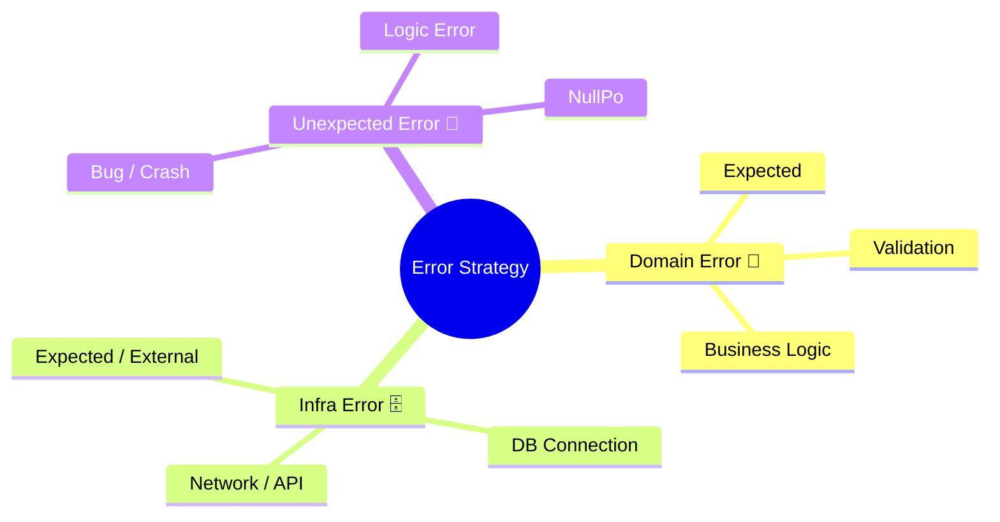
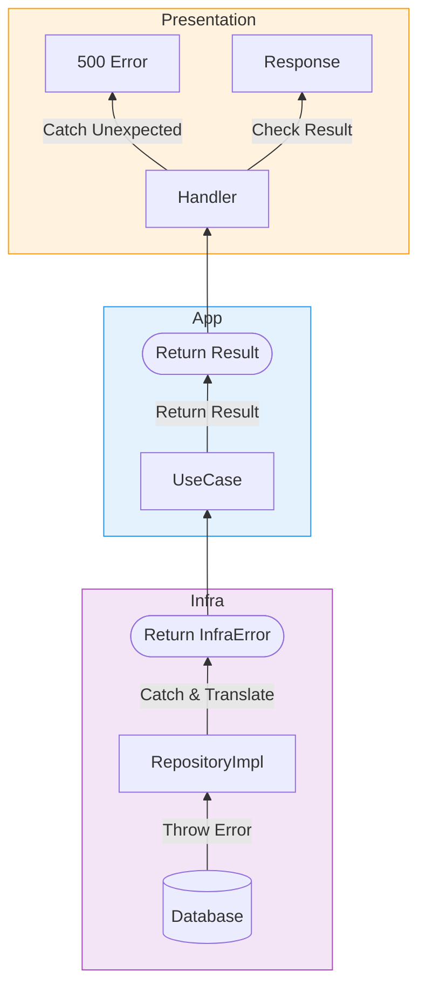

# 第18章：エラー設計（例外地獄を卒業）⚠️🌤️

〜「壊れ方」を仕様にして、デバッグも運用もラクにする〜😊✨

---

## 0. まず最初に：例外地獄ってどんな状態？😵‍💫💥


ありがちなやつ👇

* どこでも `throw` → どこでも `try/catch` → どこで握ってるか不明😇
* 画面に「Internal Server Error」だけ出て原因が追えない😭
* DBエラー文がそのままユーザーに見えちゃう（怖い）🫣
* 「想定内の失敗（入力ミス等）」まで例外で扱って、ログが真っ赤🔥

この章では、こういう状態を **“卒業”** します🎓✨

---

## 1. この章のゴール🎯✨（できるようになること）

ゴールは3つだけ😊🧡

1. **エラーを3種類に分類**できる🗂️
2. **例外は“想定外だけ”** にして、想定内は型で返せる🧩
3. レイヤーをまたぐときに **エラーを変換（翻訳）** できる🌍➡️🈂️

---

## 2. エラーは「仕様」📜✨ まずは3種類に分けよう🧩


### ✅ 分類A：Domainエラー（ルール違反）💎🚫

* 例：タイトル空はダメ、金額マイナスはダメ、完了済みを再完了はダメ🙅‍♀️
* 特徴：**想定内**（ユーザー入力や業務ルールで普通に起こる）
* 置き場所：Domain（またはDomain生成の入口）

### ✅ 分類B：Infrastructureエラー（外部都合）🗄️📡

* 例：DB接続失敗、タイムアウト、外部API落ちた、ネットワーク不調⏱️💥
* 特徴：**想定内**だけど “外側の都合”
* 置き場所：Infrastructure（実装側）

### ✅ 分類C：想定外（バグ）🐛💣

* 例：`undefined` 参照、取りうるはずのない分岐、配列範囲外、型の想定ミス
* 特徴：**想定外**＝直すべき
* 置き場所：どこでも起こる（だからこそ握りつぶさない）



---

## 3. ルールはこれだけ覚えればOK👌✨


### ルール①：**想定内の失敗は「Resultで返す」**📦✅

例外で表現しない（ログも荒れないし、分岐が見える）😊

### ルール②：**catchするのは“境界”だけ**🚪🧤

* Infrastructureの実装（DB呼び出し部分）
* Presentation（HTTPハンドラなどの入口）
  この2箇所だけに寄せると、ぐちゃぐちゃになりにくい✨



---

## 4. TypeScriptで「Result型」を作る🧩✨（超定番パターン）


まずは最小のResultを用意しよう👇

```ts
export type Ok<T> = { ok: true; value: T };
export type Err<E> = { ok: false; error: E };
export type Result<T, E> = Ok<T> | Err<E>;

export const ok = <T>(value: T): Ok<T> => ({ ok: true, value });
export const err = <E>(error: E): Err<E> => ({ ok: false, error });

export const isOk = <T, E>(r: Result<T, E>): r is Ok<T> => r.ok;
export const isErr = <T, E>(r: Result<T, E>): r is Err<E> => !r.ok;
```

これで **“成功/失敗が型で見える”** ようになります😊🩷

---

## 5. Domainエラーを「文字列じゃなくて型」にする💎✨


文字列で `return "TITLE_EMPTY"` とかすると、将来ほぼ確実に破綻します😇
なので **判別可能（discriminated union）** にしよう👇

```ts
// Domain層
export type DomainError =
  | { kind: "TodoTitleEmpty" }
  | { kind: "TodoTitleTooLong"; max: number }
  | { kind: "TodoAlreadyCompleted" };

export class TodoTitle {
  private constructor(public readonly value: string) {}

  static create(input: string): Result<TodoTitle, DomainError> {
    const v = input.trim();
    if (v.length === 0) return err({ kind: "TodoTitleEmpty" });
    if (v.length > 50) return err({ kind: "TodoTitleTooLong", max: 50 });
    return ok(new TodoTitle(v));
  }
}
```

ポイント💡

* Domainは **外部の例外やDB事情を知らない**（内側は純粋に保つ）💎

---

## 6. Infrastructureエラーは「cause」で原因をつなぐ🔗🧯

JavaScriptには `Error` に **cause** を付けて “元エラーをぶら下げる” 仕組みがあります🔗
（`new Error("message", { cause })` みたいに使うやつ）🧠✨
これは **ES標準として広く使える** 状態です。([MDN ウェブドキュメント][1])

```ts
// Infrastructure側で使うエラー
export type InfraError =
  | { kind: "DbUnavailable"; cause?: unknown }
  | { kind: "Timeout"; cause?: unknown }
  | { kind: "ExternalApiFailed"; cause?: unknown };
```

「causeは optional で持てばOK」くらいの軽さでいいよ😊
（ログに出すときに役立つ✨）

---

## 7. ユースケースは「Domain + Infra」をまとめて返す🎮📋

例：ToDo追加ユースケース（Application層）

```ts
import type { Result } from "./result";
import { ok, err } from "./result";
import type { DomainError } from "../domain/errors";
import type { InfraError } from "../infra/errors";
import { TodoTitle } from "../domain/TodoTitle";

export type AddTodoError = DomainError | InfraError;

export interface TodoRepository {
  save(todo: { id: string; title: string }): Promise<void>;
}

export class AddTodoUseCase {
  constructor(private readonly repo: TodoRepository) {}

  async execute(input: { title: string }): Promise<Result<{ id: string }, AddTodoError>> {
    const titleOrErr = TodoTitle.create(input.title);
    if (!titleOrErr.ok) return err(titleOrErr.error);

    const id = crypto.randomUUID();

    try {
      await this.repo.save({ id, title: titleOrErr.value.value });
      return ok({ id });
    } catch (e) {
      // ここで Infrastructure の例外を “InfraError” に翻訳する🈂️✨
      return err({ kind: "DbUnavailable", cause: e });
    }
  }
}
```

ここが気持ちいいポイント😍✨

* Applicationは「どう失敗するか」を **型で言える**
* Presentationは「その失敗をどう見せるか」だけ考えればいい🎛️

---

## 8. Presentationで「ユーザー向け」に変換する💌✨（RFC 9457の考え方）

HTTP APIなら、エラー応答形式は **RFC 9457（Problem Details）** が今どきの標準寄りです📄✨
RFC 9457は RFC 7807 を置き換える形の仕様だよ。([RFCエディタ][2])

例えばこんなJSONで返すイメージ👇

```json
{
  "type": "https://example.com/problems/validation-error",
  "title": "入力が正しくありません",
  "status": 400,
  "detail": "title は空にできません",
  "instance": "/todos"
}
```

### ✅ 変換のコツ（超重要）🧠✨

* **DomainError**：基本 400（入力/ルール違反）
* **InfraError**：基本 503/504（外部都合）
* **想定外**：500（詳細は出しすぎない。ログに出す）🔐

---

## 9. エラー変換テーブルを作ろう🗂️✨（これが最強の護身術🛡️）


ミニ表（例）👇

| 種類         | kind             | HTTP | ユーザー表示                | ログ                 |
| ---------- | ---------------- | ---: | --------------------- | ------------------ |
| Domain     | TodoTitleEmpty   |  400 | 「タイトルを入力してね」😊        | 低（info）            |
| Domain     | TodoTitleTooLong |  400 | 「50文字以内にしてね」✍️        | 低（info）            |
| Infra      | DbUnavailable    |  503 | 「今つながりにくいよ。あとで試してね」🙏 | 高（error + cause）   |
| Unexpected | 例外               |  500 | 「ごめんね、問題が起きたよ」💦      | 最優先（error + stack） |

この表を **READMEに置く** と、未来の自分が救われるよ🥹🩷

---

## 10. 「例外を投げっぱなし」にしないためのチェック✅✨

### ✅ ありがちな事故と対策🚧💥

* **事故1：Domainで例外を投げる**
  → DomainはResultで返す（想定内は例外にしない）💎
* **事故2：catchして握りつぶす**
  → catchしたら “翻訳して返す” or “ログして再throw（想定外）”
* **事故3：ユーザーに詳細を出しすぎる**
  → detailは優しく、内部情報はログへ🔐
* **事故4：どこでもcatchする**
  → 境界だけ（Presentation / Infra実装）🚪

---

## 11. ミニ演習🧩✨（手を動かすよ〜！💪💖）

### 演習1：あなたの題材で「代表エラー10個」出す🗒️

* Domain 5個💎
* Infra 3個🗄️
* 想定外 2個🐛

出せたら **kindの一覧** にしてね😊

### 演習2：エラー変換テーブルを完成させる🗂️

* kind
* HTTP status
* ユーザー向けメッセージ
* ログレベル
* 追加で入れたい情報（例：`max` とか）

### 演習3：ユースケースのテスト観点を作る🧪

* title空 → DomainErrorになる？
* DB落ち → InfraErrorになる？
* 成功 → okになる？

（第19章のテスト設計につながるよ🍰✨）

---

## 12. AI活用（Copilot/Codex）プロンプト例🤖💡

そのまま貼って使えるやつ置いとくね😊✨

* 「このUseCaseで起こりうる失敗を Domain / Infra / Unexpected に分類して、kindのunionを提案して」
* 「DomainErrorをHTTP Problem Details(RFC9457)に変換する関数を書いて。statusとtypeの設計も提案して」([RFCエディタ][2])
* 「try/catchが散らばってるので、境界に集約するリファクタ案を出して」
* 「InfraErrorに cause を持たせたい。ログ出力の最小実装と注意点を教えて」([MDN ウェブドキュメント][1])

---

## 13. 2026っぽい“いまどき補足”🆕✨（軽くね）

* Node.js は **v24がActive LTS、v25がCurrent** という整理になってるよ（2026年1月時点）。([Node.js][3])
* TypeScript は 5.9 系のリリース情報が公開されていて、Node向け設定も整理が進んでるよ。([GitHub][4])

（この章の本題は“設計”だから、バージョン数字はこのくらいでOK👌✨）

---

## まとめ🌈✨

この章で一番大事なのはこれ😍👇

* **想定内の失敗はResultで返す**📦
* **catchは境界だけ**🚪
* **エラーはレイヤーを越えるときに翻訳する**🈂️
* **ユーザーには優しく、ログには詳しく**💌🪵

次の第19章（テスト設計）は、ここまで整えた人ほど「うわ、テスト書きやすっ😳✨」ってなるよ〜！🍰🧪

[1]: https://developer.mozilla.org/en-US/docs/Web/JavaScript/Reference/Global_Objects/Error/cause?utm_source=chatgpt.com "Error: cause - JavaScript - MDN Web Docs"
[2]: https://www.rfc-editor.org/rfc/rfc9457.html?utm_source=chatgpt.com "RFC 9457: Problem Details for HTTP APIs"
[3]: https://nodejs.org/en/about/previous-releases?utm_source=chatgpt.com "Node.js Releases"
[4]: https://github.com/microsoft/typescript/releases?utm_source=chatgpt.com "Releases · microsoft/TypeScript"
