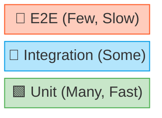
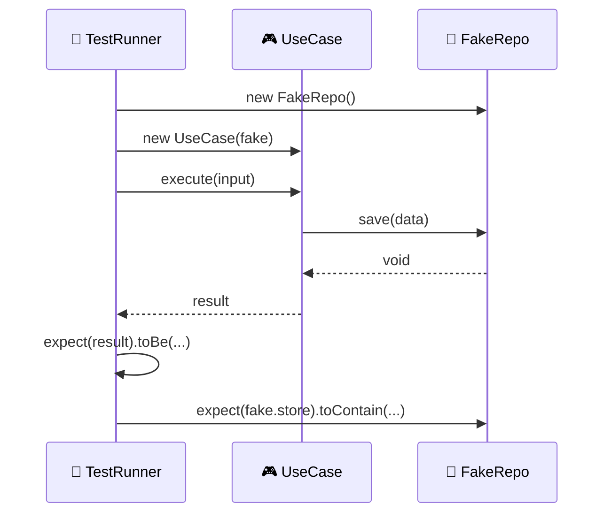

# 第19章：テスト設計（レイヤードのご褒美🍰）🧪✨

レイヤードってね、うまく作れると「テストが超書きやすい」っていうご褒美が来るの〜！🥳🎁
この章は、そのご褒美の受け取り方（＝どうテスト設計するか）を、**ふんわり→具体**で掴んでいくよ🫶💕

---

## 0. この章のゴール🎯✨

終わるころには、こんな状態になってるのが理想💖

* ✅ **Domain** は “ほぼ純粋関数” みたいに、爆速でユニットテストできる🚀💎
* ✅ **Application** は “Port（interface）をFakeに差し替え” してユースケースを検証できる🧸🔌
* ✅ **Infrastructure** は “少数精鋭” の統合テストで守れる🛡️🔧
* ✅ 「どこをどのテストで守る？」を迷わない🗺️✨

---

## 1. まずは全体像：テストの分担表🧁✨


レイヤードは「責務が分かれてる」から、テストも分けやすいのが強みだよ😊

### テストの基本方針（ざっくり）

* 🧪 **Domain**：数が多くてOK（速い・壊れにくい）
* 🎮 **Application**：ユースケース中心（Fake/Mockで外部を切る）
* 🗄️ **Infrastructure**：少数精鋭（遅い＆壊れやすいので最小に）
* 🎛️ **Presentation**：薄いから “薄いことの確認” だけ（多すぎ注意⚠️）

### テストピラミッド（イメージ）🏔️

* 🔺上：E2E（少なめ）
* 🔷中：統合テスト（少なめ）
* 🟩下：ユニットテスト（多め）



---

## 2. テストランナー何にする？（2026の現実ライン）🧰✨

ここ、最新版の事情込みで “迷いにくい選択肢” を出すね😉

### 選択肢A：Vitest（いま超人気枠）⚡

* Viteベースで、Viteの設定や解決を再利用しやすい🧠✨（Viteを使ってなくてもOK） ([vitest.dev][1])
* **Vitest 4** では Browser Mode が安定化したり、ビジュアル回帰テストや Playwrightトレース対応が進んでるよ🧪🌐 ([vitest.dev][2])
* Watch運用が基本で開発体験が良い（ローカルで気持ちいい）👀✨ ([vitest.dev][3])

### 選択肢B：Jest（安定の王道）👑

* Jestの**安定版は30系**（公式に “Current version (Stable)” として案内） ([jestjs.io][4])
* 既存資産がある・チーム標準がJestなら全然アリ👍

### 選択肢C：Node標準のnode:test（依存を増やしたくない派）🟢

* Nodeの標準テストランナー（node:test）は **Node v20 で stable 扱い** になってるよ🧩 ([Node.js][5])

> この章のサンプルは “Vitestで行く” 感じで書くね（理由：速い・書きやすい・今どき）⚡🫶
> でも考え方は Jest / node:test でも同じだよ！

---

## 3. 最小セットアップ（Vitest）🛠️✨

### 3-1. まず入れるもの📦


* vitest（本体）
* カバレッジ（V8 providerが手軽✨）
  Vitestはv8/istanbul等のカバレッジ方式をサポートしてるよ📊 ([vitest.dev][6])
  V8 providerのパッケージは @vitest/coverage-v8（直近だと4.0.17が案内されてる） ([npm][7])

```bash
npm i -D vitest @vitest/coverage-v8
```

### 3-2. package.json の scripts（例）🧪

```json
{
  "scripts": {
    "test": "vitest",
    "test:run": "vitest run",
    "test:coverage": "vitest run --coverage"
  }
}
```

### 3-3. “UIでテスト見たい派” のおまけ🎀

VitestにはテストUIもあるよ〜！見ながら実行できて楽しい👀✨ ([vitest.dev][8])

```bash
npm i -D @vitest/ui
npm run test -- --ui
```

---

## 4. Domainのテスト：ここが一番おいしい🍰💎

Domainは「外部に触れない」ように作ってるはずだから、テストが超ラク！✨
**モック不要**、**I/Oなし**、**速い**、**壊れにくい** の四天王👑👑👑👑

ここでは ToDo を例にするね📝💕

### 4-1. 例：ValueObject（タイトルは空禁止！）🛑

「無効な状態を作れない」をテストで確認するよ😊

```ts
// src/domain/TodoTitle.ts
export class TodoTitle {
  private constructor(public readonly value: string) {}

  static create(raw: string): TodoTitle {
    const v = raw.trim()
    if (v.length === 0) throw new Error("TITLE_EMPTY")
    if (v.length > 50) throw new Error("TITLE_TOO_LONG")
    return new TodoTitle(v)
  }
}
```

```ts
// src/domain/TodoTitle.test.ts
import { describe, it, expect } from "vitest"
import { TodoTitle } from "./TodoTitle"

describe("TodoTitle", () => {
  it("空白だけはダメ🙅‍♀️", () => {
    expect(() => TodoTitle.create("   ")).toThrow("TITLE_EMPTY")
  })

  it("前後の空白はトリムされる✂️", () => {
    const t = TodoTitle.create("  hello  ")
    expect(t.value).toBe("hello")
  })

  it("長すぎはダメ📏", () => {
    expect(() => TodoTitle.create("a".repeat(51))).toThrow("TITLE_TOO_LONG")
  })
})
```

#### Domainテストのコツ3つ🧠✨


* 🎯 “ルール（不変条件）” をテスト名に書いちゃう
* 🧪 例外/エラーも「仕様」なので、ちゃんと確認する
* 🧊 テストデータは少量でOK（速度優先！）

---

## 5. Applicationのテスト：Fakeでユースケース検証🎮🧸

Applicationは「手順の層」だから、テストはこうなるよ👇

* ✅ 入力を受けて
* ✅ Domainを使って
* ✅ Port（Repositoryなど）へ依頼して
* ✅ 結果DTOを返す

ここで大事なのは、**外部（DB/HTTP）を動かさない**こと！
PortをFakeに差し替えれば、ユースケースだけを気持ちよく検証できる😊🔌

### 5-1. Port（interface）とUseCase（例）🔌🎮

```ts
// src/application/ports/TodoRepository.ts
export type TodoRecord = { id: string; title: string; done: boolean }

export interface TodoRepository {
  save(todo: TodoRecord): Promise<void>
  findById(id: string): Promise<TodoRecord | null>
}
```

```ts
// src/application/AddTodoUseCase.ts
import { TodoTitle } from "../domain/TodoTitle"
import { TodoRepository } from "./ports/TodoRepository"

export class AddTodoUseCase {
  constructor(private readonly repo: TodoRepository) {}

  async execute(input: { id: string; title: string }) {
    const title = TodoTitle.create(input.title) // Domainルール
    const todo = { id: input.id, title: title.value, done: false }
    await this.repo.save(todo)
    return { id: todo.id, title: todo.title, done: todo.done }
  }
}
```

### 5-2. Fake Repository（インメモリ）🧸


```ts
// src/application/__tests__/FakeTodoRepository.ts
import { TodoRepository, TodoRecord } from "../ports/TodoRepository"

export class FakeTodoRepository implements TodoRepository {
  private store = new Map<string, TodoRecord>()

  async save(todo: TodoRecord): Promise<void> {
    this.store.set(todo.id, todo)
  }

  async findById(id: string): Promise<TodoRecord | null> {
    return this.store.get(id) ?? null
  }
}
```

### 5-3. UseCaseテスト🎮✅

```ts
// src/application/AddTodoUseCase.test.ts
import { describe, it, expect } from "vitest"
import { AddTodoUseCase } from "./AddTodoUseCase"
import { FakeTodoRepository } from "./__tests__/FakeTodoRepository"

describe("AddTodoUseCase", () => {
  it("ToDoを追加できる🎉", async () => {
    const repo = new FakeTodoRepository()
    const uc = new AddTodoUseCase(repo)

    const out = await uc.execute({ id: "t1", title: "Buy milk" })

    expect(out).toEqual({ id: "t1", title: "Buy milk", done: false })
    expect(await repo.findById("t1")).toEqual({ id: "t1", title: "Buy milk", done: false })
  })

  it("タイトルが空なら失敗する😇（Domainルール）", async () => {
    const repo = new FakeTodoRepository()
    const uc = new AddTodoUseCase(repo)

    await expect(uc.execute({ id: "t2", title: "   " })).rejects.toThrow("TITLE_EMPTY")
  })
})
```

#### ここがポイント💡

* UseCaseテストは「DBがどう保存するか」じゃなくて、**“ユースケースとして正しいか”**を見る👀✨
* Fakeを使うとテストが **速い＆安定** になる🧸💕



---

## 6. Mock/Spyはどこで使う？（使いすぎ注意⚠️）🧩


Vitestには vi というヘルパがあって、Mock/Spyもできるよ🕵️‍♀️✨ ([vitest.dev][9])

でも初心者のうちは、まずこう考えると失敗しにくいよ👇

* 🧸 **Fake**：状態を持てる代役（インメモリRepoなど）→ よく使う
* 🕵️ **Spy**：呼ばれた回数や引数を見たい → たまに使う
* 🎭 **Mock**：振る舞いをガッツリ偽装 → 最終手段（増えると読みにくい）

---

## 7. Infrastructureのテスト：少数精鋭で守る🗄️🔧

Infrastructureは “外部の都合” が入るから、テストが遅くなりがち＆壊れやすい🥲
だから **「最小限だけ」** にするのがコツ！

### 7-1. Repository実装の統合テスト（例）🧪


* ✅ “保存して→読み出せる”
* ✅ “マッピングが壊れてない”
  この2つが確認できれば十分なことが多いよ😊

### 7-2. 外部APIはMSWで安定化📡🛡️

外部APIテスト、直叩きすると落ちやすい（ネットワーク、レート制限、相手の障害…）😭
そこで **MSW**：リクエストを横取りして、モックレスポンスを返せる仕組みだよ✨
Nodeでも使えて、VitestのNodeテストでのセットアップも公式に案内されてる🧸📦 ([mswjs.io][10])

（超ざっくり手順）

```bash
npm i -D msw
```

MSWは「実際に発生したリクエスト」を横取りする思想なので、テストが現実に寄りやすくて良い感じだよ🫶 ([mswjs.io][10])

---

## 8. Presentationのテスト：薄いことを確認する🎛️✨

Presentationは理想としてこう👇

* 入力を受ける
* 形式チェック（軽め）
* UseCase呼ぶ
* 結果を返す（整形）

なのでテストも「変換が壊れてない」「UseCaseに渡せてる」を軽く確認するくらいでOK🙆‍♀️
（ビジネスルールのテストは Domain/Application に寄せる💎🎮）

---

## 9. カバレッジ：数字より “守れてる感” を優先📊💖


カバレッジは便利だけど、**数字を上げるためのテスト**になった瞬間に負けやすい🥲
Vitestは v8/istanbul 等でカバレッジ取得ができるよ📈 ([vitest.dev][6])

おすすめの使い方はこれ👇

* ✅ DomainとUseCaseの “大事な分岐” が抜けてないか見る
* ✅ 「ここ守れてないね」を発見するレーダーにする📡
* ❌ 100%を目的にしない（コスパ悪化しがち）

---

## 10. ちょい上級：Property-based Testing（余裕が出たら）🎲✨

「境界値いっぱいある〜😵」ってなったら、fast-check が便利！
fast-check は TypeScript/JavaScript の Property-based Testing ライブラリで、いろんなテストランナーで使えるよ🎲🧪 ([Fast Check][11])
Vitest用の統合パッケージもあるよ〜！ ([npm][12])

イメージ：

* 「どんな入力でも、この性質は必ず成り立つ」
  をテストする感じ😊

---

## 11. AI活用🤖✨（この章、めちゃ相性いい！）


AIはテストで特に強いよ〜！💪💕

### 11-1. 使える頼み方（コピペでOK）📝

* 「このDomainの不変条件から、テスト観点を10個列挙して🙂」
* 「このUseCase、Fakeでテスト書いて。AAAで、成功/失敗ケースもお願い🙏」
* 「この関数、境界値テストの候補を全部出して〜📏」
* 「このテスト、読みやすい名前にして✨（日本語でもOK）」

### 11-2. 注意点⚠️

* AIが作るテストは **意図がズレる**ことがあるので、最後は人間が「仕様」を握る🤝💖
* “実装の詳細” をテストしすぎない（リファクタで折れる）😇

---

## 12. 演習（この章のメイン✨）🧩🎉

### 演習A：Domainのテストを3本追加💎

TodoTitleに次を足してテストしてみて😊

* 「禁止文字」ルール（例：改行NG）
* 「先頭の#は禁止」みたいなルール
* 正常系の代表値（短い/長いギリギリ）

### 演習B：UseCaseに “重複ID禁止” を追加🎮

* repo.findById を使って、存在したらエラーにする
* テストは「既にあるIDで追加したら失敗」を書く🧸💥

### 演習C：外部API呼び出しをMSWでテスト📡

* 外部レスポンス→Domain型へ変換する処理を作る
* MSWで成功/失敗レスポンスを作って、変換とエラー処理を確認🛡️✨ ([mswjs.io][13])

---

## 13. まとめチェック✅✨（合格ライン）

* ✅ Domainは “外部なし” のユニットテストが中心になってる？💎
* ✅ UseCaseは Port を Fake にして “手順が正しい” を見れてる？🎮
* ✅ Infrastructureは “少数精鋭” で重要な接続だけ守れてる？🗄️
* ✅ Presentationは薄く、ビジネスルールを持ってない？🎛️
* ✅ テストがリファクタの味方になってる？（敵じゃない？）🫶

---

次の章（第20章）では、このテストたちを「運用で壊れにくくする仕組み（CI・依存ルール自動化・観測）」に繋げて、さらに強くしていくよ〜！🌱🏗️✨

[1]: https://vitest.dev/?utm_source=chatgpt.com "Vitest | Next Generation testing framework"
[2]: https://vitest.dev/blog/vitest-4?utm_source=chatgpt.com "Vitest 4.0 is out!"
[3]: https://vitest.dev/guide/cli?utm_source=chatgpt.com "Command Line Interface | Guide"
[4]: https://jestjs.io/versions?utm_source=chatgpt.com "Jest Versions"
[5]: https://nodejs.org/api/test.html?utm_source=chatgpt.com "Test runner | Node.js v25.3.0 Documentation"
[6]: https://vitest.dev/guide/features?utm_source=chatgpt.com "Features | Guide"
[7]: https://www.npmjs.com/package/%40vitest/coverage-v8?utm_source=chatgpt.com "vitest/coverage-v8"
[8]: https://vitest.dev/guide/ui.html?utm_source=chatgpt.com "Vitest UI | Guide"
[9]: https://vitest.dev/guide/mocking?utm_source=chatgpt.com "Mocking | Guide"
[10]: https://mswjs.io/docs/?utm_source=chatgpt.com "Introduction"
[11]: https://fast-check.dev/?utm_source=chatgpt.com "fast-check official documentation | fast-check"
[12]: https://www.npmjs.com/package/%40fast-check/vitest?utm_source=chatgpt.com "fast-check/vitest"
[13]: https://mswjs.io/docs/quick-start/?utm_source=chatgpt.com "Quick start"
